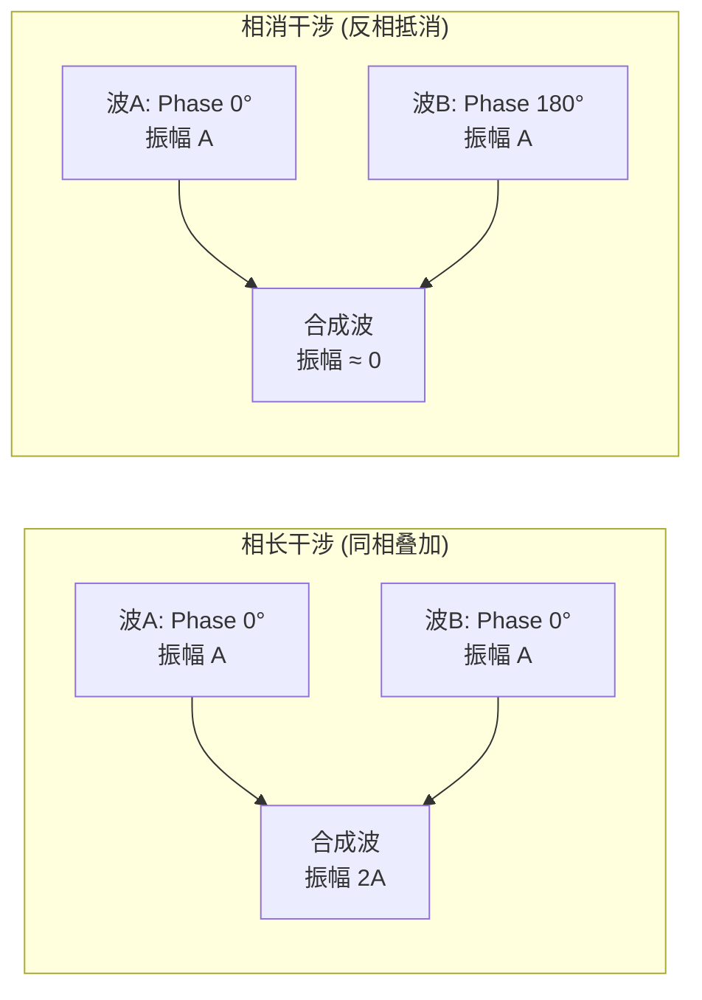

# 声波物理特性 (Sound Wave Physics)

声音是音频工程的逻辑起点。理解声音如何产生、传播以及其物理参数，是掌握后续数字信号处理 (DSP)、声学设计和音频系统调试的前提。

---

## 1. 什么是声音 (Definition of Sound)

**声音 (Sound)** 是由物体振动产生的**机械波 (Mechanical Wave)**。

```
声音的产生与传播:

  振动源 → 介质粒子受迫振动 → 压力波向外扩散 → 接收器 (人耳/麦克风)
  
  纵波 (Longitudinal Wave):
    介质质点振动方向 ∥ 波传播方向
    形成交替的 密部 (Compression) 和 疏部 (Rarefaction)
    
    压力分布示意:
    ┌─密─┐┌─疏─┐┌─密─┐┌─疏─┐
    │||||│|  | |│||||│|  | |  → 传播方向
    └────┘└────┘└────┘└────┘
    ←─── λ ───→

  传播条件:
    必须有弹性介质 (固体/液体/气体)
    真空中无法传声
    
  声波方程 (一维):
    ∂²p/∂t² = c² × ∂²p/∂x²
    其中 p=声压, c=声速, x=距离, t=时间
```

---

## 2. 核心物理参数

### 2.1 频率、周期与波长

$$f = \frac{1}{T}, \quad \lambda = \frac{v}{f}$$

| 参数 | 符号 | 单位 | 定义 |
|:---|:---|:---|:---|
| **频率** | $f$ | Hz | 每秒振动次数 |
| **周期** | $T$ | s | 一次完整振动的时间 |
| **波长** | $\lambda$ | m | 相邻同相位点间距 |
| **声速** | $v$ | m/s | 波在介质中的传播速度 |

**常见频率与波长对照**：

| 频率 | 波长 (空气中) | 对应 | 工程意义 |
|:---|:---|:---|:---|
| 20 Hz | 17.2 m | 人耳下限 | 低频驻波 ≈ 房间尺寸 |
| 100 Hz | 3.43 m | 低音 | 汽车车厢共振频段 |
| 1 kHz | 34.3 cm | 中频 | 测试标准频率 |
| 3 kHz | 11.4 cm | 语音核心 | 耳道共振频率 |
| 10 kHz | 3.43 cm | 高频 | 头部阴影效应显著 |
| 20 kHz | 1.72 cm | 人耳上限 | MEMS 振膜尺寸量级 |

### 2.2 声速

```
声速取决于介质的弹性和密度:

  v = √(E/ρ)    (固体/液体)
  v = √(γRT/M)  (理想气体)
  
  空气中声速 (近似):
    v ≈ 331.5 + 0.6T  (T: 摄氏度)
    
  各介质声速对比:
    空气 (20°C):    343 m/s
    水 (20°C):      1482 m/s
    铝:             6420 m/s
    钢:             5960 m/s
    
  温度/湿度影响:
    温度 ↑ → 声速 ↑ (约 +0.6 m/s 每°C)
    湿度 ↑ → 声速略 ↑ (水蒸气密度 < 干空气)
    
  工程应用:
    麦克风阵列波束成形: 需要精确声速值
    延迟计算: Δt = d/v (d=距离)
    例: 两麦克风间距 7cm, 90° 入射
        Δt = 0.07/343 ≈ 204 μs
```

### 2.3 声压与声强

```
声压 (Sound Pressure):
  大气压上的微小压力扰动
  单位: Pa (帕斯卡)
  
  人耳听阈:  20 µPa = 2×10⁻⁵ Pa (极其微小!)
  痛阈:      20 Pa  = 120 dB SPL
  大气压:    101325 Pa

声强 (Sound Intensity):
  单位面积上的声功率
  I = p²/(ρc)
  单位: W/m²
  
  参考值: I₀ = 10⁻¹² W/m²

声功率 (Sound Power):
  声源总辐射功率
  W = I × A (A=包围面积)
  
  声功率级: Lw = 10 × log₁₀(W/W₀)  (W₀ = 10⁻¹² W)

距离衰减 (自由场):
  点声源: SPL ∝ 1/r²  → 距离翻倍, SPL 下降 6 dB
  线声源: SPL ∝ 1/r   → 距离翻倍, SPL 下降 3 dB
```

### 2.4 相位

*   **定义**：描述声波在特定时间点处于振动周期中哪个位置的物理量，通常用角度 (0° - 360°) 或弧度 (0 - 2π) 表示。
*   **相位差 (Phase Difference)**：两个频率相同的声波，如果起始时间不同，就会产生相位差。这是 **AEC (回声消除)**、**ANC (主动降噪)**、**波束成形** 的核心物理基础。

```
相位差与时间差的关系:
  Δφ = 2π × f × Δt
  
  例: 1kHz 信号, 两麦克风间时差 0.5ms
      Δφ = 2π × 1000 × 0.0005 = π (180°) → 完全反相
```

---

## 3. 声学现象

### 3.1 干涉 (Interference)



**工程应用**：
- **ANC (主动降噪)**：生成与噪声反相的信号，利用相消干涉抵消噪声
- **波束成形**：利用相长干涉增强目标方向信号
- **相位校准**：多扬声器系统必须对齐相位，否则产生梳状滤波效应

### 3.2 反射与混响

```
声波遇到界面时:
  一部分被反射 (Reflection)
  一部分被吸收 (Absorption)
  一部分被透射 (Transmission)
  
  吸声系数 α = 被吸收声能 / 入射声能  (0~1)
    硬墙壁:     α ≈ 0.02 (几乎全反射)
    厚地毯:     α ≈ 0.4
    声学泡棉:   α ≈ 0.8
    开窗:       α = 1.0 (完全吸收)

混响时间 RT60:
  定义: 声源停止后, SPL 衰减 60 dB 所需时间
  
  赛宾公式 (Sabine): RT60 = 0.161 × V / A
    V: 房间体积 (m³)
    A: 总吸声量 = Σ(αᵢ × Sᵢ) (m²)
    
  典型 RT60:
    录音棚控制室: 0.2-0.4s (高度吸声)
    教室:         0.5-0.8s
    音乐厅:       1.5-2.5s (适度混响)
    大教堂:       4-8s (高度混响)
    车内:         < 0.1s (极小空间)
```

### 3.3 衍射 (Diffraction)

```
声波绕过障碍物继续传播:
  
  规律:
    λ >> 障碍物尺寸 → 几乎完全绕射 (低频)
    λ << 障碍物尺寸 → 产生明显阴影区 (高频)
    
  实际影响:
    头部衍射 (头部直径 ~17cm):
      低频 (< 500Hz): 几乎无阴影 → ITD 主导定位
      高频 (> 2kHz):  明显阴影 → ILD 主导定位
      过渡频率 ~1.5kHz (λ ≈ 头部直径)
```

### 3.4 驻波 (Standing Wave)

```
驻波:
  入射波与反射波叠加形成固定的波腹/波节模式
  
  房间模态频率 (矩形房间):
    f = (v/2) × √((nₓ/Lₓ)² + (nᵧ/Lᵧ)² + (n_z/L_z)²)
    
    n: 模态阶数 (0, 1, 2, ...)
    L: 房间尺寸
    
  实际影响:
    低频段 (< 300Hz) 驻波最明显
    例: 房间长 5m → 基频 = 343/(2×5) = 34.3 Hz
    
  解决方案:
    声学处理: 低频吸声体 (Bass Trap)
    DSP 校正: 参数 EQ 补偿
    房间比例设计: 避免整数比 (推荐 1:1.28:1.54)
```

### 3.5 多普勒效应 (Doppler Effect)

```
声源与观察者相对运动时, 感知频率改变:

  f' = f × (v ± v_observer) / (v ∓ v_source)
  
  接近 → 频率升高, 远离 → 频率降低
  
  工程影响:
    车载 ANC: 车速引起的频移需要算法补偿
    雷达/超声: 利用多普勒测速
    
  日常感知:
    救护车经过时音调变化
    车速 120km/h (~33m/s) → Δf/f ≈ 10% (可闻)
```

---

## 4. 分贝系统 (The Decibel System)

音频领域有多种分贝基准，混淆它们是专业工作中的大忌。

### 4.1 分贝基准速查

| 单位 | 参考基准 | 适用领域 | 典型值 |
|:---|:---|:---|:---|
| **dB SPL** | 20 µPa | 声学测量 | 对话: 60 dB, 演唱会: 110 dB |
| **dBFS** | 数字满幅 | 数字音频 | -6 dBFS (典型录制电平) |
| **dBu** | 0.775 Vrms | 专业音频 | +4 dBu (标准线路电平) |
| **dBV** | 1.0 Vrms | 消费电子 | -10 dBV (标准线路电平) |
| **dBm** | 1 mW (600Ω) | 电信 | 0 dBm = 0.775 Vrms@600Ω |
| **dB(A)** | A 计权 SPL | 噪声测量 | 办公室: 40 dB(A) |

### 4.2 常见声压级参考

```
dB SPL  │  场景
────────┼──────────────────────────────
  0     │  人耳听阈 (1kHz)
 20     │  树叶沙沙声
 40     │  安静图书馆
 50     │  安静办公室
 60     │  正常对话 (1m)
 70     │  吸尘器 / 交通噪声
 80     │  闹市 / 工厂 (需要听力保护)
 90     │  割草机 (长时间暴露有害)
100     │  摩托车 / 链锯
110     │  摇滚演唱会前排
120     │  痛阈 / 飞机起飞 (100m)
140     │  枪声 (近距离, 即时损伤)
```

### 4.3 dBFS 详解：数字音频的分贝系统

> **dBFS (Decibels relative to Full Scale, 相对满幅分贝)** 是数字音频系统中最重要的电平度量单位。与声学 dB SPL 不同，dBFS 的 **0 dBFS 是系统最大值**（满幅），所有有效信号电平都是**负值**。超过 0 dBFS 就会发生**数字削波 (Clipping)**。

#### 4.3.1 为什么 0 dBFS 是"天花板"？

```
模拟音频 vs 数字音频的根本差异:

  模拟 (Analog):
    电压信号可以持续增大 (直到硬件烧毁)
    0 dBu/dBV 只是参考点, 信号可以超过它 (headroom)
    过载是渐进式的 (模拟失真, 磁带饱和 → 有些甚至"好听")
    
  数字 (Digital):
    采样值被固定位深量化, 存在绝对上限
    16-bit 有符号整数范围: [-32768, +32767]
    24-bit 有符号整数范围: [-8388608, +8388607]
    32-bit 浮点: 虽然动态范围更大, 但 DAC 输出仍有物理上限
    
    0 dBFS = 量化能表示的最大振幅 = 满幅 (Full Scale)
    超过这个值 → 数据被截断 (Hard Clipping) → 方波失真
    
    ┌────────────────────────────────────────────┐
    │  + 32767 ─ ─ ─ ─ ─ ─ ─ ─  0 dBFS (天花板) │ ← 削波线
    │          /\      /\                        │
    │         /  \    /  \    ← 正常波形         │
    │  ──────/────\──/────\──── 0 (零线)         │
    │       /      \/      \                      │
    │      /                \                     │
    │  - 32768 ─ ─ ─ ─ ─ ─ ─ ─  0 dBFS (地板)   │ ← 削波线
    └────────────────────────────────────────────┘

    削波示意 (超出被截断):
    ┌────────────────────────────────────────────┐
    │  ┌──────┐     ┌──────┐   ← 被截成方波    │
    │  │      │     │      │                    │
    │  ──────/──────\──────/──────── 0           │
    │       /        \    /                       │
    │  ────┘          └──┘         ← 底部也被削  │
    └────────────────────────────────────────────┘
    
    削波的听觉后果:
    - 产生大量高次谐波 → 刺耳的"嘶嘶"或"嗡嗡"失真
    - 不可逆: 一旦录制时削波, 后期无法修复
    - 数字削波比模拟过载难听得多 (硬截断 vs 软饱和)
```

#### 4.3.2 dBFS 计算公式

```
对于正弦波信号:

  峰值 (Peak):
    dBFS_peak = 20 × log₁₀(|sample_peak| / Full_Scale)
    
    示例 (16-bit):
      满幅正弦峰值 = 32767 → 20×log₁₀(32767/32768) ≈ 0 dBFS
      半幅正弦峰值 = 16384 → 20×log₁₀(16384/32768) = -6.02 dBFS

  RMS (均方根, 反映平均能量):
    dBFS_RMS = 20 × log₁₀(RMS_value / Full_Scale_RMS)
    
    满幅正弦波的 RMS = Peak / √2 → dBFS_RMS ≈ -3.01 dBFS
    (注: 满幅正弦波 Peak = 0 dBFS, RMS = -3 dBFS)
    
    满幅方波 (极端情况): Peak = RMS = 0 dBFS (方波有效值等于峰值)

  浮点 PCM (范围 [-1.0, +1.0]):
    dBFS = 20 × log₁₀(|sample| / 1.0)
    → 满幅 = 0 dBFS, 半幅 = -6 dBFS

常用电平对照:
  ┌────────────────────────────────────────────────────────────┐
  │  dBFS       │  线性增益   │  16-bit 峰值    │  含义         │
  ├────────────────────────────────────────────────────────────┤
  │   0 dBFS    │  1.000      │  32767          │  满幅 (上限)  │
  │  -1 dBFS    │  0.891      │  29205          │  接近满幅     │
  │  -3 dBFS    │  0.708      │  23197          │  满幅正弦 RMS │
  │  -6 dBFS    │  0.501      │  16422          │  半幅         │
  │ -12 dBFS    │  0.251      │  8231           │  1/4 幅       │
  │ -20 dBFS    │  0.100      │  3277           │  1/10         │
  │ -40 dBFS    │  0.010      │  328            │  很安静       │
  │ -60 dBFS    │  0.001      │  33             │  接近底噪     │
  │ -96 dBFS    │  0.0000153  │  ~1             │  16-bit 最小值│
  │ -144 dBFS   │  —          │  (24-bit 底)    │  24-bit 最小值│
  └────────────────────────────────────────────────────────────┘
```

#### 4.3.3 数字系统的动态范围与位深

```
动态范围 (Dynamic Range) = 最大电平 - 最小可分辨电平

  理论最大动态范围 ≈ 6.02 × N + 1.76 dB   (N = 位深 bits)
  
  16-bit:  6.02 × 16 + 1.76 ≈ 98.1 dB
  24-bit:  6.02 × 24 + 1.76 ≈ 146.2 dB
  32-bit float: ~1528 dB (理论上无限, 实际受 DAC 限制 ≈ 144 dB)

  直观理解:
    16-bit 系统: 从削波到"数字静默"有 ~96dB 的空间
    24-bit 系统: ~144dB 空间 → 超过人耳极限 (~120dB 痛阈)
    
  量化噪底:
    16-bit: -96 dBFS (量化噪声的 RMS 约在这里)
    24-bit: -144 dBFS
    → 位深越高, 安静信号细节保留越好, 底噪越低
```

#### 4.3.4 录音与混音的电平规范

```
行业电平标准:

  录音阶段:
    目标: 峰值 -12 ~ -6 dBFS (留足 Headroom 余量)
    原因: 瞬态 (Transient) 可能比均值高 12-20dB
          留余量防止不可预见的峰值削波
    
  混音阶段:
    母带前: RMS -18 ~ -14 dBFS
    峰值上限: -1 dBFS (留给母带处理空间)
    
  母带阶段 (Mastering):
    流媒体标准:
      - Spotify: 目标 -14 LUFS (Loudness Unit Full Scale)
      - Apple Music: -16 LUFS
      - YouTube: -14 LUFS
    峰值: True Peak ≤ -1 dBTP (防止 DA 转换后过冲)
    
  通话/语音:
    Active Speech Level: -26 dBov ± 3 (ITU-T P.56)
    (dBov = dB overload point ≈ dBFS 在语音测量中的等价)

LUFS vs dBFS:
  - dBFS: 纯电气测量 (不考虑人耳感知)
  - LUFS (Loudness Units Full Scale): 
    K-计权 + 时间积分 → 反映人耳响度感知
    EBU R128 / ITU-R BS.1770 标准
    流媒体平台用 LUFS做响度归一化
```

#### 4.3.5 dBFS 与 dB SPL 的关系

```
dBFS 和 dB SPL 没有固定的数学对应关系!

  dBFS 是数字域 (相对满幅)
  dB SPL 是声学域 (相对 20µPa 绝对声压)
  
  它们的关系取决于整条信号链的增益:
    麦克风灵敏度 + 前放增益 + ADC 量程 = 综合映射关系
    
  示例:
    设备标定后, 某系统中:
      94 dB SPL @ 麦克风 → ADC 输出 -26 dBFS
      (这是该设备的校准点)
    
    那么 0 dBFS 对应:
      94 + 26 = 120 dB SPL (该系统的声学过载点)
      
  手机/笔记本典型映射:
    正常说话 (60 dB SPL, 30cm) → 约 -26 ~ -20 dBFS (MIC 输入)
    喊叫 (90 dB SPL) → 约 -6 ~ 0 dBFS (接近满幅)
    AOP (Acoustic Overload Point) → 0 dBFS (麦克风最大承受)
    
  Android 参考:
    AudioRecord 返回的 PCM 数据范围: [-32768, +32767] (16-bit)
    0 dBFS = 32767
    实际对应多少 dB SPL 取决于设备硬件标定
```

#### 4.3.6 常见削波问题与避免

```
削波 (Clipping) 出现的常见场景:

  1. 录制时:
     - 麦克风太近 / 音源太大 → ADC 饱和
     - 解决: 降低前放增益, 使用 pad (-10/-20dB 衰减)
     
  2. DSP 处理时:
     - EQ 提升导致某频段溢出
     - AGC/Gain 设置过高
     - 解决: 处理前预留 Headroom; 使用 32-bit float 内部处理
     
  3. DA 转换时:
     - Inter-sample Peak (采样点间峰值): 
       相邻采样点未超 0 dBFS, 但重建后的模拟波形可能超过!
       → True Peak 测量 (4x oversampling 检测)
       → 预留 -1 dBTP (True Peak) 余量
       
  4. 蓝牙传输:
     - SBC/AAC 编解码可能引入电平偏差
     - 解决: 编码前做 -1dB 限幅

最佳实践:
  - 录音: 峰值不超过 -6 dBFS
  - 数字处理: 内部用 32-bit float (避免定点溢出)
  - 输出: True Peak ≤ -1 dBTP
  - 监控: 使用 DAW 的削波指示灯 (Clip Indicator)
```

### 4.4 dB 运算速查

```
dB 快速心算:

  +3 dB  ≈ 功率 ×2   (电压 ×1.41)
  +6 dB  ≈ 电压 ×2   (功率 ×4)
  +10 dB ≈ 功率 ×10  (主观响度 ×2)
  +20 dB ≈ 电压 ×10  (功率 ×100)
  
  组合示例:
    +13 dB = +10 dB + 3 dB = 功率 ×10 × ×2 = ×20
    -6 dB  = 电压 ÷2 (信号衰减一半)
    
  dBFS → 线性增益:
    gain = 10^(dBFS/20)
    -6 dBFS  → 0.501 (约一半)
    -20 dBFS → 0.1
    -40 dBFS → 0.01
    -60 dBFS → 0.001
```

---

## 5. 声场类型

```
自由场 (Free Field):
  无反射面, 声波自由扩散
  SPL 遵循 1/r² 衰减
  例: 户外开阔空间, 消声室
  
扩散场 (Diffuse Field):
  来自各方向声能均匀分布
  例: 混响室
  
近场 (Near Field):
  距离声源 < 几个波长
  声压与声强关系复杂 (非平面波)
  例: 近场监听扬声器 (1m 内使用)
  
远场 (Far Field):
  距离声源 >> 波长
  声波近似平面波
  例: 远场测试 (>1m), 麦克风阵列远场假设
```

---

## 6. 关键参考 (References)

1.  *Fundamentals of Acoustics* - Lawrence E. Kinsler
2.  *Principles of Vibration and Sound* - Thomas D. Rossing
3.  [Sound - Wikipedia](https://en.wikipedia.org/wiki/Sound)
4.  [The Speed of Sound - Engineering Toolbox](https://www.engineeringtoolbox.com/speed-sound-d_82.html)
5.  [Room Acoustics - Sabine Equation](https://en.wikipedia.org/wiki/Reverberation)

---
*Next Topic: [心理声学 (Psychoacoustics)](./02-Psychoacoustics.md)*
