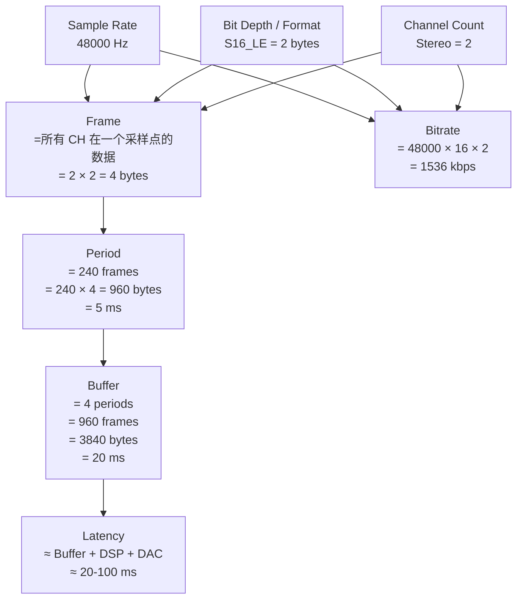

# 音频软件核心概念 (Audio Software Core Concepts)

上一章从物理和数学角度讲解了数字音频原理，本章从**软件工程师的视角**梳理在 Android / Linux / 嵌入式音频开发中日常打交道的核心概念和数据结构，并配合代码示例，帮助你在阅读源码、调试问题时胸有成竹。

---

## 1. 七大核心概念一览

```
音频软件的 7 个基本量:

  ┌──────────────────────────────────────────────────────────┐
  │  Sample Rate  ──→  每秒采集/回放多少个采样点            │
  │  Bit Depth    ──→  每个采样点用多少 bit 表示            │
  │  Channel      ──→  有多少路独立的音频信号               │
  │  Format       ──→  采样点的编码方式 (S16LE/F32...)      │
  │  Frame        ──→  同一采样时刻所有 Channel 的数据合集  │
  │  Buffer Size  ──→  一次读写操作包含的 Frame 数          │
  │  Latency      ──→  从输入到输出的时间延迟               │
  └──────────────────────────────────────────────────────────┘
  
  它们之间的关系:
    Frame Size (bytes)  = Channel Count × Bytes per Sample
    Buffer Size (bytes) = Frame Count × Frame Size
    Buffer Duration (s) = Frame Count / Sample Rate
    Latency ≈ Buffer Duration × N (N = buffer 级数)
```

---

## 2. Sample Rate (采样率)

### 2.1 概念

采样率 = 每秒对模拟信号采集的次数，单位 Hz。

```
采样率直觉理解:

  48000 Hz = 每秒取 48000 个点来描述声波
  
  ──▶ 时间轴
  │·  ·  ·  ·  ·  ·  ·  ·│   ← 每个 "·" 是一个采样点
  │      1/48000 s        │   ← 两个点的间隔 ≈ 20.83 µs
```

### 2.2 代码中的 Sample Rate

```java
// === Android Java 层 ===
// 创建 AudioTrack 时指定采样率
AudioTrack track = new AudioTrack.Builder()
    .setAudioAttributes(new AudioAttributes.Builder()
        .setUsage(AudioAttributes.USAGE_MEDIA)
        .build())
    .setAudioFormat(new AudioFormat.Builder()
        .setSampleRate(48000)          // ← 采样率
        .setEncoding(AudioFormat.ENCODING_PCM_16BIT)
        .setChannelMask(AudioFormat.CHANNEL_OUT_STEREO)
        .build())
    .setBufferSizeInBytes(bufferSize)
    .build();

// 获取设备原生采样率 (HAL 输出采样率)
int nativeSR = AudioTrack.getNativeOutputSampleRate(AudioManager.STREAM_MUSIC);
// 通常返回 48000 (Android 默认)
```

```c
// === ALSA/TinyALSA C 层 ===
struct pcm_config config = {
    .channels = 2,
    .rate = 48000,              // ← 采样率
    .period_size = 240,
    .period_count = 4,
    .format = PCM_FORMAT_S16_LE,
};
struct pcm *pcm = pcm_open(card, device, PCM_OUT, &config);
```

### 2.3 采样率不匹配会发生什么？

```
场景: App 输出 44100Hz, 但 HAL 要求 48000Hz

  AudioFlinger 自动插入 Resampler (多相 FIR 滤波器)
  44100 → 重采样 → 48000
  
  代价:
    - 额外 CPU 开销 (~1-3% per track)
    - 理论上引入微小失真 (但高质量 SRC 几乎不可闻)
    
  最佳实践:
    App 直接用 48000Hz 输出 → 避免重采样
    AudioTrack.getNativeOutputSampleRate() 获取原生率
```

---

## 3. Bit Depth / Format (位深 / 格式)

### 3.1 概念

位深 = 每个采样点的精度。Format = 位深 + 数据类型 + 字节序的组合。

```
常见格式对照:

  名称           位深   类型    范围                  Android 常量
  ───────────────────────────────────────────────────────────────────
  S16_LE         16-bit 有符号  [-32768, +32767]      ENCODING_PCM_16BIT
  S24_LE         24-bit 有符号  [-8388608, +8388607]  ENCODING_PCM_24BIT_PACKED
  S24_3LE        24-bit 3字节   同上                   —
  S32_LE         32-bit 有符号  [-2^31, +2^31-1]      ENCODING_PCM_32BIT
  FLOAT_LE       32-bit 浮点    [-1.0, +1.0] (标称)   ENCODING_PCM_FLOAT
  
  "S" = Signed (有符号)
  "LE" = Little-Endian (低字节在前, x86/ARM 默认)

内存中一个 S16_LE 采样:
  值 = 16384 (0x4000)
  内存: [0x00][0x40]   ← 低字节 0x00 在前
  
内存中一个 FLOAT_LE 采样:
  值 = 0.5f
  内存: [0x00][0x00][0x00][0x3F]  ← IEEE 754 表示
```

### 3.2 代码中的 Format

```java
// === Android Java 层 ===
AudioFormat format = new AudioFormat.Builder()
    .setEncoding(AudioFormat.ENCODING_PCM_FLOAT)  // ← 格式
    .setSampleRate(48000)
    .setChannelMask(AudioFormat.CHANNEL_OUT_STEREO)
    .build();

// 获取每个采样的字节数
int bytesPerSample;
switch (encoding) {
    case AudioFormat.ENCODING_PCM_8BIT:    bytesPerSample = 1; break;
    case AudioFormat.ENCODING_PCM_16BIT:   bytesPerSample = 2; break;
    case AudioFormat.ENCODING_PCM_24BIT_PACKED: bytesPerSample = 3; break;
    case AudioFormat.ENCODING_PCM_32BIT:   bytesPerSample = 4; break;
    case AudioFormat.ENCODING_PCM_FLOAT:   bytesPerSample = 4; break;
}
```

```cpp
// === AudioFlinger 内部 ===
// AudioFlinger 混音器始终使用 float32 进行混音
// frameworks/av/services/audioflinger/AudioMixer.cpp
//
// 输入: 各 Track 可能是 S16/S32/Float
//   → 统一转换为 float32
//   → 混音 (float 相加)
//   → 输出到 HAL (转回 HAL 要求的格式)

// 格式转换示例:
// S16 → Float:
//   float_val = (float)s16_val / 32768.0f;
// Float → S16:
//   s16_val = (int16_t)(float_val * 32767.0f);
//   // 注意: 需要 clamp 到 [-32768, +32767] 防止溢出!
```

---

## 4. Channel (声道)

### 4.1 概念

Channel = 独立的音频信号通道。立体声 = 2 Channel (Left + Right)。

```
常见声道配置:

  Mono   (单声道):     1 ch   用途: 语音通话、麦克风录音
  Stereo (立体声):     2 ch   用途: 音乐、媒体播放
  2.1:                 3 ch   Stereo + LFE (低音炮)
  5.1 Surround:        6 ch   FL + FR + FC + LFE + SL + SR
  7.1 Surround:        8 ch   5.1 + BL + BR

  Android Channel Mask:
    CHANNEL_OUT_MONO    = 0x04         (Center 或 Front Left)
    CHANNEL_OUT_STEREO  = 0x0C         (Front Left + Front Right)
    CHANNEL_OUT_5POINT1 = 0xFC         (FL+FR+FC+LFE+BL+BR)
    
  ALSA Channel Map:
    Mono:    [FC]
    Stereo:  [FL, FR]
    5.1:     [FL, FR, FC, LFE, RL, RR]
```

### 4.2 代码中的 Channel

```java
// === Android Java 层 ===
// 播放
AudioFormat.CHANNEL_OUT_STEREO   // 2ch 播放
AudioFormat.CHANNEL_OUT_MONO     // 1ch 播放

// 录音
AudioFormat.CHANNEL_IN_MONO      // 1ch 录音 (单麦)
AudioFormat.CHANNEL_IN_STEREO    // 2ch 录音 (双麦)
```

```c
// === TinyALSA C 层 ===
struct pcm_config config = {
    .channels = 2,              // ← 声道数
    .rate = 48000,
    .period_size = 240,
    .period_count = 4,
    .format = PCM_FORMAT_S16_LE,
};

// 车载 TDM 多声道:
struct pcm_config tdm_config = {
    .channels = 8,              // ← 8 声道 TDM
    .rate = 48000,
    .period_size = 480,
    .period_count = 4,
    .format = PCM_FORMAT_S32_LE,
};
```

---

## 5. Frame (帧)

### 5.1 概念

**Frame = 同一采样时刻, 所有 Channel 的采样值合在一起。** 这是音频软件中最核心的计量单位。

```
Frame 的直觉理解:

  时间轴 →    t0        t1        t2        t3
             ┌──┐      ┌──┐      ┌──┐      ┌──┐
  Channel L: │L0│      │L1│      │L2│      │L3│
             └──┘      └──┘      └──┘      └──┘
             ┌──┐      ┌──┐      ┌──┐      ┌──┐
  Channel R: │R0│      │R1│      │R2│      │R3│
             └──┘      └──┘      └──┘      └──┘
             
             ├Frame0──┤├Frame1──┤├Frame2──┤├Frame3──┤
             
  每个 Frame 包含: 1 个 L 采样 + 1 个 R 采样

  Frame Size (字节):
    S16 Mono:    1 × 2 = 2 bytes/frame
    S16 Stereo:  2 × 2 = 4 bytes/frame
    Float Stereo: 2 × 4 = 8 bytes/frame
    S32 8ch:     8 × 4 = 32 bytes/frame
```

### 5.2 Frame vs Sample 的区别（最常见的混淆）

```
⚠️ 关键区分:

  Sample = 单个声道的一个采样值
  Frame  = 所有声道在同一时刻的采样值集合
  
  S16 Stereo 的 1 个 Frame:
    [L_lo][L_hi][R_lo][R_hi]    ← 4 bytes
    └─Sample─┘  └─Sample─┘
    └───────── Frame ─────────┘
    
  Frame Count = 1000:
    包含 1000 × 2 = 2000 个 Sample
    占用 1000 × 4 = 4000 bytes
    时长 = 1000 / 48000 = 20.83 ms

  Android API 中的命名:
    AudioTrack.getBufferSizeInFrames()  → 返回 Frame 数
    AudioTrack.write(short[], ...)       → 参数是 Sample 数!
    
    ⚠️ Stereo 时: sampleCount = frameCount × 2
    这是初学者最容易踩的坑!
```

### 5.3 代码中的 Frame

```java
// === Android Java 层 ===
// 获取最小 buffer 大小 (单位: bytes)
int minBufSize = AudioTrack.getMinBufferSize(
    48000,                               // sampleRate
    AudioFormat.CHANNEL_OUT_STEREO,      // channelMask  
    AudioFormat.ENCODING_PCM_16BIT       // format
);
// 返回值单位是 bytes, 不是 frames!

// bytes → frames 的换算:
int channelCount = 2;  // stereo
int bytesPerSample = 2; // 16-bit
int frameSize = channelCount * bytesPerSample; // = 4 bytes/frame
int frameCount = minBufSize / frameSize;

// write() 的参数陷阱:
short[] data = new short[frameCount * channelCount]; // Sample 数!
track.write(data, 0, data.length);  // ← 传入的是 Sample 数, 不是 Frame 数!

// 而 float 版本:
float[] fdata = new float[frameCount * channelCount];
track.write(fdata, 0, fdata.length, AudioTrack.WRITE_BLOCKING);
```

```cpp
// === AudioFlinger C++ 层 ===
// frameworks/av/services/audioflinger/Threads.cpp
//
// PlaybackThread 核心变量:
//   mFrameCount   = HAL buffer 的 Frame 数 (如 960)
//   mSampleRate   = HAL 采样率 (如 48000)
//   mChannelCount = HAL 声道数 (如 2)
//   mFrameSize    = mChannelCount * bytesPerSample (如 4)
//
// 处理循环:
//   每次 threadLoop() 处理 mFrameCount 个 frames
//   耗时 = mFrameCount / mSampleRate = 960/48000 = 20ms
```

---

## 6. Buffer Size / Frame Count (缓冲区大小)

### 6.1 概念

Buffer Size = 音频缓冲区能容纳的 Frame 数。它直接决定了**延迟 (Latency)** 和**稳定性 (Glitch-free)** 之间的权衡。

```
Buffer 与延迟的关系:

  Buffer 大 → 延迟高, 但不容易 underrun (卡顿)
  Buffer 小 → 延迟低, 但 CPU 调度稍慢就 underrun
  
  ┌─────────────────────────────────────────┐
  │              Ring Buffer                │
  │  ┌────┬────┬────┬────┬────┬────┬────┐  │
  │  │ F0 │ F1 │ F2 │ F3 │ F4 │ F5 │ F6 │  │
  │  └────┴────┴────┴────┴────┴────┴────┘  │
  │       ↑ Read (HAL 消费)                 │
  │                          ↑ Write (App 生产)
  │                                         │
  │  Underrun: Write 跟不上 Read → 空了!    │
  │  Overrun:  Read 跟不上 Write → 满了!    │
  └─────────────────────────────────────────┘
  
  典型配置:
    Normal Track:   Buffer = 4 × period = 4 × 240 = 960 frames = 20ms
    Fast Track:     Buffer = 2 × period = 2 × 128 = 256 frames ≈ 5ms
    AAudio MMAP:    Buffer = 1-2 × period ≈ 128 frames ≈ 2.67ms
    Deep Buffer:    Buffer = 4 × 1920 = 7680 frames = 160ms (省电)
```

### 6.2 Period / Period Count

```
Buffer 的内部组织:

  Buffer = Period Count × Period Size (frames)
  
  Period (周期) = HAL 一次 DMA 传输的数据量
    - DMA 每传完一个 Period → 触发一次中断
    - HAL 在中断回调中填入下一个 Period 的数据
    
  示例: period_size=240, period_count=4
  
    ┌─────────┬─────────┬─────────┬─────────┐
    │Period 0 │Period 1 │Period 2 │Period 3 │
    │240 frame│240 frame│240 frame│240 frame│
    └─────────┴─────────┴─────────┴─────────┘
    │◄──── Buffer = 960 frames = 20ms ────►│
    
    DMA 正在送出 Period 0 的数据给 DAC
    同时 CPU 在填写 Period 2 或 3 → 双缓冲/多缓冲

  ALSA 中:
    period_size  = 一个周期的 Frame 数
    period_count = 周期个数 (= buffer_size / period_size)
    buffer_size  = 总 Frame 数
```

### 6.3 代码中的 Buffer Size

```java
// === Android Java 层 ===
// 获取最小 buffer (bytes)
int minBuf = AudioTrack.getMinBufferSize(48000,
    AudioFormat.CHANNEL_OUT_STEREO,
    AudioFormat.ENCODING_PCM_16BIT);
// minBuf ≈ 3840 bytes = 960 frames × 4 bytes/frame

// 创建 AudioTrack 时可以指定更大的 buffer
AudioTrack track = new AudioTrack.Builder()
    .setBufferSizeInBytes(minBuf * 2)  // 2倍最小值, 更安全
    .build();

// 运行时动态调整 buffer (Android 7.0+)
track.setBufferSizeInFrames(960);  // 动态调小 → 降低延迟
int actualBuf = track.getBufferSizeInFrames(); // 实际生效值
```

```c
// === TinyALSA 层 ===
struct pcm_config config;
config.period_size = 240;     // 每个 period 240 frames (5ms @ 48kHz)
config.period_count = 4;      // 4 个 period
// buffer_size = 240 × 4 = 960 frames = 20ms

struct pcm *pcm = pcm_open(0, 0, PCM_OUT, &config);

// 一次 write 写入一个 period 的数据
int frame_size = config.channels * 2; // S16 stereo = 4 bytes
pcm_writei(pcm, buffer, config.period_size);
// 写入 240 frames × 4 bytes = 960 bytes
```

---

## 7. Latency (延迟)

### 7.1 延迟的组成

```
端到端音频延迟拆解:

  App write() → ... → 扬声器出声

  ┌────────────────────────────────────────────────────────┐
  │ 1. App Buffer        写入但尚未消费的数据              │
  │    ~0-20ms           取决于 App 提前写入量             │
  ├────────────────────────────────────────────────────────┤
  │ 2. AudioFlinger      Server buffer + 混音处理          │
  │    ~5-20ms           Normal: 20ms / Fast: 5ms          │
  ├────────────────────────────────────────────────────────┤
  │ 3. HAL Buffer        ALSA ring buffer 中排队           │
  │    ~5-20ms           period_size × (period_count-1)    │
  ├────────────────────────────────────────────────────────┤
  │ 4. DSP 处理          AudioReach Graph 处理延迟         │
  │    ~1-5ms            取决于 Graph 中模块数量           │
  ├────────────────────────────────────────────────────────┤
  │ 5. DAC 转换          数字→模拟转换                     │
  │    ~0.1-1ms          取决于 DAC 芯片                   │
  ├────────────────────────────────────────────────────────┤
  │ 6. 功放+扬声器       物理响应时间                      │
  │    ~0.1-0.5ms                                          │
  └────────────────────────────────────────────────────────┘
  
  总延迟 (典型值):
    Normal Path:   50-100ms
    Fast Path:     20-40ms
    AAudio MMAP:   10-20ms
    Offload Path:  100-300ms (大 buffer 换低功耗)
```

### 7.2 代码中获取延迟

```java
// === Android Java 层 ===
// 获取输出延迟
AudioManager am = (AudioManager) getSystemService(AUDIO_SERVICE);

// 方法 1: 获取 HAL 报告的延迟
String latencyStr = am.getProperty(AudioManager.PROPERTY_OUTPUT_LATENCY);

// 方法 2: AudioTrack 直接获取
AudioTrack track = ...;
int latencyMs = track.getLatency(); // 非公开 API, 反射调用
// 或
int bufFrames = track.getBufferSizeInFrames();
float bufLatencyMs = (float) bufFrames / track.getSampleRate() * 1000;

// === AAudio (最低延迟路径) ===
// AAudio 通过 PerformanceMode 控制延迟
AAudioStreamBuilder_setPerformanceMode(builder,
    AAUDIO_PERFORMANCE_MODE_LOW_LATENCY);

// 获取实际延迟
int32_t framesPerBurst;
AAudioStream_getFramesPerBurst(stream, &framesPerBurst);
// framesPerBurst ≈ 48-192 frames → 1-4ms 级别延迟
```

---

## 8. Stream Type / Usage / AudioAttributes (音频属性)

### 8.1 概念

Android 中每条音频流都要声明"我是什么类型的音频"，系统据此做**音量控制**和**路由决策**。

```
演进历史:

  Android 1.0-7.x:  StreamType (已废弃)
    STREAM_MUSIC / STREAM_RING / STREAM_ALARM / STREAM_VOICE_CALL ...
    问题: 类型太粗, 无法区分导航语音和音乐, 都是 STREAM_MUSIC
    
  Android 8.0+:     AudioAttributes (推荐)
    二维描述:
      Usage       = "我的目的是什么" (媒体/通话/导航/通知...)
      ContentType = "我的内容是什么" (音乐/语音/电影/超声波...)
    
    额外标记:
      Flags       = 行为修饰 (低延迟/硬件AV同步/可闻性强制...)
```

### 8.2 代码中的 AudioAttributes

```java
// === 音乐播放 ===
AudioAttributes musicAttrs = new AudioAttributes.Builder()
    .setUsage(AudioAttributes.USAGE_MEDIA)
    .setContentType(AudioAttributes.CONTENT_TYPE_MUSIC)
    .build();

// === 导航语音 (车载场景极其重要, 决定路由到哪个 Bus) ===
AudioAttributes naviAttrs = new AudioAttributes.Builder()
    .setUsage(AudioAttributes.USAGE_ASSISTANCE_NAVIGATION_GUIDANCE)
    .setContentType(AudioAttributes.CONTENT_TYPE_SPEECH)
    .build();

// === 低延迟游戏音频 ===
AudioAttributes gameAttrs = new AudioAttributes.Builder()
    .setUsage(AudioAttributes.USAGE_GAME)
    .setContentType(AudioAttributes.CONTENT_TYPE_SONIFICATION)
    .setFlags(AudioAttributes.FLAG_LOW_LATENCY)
    .build();

// === 语音通话 ===
AudioAttributes callAttrs = new AudioAttributes.Builder()
    .setUsage(AudioAttributes.USAGE_VOICE_COMMUNICATION)
    .setContentType(AudioAttributes.CONTENT_TYPE_SPEECH)
    .build();
```

```
AudioPolicy 如何使用 AudioAttributes:

  AudioAttributes → ProductStrategy → VolumeGroup → 音量曲线
                  → RoutingRule       → 输出设备
  
  常见 Usage 与路由:
    USAGE_MEDIA              → Speaker / Headphone / BT A2DP
    USAGE_VOICE_COMMUNICATION → Earpiece / BT SCO
    USAGE_ALARM              → Speaker (即使静音也要出声)
    USAGE_ASSISTANCE_NAVIGATION_GUIDANCE → 车载: 指定 Bus
```

---

## 9. Audio Session ID (音频会话 ID)

### 9.1 概念

Session ID 是一个 **int** 值, 用于将 AudioTrack / MediaPlayer 与 AudioEffect 绑定。同一 Session ID 的音频流共享同一条音效链。

```
Session ID 的作用:

  ┌──────────────┐     Session = 100      ┌──────────────┐
  │  AudioTrack  │ ──────────────────────→ │ Effect Chain │
  │  (音乐播放)  │                         │ EQ + Reverb  │
  └──────────────┘                         └──────────────┘
  
  ┌──────────────┐     Session = 200      ┌──────────────┐
  │  AudioTrack  │ ──────────────────────→ │ Effect Chain │
  │  (游戏音效)  │                         │ (无音效)     │
  └──────────────┘                         └──────────────┘
  
  特殊 Session ID:
    SESSION_ID_NONE (0)         → 不绑定任何音效
    SESSION_OUTPUT_MIX          → 全局输出混音后的音效 (如 Visualizer)
    SESSION_OUTPUT_STAGE        → 最终输出阶段 (系统级)
    
  生成方式:
    AudioManager.generateAudioSessionId()  → 返回唯一 ID
```

### 9.2 代码示例

```java
// 创建 Session
int sessionId = audioManager.generateAudioSessionId();

// AudioTrack 绑定 Session
AudioTrack track = new AudioTrack.Builder()
    .setSessionId(sessionId)
    .build();

// 将 EQ 音效绑定到同一 Session
Equalizer eq = new Equalizer(0, sessionId);
eq.setEnabled(true);
eq.setBandLevel((short) 0, (short) 300); // Band 0 +3dB

// Visualizer 绑定到全局输出 (Session 0)
Visualizer visualizer = new Visualizer(0); // session 0 = 全局
visualizer.setCaptureSize(Visualizer.getCaptureSizeRange()[1]);
```

---

## 10. Volume / Gain / dB (音量与增益)

### 10.1 概念

```
音量的三种表示:

  1. 线性 (Linear):  0.0 = 静音, 1.0 = 满幅
     特点: 直觉上不均匀 (0.1→0.2 和 0.5→0.6 听感差异巨大)
     
  2. 分贝 (dB):      0 dB = 满幅, -∞ dB = 静音
     换算: dB = 20 × log₁₀(linear)
     特点: 符合人耳感知 (每 -6dB ≈ 音量减半)
     
  3. 整数级 (Index):  0-15 (Android 音量条)
     系统通过音量曲线 (Volume Curve) 映射到 dB

  转换公式:
    linear → dB:   dB = 20 × log₁₀(linear)
    dB → linear:   linear = 10^(dB/20)
    
  常用 dB 值:
    0 dB    = 1.0    (满幅)
    -6 dB   = 0.501  (约一半响度)
    -20 dB  = 0.1    (十分之一)
    -60 dB  = 0.001  (几乎听不到)
    -∞ dB   = 0.0    (静音)
```

### 10.2 Android 音量体系

```
Android 多级音量:

  ┌───────────────────────────────────────────────┐
  │ App 层:    AudioTrack.setVolume(0.8f)         │ ← 线性 0-1
  ├───────────────────────────────────────────────┤
  │ Framework: AudioManager.setStreamVolume(idx)  │ ← Index 0-15
  │            → AudioService 查 Volume Curve     │
  │            → 映射为 dB 值                     │
  ├───────────────────────────────────────────────┤
  │ AudioFlinger: Track volume (float)            │ ← 线性衰减
  │               Master volume                   │ ← 叠加
  ├───────────────────────────────────────────────┤
  │ HAL:   set_volume(left, right)                │ ← 线性 0-1
  ├───────────────────────────────────────────────┤
  │ Codec: PGA (Programmable Gain Amplifier)      │ ← 寄存器 dB 值
  │        DAC digital gain                       │
  └───────────────────────────────────────────────┘
  
  最终音量 = App vol × Stream vol × Master vol × HAL vol
  全部是线性相乘 (对应 dB 相加)
```

```java
// === 代码示例 ===
// 设置流音量 (Index)
AudioManager am = (AudioManager) getSystemService(AUDIO_SERVICE);
int maxVol = am.getStreamMaxVolume(AudioManager.STREAM_MUSIC); // 15
am.setStreamVolume(AudioManager.STREAM_MUSIC, maxVol / 2, 0);

// 设置 Track 音量 (Linear 0.0-1.0)
audioTrack.setVolume(0.8f);  // 左右声道相同
audioTrack.setStereoVolume(1.0f, 0.5f); // 左满右半

// dB 与线性互转
float linearToDb(float linear) {
    return (linear <= 0f) ? Float.NEGATIVE_INFINITY
                          : 20f * (float) Math.log10(linear);
}
float dbToLinear(float dB) {
    return (float) Math.pow(10f, dB / 20f);
}
```

---

## 11. Interleaved vs Non-interleaved (交织 vs 平面)

```
两种 PCM 多声道数据排列方式:

  Interleaved (交织, 最常见):
    所有声道的采样交替排列
    
    内存: [L0][R0][L1][R1][L2][R2][L3][R3]...
          └Frame0┘ └Frame1┘ └Frame2┘ └Frame3┘
    
    优点: 一个指针顺序读取, 一个 Frame 连续
    缺点: SIMD/NEON 处理时需要 deinterleave
    使用: ALSA 默认, Android HAL, 大多数 API
    API:  pcm_writei()  ← "i" = interleaved
    
  Non-interleaved (非交织 / Planar, 平面):
    每个声道独立连续存放
    
    Buffer L: [L0][L1][L2][L3][L4]...
    Buffer R: [R0][R1][R2][R3][R4]...
    
    优点: 单声道连续 → SIMD/NEON 并行处理效率高
    缺点: 需要多个 buffer 指针
    使用: AudioFlinger 内部混音, FFmpeg planar 格式
    API:  pcm_writen()  ← "n" = non-interleaved

  FFmpeg 中的命名:
    AV_SAMPLE_FMT_S16   = interleaved signed 16-bit
    AV_SAMPLE_FMT_S16P  = planar signed 16-bit  ← "P" 后缀
    AV_SAMPLE_FMT_FLTP  = planar float
```

---

## 12. Underrun / Overrun / Xrun (欠载 / 溢出)

### 12.1 概念

```
音频数据流是实时的 — 数据必须按时到达, 否则:

  Underrun (欠载, 播放):
    HAL 要从 buffer 读数据, 但 App/AudioFlinger 还没写够
    → buffer 空了 → HAL 只能送出静音或重复数据
    → 听感: "咔嗒" / 卡顿 / 爆音
    
  Overrun (溢出, 录音):
    麦克风持续产生数据, 但 App 没有及时 read()
    → buffer 满了 → 新数据覆盖旧数据 (或被丢弃)
    → 听感: 录音丢帧 / 数据不连续
    
  Xrun = Underrun 或 Overrun 的统称

  ┌─────────────── Ring Buffer ───────────────┐
  │ ▓▓▓▓▓▓░░░░░░░░░░░░░░░░░░░░░░░░░░░░░░░░░ │
  │ ↑ Read                    ↑ Write          │
  │ └──── 可用数据 ────┘└──── 空闲空间 ────┘  │
  │                                            │
  │  Read 追上 Write → Underrun! (播放)        │
  │  Write 追上 Read → Overrun!  (录音)        │
  └────────────────────────────────────────────┘
```

### 12.2 代码中检测和处理

```java
// === Android Java 层 ===
// 获取 underrun 次数 (Android 7.0+)
int underrunCount = audioTrack.getUnderrunCount();
// underrunCount > 0 说明发生过卡顿

// AudioRecord 的 overrun
// 通过 AudioRecord.read() 返回的 frame 数判断
// 如果 < 请求数 → 可能有问题
```

```bash
# === 调试命令 ===
# 查看 AudioFlinger 统计
adb shell dumpsys media.audio_flinger | grep -iE "underrun|overrun|xrun"
#   Thread 0x... (Mixer)
#     Underruns: 3
#
# ALSA 层
adb shell cat /proc/asound/card0/pcm0p/sub0/status
#   status: RUNNING / XRUN
```

---

## 13. Timestamp & Presentation Position (时间戳与呈现位置)

### 13.1 概念

```
问题: 我 write() 了 10000 个 frame, DAC 实际播了多少个?

  AudioTimestamp 包含:
    framePosition  = DAC 已播放的总 frame 数 (单调递增)
    nanoTime       = 该 framePosition 对应的系统时钟 (CLOCK_MONOTONIC)
    
  用途:
    - A/V 同步: 根据已播 frame 数推算当前播放位置, 同步视频帧
    - 播放进度: 精确到 frame 级别的播放位置
    - Glitch 检测: 如果 framePosition 不连续 → 有 underrun
```

### 13.2 代码示例

```java
// === Android Java 层 ===
AudioTimestamp ts = new AudioTimestamp();
if (track.getTimestamp(ts)) {
    long framesPlayed = ts.framePosition;
    long timeNs = ts.nanoTime;
    
    // 推算"现在"DAC 正在播的 frame
    long nowNs = System.nanoTime();
    long elapsedNs = nowNs - timeNs;
    long elapsedFrames = (elapsedNs * sampleRate) / 1_000_000_000L;
    long currentFrame = framesPlayed + elapsedFrames;
    
    // 换算成播放时间 (毫秒)
    double playbackMs = (double) currentFrame / sampleRate * 1000.0;
}
```

```c
// === AAudio C 层 ===
int64_t presentationFrame, presentationTime;
aaudio_result_t result = AAudioStream_getTimestamp(
    stream,
    CLOCK_MONOTONIC,
    &presentationFrame,
    &presentationTime);
// presentationFrame = DAC 已送出的 frame
// presentationTime  = 对应的时钟纳秒值
```

---

## 14. Callback vs Blocking 模式 (回调 vs 阻塞)

```
两种音频数据写入/读取模式:

  ┌────────────────────────────────────────────────────┐
  │ Blocking (阻塞) 模式                              │
  │                                                    │
  │   App 线程:                                        │
  │     while (playing) {                              │
  │       fillBuffer(data);                            │
  │       track.write(data, ...);  // ← 阻塞等待!     │
  │     }                                              │
  │                                                    │
  │   优点: 简单直观                                   │
  │   缺点: 需要独立线程; 延迟取决于 buffer 大小       │
  │   Android: AudioTrack.WRITE_BLOCKING               │
  ├────────────────────────────────────────────────────┤
  │ Callback (回调) 模式                               │
  │                                                    │
  │   系统定时调用 App 提供的回调函数:                  │
  │     void onAudioReady(stream, audioData, numFrames)│
  │     {                                              │
  │       // 在这里填写 numFrames 个 frame 的数据       │
  │       // 必须在规定时间内完成!                      │
  │     }                                              │
  │                                                    │
  │   优点: 最低延迟; 系统管理线程和时序               │
  │   缺点: 回调中不能做任何阻塞操作 (文件读/锁/alloc)│
  │   Android: AAudio Callback / Oboe                  │
  └────────────────────────────────────────────────────┘
```

```cpp
// === AAudio Callback 模式 ===
aaudio_data_callback_result_t myCallback(
    AAudioStream *stream,
    void *userData,
    void *audioData,       // ← 往这里写数据
    int32_t numFrames)     // ← 需要填写的 frame 数
{
    float *output = (float *) audioData;
    // 生成正弦波 (示例)
    for (int i = 0; i < numFrames; i++) {
        float sample = sinf(phase);
        *output++ = sample;  // Left
        *output++ = sample;  // Right
        phase += phaseIncrement;
    }
    return AAUDIO_CALLBACK_RESULT_CONTINUE;
}

// 设置回调
AAudioStreamBuilder_setDataCallback(builder, myCallback, userData);
AAudioStreamBuilder_setPerformanceMode(builder,
    AAUDIO_PERFORMANCE_MODE_LOW_LATENCY);
```

---

## 15. Shared vs Exclusive 模式 (共享 vs 独占)

```
AAudio 的两种共享模式:

  Shared (共享, 默认):
    多个 App 的音频经过 AudioFlinger 混音后输出
    App → AudioFlinger (混音) → HAL → 硬件
    
    优点: 多 App 同时出声
    缺点: 额外一跳延迟 (~10-20ms)
    
  Exclusive (独占, MMAP):
    App 直接访问硬件 buffer, 绕过 AudioFlinger
    App → MMAP → HAL → 硬件
    
    优点: 最低延迟 (~1-5ms)
    缺点: 独占硬件, 其他 App 无法用此设备
    限制: 需要 HAL 支持 MMAP, 并非所有设备可用
    
  ┌─────────────────────────────────────────┐
  │ Shared Mode                             │
  │ App A ─┐                                │
  │ App B ─┤→ AudioFlinger → HAL → Speaker  │
  │ App C ─┘   (混音)                       │
  ├─────────────────────────────────────────┤
  │ Exclusive Mode (MMAP)                   │
  │ App A ──────────────→ HAL → Speaker     │
  │            (直通, 绕过 AudioFlinger)     │
  └─────────────────────────────────────────┘
```

```cpp
// === AAudio 请求独占模式 ===
AAudioStreamBuilder_setSharingMode(builder,
    AAUDIO_SHARING_MODE_EXCLUSIVE);  // 请求独占

// 打开后检查实际获得的模式
aaudio_sharing_mode_t actualMode =
    AAudioStream_getSharingMode(stream);
if (actualMode == AAUDIO_SHARING_MODE_SHARED) {
    // 独占不可用, 回退到共享模式
    ALOGW("Exclusive mode not available, using Shared");
}
```

---

## 16. Mixing (混音)

```
混音 = 多路音频信号合并为一路输出

  AudioFlinger 混音过程:

    Track 1 (音乐,    48kHz S16 Stereo) → 转 float → ×volume ──┐
    Track 2 (通知铃声, 44.1kHz S16 Mono) → SRC → 转 float → ×volume ──┤→ Σ 相加 → clamp → 输出
    Track 3 (游戏音效, 48kHz Float Stereo) → ×volume ──┘

  混音公式:
    output[i] = Σ (track[n][i] × volume[n])  // 线性相加
    output[i] = clamp(output[i], -1.0f, 1.0f) // 防止削波
    
  为什么用 float 混音?
    - int16 相加极易溢出: 32767 + 32767 = 65534 → 溢出!
    - float 范围巨大, 混音后再 clamp 即可
    
  AudioFlinger 的 AudioMixer:
    位置: frameworks/av/services/audioflinger/AudioMixer.cpp
    输入: 各 Track (任意格式/采样率/声道)
    处理: Resampler → Format convert → Volume → Mix
    输出: float buffer → 输出给 HAL
```

---

## 17. 完整公式速查表

```
核心公式:
  ──────────────────────────────────────────────────────────
  Frame Size (bytes)  = Channel Count × Bytes per Sample
  Buffer Size (bytes) = Frame Count × Frame Size
  Buffer Duration (s) = Frame Count / Sample Rate
  Bitrate (bps)       = Sample Rate × Bit Depth × Channels
  BCLK (Hz)           = Sample Rate × Bit Depth × Channels
  MCLK (Hz)           = Sample Rate × 256 (或 512)
  
  换算示例 (S16 Stereo 48kHz, 960 frames):
  ──────────────────────────────────────────────────────────
  Frame Size   = 2 × 2          = 4 bytes
  Buffer Size  = 960 × 4        = 3840 bytes ≈ 3.75 KB
  Duration     = 960 / 48000    = 0.02 s = 20 ms
  Bitrate      = 48000 × 16 × 2 = 1,536,000 bps ≈ 1.5 Mbps
  
  换算示例 (Float 8ch 48kHz, 480 frames):
  ──────────────────────────────────────────────────────────
  Frame Size   = 8 × 4          = 32 bytes
  Buffer Size  = 480 × 32       = 15,360 bytes = 15 KB
  Duration     = 480 / 48000    = 0.01 s = 10 ms
  Bitrate      = 48000 × 32 × 8 = 12,288,000 bps ≈ 12.3 Mbps
```

---

## 18. 概念关系全景图



---

## 19. 常见陷阱 FAQ

| # | 陷阱 | 说明 |
|:---|:---|:---|
| 1 | **Frame 和 Sample 混淆** | `AudioTrack.write(short[])` 的 length 是 **Sample 数**, 不是 Frame 数。Stereo 时 sampleCount = frameCount × 2 |
| 2 | **getMinBufferSize 返回 bytes** | 不是 frames! 需要除以 frameSize 才是 frame count |
| 3 | **Buffer 越大≠越好** | Buffer 大 → 延迟高 → 游戏/通话体验差 |
| 4 | **44100 vs 48000** | Android 默认 48kHz, App 如果用 44100 会触发重采样 |
| 5 | **Float 不会溢出?** | Float 可以超过 1.0, 但 DAC 只能输出 [-1.0, 1.0], 超出即削波失真 |
| 6 | **8-bit PCM 是 unsigned** | 大多数平台 8-bit PCM 是 unsigned (128=静音), 其他位深是 signed |
| 7 | **Interleaved 顺序** | LRLRLR... 是标准 interleaved; 别假设是 LLLLRRRR |

---

## 20. 关键参考 (References)

1.  [Android AudioTrack API Reference](https://developer.android.com/reference/android/media/AudioTrack)
2.  [AAudio API Reference](https://developer.android.com/ndk/guides/audio/aaudio/aaudio)
3.  [ALSA PCM Interface](https://www.alsa-project.org/alsa-doc/alsa-lib/pcm.html)
4.  [TinyALSA GitHub](https://github.com/tinyalsa/tinyalsa)
5.  [Android Audio Latency - Official](https://source.android.com/docs/core/audio/latency)

---
*返回：[数字音频基础](./03-Digital-Audio-Fundamentals.md) | [Android 音频概览](../04-Android-Audio-Stack/01-Overview.md)*
