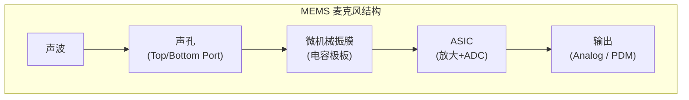
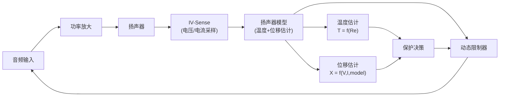

# 换能器：麦克风与扬声器 (Transducers: Microphone & Speaker)

换能器是音频系统中物理世界与电子世界的桥梁。麦克风将声波转换为电信号（录音），而扬声器将电信号还原为声波（播放）。本章详细解析两类换能器的工作原理、关键指标、封装技术和选型依据。

---

## 1. 麦克风 (Microphone)

### 1.1 类型对比

| 类型 | 原理 | 灵敏度 | 频响 | 供电 | 应用 |
|:---|:---|:---|:---|:---|:---|
| **动圈式** | 电磁感应 (线圈+磁铁) | -55 dBV | 50-15kHz | 无需 | 舞台/直播 |
| **电容式** | 极板电容变化 | -35 dBV | 20-20kHz | 48V 幻象电源 | 录音棚 |
| **驻极体 (ECM, Electret Condenser Microphone)** | 永久极化电容 | -42 dBV | 50-16kHz | 2-10V | 传统手机/耳机 |
| **MEMS** (Micro-Electro-Mechanical Systems) | 微机械振膜+ASIC | -38 dBV | 50-20kHz | 1.8-3.3V | 智能手机/车载 |
| **压电式** | 压电效应 | 低 | 窄带 | 无需 | 骨传导/加速度计 |

### 1.2 各类麦克风物理原理详解

#### 动圈式 (Dynamic / Moving Coil)

```
原理: 电磁感应定律 (Faraday's Law)
  声波 → 振膌振动 → 音圈在磁场中运动 → 产生感应电动势 (EMF)
  
  EMF = B × L × v
    B: 磁通密度 (Tesla)
    L: 音圈导线总长度 (m)
    v: 音圈运动速度 (m/s)

  结构:
    永磁体 (钕铁硒/铕钴) → 提供恒定磁场
    音圈 (铜线绕制) → 悬挂在磁场中
    振膌 (聚酯所) → 与音圈粘合，接收声压

  特点:
    ✔ 无需外部供电、结构健壮、不易损坏
    ✘ 灵敏度低、频响较窄、质量重
```

#### 电容式 (Condenser) & ECM

```
原理: 电容变化原理 (C = εA/d)
  声波 → 振膌振动 → 极板间距 d 变化 → 电容 C 变化 → 电压变化
  
  “真”电容麦克风 (Large-Diaphragm Condenser):
    需要外部 48V 幻象电源 (Phantom Power) 提供极化电压
    振膌材料: 镜射金属薄膜 (6μm 厚度)
    灵敏度极高 (-35dBV)，适合录音棚
    代表: Neumann U87、AKG C414
  
  ECM (驻极体电容):
    使用永久极化的驻极体材料 → 无需 48V
    内置 JFET 阻抗变换器
    供电: 2-10V (bias voltage)
    缺点: 性能随温度/湿度衰退，一致性差
    已被 MEMS 大量取代 (手机/车载领域)
```

#### MEMS 麦克风原理

```
原理: 微机电电容传感 + ASIC 信号调理
  声波 → 声孔 → 微机械振膌 (硅基) → 电容变化
  → ASIC 放大 + ADC → 数字 PDM/模拟输出

  制造工艺:
    振膌 + 背板: MEMS 微加工 (融刻/満刻)
    ASIC: 标准 CMOS 工艺
    封装: 振膌芯片 + ASIC 芯片 wire-bond 封装在金属罩内

  输出类型:
    模拟 (Analog): 电压输出，需外部 ADC
    数字 PDM: 1-bit ∆Σ调制输出，直连 SoC PDM 接口
    数字 I2S: 内置完整 ADC，稀少但有 (SPH0645LM4H)
```

#### 压电式 (Piezoelectric)

```
原理: 压电效应 (Piezoelectric Effect)
  机械应力/变形 → 晶体产生电荷 → 输出电压
  常用材料: PZT (锋钛锁铛陶瓷)、PVDF (聚偏氟乙烯 压电薄膜)

  应用场景:
    骨传导麦克风: 拾取颈部/颜骨振动，抗环境噪声
    加速度计麦克风: 车载 ANC/RNC 参考信号
    水下/防爆场景: 结构密封，无需声孔
  
  特点:
    ✔ 耐用、防水、无需供电
    ✘ 频响窄 (一般只覆盖 100Hz-4kHz)、音质一般
```

### 1.3 MEMS 麦克风芯片详解



**封装类型**：

| 封装 | 声孔位置 | 优势 | 应用 |
|:---|:---|:---|:---|
| **Top-Port** | 顶部开孔 | SMD (Surface-Mount Device, 贴片元件) 回流组友好 | 智能手机底部MIC |
| **Bottom-Port** | 底部开孔 (PCB, Printed Circuit Board 打孔) | 密封性好，防尘 | 手机顶部/耳机 |

**关键指标**：

| 指标 | 入门级 | 主流级 | 高端级 | 说明 |
|:---|:---|:---|:---|:---|
| **SNR** (Signal-to-Noise Ratio, 信噪比) | 61-63 dB | 64-67 dB | 68-74 dB | 越高越好 |
| **AOP** (Acoustic Overload Point, 声学过载点) | 120 dBSPL | 125 dBSPL | 130+ dBSPL | 越高失真越少 |
| **灵敏度** | -42 dBV | -38 dBV | -26 dBV | |
| **电流** | 120 µA | 150 µA | 250 µA | 功耗 |
| **尺寸** | 3.5×2.65mm | 3.35×2.5mm | 2.7×1.8mm | |

**主流供应商**：

| 供应商 | 代表型号 | 特点 |
|:---|:---|:---|
| **Knowles** | SPH0645LM4H | 数字 PDM，高 SNR |
| **InvenSense (TDK)** | ICS-43434 | 多麦同步，低功耗 |
| **Goertek** | S15OB381-049 | 国产，车规 |
| **STMicroelectronics** | MP23ABS1 | 高 AOP |

### 1.4 指向性 (Polar Patterns)

```
              0° (正前方)
              │
         ╱────┼────╲
        /     │     \    ── 全指向 (Omni)
       |      │      |
  270° ├──────┼──────┤ 90°
       |      │      |
        \     │     /    ── 心形 (Cardioid)
         ╲────┼────╱
              │
             180° (正后方)

指向性选择:
  全指向: 底噪最低，适合静态录音
  心形:   抑制后方 6dB，适合通话/直播
  超心形: 更窄的拾音角度，抑制侧面
  8字形: 前后拾音，抑制侧面 (用于中侧录音)
```

### 1.5 麦克风阵列与波束成形

```
波束成形原理 (Delay-and-Sum):
  多个全指向麦克风组成阵列
  通过对各麦信号施加不同延迟，增强目标方向信号

  ●──────●──────●──────●   (线性阵列, 间距 d)
  M0     M1     M2     M3
  
  对于方向 θ 的波束:
    delay[i] = i × d × cos(θ) / c
    output = Σ mic[i](t - delay[i])
  
  麦克风间距 d 决定:
    - d < λ/2 → 避免空间混叠
    - 对于 8kHz 信号: d < 21.4mm
    - 手机典型间距: 15-20mm

典型配置:
  手机: 2-3 个 MEMS (通话波束成形)
  智能音箱: 4-8 个 (360° 拾音)
  车载: 4-8 个 (多区域语音识别)
  会议设备: 6-16 个 (远距离拾音)
```

---

## 2. 扬声器 (Speaker / Loudspeaker)

### 2.1 电动式扬声器结构

```
扬声器剖面图:
  ┌────────────────────────────────┐
  │         防尘帽 (Dust Cap)       │
  │    ┌─────────────────────┐     │
  │    │    振膜 (Cone)       │     │
  │    │         ┌───┐        │     │
  │    │         │音圈│        │     │
  │    │         │Coil│        │     │
  │    │         └───┘        │     │
  │    └───┬─────────────┬───┘     │
  │   弹波 │  (Spider)   │ 弹波    │
  │   ─────┤             ├─────    │
  │        │   磁铁      │         │
  │        │  (Magnet)   │         │
  │        │   ┌───┐     │         │
  │        │   │ N │     │         │
  │        │   └───┘     │         │
  │        │   ┌───┐     │         │
  │        │   │ S │     │         │
  │        │   └───┘     │         │
  └────────┴─────────────┴─────────┘
           框架 (Frame/Basket)

驱动力: F = B × I × L
  B: 磁通密度 (T)
  I: 音圈电流 (A)
  L: 音圈有效导线长度 (m)
```

### 2.2 T/S 参数详解

| 参数 | 单位 | 意义 | 典型值 (手机微型SPK) |
|:---|:---|:---|:---|
| **Fs** | Hz | 共振频率 (最低有效频率) | 600-900 Hz |
| **Re** | Ω | 直流电阻 | 4-8 Ω |
| **Qms** | - | 机械品质因数 | 3-8 |
| **Qes** | - | 电气品质因数 | 0.5-2 |
| **Qts** | - | 总品质因数 (Qms×Qes/(Qms+Qes)) | 0.5-1.5 |
| **Vas** | L | 等效空气容积 | 0.01-0.5 |
| **Xmax** | mm | 最大线性位移 | 0.3-0.8 mm |
| **BL** | T·m | 力因子 | 0.3-0.8 |
| **SPL** | dB | 灵敏度 (1W/1m) | 78-85 dB |

### 2.3 扬声器物理原理

```
电动式 (动圈式) 扬声器工作原理:

  安培力 (Ampere Force): F = B × I × L
  
  1. 音频电流通过音圈 (Voice Coil)
  2. 音圈在永久磁铁磁场中受安培力驱动
  3. 音圈带动振膌 (Cone/Diaphragm) 前后运动
  4. 振膌推动空气产生声波
  5. 弹波 (Spider) + 折环 (Surround) 提供回复力

  等效电路模型 (Lumped Parameter Model):
    电域:  Re (DC电阻) + Le (电感) + Bl:转换 (Gyrator)
    机械域: Mms (运动质量) + Cms (顺性) + Rms (阻尼)
    声域:  Sd (有效辐射面积) + 空气负载
    
    关系: 电域 ↔ 机械域通过 Bl↔ (Force Factor) 耦合
    Fs = 1 / (2π × √(Mms × Cms))  ← 共振频率
```

```
其他扬声器类型:

  压电式扬声器 (Piezoelectric Speaker):
    原理: 压电材料加电变形 → 振动发声
    应用: 骨传导耳机、超薄设备、声表面扬声器
    供应商: 村田制作所 (Murata)、TDK
    特点: 超薄 (<1mm)、低功耗、但低频差

  平板式扬声器 (Planar Magnetic):
    原理: 导电薄膜在平面磁场中运动
    应用: 高端耳机 (Audeze LCD、HiFiMAN)
    特点: 低失真、瞬态响应好、但功耗大

  静电式扬声器 (Electrostatic):
    原理: 带电薄膜在电场中运动 (F = qE)
    应用: 发烧耳机 (STAX)、大型 HiFi
    特点: 失真极低，但需要偏置电源 (~580V)
```

### 2.4 主流扬声器供应商与型号

| 供应商 | 代表型号/产品线 | 类型 | 应用 |
|:---|:---|:---|:---|
| **AAC Technologies (瑞声科技)** | 15mm/17mm 微型 SPK | 动圈式微型 | 手机 (苹果/华为/小米 主力供应商) |
| **Goertek (歌尔股份)** | SPK模组 + Receiver | 动圈式微型 | 手机/TWS 耳机/VR/AR |
| **Knowles** | BA (Balanced Armature) 系列 | 动铁式微型 | 入耳式耳机、助听器 |
| **Harman/JBL** | JBL 车载系列、Infinity | 动圈式全尺寸 | 车载 OEM (BMW/奇瑞) |
| **Bose** | 车载定制单元 | 动圈式 | 车载 OEM (保时捷/凯迪拉克) |
| **Dynaudio** | Esotar 系列 | 动圈式 | 车载 OEM (大众/沃尔沃) |
| **Burmester** | 车载定制高音/中音 | 动圈式 | 车载 OEM (奔驰/保时捷) |
| **Focal** | Utopia/Flax 系列 | 动圈式 | 车载 (标致、雪铁龙) |
| **Murata (村田)** | 压电 SPK | 压电式 | 超薄设备、IoT |

### 2.5 微型扬声器 (Microspeaker)

手机扬声器的特殊挑战：

```
微型扬声器约束:
  尺寸: 10×15×3mm (典型手机)
  腔体: 0.5-1.5 cc (极小后腔)
  Fs:   700-1000Hz (低频受限)
  Xmax: 0.3-0.6mm (位移极小)
  功率: 0.5-1W (连续), 2-3W (峰值)
  
  结果:
    - 低频下潜差 (Fs 高)
    - 大音量时非线性失真严重
    - 需要 SmartPA 保护 + 虚拟低音增强
```

### 2.6 SmartPA 保护算法



**保护逻辑**：
- 温度保护: 当估计温度 > 阈值 (如 120°C)，降低增益
- 位移保护: 当估计位移 > Xmax × 90%，限制低频能量
- 综合结果: 在不损坏扬声器的前提下最大化响度

---

## 3. 频率响应测试

### 3.1 麦克风频响测试

```
测试条件:
  - 消声室 (自由场条件)
  - 参考声源: B&K 4231 声校准器 (94 dB SPL @ 1kHz)
  - 频率扫描: 20Hz - 20kHz (log sweep)
  - 测试距离: 近场 (1cm) 或远场 (1m)
  
合格标准 (手机MEMS):
  100Hz - 8kHz: ±3 dB (相对 1kHz)
  8kHz - 16kHz: ±5 dB
```

### 3.2 扬声器频响测试

```
测试条件:
  - 消声室 或 近场测量
  - 输入: 1W (额定功率)
  - 距离: 10cm (微型SPK) 或 1m (传统SPK)
  - 测量: 轴向响应 (On-axis) + 离轴 (Off-axis)
  
手机微型扬声器典型频响:
  700Hz - 8kHz: 主要工作频段
  < 700Hz: 急剧衰减 (受 Fs 限制)
  > 8kHz: 受限于振膜质量和分割振动

声学仿真工具:
  - COMSOL Multiphysics (FEA 声学仿真)
  - Klippel (扬声器非线性分析)
  - LEAP (箱体设计)
```

---

## 4. 关键参考 (References)

1.  *Loudspeaker and Headphone Handbook* - John Borwick
2.  [Thiele/Small Parameters - Wikipedia](https://en.wikipedia.org/wiki/Thiele/Small_parameters)
3.  [Knowles MEMS Microphones](https://www.knowles.com/microphones)
4.  [Klippel - Loudspeaker Measurement](https://www.klippel.de/)
5.  [Analog Devices A2B Technology](https://www.analog.com/en/applications/technology/a2b-audio-bus.html)
