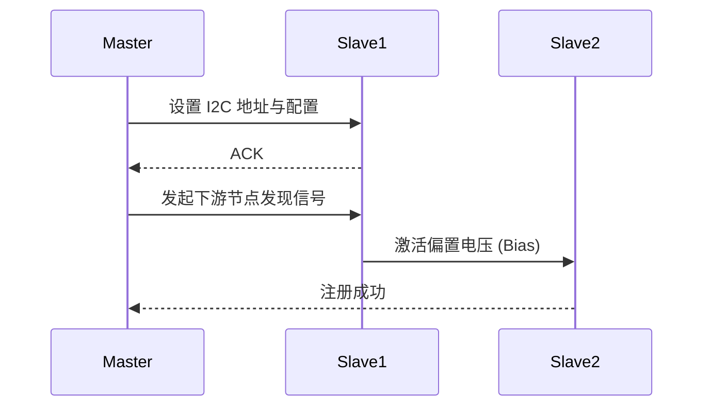

# 换能器：麦克风与扬声器 (Transducers: Microphone & Speaker)

换能器是音频系统中物理世界与电子世界的桥梁。麦克风将声波转换为电信号（录音），而扬声器将电信号还原为声波（播放）。

---

## 1. 麦克风 (Microphone)

### 1.1 核心原理分类
1.  **动圈式 (Dynamic)**：利用电磁感应。无需外部电源，耐用，但高频响应受限于振膜质量。
2.  **电容式 (Condenser)**：利用极板间电容变化。灵敏度极高，需 **48V 幻象电源**。
3.  **MEMS 麦克风**：目前智能手机的主流。
    *   **封装**：集成微型机械振膜与 ASIC。
    *   **接口**：模拟输出或数字 PDM 输出。
    *   **关键指标 - SNR**：智能手机麦克风 SNR 通常在 64dB 到 74dB 之间。

### 1.2 指向性 (Polar Patterns)
专业开发中必须根据场景选择指向性：
*   **全指向 (Omni)**：拾取所有方向，底噪低。
*   **心形 (Cardioid)**：拾取前方，抑制后方，适合手机手持通话。
*   **波束成形 (Beamforming)**：利用麦克风阵列 (Mic Array)，通过算法（如延迟求和）实现动态指向性。

---

## 2. 扬声器 (Speaker / Loudspeaker)

### 2.1 物理构造与安培力
扬声器的动力来自：$F = B \cdot I \cdot L$
*   $B$：磁感应强度；$I$：电流；$L$：音圈导线长度。

### 2.2 T/S 参数 (Thiele/Small Parameters)
这是评估扬声器单元物理性能的专业参数，直接决定了音箱箱体（或手机腔体）的设计：
*   **Fs**：共振频率。扬声器在此时阻抗达到峰值。
*   **Qts**：总品质因数。
*   **Vas**：等效空气体积。

### 2.3 扬声器保护：为何需要 SmartPA？
手机扬声器由于体积微小且驱动电压高，面临两大风险：
1.  **过热 (Over-temperature)**：直流电阻 $R_e$ 随温度升高，音圈烧毁。
2.  **过冲 (Excursion Limit)**：振膜位移超过物理极限，产生物理损坏。
*   **SmartPA 方案**：集成 **IV-Sense** 采样，实时计算实时阻抗 $Z = V / I$，并推算出音圈温度和位移，动态限制输出功率。

---

## 3. 车载专用硬件：A2B (Automotive Audio Bus)

车载环境布线困难且重量敏感。

### 3.1 核心特性
*   **拓扑**：单主节点 (Master) + 最多 16 个从节点 (Slave)。
*   **线缆**：单根 **UTP (非屏蔽双绞线)**。
*   **同步性**：全系统纳秒级同步，非常适合 **ANC (主动降噪)**。

### 3.2 A2B 发现与初始化流程

---

## 4. 关键参考 (References)

1.  *Loudspeaker and Headphone Handbook* - John Borwick
2.  [Thiele/Small Parameters - Wikipedia](https://en.wikipedia.org/wiki/Thiele/Small_parameters)
3.  [Analog Devices A2B Technology](https://www.analog.com/en/applications/technology-solutions/a2b-audio-bus.html)
