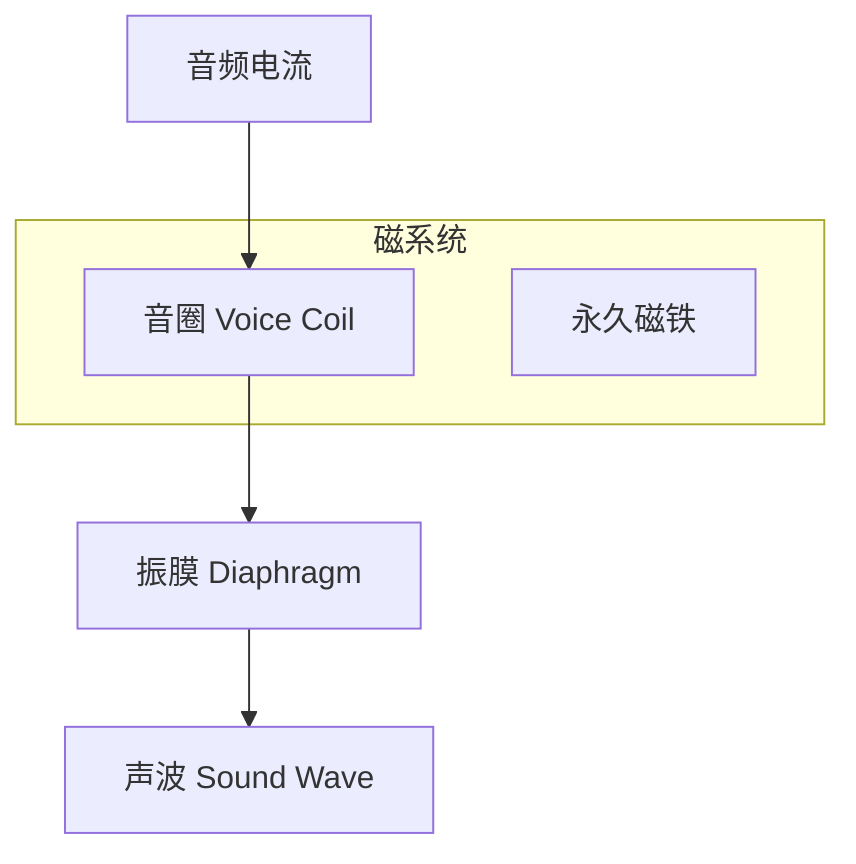

# 换能器：麦克风与扬声器 (Transducers: Microphone & Speaker)

换能器是音频系统中物理世界与电子世界的桥梁。麦克风将声波转换为电信号（录音），而扬声器将电信号还原为声波（播放）。

---

## 1. 麦克风 (Microphone)

麦克风根据工作原理主要分为动圈式和电容式.

### 1.1 动圈式麦克风 (Dynamic Microphone)
*   **原理**：基于**电磁感应**。声波推动振膜带动线圈在磁场中运动，产生感应电流。
*   **特点**：结构坚固，无需电源（幻象电源），耐高声压，但灵敏度和高频响应稍逊。
*   **应用**：舞台演出、KTV。

### 1.2 电容式麦克风 (Condenser Microphone)
*   **原理**：基于**电容电荷变化**。振膜作为电容器的一个极板，声波改变极板间距，导致电容值变化，从而产生电信号。
*   **特点**：极其灵敏，频率响应宽且平坦，瞬态响应快，但需要 **48V 幻象电源 (Phantom Power)**。
*   **应用**：专业录音室、广播。

### 1.3 MEMS 麦克风 (Micro-Electro-Mechanical Systems)
*   **特点**：体积微小，直接集成 CMOS 电路，一致性极好。
*   **应用**：**智能手机**、耳机、穿戴设备。
*   **输出形式**：模拟信号或数字信号 (PDM)。

---

## 2. 扬声器 (Speaker / Loudspeaker)

### 2.1 动圈式扬声器 (Dynamic Loudspeaker)
这是目前应用最广泛的扬声器类型。
*   **结构**：由永久磁铁、音圈 (Voice Coil) 和振膜 (Diaphragm) 组成。
*   **原理**：利用 **安培力**。电流通过位于磁场中的音圈，产生受力运动，带动振膜振动空气发声。

### 2.2 扬声器核心指标
*   **阻抗 (Impedance)**：常见为 4Ω, 8Ω, 32Ω。
*   **灵敏度 (Sensitivity)**：给定 1W 功率在 1米处产生的声压级 (dB/W/m)。
*   **频率响应 (Frequency Response)**：扬声器能有效回放的频率范围。

---

## 3. 手机与车载硬件特有概念

### 3.1 手机：SmartPA (智能功率放大器)
*   **痛点**：手机扬声器体积微小，容易过热或过冲（超出行程）。
*   **原理**：SmartPA 集成了**电流/电压反馈 (IV Sense)**。它实时监测扬声器的状态，通过算法在保护硬件的前提下，压榨出更大的音量和更好的低音。

### 3.2 车载：A2B (Automotive Audio Bus)
*   **痛点**：传统车载音频线缆极重且布线复杂。
*   **解决方案**：由 ADI 提出的数字音频总线。使用单根非屏蔽双绞线传输多通道 I2S/TDM 数据和控制信号，极大减轻了车身重量。

---

## 4. 关键参考 (References)

1.  *Loudspeaker and Headphone Handbook* - John Borwick
2.  [Microphone - Wikipedia](https://en.wikipedia.org/wiki/Microphone)
3.  [A2B Technology - Analog Devices](https://www.analog.com/en/applications/technology-solutions/a2b-audio-bus.html)

---
*Next Topic: [数字音频接口与总线 (Digital Audio Interfaces & Bus)](./02-Interface-Bus/README.md)*
