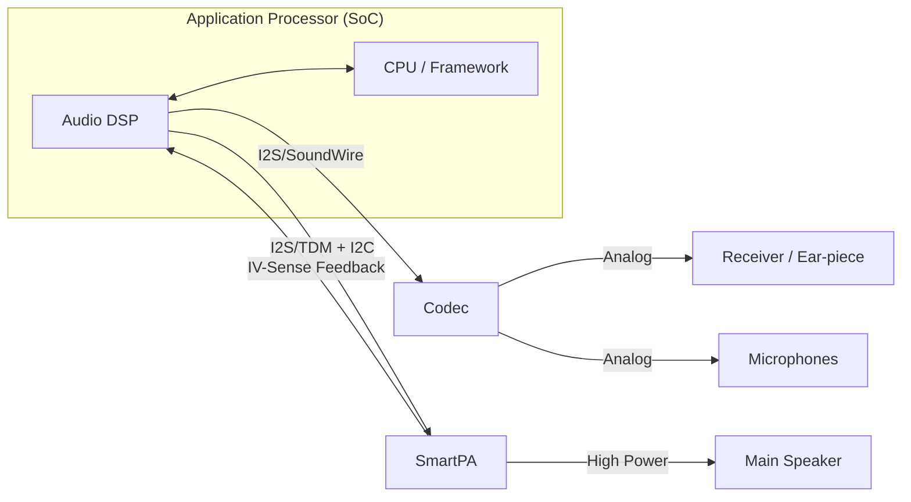
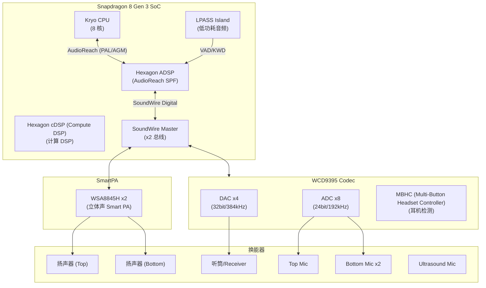
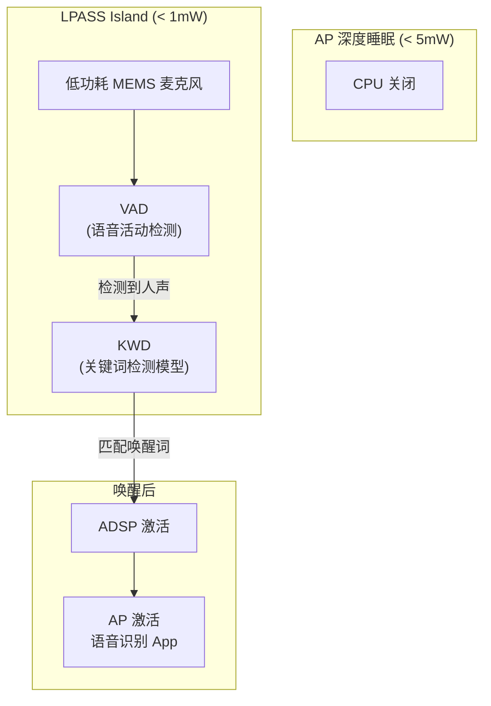

# 移动端音频硬件架构 (Mobile Audio Hardware Architecture)

智能手机的音频硬件架构在过去十年中经历了从简单到极其复杂的演进。现代手机需要在极小的物理空间内实现高质量录音、高保真播放以及低功耗语音交互。

---

## 1. 典型手机音频拓扑 (Typical Mobile Audio Topology)

手机音频系统通常由应用处理器 (AP)、音频编解码器 (Codec)、功率放大器 (PA) 和换能器组成。



---

## 2. 核心组件详解

### 2.1 Audio DSP (ADSP)
*   **作用**：卸载 CPU 的音频处理任务（如解码、3A 算法、音效）。
*   **优势**：极低功耗，适合长期运行（如“Hey Siri”语音唤醒）。
*   **高通平台**：通常称为 Hexagon DSP。

### 2.2 Audio Codec (编解码器)
*   **集成式 (Integrated)**：Codec 集成在电源管理芯片 (PMIC) 或 SoC 中，节省空间 and 成本，常见于中低端机型。
*   **独立式 (Discrete)**：高品质独立 DAC/ADC 芯片（如 Cirrus Logic 系列），提供更好的信噪比 (SNR) 和动态范围，常见于旗舰机或音乐手机。

### 2.3 SmartPA (智能功放)
手机扬声器由于体积限制，面临两个巨大风险：**过热 (Over-temperature)** 和 **过振 (Over-excursion)**。
*   **IV-Sense**：SmartPA 实时测量流过扬声器的电流 (I) 和电压 (V)。
*   **保护算法**：根据 IV 数据实时计算扬声器的实时阻抗 and 振膜位置，通过动态调整增益和 EQ，在不烧毁扬声器的前提下实现最大化的音量（比传统功放提升 3-6dB）。

---

## 3. 旗舰 SoC 音频参考设计

### 3.1 Qualcomm SM8650 (Snapdragon 8 Gen 3) 音频子系统



### 3.2 SM8650 音频关键规格

| 参数 | 规格 | 说明 |
|:---|:---|:---|
| Codec 芯片 | WCD9395 | 集成 4 DAC + 8 ADC |
| SmartPA | WSA8845H × 2 | 支持 IV-Sense + 扬声器保护 |
| 数字接口 | SoundWire v1.2 × 2 | 替代传统 I2S，支持多设备挂载 |
| 播放能力 | 32bit / 384kHz | 原生 Hi-Res |
| 录音能力 | 24bit / 192kHz | 8通道同时录音 |
| DSP 架构 | Hexagon V73 | AudioReach SPF 框架 |
| 低功耗岛 | LPASS Island | < 1mW 待机检测 |
| SNR (DAC) | > 120dB | 独立耳机放大器 |
| THD+N | < -105dB | @ 1kHz, 0dBFS |

### 3.3 SoundWire 总线拓扑

SoundWire 是 Qualcomm 平台上取代 I2S/SLIMbus 的新一代音频总线：

```
SoundWire 相比 I2S/SLIMbus 的优势:
  ┌──────────────────┬──────────────┬────────────────┬─────────────────┐
  │     维度         │     I2S      │   SLIMbus      │   SoundWire     │
  ├──────────────────┼──────────────┼────────────────┼─────────────────┤
  │ 引脚数           │ 4 线/通道     │ 2 线           │ 2 线            │
  │ 设备挂载         │ 点对点        │ 多设备         │ 多设备          │
  │ 带宽             │ 固定          │ 动态           │ 动态            │
  │ 功耗             │ 中            │ 低             │ 极低            │
  │ 控制通道         │ 需独立I2C     │ 内嵌           │ 内嵌            │
  │ 同步             │ 外部          │ 内部           │ 内部 (Bank)     │
  │ MIPI 标准        │ 否            │ 否             │ 是 (MIPI)       │
  └──────────────────┴──────────────┴────────────────┴─────────────────┘
```

### 3.4 MediaTek Dimensity 9300 参考

| 参数 | 规格 |
|:---|:---|
| Codec | MT6681 (集成) |
| DSP | Tensilica HiFi5 |
| SmartPA | 外置 (如 CS35L45) |
| 数字接口 | I2S / SPI |
| Hi-Res | 32bit / 384kHz |
| 低功耗 | VoW (Voice on Wakeup) |

---

## 4. 接口演进：从 3.5mm 到 USB-C/蓝牙

### 4.1 接口时间线

```
2014        2016         2018         2020         2023
 │           │            │            │            │
 ▼           ▼            ▼            ▼            ▼
3.5mm      USB-C 模拟    USB-C 数字    BT 5.0      LE Audio
主流        (被动转接)    (主动DAC)     (TWS 爆发)   (LC3 标准化)
```

### 4.2 3.5mm 耳机孔的消失
*   **内部影响**：节省 1.5-2mm PCB 高度，给电池和马达让空间。
*   **外部影响**：音频信号从**模拟输出**转向**数字输出**。

### 4.3 USB-C 音频 (USB Audio Class)

| 模式 | 原理 | DAC 位置 | 音质 | 功耗 |
|:---|:---|:---|:---|:---|
| **模拟 (Accessory)** | USB-C CC 引脚切换为音频 | 手机内部 Codec | 受手机 DAC 限制 | 低 |
| **数字 (UAC 1.0)** | USB 协议传输 PCM | 转接头/耳机内 | 取决于外部 DAC | 中 |
| **数字 (UAC 2.0)** | USB 异步传输 | 外部 DAC | 可达 32/384 Hi-Res | 高 |

### 4.4 蓝牙音频编码

| 编码 | 码率 | 采样率 | 延迟 | 授权 |
|:---|:---|:---|:---|:---|
| SBC | 328kbps | 44.1/48kHz | ~150ms | 免费 |
| AAC | 256kbps | 44.1/48kHz | ~120ms | 含专利 |
| aptX HD | 576kbps | 48kHz/24bit | ~80ms | 高通 |
| LDAC | 990kbps | 96kHz/24bit | ~100ms | Sony |
| LC3 (LE Audio) | 160-345kbps | 8-48kHz | ~20ms | 免费 |

---

## 5. 低功耗交互：语音唤醒 (Always-on Voice)

### 5.1 低功耗唤醒架构



### 5.2 功耗分析

```
各阶段功耗:
  待机监听 (VAD only):     ~0.3 mW
  二级检测 (KWD):          ~1.5 mW (仅在 VAD 触发后)
  ADSP 全速处理:           ~15 mW
  AP 唤醒 + ASR:           ~500 mW (仅在 KWD 确认后)
  
误唤醒率 vs 功耗 tradeoff:
  VAD 灵敏度 ↑ → 功耗 ↑ (频繁触发 KWD)
  VAD 灵敏度 ↓ → 漏检率 ↑ (用户体验差)
```

---

## 6. 高通 vs MTK vs 三星 平台对比

```
主流手机 SoC 音频子系统对比 (旗舰级):

  ┌──────────────────┬────────────────────┬────────────────────┬──────────────────┐
  │ 维度             │ 高通 SM8650        │ MTK Dimensity 9300 │ Samsung Exynos    │
  ├──────────────────┼────────────────────┼────────────────────┼──────────────────┤
  │ 音频 DSP         │ Hexagon ADSP       │ Hifi5 DSP          │ cDSP             │
  │                  │ (独立核)           │ (共享 SCP)         │ (ARM Cortex)     │
  ├──────────────────┼────────────────────┼────────────────────┼──────────────────┤
  │ Codec 芯片       │ WCD9395            │ MT6373 (集成)      │ 集成 Codec       │
  │                  │ (外挂, SoundWire)  │                    │ (SoC 内部)       │
  ├──────────────────┼────────────────────┼────────────────────┼──────────────────┤
  │ 数字接口         │ SoundWire + I2S    │ TDM + I2S          │ I2S              │
  ├──────────────────┼────────────────────┼────────────────────┼──────────────────┤
  │ SmartPA 支持     │ SoundWire/I2S      │ I2S + I2C          │ I2S + I2C        │
  ├──────────────────┼────────────────────┼────────────────────┼──────────────────┤
  │ 算法框架         │ AudioReach SPF     │ SWIP               │ 自研框架         │
  ├──────────────────┼────────────────────┼────────────────────┼──────────────────┤
  │ 语音唤醒         │ 三级 (Codec VAD    │ SCP 低功耗唤醒     │ VTS (Voice       │
  │                  │ + ADSP KWD + AP)   │                    │ Trigger System)  │
  ├──────────────────┼────────────────────┼────────────────────┼──────────────────┤
  │ 最大采样率       │ 384kHz (Codec)     │ 192kHz             │ 192kHz           │
  │                  │ DSD512 (via DoP)   │                    │                  │
  ├──────────────────┼────────────────────┼────────────────────┼──────────────────┤
  │ Offload 解码     │ AAC/MP3/FLAC/ALAC  │ AAC/MP3/FLAC       │ AAC/MP3          │
  │                  │ Opus/WMA/DSD       │                    │                  │
  ├──────────────────┼────────────────────┼────────────────────┼──────────────────┤
  │ 空间音频         │ Snapdragon Sound   │ 第三方 (Dolby)     │ Samsung 360 Audio│
  │                  │ (ADSP 渲染)        │                    │                  │
  └──────────────────┴────────────────────┴────────────────────┴──────────────────┘
```

---

## 7. 典型手机音频原理图解读

```
高通旗舰手机音频硬件连接 (简化原理图):

  ┌──────────────────────────────────────────────────────────────────┐
  │ SM8650 SoC                                                       │
  │                                                                  │
  │  LPAIF (Low-Power Audio Interface):                             │
  │    ├── SoundWire Master 0 → WCD9395 (Codec)                    │
  │    │     ├── DMIC 0/1 (底部双麦)                                │
  │    │     ├── DMIC 2/3 (顶部双麦)                                │
  │    │     ├── AMIC (模拟麦接口, 预留)                            │
  │    │     ├── HPH_L/R (耳机输出)                                 │
  │    │     ├── EAR (听筒输出)                                     │
  │    │     └── MBHC (耳机检测)                                    │
  │    │                                                            │
  │    ├── SoundWire Master 1 → WSA8845 ×2 (SmartPA)               │
  │    │     ├── WSA8845 #1 → Speaker L                            │
  │    │     └── WSA8845 #2 → Speaker R                            │
  │    │                                                            │
  │    ├── TDM/I2S → 外部 SmartPA (可选, 如 CS35L45)              │
  │    │                                                            │
  │    └── AUX PCM → BT Codec (SCO 通话)                           │
  │                                                                  │
  │  USB → USB Audio HAL → 外部 DAC/耳机                            │
  └──────────────────────────────────────────────────────────────────┘
  
  电源设计注意:
    - WCD9395: VDDA (1.8V Analog) + VDDD (1.8V Digital) + VDD_Buck
    - WSA8845: VBAT (3.8V, 直接接电池电压!) + VDD (1.8V)
    - 所有 LDO 需要 DAPM 控制, 不使用时关断省电
    
  PCB Layout 注意:
    - DMIC 走线远离高速数字信号 (DDR/UFS)
    - SoundWire 差分线阻抗匹配 (50Ω)
    - SmartPA 到 Speaker 走线尽量短且宽 (大电流)
```

---

## 8. 音频芯片供应商完整图谱

### 8.1 Codec 芯片供应商

| 供应商 | 代表型号 | 接口 | 定位 | 主要客户 |
|:---|:---|:---|:---|:---|
| **Qualcomm** | WCD9395, WCD9380, WCD937x | SoundWire | 手机 (高通平台专用) | 小米/OPPO/vivo/三星 |
| **Cirrus Logic** | CS42L43, CS47L90 | SoundWire/I2S | 手机/PC (Apple 生态) | Apple iPhone/MacBook |
| **Realtek** | ALC5682, ALC1220 | I2S/SPI | PC/IoT/USB-C 耳机 | 联想/华硕/Dell |
| **Texas Instruments** | PCM512x, TLV320AIC | I2S | 嵌入式/树莓派/IoT | 工业/消费 |
| **Asahi Kasei (AKM)** | AK4458, AK4493, AK4377 | I2S | Hi-Fi DAC/车载 | Sony/LG/高端播放器 |
| **ESS Technology** | ES9038, ES9219 | I2S | 发烧级 DAC | vivo (X 系列)/FiiO |
| **MediaTek** | MT6681, MT6359 (集成 PMIC) | I2S/TDM | 手机 (MTK 平台内置) | OPPO/vivo/小米 |

### 8.2 SmartPA 芯片供应商

| 供应商 | 代表型号 | 接口 | 特色 | 主要客户 |
|:---|:---|:---|:---|:---|
| **Cirrus Logic** | CS35L45, CS35L41 | I2S + I2C | Haptics 支持, 低功耗 | Apple/Samsung/Google |
| **Qualcomm (WSA)** | WSA8845H, WSA8835 | SoundWire | 高通平台原生集成 | 小米/OPPO/vivo |
| **NXP → Goodix** | TFA9874, TFA9878 | I2S + I2C | 双通道, IV-Sense EQ | 华为/三星 |
| **Maxim (ADI)** | MAX98390, MAX98396 | I2S + I2C | 集成 DSP, 热保护 | Google Pixel/联想 |
| **艾为电子 (Awinic)** | AW882xx, AW883xx | I2S + I2C | 国产, 性价比 | 小米/荣耀/传音 |
| **富芮坤 (Foursemi)** | FS19xx | I2S + I2C | 国产, 车规认证 | 车载 Tier 1 |

### 8.3 典型手机音频方案

```
旗舰手机音频硬件方案对比:

┌──────────────┬──────────────┬─────────────┬──────────────┬──────────────┐
│ 手机         │ SoC          │ Codec       │ SmartPA      │ MEMS MIC     │
├──────────────┼──────────────┼─────────────┼──────────────┼──────────────┤
│ iPhone 15 Pro│ A17 Pro      │ Cirrus      │ CS35L45 ×2   │ Knowles ×3   │
│              │              │ CS42L43     │              │              │
├──────────────┼──────────────┼─────────────┼──────────────┼──────────────┤
│ 小米 14 Ultra│ SM8650       │ WCD9395     │ CS35L45 ×2   │ Knowles ×4   │
│              │ (骁龙8Gen3)  │ (SoundWire) │ (定制调音)   │              │
├──────────────┼──────────────┼─────────────┼──────────────┼──────────────┤
│ Samsung S24U │ SM8650       │ WCD9395     │ CS35L41 ×2   │ Knowles ×3   │
│              │ /Exynos 2400 │ /集成 Codec │ /AW882xx     │              │
├──────────────┼──────────────┼─────────────┼──────────────┼──────────────┤
│ OPPO Find X7 │ Dimensity    │ MT6681      │ CS35L45 ×2   │ Knowles ×3   │
│              │ 9300         │ (集成)      │              │              │
├──────────────┼──────────────┼─────────────┼──────────────┼──────────────┤
│ 华为 Pura 70 │ 麒麟 9010   │ 自研 Codec  │ 自研/NXP     │ Goertek ×4   │
│              │              │             │ TFA9878      │              │
├──────────────┼──────────────┼─────────────┼──────────────┼──────────────┤
│ vivo X100Pro │ Dimensity    │ MT6681 +    │ CS35L45 ×2   │ Knowles ×3   │
│              │ 9300         │ CS43131     │              │              │
│              │              │ (独立HiFi)  │              │              │
└──────────────┴──────────────┴─────────────┴──────────────┴──────────────┘

注: 具体型号可能因地区/批次/成本优化而变化
```

---

## 9. 关键参考 (References)

1.  [Qualcomm SM8650 Audio Subsystem](https://www.qualcomm.com/products/mobile/snapdragon/smartphones/snapdragon-8-series-mobile-platforms)
2.  [WCD9395 Codec Datasheet](https://www.qualcomm.com/)
3.  [MIPI SoundWire Specification](https://www.mipi.org/specifications/soundwire)
4.  [SmartPA Technology Overview - Cirrus Logic](https://www.cirrus.com/)
5.  [USB Audio Class 2.0 Specification](https://www.usb.org/)
6.  [MediaTek Audio Technology](https://www.mediatek.com/products/smartphones)

---
*Next Topic: [车载音频硬件架构 (Automotive Audio Hardware)](./04-Automotive-Hardware.md)*
