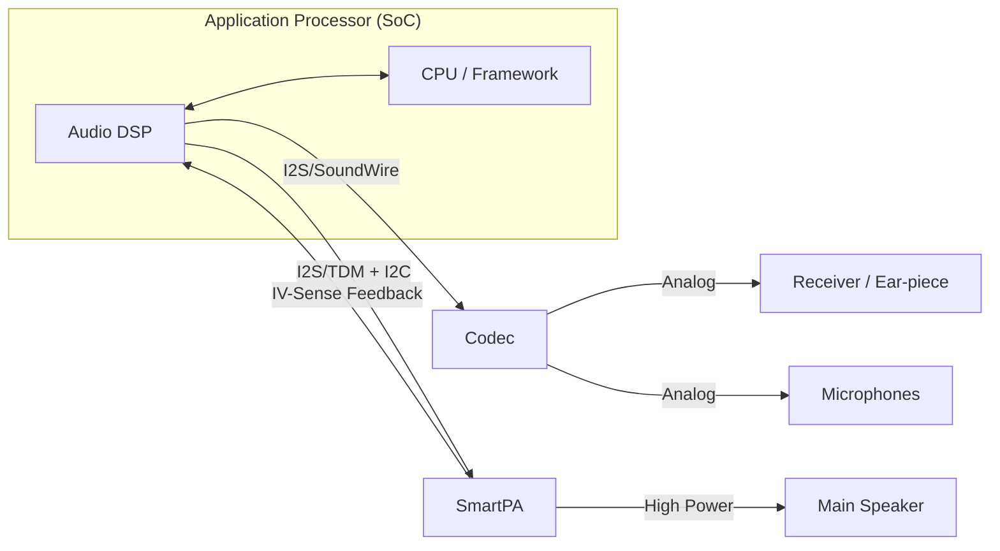

# 移动端音频硬件架构 (Mobile Audio Hardware Architecture)

智能手机的音频硬件架构在过去十年中经历了从简单到极其复杂的演进。现代手机需要在极小的物理空间内实现高质量录音、高保真播放以及低功耗语音交互。

---

## 1. 典型手机音频拓扑 (Typical Mobile Audio Topology)

手机音频系统通常由应用处理器 (AP)、音频编解码器 (Codec)、功率放大器 (PA) 和换能器组成。

---

## 2. 核心组件详解

### 2.1 Audio DSP (ADSP)
*   **作用**：卸载 CPU 的音频处理任务（如解码、3A 算法、音效）。
*   **优势**：极低功耗，适合长期运行（如“Hey Siri”语音唤醒）。
*   **高通平台**：通常称为 Hexagon DSP。

### 2.2 Audio Codec (编解码器)
*   **集成式 (Integrated)**：Codec 集成在电源管理芯片 (PMIC) 或 SoC 中，节省空间 and 成本，常见于中低端机型。
*   **独立式 (Discrete)**：高品质独立 DAC/ADC 芯片（如 Cirrus Logic 系列），提供更好的信噪比 (SNR) 和动态范围，常见于旗舰机或音乐手机。

### 2.3 SmartPA (智能功放)
手机扬声器由于体积限制，面临两个巨大风险：**过热 (Over-temperature)** 和 **过振 (Over-excursion)**。
*   **IV-Sense**：SmartPA 实时测量流过扬声器的电流 (I) 和电压 (V)。
*   **保护算法**：根据 IV 数据实时计算扬声器的实时阻抗 and 振膜位置，通过动态调整增益和 EQ，在不烧毁扬声器的前提下实现最大化的音量（比传统功放提升 3-6dB）。

---

## 3. 接口演进：从 3.5mm 到 USB-C/蓝牙

### 3.1 3.5mm 耳机孔的消失
*   **内部影响**：节省了大量的 PCB 空间。
*   **外部影响**：音频信号从**模拟输出**转向了**数字输出**。

### 3.2 USB-C 音频 (USB Audio Class)
*   **模拟模式 (Accessory Mode)**：使用 USB-C 的边带引脚传输模拟信号，依赖手机内部 Codec。
*   **数字模式**：音频数据以 USB 数据包形式传输，由耳机或转接头内部的 DAC 芯片进行转换。

---

## 4. 低功耗交互：语音唤醒 (Always-on Voice)

现代手机支持熄屏唤醒，硬件上依赖：
1.  **低功耗 LP-MEMS 麦克风**。
2.  **DSP 中的 VAD (Voice Activity Detection) 模块**：只有检测到人类声音特征时，才激活后续更复杂的唤醒词匹配算法。

---

## 5. 关键参考 (References)

1.  *Mobile Phone Architecture and Design* - Specialized Industry Reports
2.  [SmartPA Technology Overview - NXP/Cirrus Logic](https://www.cirrus.com/)
3.  [Qualcomm Hexagon DSP Architecture](https://www.qualcomm.com/)

---
*Next Topic: [车载音频硬件架构 (Automotive Audio Hardware)](./04-Automotive-Hardware.md)*
