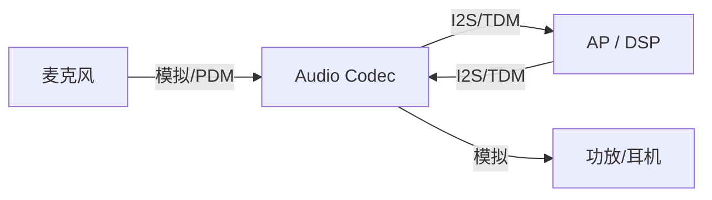
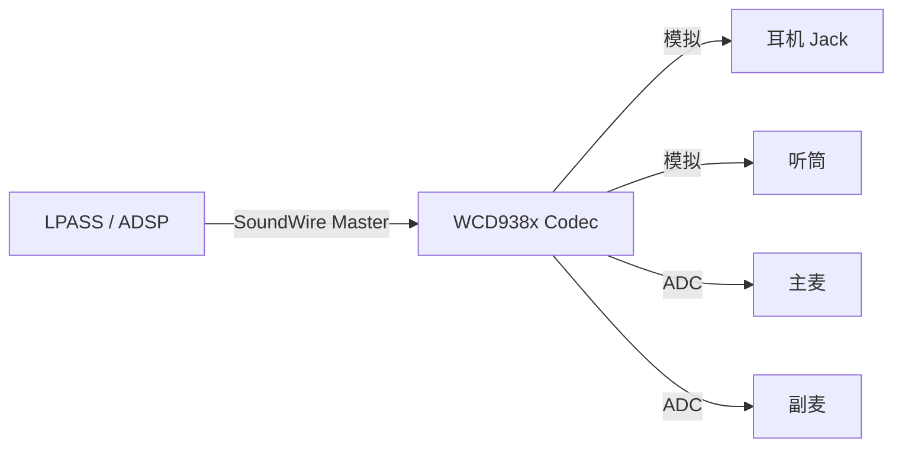
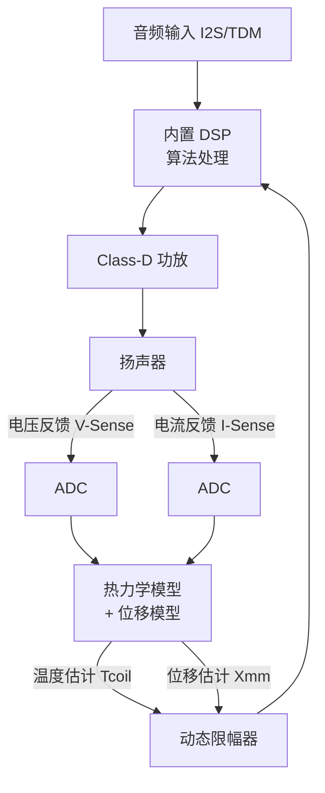
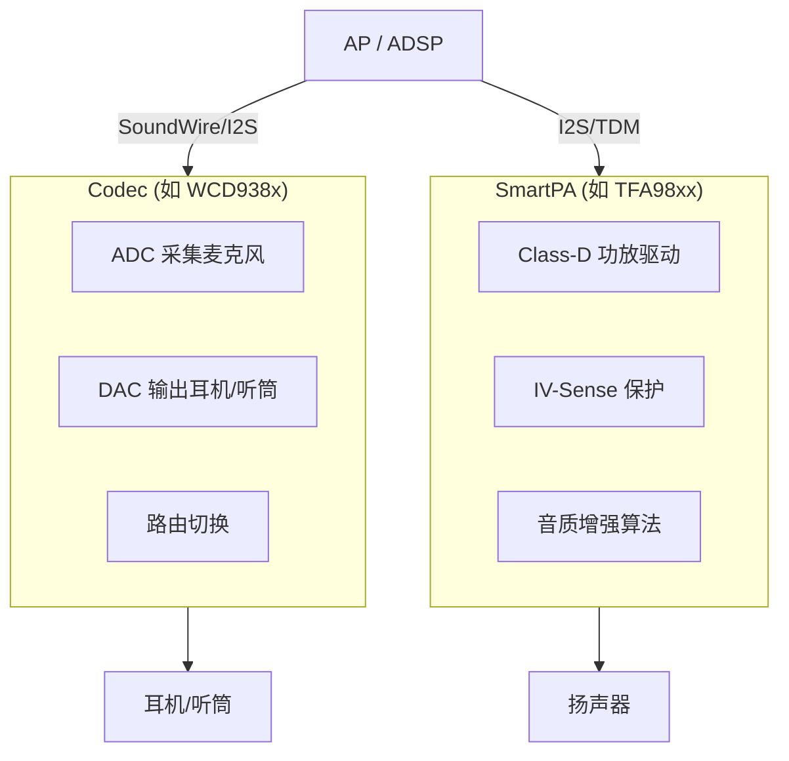

# 编解码器与智能功放 (Audio Codec & SmartPA)

音频编解码器 (Codec) 是数字音频系统的核心枢纽，负责 ADC/DAC 转换、路由切换与信号调理；智能功放 (SmartPA) 则是驱动微型扬声器的关键芯片，通过实时保护算法最大化音质表现。

---

## 1. 音频 Codec 芯片

### 1.1 功能定位

Codec 是 SoC 与外部换能器之间的"翻译官"：



### 1.2 核心功能模块

| 模块 | 功能 | 关键指标 |
|:---|:---|:---|
| **ADC** | 模拟→数字，采集麦克风信号 | SNR、THD+N、动态范围 |
| **DAC** | 数字→模拟，输出至功放/耳机 | DNR (Dynamic Range, 动态范围)、THD+N |
| **PGA (可编程增益放大器)** | 输入/输出增益调节 | 增益范围、步进精度 |
| **Mixer** | 多路信号混合 | 通道数 |
| **路由矩阵 (Routing Matrix)** | 灵活连接输入输出端口 | 拓扑复杂度 |
| **数字接口** | I2S / TDM / SoundWire 与 SoC 通信 | 支持采样率、位深 |
| **控制接口** | I2C / SPI 寄存器配置 | 寄存器映射 |

### 1.3 主流 Codec 芯片系列

#### 高通 WCD 系列 (移动端主力)

| 型号 | 定位 | 关键特性 |
|:---|:---|:---|
| **WCD9380** | 旗舰 | 32-bit/384kHz, DSD128 (DoP), SoundWire |
| **WCD9385** | 旗舰增强 | 支持更多并发 SoundWire 通路 |
| **WCD937x** | 中端 | 24-bit/192kHz, 成本优化 |

高通平台中 Codec 通常通过 **SoundWire** 总线与 SoC LPASS (Low Power Audio SubSystem) 连接：



#### Cirrus Logic CS 系列 (Apple 生态)

*   **CS42L43**：集成 SoundWire，支持多通道 TDM。
*   **CS35Lxx**：SmartPA + Codec 一体化方案。

#### Realtek ALC 系列 (PC/IoT)

*   **ALC5682**：USB-C 耳机 Codec，支持 Hi-Res。
*   **ALC1220**：桌面主板旗舰 Codec，120dB SNR。

#### 其他重要供应商

| 供应商 | 代表型号 | 应用 | 特点 |
|:---|:---|:---|:---|
| **Asahi Kasei (AKM)** | AK4458 (DAC), AK5558 (ADC), AK4377 | 车载/Hi-Fi 播放器 | 天鹅绒音质 (Velvet Sound), 超低 THD |
| **ESS Technology** | ES9038PRO, ES9219, ES9039 | 发烧 DAC/手机 Hi-Fi | 业界最高 SNR (140dB), Hyperstream |
| **Texas Instruments** | PCM5102, PCM1795, TLV320AIC3254 | 嵌入式/IoT/树莓派 | 高性价比、文档完善 |
| **Analog Devices** | ADAU1978 (ADC), ADAU1966 (DAC) | 专业录音/车载 | 多通道、高精度 |

### 1.4 DAC/ADC 核心架构

```
两大主流 ADC/DAC 架构:

1. Sigma-Delta (ΣΔ) 架构  [音频领域主流]
   ┌─────────┐    ┌──────────┐    ┌───────────┐
   │ 模拟输入  │──→ │ ΣΔ 调制器 │──→ │ 数字滤波器  │──→ PCM 输出
   │          │    │(过采样×64) │    │(Decimation)│
   └─────────┘    └──────────┘    └───────────┘
   
   原理: 
     - 对信号进行超高速过采样 (如 64× 或 128× Fs)
     - ΣΔ 调制器将信号转为 1-bit 流 (PDM)
     - 通过数字抗混叠滤波器 (Decimation) 转为多 bit PCM
   
   优势: 高分辨率 (24-32bit)、高 SNR、低成本
   劣势: 群延迟大 (数ms)、不适合超低延迟场景
   应用: 几乎所有音频 Codec、DMIC、Hi-Fi DAC
   代表: WCD938x (ADC/DAC)、AK4458、ES9038

2. SAR (Successive Approximation Register, 逐次逼近) 架构
   ┌─────────┐    ┌────────┐    ┌──────┐
   │ 模拟输入  │──→ │ S/H    │──→ │ SAR  │──→ 数字输出
   │          │    │(采样保持)│    │逐次比较│
   └─────────┘    └────────┘    └──────┘
   
   原理:
     - 采样保持后，从 MSB 到 LSB 逐位比较
     - 每次比较用 DAC 生成参考，与输入比对
     - N-bit 需要 N 个时钟周期
   
   优势: 低延迟 (~µs 级)、低功耗、无群延迟
   劣势: 分辨率受限 (通常 12-16bit)、SNR 不如 ΣΔ
   应用: 传感器采集、IV-Sense 电流检测、ANC 参考
   代表: TI ADS131 系列、ADI AD7175

对比:
  ┌──────────┬──────────────┬──────────────┐
  │ 维度     │ Sigma-Delta  │ SAR          │
  ├──────────┼──────────────┼──────────────┤
  │ 分辨率   │ 24-32 bit    │ 12-16 bit    │
  │ 采样率   │ 8-768 kHz    │ 1-10 MSPS    │
  │ SNR      │ 100-130 dB   │ 70-95 dB     │
  │ 延迟     │ ms 级        │ µs 级        │
  │ 功耗     │ 中           │ 低           │
  │ 音频适用 │ 主流         │ 辅助/传感    │
  └──────────┴──────────────┴──────────────┘
```

### 1.5 Codec 寄存器配置范例 (以 WCD 为例)

Codec 的所有行为通过寄存器控制，在 Linux/Android 中由 ASoC 驱动 + DAPM 管理：

```c
/* 典型 Codec 寄存器操作 - 设置 PGA 增益 */
static int wcd_set_decimator_gain(struct snd_soc_component *component,
                                   int decimator, int gain_db)
{
    u16 gain_reg = WCD_REG_DEC0_GAIN + (decimator * 0x10);
    /* 增益范围: -12dB ~ +40dB, 步进 1dB */
    u8 val = (u8)(gain_db + 12); /* offset to unsigned */
    return snd_soc_component_write(component, gain_reg, val);
}
```

---

## 2. 智能功放 SmartPA

### 2.1 为什么需要 SmartPA？

传统功放 (Class-D Amp) 仅负责放大信号。但在手机/车载微型扬声器中：
*   **腔体极小** → 低频响应差 → 需要算法补偿
*   **功率密度高** → 音圈过热风险 → 需要温度保护
*   **振膜行程短** → 大音量时物理过冲 → 需要位移保护

SmartPA = **Class-D 功放** + **实时保护 DSP** + **IV-Sense 采样**

### 2.2 核心工作原理：IV-Sense 闭环



**关键公式**：
*   阻抗估算：$Z(t) = V(t) / I(t)$
*   温度推算：$T_{coil} = T_0 \times (1 + \alpha \cdot \Delta R / R_0)$
    *   $\alpha$：铜导线电阻温度系数 (≈0.00393/°C)
*   位移估算：基于电机方程 $x(t) = \frac{1}{Bl} \int (V - IR - L\frac{dI}{dt}) dt$

### 2.3 主流 SmartPA 芯片

| 芯片 | 厂商 | 关键特性 |
|:---|:---|:---|
| **TFA9874** | NXP (Goodix) | 双通道、IV-Sense、EQ |
| **TFA9878** | NXP (Goodix) | 支持 SoundWire |
| **CS35L45** | Cirrus Logic | Haptics 支持、低功耗 |
| **MAX98390** | Maxim (ADI) | 集成 DSP、热保护 |
| **AW882xx** | 艾为电子 | 国产方案、性价比高 |
| **FS19xx** | 富芮坤 (Foursemi) | 国产、车载认证 |

### 2.4 SmartPA 的音质增强算法

除了保护功能外，SmartPA 内置 DSP 通常还支持：

1.  **低频补偿 (Bass Enhancement)**
    *   根据扬声器特性曲线，补偿 200Hz 以下的低频衰减。
    *   使能后可感知到明显"低音增强"效果。

2.  **热补偿 (Thermal Compensation)**
    *   音圈温度升高 → 阻抗升高 → 输出声压下降。
    *   算法预判并增加增益，保持输出声压稳定。

3.  **非线性失真校正**
    *   大信号时振膜运动产生非线性。
    *   通过前馈校正算法降低 THD。

### 2.5 Linux/Android 驱动集成

SmartPA 在 ASoC 框架中通常注册为一个 **Codec 驱动**：

```
Machine Driver → DAI Link → SmartPA Codec Driver
                                    ↓
                              I2C/SPI 控制通路
                              I2S/TDM 音频数据通路
```

典型设备树配置：
```dts
&i2c5 {
    tfa98xx: smartpa@34 {
        compatible = "nxp,tfa9874";
        reg = <0x34>;
        reset-gpio = <&tlmm 68 GPIO_ACTIVE_LOW>;
        irq-gpio = <&tlmm 69 GPIO_ACTIVE_HIGH>;
    };
};

&dai_link_speaker {
    codec {
        sound-dai = <&tfa98xx>;
    };
};
```

---

## 3. Codec vs SmartPA 职责划分

在现代手机音频架构中，两者分工明确：



| 维度 | Codec | SmartPA |
|:---|:---|:---|
| 主要角色 | 信号转换与路由 | 功率放大与保护 |
| 驱动对象 | 耳机、听筒、麦克风 | 扬声器 |
| 是否含 DAC | ✅ | ❌ (接收数字 I2S 输入) |
| 是否含功放 | 仅低功率耳机放大 | Class-D 大功率 |
| 保护算法 | 无 | IV-Sense 闭环 |

---

## 4. WCD938x 寄存器操作实战

### 4.1 WCD938x 架构概览

```
高通 WCD938x 系列 Codec 内部功能模块:

  ┌─────────────────────────────────────────────────────┐
  │ WCD9380 / WCD9385 Codec                            │
  │                                                     │
  │  ┌───────────┐  ┌───────────┐  ┌───────────┐       │
  │  │ TX Path   │  │ RX Path   │  │ Sidetone  │       │
  │  │ (录音)    │  │ (播放)    │  │ (侧音)    │       │
  │  │ ADC ×4    │  │ DAC ×2    │  │ IIR Filter│       │
  │  │ DMIC ×8   │  │ PA (HP)   │  └───────────┘       │
  │  │ AMIC ×4   │  │ PA (EAR)  │                      │
  │  │ HPF/Dec   │  │ Interp    │  ┌───────────┐       │
  │  └───────────┘  └───────────┘  │ MBHC      │       │
  │                                 │ (耳机检测) │       │
  │  ┌───────────┐  ┌───────────┐  └───────────┘       │
  │  │ SoundWire │  │ Clock/PLL │                       │
  │  │ Master    │  │ MCLK/PLL  │  ┌───────────┐       │
  │  │ Slave     │  │ Fractional│  │ SWR/DSD   │       │
  │  └───────────┘  └───────────┘  └───────────┘       │
  └─────────────────────────────────────────────────────┘
  
  接口: SoundWire (数字音频 + 寄存器控制共用)
  供电: 1.8V (数字) + 1.8V (模拟) + Buck/LDO
```

### 4.2 关键寄存器配置示例

```c
// === WCD938x Codec 驱动常见寄存器操作 ===
// 文件: techpack/audio/asoc/codecs/wcd938x/wcd938x.c

// 1. RX 数字音量控制 (HPH DAC)
// 范围: 0x00 (-84dB) ~ 0x54 (0dB) ~ 0x7F (+20dB)
snd_soc_component_write(component,
    WCD938X_CDC_RX0_RX_VOL_CTL, 0x54);  // 0dB
    
// 2. TX 模拟增益 (Mic PGA)
// 范围: 0x00 (0dB) ~ 0x14 (20dB), 步进 1dB (近似)
snd_soc_component_update_bits(component,
    WCD938X_ANA_TX_CH1, 0x1F, 0x0C);    // +12dB

// 3. HPH (耳机) PA 使能
snd_soc_component_update_bits(component,
    WCD938X_ANA_HPH,
    WCD938X_HPH_EN_MASK,
    WCD938X_HPH_EN_MASK);  // Enable L+R

// 4. MBHC 耳机检测启用
snd_soc_component_update_bits(component,
    WCD938X_MBHC_NEW_CTL_1,
    WCD938X_MBHC_DET_EN, WCD938X_MBHC_DET_EN);
```

### 4.3 WCD938x 调试命令

```bash
# 读取 Codec 寄存器 (通过 debugfs)
adb shell cat /sys/kernel/debug/regmap/wcd938x-codec/registers

# 查看 Codec DAPM 状态
adb shell cat /sys/kernel/debug/asoc/wcd938x-codec/dapm_widgets

# 查看 SoundWire 状态
adb shell cat /sys/kernel/debug/soundwire/master-0/status

# Codec 供电状态
adb shell cat /sys/kernel/debug/regulator/wcd938x-vdd-buck/consumers
```

---

## 5. SmartPA IV-Sense 调参流程

### 5.1 IV-Sense 闭环保护原理

```
IV-Sense (电流/电压感应) 闭环保护:

  ┌─────────────────────────────────────────────────────┐
  │ SmartPA (如 CS35L45 / TFA9874)                     │
  │                                                     │
  │  I2S 输入 (PCM)                                    │
  │    │                                                │
  │    ▼                                                │
  │  ┌──────────────┐                                  │
  │  │ DSP/算法     │←── V-Sense (扬声器端电压采样)    │
  │  │  温度估算    │←── I-Sense (扬声器端电流采样)    │
  │  │  位移估算    │                                  │
  │  │  增益调整    │                                  │
  │  └──────┬───────┘                                  │
  │         │ 保护后的信号                              │
  │         ▼                                          │
  │  Class-D 功放 → 扬声器                             │
  └─────────────────────────────────────────────────────┘
  
  保护逻辑:
    1. 实时采集 V(t) 和 I(t)
    2. 计算阻抗: Z = V/I → 推算音圈温度 (Re 随温升增大)
    3. 计算位移: 通过电感变化估算振膜偏移
    4. 判断:
       - 温度 > 阈值 → 降低增益 (防烧毁)
       - 位移 > Xmax → 限幅 (防机械撞击)
    5. 动态调整输出, 在安全范围内最大化音量
```

### 5.2 调参关键步骤

```
SmartPA 调参 (Speaker Tuning) 流程:

  Step 1: 扬声器 T/S 参数测量
    用激光测振仪 + 阻抗分析仪测量:
    - Re (直流电阻, 典型 6-8Ω)
    - Fs (谐振频率)
    - Qts, Vas, Xmax
    - BL (力系数)
    
  Step 2: 建立扬声器模型
    在 SmartPA 调参工具中导入参数:
    - Cirrus: WISCE / SoundClear Studio
    - NXP/Goodix: TFA Tuning Tool
    
  Step 3: 设置保护参数
    - 最高温度: 通常 80-120°C (取决于音圈材料)
    - Xmax: 正/负最大位移 (如 ±0.4mm)
    - 安全余量: 通常留 10-20% 裕度
    
  Step 4: EQ 调频响
    - 目标曲线: 参考 Harman Target Curve
    - 低频补偿: 小喇叭天然低频不足, 适当 Boost
    - 高频: 平滑衰减, 避免刺耳
    
  Step 5: 验证
    - 播放粉红噪声/正弦扫频, 观察保护是否触发
    - THD 测试: 不同音量下失真是否在可接受范围
    - 跌落测试: 长时间大音量播放, 温度是否稳定
```

### 5.3 IV-Sense 数据通路 (高通平台)

```
高通平台 SmartPA IV 反馈路径:

  扬声器
    │ V-Sense / I-Sense (模拟信号)
    ▼
  SmartPA ADC → I2S/TDM TX (数字回传)
    │
    ▼
  ADSP SPF Graph:
    ├── Speaker Protection Module (SPv4/SPv5)
    │     → 接收 IV 数据
    │     → 运行热模型 + 位移模型
    │     → 输出保护增益
    ├── 保护增益 → 应用到 RX 路径
    └── RX Path → I2S/TDM → SmartPA → 扬声器
    
  TDM 通道分配 (典型):
    TX: Ch0 = V-Sense Left,  Ch1 = I-Sense Left
        Ch2 = V-Sense Right, Ch3 = I-Sense Right
    RX: Ch0 = Audio Left,    Ch1 = Audio Right
```

---

## 6. 关键参考 (References)

1.  [NXP TFA98xx Datasheet & Application Notes](https://www.nxp.com/products/audio-and-radio/audio-amplifiers/smart-audio-amplifiers)
2.  [Qualcomm WCD938x Codec Overview - Qualcomm Developer](https://developer.qualcomm.com/)
3.  [Cirrus Logic CS35L45 Technical Documentation](https://www.cirrus.com/products/cs35l45/)
4.  *ALSA ASoC Driver Development* - Linux Kernel Documentation
5.  [Understanding Speaker Protection - Audio Precision](https://www.ap.com/)
6.  [Harman Target Response Curve](https://www.harman.com/documents/HarmanTargetCurve.pdf)
7.  [Goodix Smart Amplifier Solutions](https://www.goodix.com/en/product/audio)
