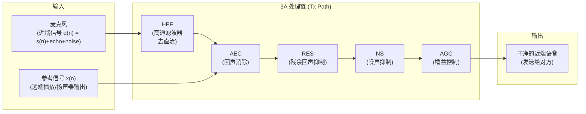
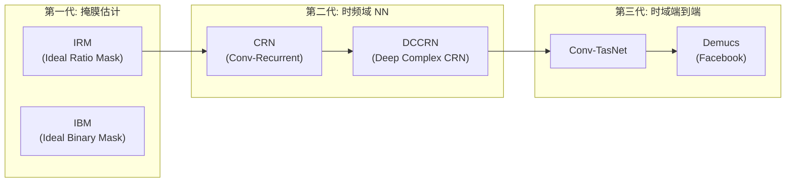
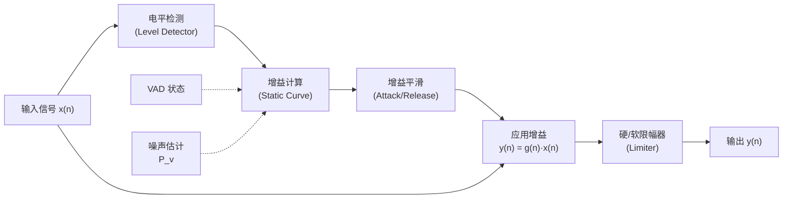

# 语音通信 3A 算法 (AEC, ANS, AGC)

> **3A** 指语音通信中三大前端处理算法：**AEC (Acoustic Echo Cancellation, 声学回声消除)**、**ANS (Active Noise Suppression, 噪声抑制，也常写作 NS)**、**AGC (Automatic Gain Control, 自动增益控制)**。它们是保证全双工通话质量的基石。

本章从信号模型、数学原理、工程实现、系统集成到调试方法，系统而深入地解析 3A 全链路。

---

## 1. 3A 处理全链路与系统位置

### 1.1 信号处理流水线



**处理顺序的工程原理**：
1. **HPF (High Pass Filter, 高通滤波器)** 必须最先：去除 DC offset (直流偏置) 和超低频干扰，防止影响后续估计器
2. **AEC** 紧随其后：它需要干净的参考信号 x(n) 做自适应滤波，且需在信号未被非线性处理前工作
3. **RES (Residual Echo Suppressor, 残余回声抑制器)**：对线性 AEC 未能完全消除的非线性回声做后处理
4. **NS** 在 AEC/RES 之后：处理环境噪声和 AEC 残余泄漏
5. **AGC** 在最末：对已经干净的信号做电平归一化，避免放大噪声/回声

### 1.2 系统位置：Tx Path vs Rx Path

```
┌─────────────────────────────────────────────────────────────┐
│                     近端设备 (Near-End)                        │
│                                                              │
│   ┌────────────┐      ┌──────────────┐     ┌─────────┐     │
│   │ 麦克风 MIC  │──Tx──│ 3A (AEC+NS+AGC)│──→──│ 编码发送 │──→ 网络
│   └────────────┘  Path │              │     └─────────┘     │
│                         │   AEC Ref ↑  │                     │
│   ┌────────────┐      │   ┌───────┐  │     ┌─────────┐     │
│   │ 扬声器 SPK  │←─Rx──│   │ Rx NS │←─│─────│ 解码接收 │←── 网络
│   └────────────┘  Path │   │ Rx AGC│  │     └─────────┘     │
│                         └───┴───────┴──┘                     │
└─────────────────────────────────────────────────────────────┘

Tx Path (发送路径): MIC → HPF → AEC → RES → NS → AGC → Encoder → Network
Rx Path (接收路径): Network → Decoder → Rx NS → Rx AGC → Speaker

注: AEC 的参考信号 (Reference) 从 Rx Path 的 DAC (Digital-to-Analog Converter) 
    输出前取出，与 Tx MIC 输入做延迟对齐后送入自适应滤波器。
```

### 1.3 关键延迟预算

| 环节 | 典型延迟 | 说明 |
|:---|:---|:---|
| ADC (Analog-to-Digital Converter) | 1-3 ms | 模拟→数字转换 |
| AEC 算法帧 | 10-20 ms | 帧长 + 前瞻 (Lookahead) |
| NS 算法帧 | 10-20 ms | STFT (Short-Time Fourier Transform) 帧 + 重叠 |
| AGC | 0-5 ms | 通常无额外延迟 |
| 编码器 (Codec) | 20-40 ms | 帧长依编码格式 (如 Opus 20ms) |
| 网络 + Jitter Buffer | 40-150 ms | 端到端变化最大 |
| **单向总延迟** | **< 150 ms** | ITU-T G.114 建议 (保证通话交互感) |

---

## 2. 回声消除 (AEC - Acoustic Echo Cancellation)

### 2.1 回声成因与路径模型

**声学回声** 产生的物理机制：

```
远端语音 x(n) → 网络传输 → DAC → 扬声器播放 → 房间声学反射 → 麦克风拾取
                                                  ↑
                                    声学回声路径 h(n) — 多径反射 (Multipath)
                                    (脉冲响应长度: 50-500ms, 取决于房间RT60)

数学模型:
  d(n) = s(n) + y(n) + v(n)
  
  其中:
    d(n) — 麦克风拾取的混合信号 (near-end microphone signal)
    s(n) — 近端语音 (near-end speech, 我们想保留的有用信号)
    y(n) — 声学回声 = Σ h(k)·x(n-k) ≈ h(n) * x(n) (线性卷积)
    v(n) — 环境噪声 (ambient noise)
    x(n) — 远端参考信号 (far-end reference)
    h(n) — 回声路径 RIR (Room Impulse Response, 房间脉冲响应)
    
  AEC 目标: 估计 ĥ(n) 使 ŷ(n) = ĥ(n)*x(n) ≈ y(n)，输出 e(n) = d(n) - ŷ(n) ≈ s(n) + v(n)
```

**回声路径特性**：
| 特性 | 说明 | 典型数值 |
|:---|:---|:---|
| **路径长度** | RIR 有效持续时间 | 手机免提 50-150ms; 车载 80-300ms; 会议室 200-500ms |
| **RT60** | 混响时间 (声能衰减 60dB 所需时间) | 办公室 0.3-0.6s; 会议室 0.5-1.2s |
| **ERL (Echo Return Loss)** | 回声路径自然衰减 | 手持 40-60dB; 免提 5-15dB |
| **非线性失真** | 扬声器功放引入的谐波 | THD (Total Harmonic Distortion) 1-10% |
| **路径时变性** | 人移动、门窗变化 | 需自适应跟踪 |

### 2.2 延迟对齐 (Delay Alignment) — AEC 正确工作的前提

AEC 滤波器必须知道参考信号 x(n) 到达麦克风的**系统延迟** (Bulk Delay)。如果对齐错误，滤波器将无法收敛。

```
系统延迟组成:
  τ_total = τ_software + τ_DAC + τ_acoustic + τ_ADC

  τ_software: 软件缓冲 (Audio HAL buffer, ALSA period)  — 可变 5-50ms
  τ_DAC:      DA 转换延迟                                  — 固定 ~1ms
  τ_acoustic: 声学传播 (SPK → MIC 物理距离)              — 固定 < 1ms (手机)
  τ_ADC:      AD 转换延迟                                  — 固定 ~1ms

延迟估计方法:
  1. GCC-PHAT (Generalized Cross-Correlation with Phase Transform):
     τ̂ = argmax_τ { IFFT[ X(f)·D*(f) / |X(f)·D*(f)| ] }
     - 频域互相关，相位加权，对噪声和混响鲁棒
     
  2. 基于能量的粗搜索:
     在 [0, τ_max] 范围内滑动，找到互相关能量峰值
     - 计算量小，适合初始粗对齐
     
  3. 子带延迟估计:
     在多个频带分别估计延迟取中值
     - 抗窄带噪声干扰
```

**Android/高通平台延迟对齐实践**：
```bash
# 查看 Audio HAL 报告的延迟
adb shell dumpsys media.audio_flinger | grep -A5 "Output thread"
# 关注: standby delay, write blocked, latency (ms)

# 高通平台: 参考信号延迟由 ACDB (Audio Calibration Database) 配置
# 路径: /vendor/etc/acdbdata/<device>/Bluetooth_cal.acdb
# QACT 中调整 EC Reference Delay 参数
```

### 2.3 线性自适应滤波器

#### 2.3.1 LMS (Least Mean Squares, 最小均方) 族

| 算法 | 更新公式 | 复杂度 | 收敛性 |
|:---|:---|:---|:---|
| **LMS** | w(n+1) = w(n) + μ·e(n)·x(n) | O(N) | 慢，依赖步长 |
| **NLMS** | w(n+1) = w(n) + μ·e(n)·x(n) / (‖x(n)‖² + ε) | O(N) | 中等，归一化收敛稳定 |
| **APA (Affine Projection)** | 使用 P 个历史向量投影 | O(NP²) | 快，适合有色信号 |
| **RLS (Recursive Least Squares)** | 递推最小二乘，指数加权 | O(N²) | 最快，计算量大 |

**NLMS (Normalized LMS, 归一化最小均方)** 是工程中最常用的基线：

$\mathbf{w}(n+1) = \mathbf{w}(n) + \mu \frac{e(n) \cdot \mathbf{x}(n)}{\|\mathbf{x}(n)\|^2 + \varepsilon}$

其中：
- **w(n)**: 自适应滤波器权重向量，长度 L (对应回声路径 tap 数)
- **μ**: 步长因子 (Step Size)，0 < μ < 2，控制收敛速度与稳态误差的 tradeoff
- **e(n)**: 误差信号 = d(n) - ŷ(n) = d(n) - wᵀ(n)·x(n)
- **ε**: 正则化常数，防止除零 (典型 10⁻⁶ ~ 10⁻⁸)
- **L**: 滤波器阶数 = 采样率 × 最大回声延迟 (如 16kHz × 200ms = 3200 taps)

```python
import numpy as np

class NlmsAEC:
    """NLMS 自适应回声消除器"""
    def __init__(self, filter_len=3200, mu=0.5, eps=1e-8):
        self.L = filter_len          # 滤波器长度 (taps)
        self.mu = mu                  # 步长
        self.eps = eps                # 正则化
        self.w = np.zeros(filter_len) # 滤波器权重
        self.x_buf = np.zeros(filter_len)  # 远端参考缓冲
        
    def process_sample(self, mic_in: float, far_ref: float, 
                       dtd_flag: bool = False) -> float:
        """
        Args:
            mic_in:  麦克风输入 d(n)
            far_ref: 远端参考 x(n) (已延迟对齐)
            dtd_flag: DTD (Double-Talk Detector) 检测标志
        Returns:
            error: 回声消除后的信号 e(n)
        """
        # 更新参考缓冲 (FIFO)
        self.x_buf = np.roll(self.x_buf, 1)
        self.x_buf[0] = far_ref
        
        # 估计回声
        echo_hat = np.dot(self.w, self.x_buf)
        
        # 误差信号
        error = mic_in - echo_hat
        
        # 自适应更新 (仅在非双讲时)
        if not dtd_flag:
            norm = np.dot(self.x_buf, self.x_buf) + self.eps
            self.w += self.mu * (error / norm) * self.x_buf
        
        return error
```

#### 2.3.2 频域自适应滤波 (FDAF / PBFDAF)

时域 NLMS 对长回声路径 (L > 1000 taps) 效率低。现代 AEC 普遍使用**分块频域自适应滤波器 (PBFDAF, Partitioned Block Frequency Domain Adaptive Filter)**：

```
PBFDAF 核心思路:
  1. 将长滤波器 (L taps) 分成 P 个子块，每块 B 个 taps
     L = P × B, 例: L=4096, B=128, P=32
  
  2. 每块独立做频域卷积:
     - 参考信号分块: X_p(k) = FFT(x_p(n)), 使用 2B 点 FFT (overlap-save)
     - 滤波器频域权重: W_p(k)
     - 回声估计: Y(k) = Σ_{p=0}^{P-1} W_p(k) · X_p(k)
  
  3. 频域权重更新 (逐频点 NLMS):
     E(k) = D(k) - Y(k)
     W_p(k) += μ · E(k) · X_p*(k) / (|X_p(k)|² + δ)
     
     * 表示共轭, δ 为正则化项
  
  4. 约束: IFFT → 截取前 B 个样本 → FFT (防止循环卷积泄漏)

计算复杂度对比:
  时域 NLMS:  O(L) per sample → O(L²/B) per block  (L=4096 时极慢)
  PBFDAF:     O(P · B·log₂(2B)) per block          (利用 FFT 加速)
  
  当 L=4096, B=128: 
    时域: ~4096 MACs/sample
    频域: ~32 × 256×8 / 128 ≈ 512 MACs/sample → 8x 加速

WebRTC AEC3 参数:
  - Block size B = 64 samples
  - FFT size = 128 (2B)
  - Filter length: ~400ms @ 16kHz → P ≈ 100 个分块
  - 每频点独立步长 (Variable Step Size)
  - 正则化: 逐频点功率谱平滑
```

#### 2.3.3 子带自适应滤波 (SAEC)

另一种降低复杂度的方法是**子带分解 (Subband Decomposition)**:

```
子带 AEC 架构:
  1. Analysis Filter Bank: 将宽带信号分解为 K 个子带 (如 QMF / Polyphase)
  2. 各子带独立运行 NLMS (下采样后滤波器长度缩短 K 倍)
  3. Synthesis Filter Bank: 合成子带输出

优势:
  - 各子带下采样 K 倍 → 滤波器长度 L/K
  - 子带内信号更"白"(去相关) → NLMS 收敛更快
  - 适合 DSP 多核并行

劣势:
  - Filter Bank 引入额外延迟 (几 ms)
  - 跨子带失真 (Aliasing) 需要处理
  
实际应用:
  - 高通 Fluence: 多子带自适应 + 后处理
  - Speex: 使用 QMF (Quadrature Mirror Filter) 2 子带结构
```

### 2.4 非线性处理器 (NLP - Nonlinear Processor)

线性自适应滤波器只能消除**线性回声**。由于扬声器功放的非线性失真 (如 THD, 谐波、互调失真)，会产生线性滤波器无法建模的**非线性回声**成分。NLP 是解决这个问题的关键后处理模块。

```
NLP 工作原理:
  1. 回声估计 → 计算残余回声功率谱 P_echo(f)
  2. 信号检测 → 判断当前帧是否仍有回声残留
  3. 抑制增益 → 计算频域抑制掩膜 (Suppression Mask):
  
     G(f) = max{ G_min, 1 - α · P_echo(f) / P_error(f) }
     
     G_min: 最小增益 (如 -40dB, 避免完全静音的不自然感)
     α: 过抑制因子 (Over-Suppression Factor, 1.0 ~ 2.0)
  
  4. 应用抑制: S_out(f) = G(f) · E(f)

NLP 难点:
  - 双讲 (Double-Talk) 时不能过度抑制，否则会消掉近端语音
  - 需要与 DTD (Double-Talk Detector) 紧密配合
  - 非线性回声估计不准会导致"半双工"感觉
```

**WebRTC AEC3 的 NLP 实现**：采用 **回声路径增益估计 (Echo Path Gain)** + **Coherence-based Suppression**:
- 估计线性回声残余 (通过 ERLE 自适应)
- 估计非线性回声 (通过 mic-ref 频域相干性)
- 综合两者输出抑制增益

### 2.5 双讲检测 (DTD - Double-Talk Detection)

双讲 (Double-Talk) 是 AEC 面临的最大挑战之一：当近端和远端同时说话时，自适应滤波器可能将近端语音误判为误差而发散。

| 方法 | 原理 | 判据 | 优缺点 |
|:---|:---|:---|:---|
| **Geigel** | 比较 MIC 能量与 REF 能量 | \|d(n)\| > δ·max(\|x\|) | 极简单但不准确，易漏检 |
| **NCC (Normalized Cross-Correlation)** | 计算 d(n) 与 x(n) 的归一化互相关 | ρ < threshold (互相关下降表示有近端信号) | 中等复杂度 |
| **ERLE Monitoring** | 监测 ERLE (Echo Return Loss Enhancement) 突变 | ERLE 突然下降 → 可能双讲 | 准确但有延迟 |
| **Coherence-based** | 计算 mic-ref 频域相干函数 | 相干性低 → 近端信号占主导 | WebRTC 采用，鲁棒 |
| **Neural DTD** | RNN/CNN 小模型直接分类 | softmax 输出双讲概率 | 最准确，需额外计算资源 |

**DTD 对滤波器的控制策略**：
```
DTD 状态       → 滤波器行为
─────────────────────────────────────
单讲(远端)     → 正常自适应更新 (μ = μ_normal)
单讲(近端)     → 冻结滤波器 (μ = 0)，仅输出
双讲           → 降低步长 (μ = μ_normal × 0.1) 或冻结
静默           → 缓慢更新 (跟踪路径缓变)
```

### 2.6 多麦克风 AEC (MAEC - Multi-channel AEC)

多麦克风设备 (如手机多 MIC、会议终端麦阵) 面临**通道间相关性问题**：

```
单通道 AEC: 
  对每个 MIC 独立做 AEC (实现简单但忽略空间信息)

问题: 当多个 MIC 拾取相同远端播放时，各通道参考信号 x(n) 相同
      → 多通道自适应滤波器存在"非唯一性"(Non-Uniqueness) 问题
      → 权重可能收敛到错误解

解决方案:
  1. 参考信号去相关 (Reference Decorrelation):
     - 各通道参考加不同随机噪声扰动
     - 各通道用不同的非线性变换
     
  2. 波束成形 + AEC 联合:
     - BF (Beamforming, 波束成形) 先做空域滤波
     - AEC 对 BF 输出做处理 (单通道问题)
     - 优势: 降低 AEC 复杂度，利用空间信息抑制干扰
     
  3. 高通 Fluence (EC + BF 联合):
     Fluence Pro (3+ MIC):
       MIC Array → BF (MVDR/GSC) → EC → NS → AGC
                                    ↑
                              多通道参考去相关
```

### 2.7 NN-AEC (Neural Network Echo Cancellation)

近年来 DNN (Deep Neural Network, 深度神经网络) 被用于解决传统 AEC 难以处理的场景：

| 方案 | 架构 | 特点 | 场景 |
|:---|:---|:---|:---|
| **Hybrid (线性 AEC + NN 后处理)** | FDAF + CRN (Convolutional Recurrent Network) | 线性消除 + 非线性残余NN处理 | 主流方案 |
| **End-to-End NN** | 纯 U-Net / DCCRN 直接输入 mic+ref 输出 clean | 无需自适应滤波器 | 研究阶段 |
| **Meta-AEC** | MAML (Model-Agnostic Meta-Learning) 快速适应新房间 | 少样本适应 | 前沿研究 |

```
典型 Hybrid NN-AEC 架构 (如 AEC Challenge 2021 获胜方案):

  Far-end ref x(n) ─→ ┌─────────────┐
                        │ Linear FDAF  │──→ e(n) (线性残差)
  Mic input d(n) ──→   └─────────────┘
                                │
                    ┌───────────┼───────────────────────┐
                    │           ↓                         │
                    │    ┌─────────────┐                 │
  Features:         │    │  NN Post-   │                 │
  - |E(f)|² (残差频谱) │    │  Filter     │──→ Clean speech │
  - |X(f)|² (参考频谱) │    │  (CRN/GRU)  │                 │
  - |D(f)|² (MIC频谱)  │    └─────────────┘                 │
  - ERLE estimate   │                                     │
                    └─────────────────────────────────────┘

优势:
  - 处理非线性回声 (功放失真、近场耦合)
  - 双讲性能大幅提升 (NN 学习到近端语音特征)
  - 适应复杂声学环境 (混响、运动)
  
代价:
  - 计算量: 2-10 MFLOPS 额外
  - 训练数据: 需大量 echo/clean 配对数据
  - 延迟: NN 推理可能增加 5-10ms
```

### 2.8 AEC 性能指标

| 指标 | 全称 | 定义 | 目标值 |
|:---|:---|:---|:---|
| **ERLE** | Echo Return Loss Enhancement | 输出回声衰减 = 10log₁₀(P_echo_in / P_echo_out) | > 30dB (单讲); > 20dB (双讲) |
| **ERL** | Echo Return Loss | 声学路径自然衰减 = 10log₁₀(P_ref / P_echo) | 设备相关 (5-60dB) |
| **AECMOS** | AEC Mean Opinion Score | Microsoft 提出的 AEC 主观评分 (1-5) | > 4.0 |
| **收敛时间** | Convergence Time | 从开始到 ERLE 达到稳态 90% 的时间 | < 1-2 秒 |
| **双讲 MOS** | Double-Talk MOS | 双讲场景下近端语音质量 | > 3.5 |
| **尾音长度** | Tail Length | 可消除的最大回声路径长度 | > 200ms (手机); > 400ms (车载) |
| **跟踪速度** | Tracking Speed | 路径突变后重新收敛时间 | < 500ms |

---

## 3. 噪声抑制 (NS - Noise Suppression)

> 也称 ANS (Active Noise Suppression) 或 NR (Noise Reduction)。目标是从带噪语音信号中估计并去除背景噪声，保留干净语音。

### 3.1 问题建模

```
带噪语音模型 (加性噪声假设):
  y(n) = s(n) + v(n)
  
频域 (STFT 变换后):
  Y(k,l) = S(k,l) + V(k,l)
  
  k: 频率 bin 索引
  l: 时间帧索引
  Y: 带噪信号频谱
  S: 纯净语音频谱 (待估计)
  V: 噪声频谱

NS 核心任务:
  估计增益函数 G(k,l)，使得 Ŝ(k,l) = G(k,l) · Y(k,l) ≈ S(k,l)
  
  关键子问题:
  1. 噪声功率谱估计 (Noise PSD Estimation): 估计 P_v(k,l) = E[|V(k,l)|²]
  2. 先验/后验 SNR 估计
  3. 增益函数计算
  4. 增益平滑与后处理 (避免音乐噪声)
```

### 3.2 STFT (Short-Time Fourier Transform) 分析-合成框架

所有频域 NS 方法都基于 STFT:

```
STFT 参数选择 (语音处理典型值):
┌───────────────────────────────────────────────────────────┐
│  参数              │  典型值          │  选择依据            │
├───────────────────────────────────────────────────────────┤
│  帧长 (Frame)      │  20-32 ms       │  语音准平稳假设      │
│  帧移 (Hop)        │  10-16 ms       │  时间分辨率          │
│  重叠率 (Overlap)  │  50-75%         │  完美重建条件        │
│  窗函数            │  Hann / Sqrt-Hann│  OLA (Overlap-Add)  │
│  FFT 大小          │  256-512 点     │  ≥帧长, 2的幂        │
│  采样率            │  16kHz (NB/WB)  │  通话标准            │
└───────────────────────────────────────────────────────────┘

处理流程:
  Input → 分帧 → 加窗 → FFT → 频域增益处理 → IFFT → 去窗 → OLA → Output
  
  OLA (Overlap-Add): 相邻帧重叠相加实现无缝拼接
  WOLA (Weighted OLA): 分析窗+合成窗，满足完美重建: Σ w_a(n-mR)·w_s(n-mR) = 1
```

### 3.3 噪声功率谱估计 (Noise PSD Estimation)

这是 NS 中**最关键的子问题**。噪声估计不准，一切后续处理都会出问题。

#### 3.3.1 VAD-Based (基于语音活动检测)

```
最简单方法: 
  1. VAD (Voice Activity Detection, 语音活动检测) 判断当前帧是否为静音
  2. 静音帧: 更新噪声估计 P_v(k) = α·P_v(k) + (1-α)·|Y(k)|²
  3. 语音帧: 保持噪声估计不变

缺点:
  - VAD 本身需要 SNR 信息 (鸡生蛋问题)
  - 非平稳噪声 (如车载风噪) 在语音段可能变化 → 估计滞后
  - VAD 误判直接导致噪声估计错误
```

#### 3.3.2 MCRA (Minima Controlled Recursive Averaging)

**MCRA** 是工业界广泛使用的无 VAD 噪声估计方法，由 Cohen & Berdugo (2002) 提出：

```
核心思想: 
  语音信号是间歇性的，在任何频率 bin 上，功率谱的局部最小值趋近于噪声功率

MCRA 算法步骤:
  1. 功率谱平滑:
     P(k,l) = α_s · P(k,l-1) + (1-α_s) · |Y(k,l)|²     (α_s ≈ 0.8)
  
  2. 搜索局部最小值 (滑动窗口):
     P_min(k,l) = min{ P(k,l), P(k,l-1), ..., P(k,l-D+1) }
     D: 搜索窗长 (如 96 帧 ≈ 1.5s)
  
  3. 语音存在概率 (SPP, Speech Presence Probability):
     I(k,l) = 1  if P(k,l) / P_min(k,l) > δ    (δ ≈ 4-5, 对应 ~6-7dB)
              0  otherwise
     
     p(k,l) = α_p · p(k,l-1) + (1-α_p) · I(k,l)   (SPP 平滑)
  
  4. 条件更新噪声估计:
     α̃(k,l) = α_d + (1-α_d) · p(k,l)     (α_d ≈ 0.95, 噪声平滑系数)
     P_v(k,l) = α̃(k,l) · P_v(k,l-1) + (1-α̃(k,l)) · |Y(k,l)|²
     
     解释: 当 p(k,l)→1 (语音存在) 时，α̃→1，噪声估计几乎不更新
           当 p(k,l)→0 (仅噪声) 时，α̃→α_d，噪声估计正常跟踪

MCRA 改进版本:
  - IMCRA (Improved MCRA): 两级最小值跟踪 + 偏差补偿
  - MCRA2: 动态 δ 门限适应
  - MS (Minimum Statistics): Martin 1994, 利用功率谱统计分位数
```

#### 3.3.3 MMSE-Based Noise Estimation

```
MMSE (Minimum Mean Square Error) 噪声估计:
  - 将噪声看作随机变量，在 MMSE 准则下估计
  - 需要 SPP 作为先验:
    P̂_v(k,l) = p(k,l)·P_v(k,l-1) + [1-p(k,l)]·|Y(k,l)|²
  
  优势: 理论最优; 劣势: 依赖 SPP 准确性
```

### 3.4 SNR (Signal-to-Noise Ratio) 估计

#### 3.4.1 后验 SNR (A Posteriori SNR)

$\gamma(k,l) = \frac{|Y(k,l)|^2}{\hat{P}_v(k,l)}$

直接由观测信号与噪声估计计算。

#### 3.4.2 先验 SNR (A Priori SNR) — Decision-Directed 方法

$\xi(k,l) = \alpha_{DD} \cdot \frac{|\hat{S}(k,l-1)|^2}{\hat{P}_v(k,l-1)} + (1-\alpha_{DD}) \cdot \max\{\gamma(k,l) - 1, 0\}$

- **α_DD**: DD (Decision-Directed) 平滑因子，典型 0.98
- 第一项: 上一帧估计的 SNR (平滑)
- 第二项: 当前帧瞬时 SNR (ML 估计)
- DD 方法是 **Ephraim & Malah (1984)** 提出的经典方法，几乎所有工业 NS 都使用

### 3.5 增益函数 (Gain Function) 详解

#### 3.5.1 谱减法 (Spectral Subtraction)

$|\hat{S}(k)|^2 = |Y(k)|^2 - \alpha \cdot \hat{P}_v(k)$
$G(k) = \sqrt{\frac{\max\{|Y(k)|^2 - \alpha \hat{P}_v(k),\ \beta \cdot |Y(k)|^2\}}{|Y(k)|^2}}$

- **α**: 过减因子 (Over-subtraction, 1.0-4.0)
- **β**: 谱底 (Spectral Floor, 0.01-0.1)，防止过度抑制产生"音乐噪声"
- 最简单但音乐噪声严重

#### 3.5.2 维纳滤波 (Wiener Filter)

$G_{Wiener}(k,l) = \frac{\xi(k,l)}{1 + \xi(k,l)} = \frac{\text{SNR}_{priori}}{1 + \text{SNR}_{priori}}$

- 在 MMSE 准则下对**功率谱幅度**最优
- 结合 DD 方法估计 ξ(k,l)，音乐噪声极少
- **工业标准方案**，WebRTC NS 即基于此

#### 3.5.3 MMSE-STSA (Short-Time Spectral Amplitude)

$G_{MMSE}(k,l) = \frac{\sqrt{\pi}}{2} \cdot \frac{\sqrt{\nu(k,l)}}{\gamma(k,l)} \cdot \exp\left(-\frac{\nu}{2}\right) \cdot \left[(1+\nu)I_0\left(\frac{\nu}{2}\right) + \nu I_1\left(\frac{\nu}{2}\right)\right]$

其中 ν = ξ·γ/(1+ξ), I₀/I₁ 为修正贝塞尔函数。

- Ephraim & Malah (1984) 提出
- 在语音幅度的 MMSE 准则下最优 (假设高斯先验)
- 复杂度高于 Wiener，但质量更好

#### 3.5.4 MMSE-LSA (Log-Spectral Amplitude)

$G_{LSA}(k,l) = \frac{\xi(k,l)}{1+\xi(k,l)} \cdot \exp\left(\frac{1}{2}\int_{\nu(k,l)}^{\infty}\frac{e^{-t}}{t}dt\right)$

- 对数域 MMSE，主观听感最好 (人耳对数感知)
- 配合 SPP 可实现 **OM-LSA (Optimally-Modified LSA)**:
  G(k) = G_LSA^{p(k)} · G_min^{1-p(k)}
  → 语音存在时用 LSA 增益; 语音不存在时用最小增益

### 3.6 音乐噪声 (Musical Noise) 抑制

音乐噪声是频域 NS 的典型人工失真，表现为随机分散的"水滴声/鸟鸣声"：

```
成因:
  - 噪声频谱的随机波动导致各频点增益忽大忽小
  - 帧间增益不连续产生调幅效应

抑制策略:
  1. 增益平滑 (Gain Smoothing):
     - 时间平滑: G(k,l) = β·G(k,l-1) + (1-β)·G_raw(k,l)
     - 频率平滑: G(k,l) = Σ b(m)·G(k-m,l) (FIR 滤波)
     
  2. 最小增益限制 (Spectral Floor):
     G(k,l) = max{ G_computed(k,l), G_min }
     G_min 典型: -12 ~ -20 dB (舒适噪声保留)
     
  3. 过抑制+舒适噪声 (Comfort Noise):
     - 大幅抑制 (G_min = -40dB)
     - 人工注入舒适噪声 (CNG, Comfort Noise Generation)
     - 避免"死寂"的不自然感
     
  4. SPP-based 平滑 (OM-LSA):
     利用 SPP 做软切换，语音段少抑制，非语音段多抑制
```

### 3.7 深度学习降噪

#### 3.7.1 架构演进



#### 3.7.2 主流方案对比

| 方案 | 架构 | 参数量 | MFLOPS | 延迟 | 适用平台 |
|:---|:---|:---|:---|:---|:---|
| **RNNoise** | GRU, 22 Bark bands | 60K | 0.04 | 10ms | ARM Cortex-M/A, WebRTC |
| **NSNet2** | GRU + FC | 2.7M | 0.3 | 20ms | 端侧 (Microsoft) |
| **DTLN** | Dual-signal LSTM | 1M | 0.5 | 32ms | 移动端 CPU |
| **DCCRN** | Complex Conv + LSTM | 3.7M | 2.0 | 32ms | GPU/NPU |
| **FullSubNet+** | Full-band + Sub-band LSTM | 8.6M | 5.0 | 20ms | 服务端 |
| **DPCRN** | Dual-Path Complex RNN | 0.8M | 0.8 | 8ms | 移动端 NPU |
| **Qualcomm Fluence** | 专有 (ADSP HW 加速) | 不公开 | ADSP native | <5ms | 高通 SoC |

#### 3.7.3 训练策略

```
训练数据构造:
  clean_speech: DNS (Deep Noise Suppression) Challenge 数据集 (500h+)
  noise: AudioSet, MUSAN, QUT-NOISE, 自采集
  mix: SNR 随机 [-5, 20] dB
  RIR (Room Impulse Response): 合成/实采混响

Loss 函数选择:
  - SI-SNR (Scale-Invariant SNR): 时域，不受增益影响
  - STFT Loss: L1(|S| - |Ŝ|) + L1(phase)
  - Multi-Resolution STFT: 多窗长综合
  - Perceptual Loss: PESQ-proxy / STOI-proxy 可微近似

端侧部署:
  - 量化: INT8/INT16 (TFLite / SNPE / QNN)
  - 剪枝: 结构化剪枝 (channel pruning)
  - 知识蒸馏: 大模型→小模型
  - 平台 SDK: Qualcomm SNPE/QNN, ARM NN, MediaTek NeuroPilot
```

### 3.8 NS 性能指标

| 指标 | 全称 | 说明 | 目标 |
|:---|:---|:---|:---|
| **SNR Improvement** | — | 处理前后 SNR 提升 (dB) | > 10-15 dB |
| **PESQ** | Perceptual Evaluation of Speech Quality | ITU-T P.862 语音感知质量 (1.0-4.5) | > 3.5 |
| **STOI** | Short-Time Objective Intelligibility | 短时客观可懂度 (0-1) | > 0.85 |
| **SI-SNR** | Scale-Invariant SNR | 尺度不变 SNR (dB) | > 15 dB |
| **DNSMOS** | Deep Noise Suppression MOS | Microsoft 非侵入式 MOS 预测 (1-5) | > 3.5 |
| **处理延迟** | Algorithmic Latency | 算法引入的额外延迟 | < 20ms |
| **Speech Distortion** | — | 对语音本身的失真程度 | LSD (Log Spectral Distortion) < 1 dB |

---

## 4. 自动增益控制 (AGC - Automatic Gain Control)

> AGC 的目标是将音频信号的电平归一化到目标范围内，补偿不同说话人音量差异、说话距离变化等因素，同时防止削波 (Clipping)。

### 4.1 AGC 系统框架



### 4.2 电平检测 (Level Detection)

```
电平检测方式:
  1. Peak Detector (峰值检测):
     L(n) = max{ |x(n)|, α·L(n-1) }
     - 跟踪信号峰值
     - 响应快，但对瞬态敏感
  
  2. RMS Detector (均方根检测):
     L(n) = sqrt{ α·L²(n-1) + (1-α)·x²(n) }
     - 反映信号平均能量
     - 更稳定，但响应稍慢
  
  3. dBFS (Decibels relative to Full Scale):
     L_dB = 20·log₁₀(L / FullScale)
     - FullScale: 数字系统满幅值 (如 INT16 → 32768)
     - 0 dBFS = 满幅; -3 dBFS = 约 70.7% 满幅

  工程选择:
    - 通话 AGC: 通常用 RMS (反映响度)
    - Limiter: 必须用 Peak (防削波)
    - 分段: 短时 RMS (20-40ms 窗) 用于增益决策
```

### 4.3 静态增益曲线 (Static Characteristic)

```
                  Output (dBFS)
                     |
            0 dBFS  ─┤─ ─ ─ ─ ─ ─ ─ ─ ─ ─ ─ ─ ─ ─ /─── Limiter (∞:1)
                     |                              /
        Target Level ┤─ ─ ─ ─ ─ ─ ─ ─ ─ ─ ─ ─ ─/
                     |                          / ←── Compression (2:1~10:1)
                     |                        /
                     |                      / 
           Knee      ┤─ ─ ─ ─ ─ ─ ─ ─ ─ /←── Knee Point (软拐点)
                     |                 /
                     |               / ←── Linear (1:1)
                     |             /
                     |           /
           Gate      ┤─ ─ ─ ─ /←── Expansion Gate (语音以下不增益)
                     |       │
                     |       │←── Noise Gate: 低于此电平输出静音
                     ├───────┼──────────────────────── Input (dBFS)
                     0     Gate   Knee   Target    0 dBFS

关键参数:
  - Threshold (门限): 开始压缩的输入电平
  - Ratio (压缩比): 输入变化 X dB → 输出变化 X/R dB (如 2:1, 4:1)
  - Knee (拐点): 硬拐/软拐 (Soft Knee 过渡更平滑)
  - Make-up Gain: 压缩后的补偿增益 (提升整体电平)
  - Noise Gate: 低于此门限的信号不增益 (防止放大底噪)
```

### 4.4 增益平滑 (Gain Smoothing / Ballistics)

增益不能瞬变，否则产生可听的调制失真 (Pumping/Breathing):

```
增益平滑 (一阶 IIR):
  if g_target(n) < g(n-1):   // 增益需要减小 (信号变大了)
      g(n) = α_att · g(n-1) + (1-α_att) · g_target(n)    // Attack (快)
  else:                       // 增益需要增大 (信号变小了)
      g(n) = α_rel · g(n-1) + (1-α_rel) · g_target(n)    // Release (慢)

时间常数与平滑系数关系:
  α = exp(-1 / (τ × fs))
  τ: 时间常数 (秒)
  fs: 采样率

典型参数:
  Attack Time  (τ_att):  1-10 ms   →  快速响应防削波
  Release Time (τ_rel):  50-500 ms  →  缓慢恢复避免"呼吸效应"
  
  呼吸效应 (Breathing/Pumping): Release 太快时，语音间隙增益快速拉升，
  放大了背景噪声 → 噪声电平随语音节奏起伏 → 非常不自然
```

### 4.5 多频段 AGC (Multiband AGC)

宽带 AGC 的局限：低频能量大 (如鼓、车噪) 会触发全带压缩，导致高频语音被压。

```
多频段 AGC 架构:
  Input → [Band-Split Filter Bank] → Band 1 (0-500Hz)   → AGC₁ → ┐
                                   → Band 2 (500-2kHz)  → AGC₂ → ├→ [Sum] → Output
                                   → Band 3 (2-4kHz)    → AGC₃ → ┤
                                   → Band 4 (4-8kHz)    → AGC₄ → ┘

各频段独立参数:
  Band 1 (低频):  高门限, 慢 attack (避免频繁压缩低频能量)
  Band 2 (中频):  主语音频段, 目标电平较高
  Band 3 (高频):  适度增益, 提升清晰度
  Band 4 (极高频): 低增益上限 (避免放大齿音/高频噪声)

应用:
  - 助听器: 多频段独立压缩是核心技术
  - 高通平台 Fluence AGC: 3-4 子带独立处理
  - WebRTC AGC2: 宽带为主，配合 VAD 联动
```

### 4.6 VAD 联动与噪底管理

AGC 必须与 VAD (Voice Activity Detection) 紧密配合，避免在非语音段错误增益:

```
VAD 联动策略:
┌────────────────────────────────────────────────────┐
│  VAD 状态      │  AGC 行为                          │
├────────────────────────────────────────────────────┤
│  语音活跃      │  正常增益调节                        │
│  语音结束      │  Hold (保持当前增益一段时间)         │
│  非语音(噪声)  │  冻结增益 / 极慢释放                 │
│  静默          │  不增益 (防止放大底噪到目标电平)     │
└────────────────────────────────────────────────────┘

噪底管理 (Noise Floor Tracking):
  - 跟踪环境噪底 N_floor
  - 当 Signal Level < N_floor + Margin → 不增益
  - 防止 AGC 将噪声拉升到与语音同一电平
```

### 4.7 WebRTC AGC 架构深度解析

WebRTC 提供两代 AGC 实现：

```
AGC1 (Legacy): 双级架构
═══════════════════════════
Level 1 - Analog AGC:
  - 调节 OS 麦克风增益 (通过 AudioDeviceModule)
  - 目标: 保证 ADC 不饱和且不太小
  - 调节速度慢 (每 100ms 判断一次)
  - 调节范围: OS mixer volume 0-255

Level 2 - Digital AGC:
  - 固定增益补偿 + Limiter
  - 或自适应数字增益 (target: -3 dBFS)

AGC2 (Modern, 推荐): 纯数字架构
═══════════════════════════════════
  1. Input Level Estimator: 
     - RMS (smoothed, 10ms window)
     - Peak (防止 Limiter 前削波)
  
  2. Adaptive Digital Controller:
     - VAD-gated: 仅在 VAD=active 时更新增益
     - Target Level: 可配置 (-3 ~ -6 dBFS)
     - Max Gain: 30 dB (防止极端放大)
     - 平滑: attack 5ms, release 100ms
  
  3. Fixed Digital Gain:
     - 可选固定增益 (用于已知设备的标定)
  
  4. Limiter:
     - Threshold: -1 dBFS
     - 无限压缩比 (∞:1)
     - 极快 attack (< 1ms, 逐样本)
     - 防止任何样本超过满幅

源码路径:
  webrtc/modules/audio_processing/agc2/
    ├── adaptive_agc.cc
    ├── adaptive_digital_gain_controller.cc
    ├── fixed_digital_level_estimator.cc
    ├── limiter.cc
    ├── noise_level_estimator.cc
    └── vad_wrapper.cc
```

### 4.8 AGC 性能指标

| 指标 | 说明 | 目标 |
|:---|:---|:---|
| **Output Level** | 输出信号平均电平 | -6 ~ -3 dBFS (可配置) |
| **Level Stability** | 不同说话人/距离间电平一致性 | ±2 dB |
| **Clipping Rate** | 削波样本占比 | < 0.01% |
| **Noise Amplification** | 静音时噪底提升 | < 3 dB |
| **Attack/Release Audibility** | 增益变化的可感知程度 | 不可感知 |
| **Dynamic Range** | 输入动态范围适应 | 40-60 dB |

---

## 5. 3A 联合优化与系统集成

### 5.1 模块间交互与信息共享

3A 各模块不是孤立工作的，工业级实现中存在大量**模块间信息共享**：

```
信息共享关系:
┌─────────────────────────────────────────────────────────────────┐
│                                                                  │
│  AEC → NS:                                                       │
│    - 残余回声功率谱 → NS 需要区分"回声残余"与"环境噪声"          │
│    - AEC 收敛状态 → NS 决定是否需要额外抑制                      │
│    - DTD 状态 → NS 在双讲时调整策略                              │
│                                                                  │
│  AEC → AGC:                                                      │
│    - ERLE 值 → AGC 判断是否需要额外补偿                         │
│    - Far-end active flag → AGC 在远端活跃时保守增益             │
│                                                                  │
│  NS → AGC:                                                       │
│    - 噪声电平估计 → AGC 设置 Noise Gate (防止放大噪声)          │
│    - SNR 估计 → AGC 调整目标电平 (低 SNR 时降低目标)            │
│                                                           │
│  VAD → All:                                                      │
│    - 语音/非语音状态 → 所有模块的核心控制信号                    │
│    - AEC: 控制滤波器更新                                         │
│    - NS: 控制噪声估计更新                                        │
│    - AGC: 控制增益调节 (仅语音段调节)                            │
│                                                                  │
└─────────────────────────────────────────────────────────────────┘
```

### 5.2 3A 在不同平台的实现位置

| 平台 | 实现位置 | 方案 | 延迟特点 |
|:---|:---|:---|:---|
| **高通 (Qualcomm)** | ADSP (cDSP/aDSP) | Fluence Pro/Pro+ | 极低 (DSP 专有硬件加速) |
| **MTK (MediaTek)** | MCU + aDSP | SmartPA + 3A on DSP | 低 (SCP 子处理器) |
| **Android Framework** | AudioFlinger (软件) | WebRTC APM / OEM 方案 | 中等 (受 HAL buffer 影响) |
| **VoIP App** | App 进程 (软件) | WebRTC / 自研 | 高 (加 App 处理延迟) |
| **会议终端** | 独立 DSP 芯片 | 专有方案 (如 Fortemedia) | 极低 (独立硬件) |

**高通平台 3A 处理链 (AudioReach Graph)**：
```
典型 Tx Graph (ADSP 上的 3A 拓扑):
  MIC FE Module → Multi-MIC Processing (BF + EC) → NS → AGC → 
  → Volume Control → Encoder → AFE Tx Port

关键 CAPI (Common Audio Processing Interface) 模块:
  - MODULE_ID_FLUENCE_PRO_V2:      回声消除 + 波束成形
  - MODULE_ID_FFNS:                 远场噪声抑制
  - MODULE_ID_GAIN_CTRL:            数字增益/AGC
  - MODULE_ID_MFC (Media Format Converter): 格式转换 (采样率/位宽)
  
参数配置通过 ACDB (Audio Calibration Database) 下发:
  - EC: 滤波器长度、步长、DTD 门限
  - NS: 抑制量 (Low/Mid/High)、噪声估计参数
  - AGC: 目标电平、Attack/Release、最大增益
```

### 5.3 Android 平台 3A 集成路径

```
Android Audio 3A 集成方式:

方式 1: Hardware 3A (推荐，低延迟)
  App → AudioRecord (VOICE_COMMUNICATION) → AudioFlinger → Audio HAL 
  → ADSP (Fluence 3A) → 已处理的干净语音返回 App
  
  优点: 延迟最低、DSP 优化、多 MIC 支持
  缺点: 依赖 OEM (Original Equipment Manufacturer) 实现

方式 2: Software 3A (WebRTC)
  App 自己集成 WebRTC APM:
  AudioRecord (RAW, unprocessed) → App 处理线程 → WebRTC APM → 编码发送
  
  优点: 跨平台一致、可控
  缺点: 延迟增加 (~20-40ms)、无法利用多 MIC (需 RAW 访问权限)

方式 3: AudioEffect Framework
  App → AudioRecord + AudioEffect (AEC/NS/AGC) → Framework 加载实现
  
  实际上 Android 标准 AudioEffect 中:
  - EFFECT_TYPE_AEC: 通常底层也是调用 HW 3A
  - EFFECT_TYPE_NS:  同上
  - EFFECT_TYPE_AGC: 同上
  
  AudioAttributes 关键配置:
  - Usage: USAGE_VOICE_COMMUNICATION → 自动启用 3A
  - ContentType: CONTENT_TYPE_SPEECH → 暗示语音处理
  - CapturePreset: VOICE_COMMUNICATION → 启用前处理链
```

### 5.4 端到端延迟管理

```
全链路延迟优化 Checklist:
┌─────────────────────────────────────────────────────────────┐
│  环节                     │  优化手段                        │
├─────────────────────────────────────────────────────────────┤
│  Audio HAL Buffer         │  减小 period_size (如 128→64)   │
│  3A 算法帧                │  减小帧长 (如 20ms→10ms)        │
│  NS Lookahead             │  使用 causal 算法 (无前瞻)      │
│  AEC 延迟搜索             │  硬件级参考回路 (减少 Bulk Delay)│
│  编码帧长                 │  Opus 10ms mode (vs 20ms)       │
│  Jitter Buffer            │  自适应最小化                    │
│  MMAP (Memory-mapped I/O) │  AAudio MMAP 减少内核缓冲       │
└─────────────────────────────────────────────────────────────┘

Android 低延迟路径:
  AAudio MMAP (Exclusive mode) → FastCapture → HAL 最小 Buffer
  理论最低端到端通话延迟: ~60-80ms (单向)
```

---

## 6. 方案对比与选型

### 6.1 主流 3A SDK/方案

| 方案 | 提供者 | 开源 | 平台支持 | 特点 |
|:---|:---|:---|:---|:---|
| **WebRTC APM** | Google | 开源 (BSD) | 跨平台 (x86/ARM/DSP) | 基线方案，社区活跃，免费 |
| **Fluence** | Qualcomm | 闭源 | 高通 ADSP | 多麦 BF+EC+NS，DSP 硬件加速 |
| **Speex DSP** | Xiph.org | 开源 (BSD) | 跨平台 | 轻量但已过时，不推荐新项目 |
| **SpeexDSP-NG** | 社区 | 开源 | 嵌入式 | Speex 的现代化改进分支 |
| **3A SDK** | 科大讯飞/思必驰/声智 | 闭源商用 | 国产平台 | 中文语音优化，本土服务 |
| **Dolby Voice** | Dolby | 闭源 | 会议平台 | 高端会议 3A，空间音频集成 |
| **Fortemedia** | Fortemedia | 闭源 | 独立 DSP/SoC | 会议终端/车载硬件方案 |
| **Azure Communication** | Microsoft | 云服务 | Web/Native | 云端+端侧混合 3A |

### 6.2 选型决策树

```
选型建议:
  ├── 移动端 VoIP App (Android/iOS)
  │     ├── 有高通芯片 → 优先使用 Fluence HW 3A (延迟最低)
  │     ├── 需要跨平台一致性 → WebRTC APM (软件 3A)
  │     └── 国内平台/特殊需求 → 讯飞/声智 SDK
  │
  ├── 会议终端/硬件设备
  │     ├── 高性能需求 → Fortemedia DSP / 独立 AEC 芯片
  │     └── 成本敏感 → WebRTC + ARM Cortex-A 优化
  │
  ├── 车载座舱
  │     ├── 高通 SA8295 → AudioReach Fluence 车载版
  │     └── 其他 SoC → Harman/Continental 供应商方案
  │
  └── Web 端 (浏览器)
        └── 浏览器内置 WebRTC → 直接使用 (getUserMedia constraints)
```

---

## 7. 调试与问题排查

### 7.1 常见问题诊断矩阵

| 问题现象 | 可能根因 | 定位方法 | 解决方案 |
|:---|:---|:---|:---|
| **远端听到回声** | AEC 未收敛/延迟对齐错误 | 录制 mic+ref 分析互相关 | 校正 Bulk Delay; 增大滤波器长度 |
| **双讲时近端被消** | DTD 不灵敏/NLP 过于激进 | 双讲场景录音分析 | 调低 NLP 攻击性; 优化 DTD 门限 |
| **回声在高音量时泄漏** | 非线性回声超出线性AEC能力 | 不同音量级别测试 ERLE | 增强 NLP; 引入 NN 后处理 |
| **处理后有"水滴声"** | NS 音乐噪声 | 频谱图观察孤立频点 | 增加增益平滑; 提高 G_min |
| **语音闷/模糊** | NS 过度抑制高频语音 | 对比处理前后频谱 | 降低抑制量; 调整 SPP 门限 |
| **呼吸效应** | AGC Release 太快 | 静音段录制观察噪底 | 增大 Release 时间; VAD 联动 |
| **音量忽大忽小** | AGC Attack/Release 不匹配 | 对比输入/输出电平曲线 | 调整时间常数; 检查 VAD |
| **半双工感** | AEC+NS 联合过于激进 | 远端说话时观察近端输出 | 降低 NLP + NS 联合抑制 |
| **底噪被拉升** | AGC Noise Gate 设置不当 | 静音场景测量输出噪底 | 设置合适的 Noise Gate 门限 |
| **车载风噪残留** | NS 估计跟不上非平稳噪声 | 驾驶场景实录分析 | 使用 MCRA + 短窗跟踪 |

### 7.2 调试录音点 (Dump Points)

```bash
# ======= Android 平台 3A 调试 =======

# 1. 录制 AEC 参考信号 (远端送入扬声器的信号)
adb shell setprop vendor.audio.hal.dump.rx 1
# 输出: /data/vendor/audio/rx_dump_*.pcm

# 2. 录制麦克风原始信号 (3A 处理前)
adb shell setprop vendor.audio.hal.dump.tx.raw 1
# 输出: /data/vendor/audio/tx_raw_dump_*.pcm

# 3. 录制 3A 处理后信号
adb shell setprop vendor.audio.hal.dump.tx.processed 1
# 输出: /data/vendor/audio/tx_processed_dump_*.pcm

# 4. 高通平台: ADSP 内部 dump (需 QXDM 或 diag)
adb shell "echo 0x1 > /sys/kernel/debug/audio_dsp/pcm_logging"
# QACT: Enable Data Logging → 选择模块输入/输出

# 5. WebRTC AEC dump (App 侧)
# C++ API:
apm->AttachAecDump(aec_dump_factory->Create(file, -1, worker_queue));
# 生成 .aecdump 文件，可用 WebRTC 工具回放分析

# 6. 分析工具
# - Audacity: 导入 RAW PCM，观察波形/频谱
# - Python + matplotlib: 画功率谱、ERLE 曲线
# - MATLAB Audio Toolbox: 专业分析
```

### 7.3 关键性能评估方法

```python
import numpy as np
from scipy.signal import fftconvolve

def measure_erle(mic_signal, ref_signal, output_signal, frame_size=160):
    """
    测量 ERLE (Echo Return Loss Enhancement)
    Args:
        mic_signal: 麦克风输入 (含回声)
        ref_signal: 远端参考信号
        output_signal: AEC 输出
    Returns:
        erle_db: 每帧的 ERLE (dB)
    """
    n_frames = len(mic_signal) // frame_size
    erle_db = np.zeros(n_frames)
    
    for i in range(n_frames):
        start = i * frame_size
        end = start + frame_size
        
        # 输入回声能量 (假设单讲，mic ≈ echo)
        p_in = np.mean(mic_signal[start:end] ** 2) + 1e-10
        # 输出残余能量
        p_out = np.mean(output_signal[start:end] ** 2) + 1e-10
        
        erle_db[i] = 10 * np.log10(p_in / p_out)
    
    return erle_db

def measure_snr_improvement(noisy, clean, enhanced, frame_size=320):
    """测量 NS 的 SNR 改善量"""
    noise_before = noisy - clean
    noise_after = enhanced - clean
    
    snr_before = 10 * np.log10(
        np.mean(clean**2) / (np.mean(noise_before**2) + 1e-10))
    snr_after = 10 * np.log10(
        np.mean(clean**2) / (np.mean(noise_after**2) + 1e-10))
    
    return snr_after - snr_before  # SNR Improvement (dB)
```

---

## 8. 关键参考与标准

### 8.1 ITU-T 相关标准

| 标准 | 全称 | 内容 |
|:---|:---|:---|
| **G.168** | Digital Network Echo Cancellers | AEC 性能要求与测试方法 |
| **G.160** | Voice Enhancement Devices | 语音增强设备总体框架 |
| **G.114** | One-way Transmission Time | 单向延迟 ≤150ms 建议 |
| **P.862** | PESQ (Perceptual Evaluation of Speech Quality) | 语音质量客观评估 |
| **P.863** | POLQA (Perceptual Objective Listening Quality) | PESQ 升级版 (支持 SWB/FB) |
| **P.800** | MOS (Mean Opinion Score) | 主观评分方法 |

### 8.2 学术参考

1. Haykin, S. *Adaptive Filter Theory* (5th Ed.) — 自适应滤波圣经
2. Benesty, J. et al. *Springer Handbook of Speech Processing* — 语音处理全集
3. Ephraim, Y. & Malah, D. (1984) "Speech Enhancement Using a Minimum Mean-Square Error Short-Time Spectral Amplitude Estimator" — MMSE-STSA 开创论文
4. Cohen, I. & Berdugo, B. (2002) "Noise Estimation by Minima Controlled Recursive Averaging for Robust Speech Enhancement" — MCRA 原始论文
5. Valin, J.M. (2018) "A Hybrid DSP/Deep Learning Approach to Real-Time Full-Band Speech Enhancement" — RNNoise

### 8.3 开源实现

| 项目 | 地址 | 说明 |
|:---|:---|:---|
| **WebRTC** | webrtc.googlesource.com/src | APM: AEC3 + NS + AGC2 |
| **RNNoise** | github.com/xiph/rnnoise | 极轻量 NN 降噪 |
| **SpeexDSP** | github.com/xiph/speexdsp | 经典 C 实现 (AEC + NS + AGC) |
| **DTLN** | github.com/breizhn/DTLN | 双信号变换 LSTM 降噪 |
| **FullSubNet** | github.com/haoxiangsnr/FullSubNet | SOTA 降噪 |
| **AEC Challenge** | github.com/microsoft/AEC-Challenge | 微软 AEC 挑战赛数据与基线 |

---
[返回上级目录](./README.md) | [返回主目录](../README.md)