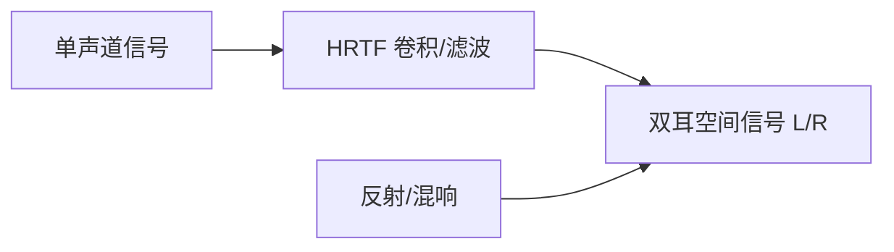

# 音效处理 (Audio Effects: EQ, DRC, Spatial Audio)

音效处理的目标是改善声音的听感、纠正硬件缺陷以及创造沉浸式的空间感。

---

## 1. 均衡器 (EQ, Equalizer)

### 1.1 定义
EQ 用于调节不同频段信号的增益，从而改变声音的色调。

### 1.2 核心类型
*   **参量均衡器 (PEQ, Parametric EQ)**：提供三个可调参数：
    *   **中心频率 (Frequency)**：调节的中心位置。
    *   **增益 (Gain)**：提升或衰减的 dB 数。
    *   **品质因数 (Q 值)**：调节带宽的宽窄。Q 值越大，带宽越窄，调节越精确。
*   **图形均衡器 (GEQ, Graphic EQ)**：将频谱划分为固定的频段（如 10 段、31 段），通过滑块直接调节。

---

## 2. 动态范围控制 (DRC, Dynamic Range Control)

### 2.1 核心概念
DRC 用于压缩或扩张信号的幅度，使声音更饱满或防止破音。

### 2.2 压缩器 (Compressor)
当信号超过某个**阈值 (Threshold)** 时，按一定的**压缩比 (Ratio)** 减小增益。
*   **Attack Time (启动时间)**：从超过阈值到开始压缩的速度。
*   **Release Time (释放时间)**：从低于阈值到停止压缩的速度。
*   **Make-up Gain (补偿增益)**：压缩后提升整体音量。

### 2.3 限制器 (Limiter)
极高压缩比（如 20:1 或 $\infty:1$）的压缩器，用于防止信号超过 0dBFS 导致数字斩波（破音）。

---

## 3. 空间音频 (Spatial Audio)

### 3.1 虚拟环绕声原理
利用心理声学原理，在双声道耳机上模拟 3D 空间中的声源位置。

### 3.2 核心技术
*   **HRTF (头相关传输函数)**：模拟声音绕过头、肩、耳廓进入耳道的变化。
*   **混响 (Reverb)**：通过模拟房间冲激响应 (RIR)，给声音添加空间大小和深度感。

---

## 4. 关键应用场景

*   **硬件补偿**：利用 EQ 修正廉价扬声器频响不平坦的问题。
*   **响度战争**：利用 DRC 提升流行音乐的整体响度。
*   **电影与游戏**：利用空间音频增强沉浸感。

---

## 5. 关键参考 (References)

1.  *The Master Handbook of Acoustics* - F. Alton Everest
2.  [Dynamic Range Compression - Wikipedia](https://en.wikipedia.org/wiki/Dynamic_range_compression)
3.  [Google Resonance Audio (Spatial Audio SDK)](https://github.com/resonance-audio/resonance-audio)

---
*Next Topic: [语音交互算法：ASR, TTS, NLU](./03-Voice-Interaction.md)*
