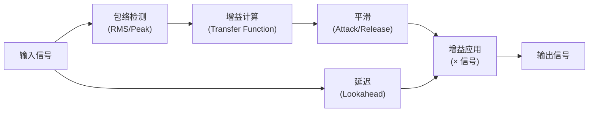
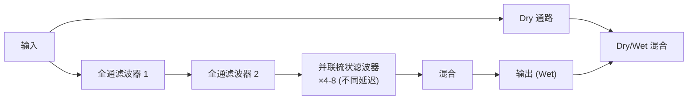
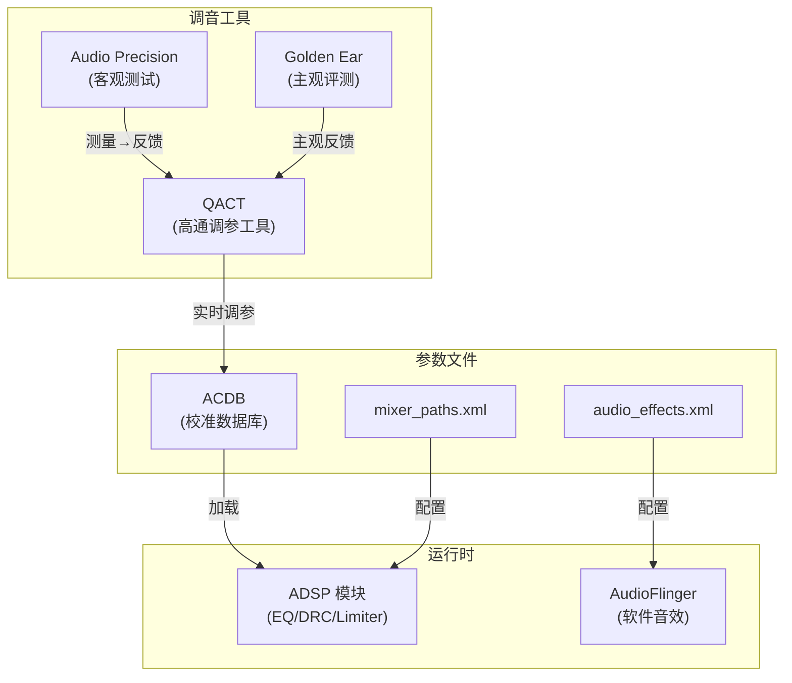
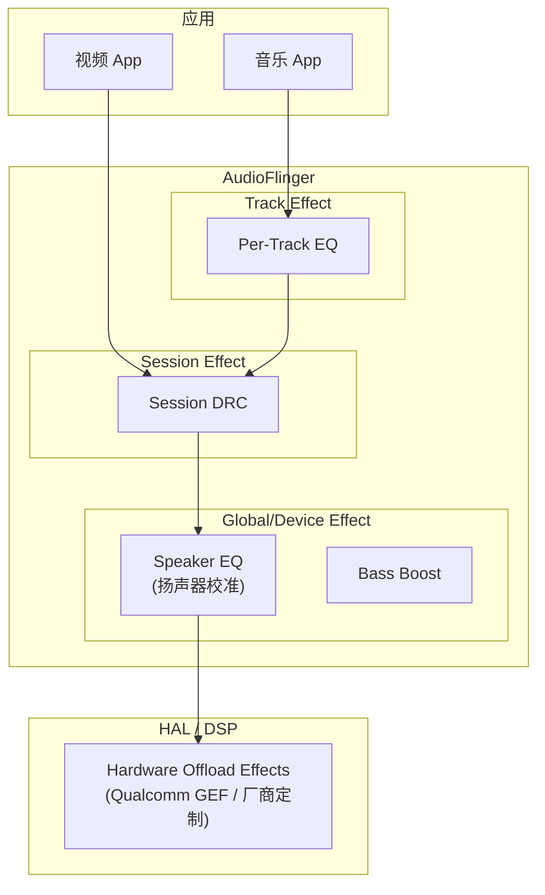

# 音效处理 (Audio Effects: EQ, DRC, Limiter, Reverb)

音效处理是对音频信号进行深度加工，以达到艺术修饰、硬件补偿或听感优化的目的。

> **给小白的一句话理解**：你买了一台新手机/音箱，声音听起来闷闷的或者刺耳？工程师和调音师就是通过"音效处理"这套工具，把声音调到好听、自然、清晰的状态。下面我们从最核心的几个"旋钮"讲起。

---

## 目录

- [1. 均衡器 (EQ)](#1-均衡器-eq-equalizer) — 调节音色的"画笔"
- [2. 动态范围控制 (DRC)](#2-动态范围控制-drc) — 控制音量的"自动挡"
- [3. 限制器与噪声门](#3-限制器-limiter-与噪声门-noise-gate) — 安全阀与看门人
- [4. 混响 (Reverb)](#4-混响-reverb) — 空间感的魔法
- [5. 调音师到底在调什么？](#5-调音师到底在调什么) — 揭秘调音实战全流程
- [6. DSP 定点化实践](#6-dsp-定点化实践) — 嵌入式落地
- [7. Android 音效集成框架](#7-android-音效集成框架) — 系统级集成
- [8. 调音工具链](#8-调音工具链) — 常用工具
- [9. 关键参考](#9-关键参考-references) — 延伸阅读

---

## 1. 均衡器 (EQ, Equalizer)

### 1.1 什么是均衡器？

> **一句话**：均衡器就是"频率维度的音量旋钮"——它让你可以**单独**调节低音、中音、高音各个频段的大小。

生活中最常见的 EQ 就是音乐播放器里的"低音增强"、"人声突出"、"古典模式"等预设，它们本质上就是对不同频段做了不同程度的提升或衰减。

#### 为什么需要 EQ？

```
问题场景                        EQ 的作用
─────────────────────────────────────────────────────
手机扬声器低音薄弱             → 提升 100-300Hz，补偿硬件不足
耳机高频刺耳                   → 衰减 6-8kHz，减少"齿音感"
会议室人声含糊                 → 提升 2-4kHz，增强语言清晰度
录音有嗡嗡声 (工频干扰)        → 在 50Hz 处精确"挖掉"一个凹槽
车内低频共振轰头               → 衰减 80-120Hz 的共振峰
```

#### 频段与听感速查

人耳可听范围 20Hz ~ 20kHz，不同频段对应不同的听觉感受：

```
频段            范围            听感描述              典型乐器/声音
────────────────────────────────────────────────────────────────────
超低频 (Sub)    20-60Hz         "震感"，身体能感受到    低音炮、管风琴最低音
低频 (Bass)     60-250Hz        "厚度"，温暖/浑浊感     贝斯、大鼓、男声基频
中低频          250-500Hz       "饱满/浑浊"            人声胸腔共鸣、吉他箱体
中频 (Mid)      500Hz-2kHz      "主体/存在感"          人声主体、钢琴主音区
中高频          2kHz-4kHz       "清晰度/穿透力"        人声齿音 (s/t)、吉他拨弦
高频 (Treble)   4kHz-8kHz       "明亮/刺耳"            镲片、弦乐泛音
超高频 (Air)    8kHz-20kHz      "空气感/细节"          呼吸声、空间混响尾音
```

### 1.2 EQ 的类型

均衡器按操作方式分为两大类：

```
┌─────────────────────────────────────────────────────────┐
│              图形均衡器 (GEQ, Graphic EQ)               │
│                                                         │
│  把频率分成固定的几个频段 (如 10 段),                   │
│  每个频段一个推子, 上推提升, 下拉衰减。                 │
│  简单直观, 适合快速调节, 但精度有限。                   │
│                                                         │
│  ┌──┬──┬──┬──┬──┬──┬──┬──┬──┬──┐                        │
│  │▓▓│  │▓▓│▓▓│  │  │▓▓│  │  │  │ <- 各频段推子          │
│  │▓▓│  │▓▓│▓▓│──│──│▓▓│  │──│──│                        │
│  │▓▓│──│▓▓│▓▓│  │  │▓▓│──│  │  │                        │
│  31 63 125 250 500 1k 2k 4k 8k 16k (Hz)                 │
└─────────────────────────────────────────────────────────┘

┌─────────────────────────────────────────────────────────┐
│            参量均衡器 (PEQ, Parametric EQ)             │
│                                                         │
│  每个频段可以自由设置 3 个参数:                         │
│    - 中心频率 (Fc): 在哪个频率动手术                    │
│    - 增益 (Gain): 提升还是衰减多少 dB                   │
│    - Q 值 (品质因数): 影响范围宽还是窄                  │
│                                                         │
│  精度高, 专业调音必备工具。                             │
│                                                         │
│  响应曲线示意 (Q 小=宽, Q 大=窄):                       │
│       /‾‾‾‾‾‾‾\       Q=0.5 宽范围                      │
│      / /‾‾‾‾\ \       Q=2.0 中等                        │
│     / / /‾‾\ \ \      Q=8.0 很窄 (手术刀)               │
│  ──/─/─/────\─\─\──── 0dB 基线                          │
│             Fc                                          │
└─────────────────────────────────────────────────────────┘
```

### 1.3 EQ 滤波器的种类

| 类型 | 形状 | 用途 | 参数 | 生活类比 |
|:---|:---|:---|:---|:---|
| **Peaking (钟形)** | 在某频率形成一个"山丘"或"山谷" | 提升/衰减某频段 | Fc, Gain, Q | 精确加减某味调料 |
| **Low-shelf (低架)** | 某频率以下整体提升/衰减 | 低音增强/减弱 | Fc, Gain, S | 整体加盐/减盐 |
| **High-shelf (高架)** | 某频率以上整体提升/衰减 | 高频亮度调节 | Fc, Gain, S | 整体加糖/减糖 |
| **HPF (高通)** | 切掉低频，只让高频通过 | 去除风噪/隆隆声 | Fc, Order | 滤掉渣子，留清汤 |
| **LPF (低通)** | 切掉高频，只让低频通过 | 去除高频噪声/毛刺 | Fc, Order | 去掉浮沫，留浓汤 |
| **Band-pass (带通)** | 只保留某段频率 | 突出人声 | Fc, Q | 只取中间一段 |
| **Notch (陷波)** | 精确"挖掉"一个频率点 | 去 50/60Hz 工频干扰 | Fc, Q | 精准挑出沙粒 |

```
各类滤波器的频率响应形状:

  HPF          LPF          Peaking       Low-shelf     High-shelf     Notch
  (高通)       (低通)        (钟形)        (低架+Gain)   (高架+Gain)    (陷波)

  |  ___       ___  |         /\          ________       ________
  | /            \  |        /  \        /               \
  |/              \ |       /    \      /                 \       \  /
  ─────           ─────    ────────    ───                ───      \/
  Fc              Fc         Fc        Fc                 Fc       Fc
```

### 1.4 Biquad 滤波器——EQ 的核心构建块

几乎所有数字 PEQ 都由 Biquad (双二阶 IIR, Infinite Impulse Response, 无限脉冲响应) 滤波器级联而成。

> **给小白的理解**：Biquad 就是 EQ 内部的"最小工作单元"。一个 10 段 EQ = 10 个 Biquad 串联。每个 Biquad 通过 5 个数学系数 (b0, b1, b2, a1, a2) 决定自己的滤波形状。

**数学公式（差分方程）**：

$$y[n] = b_0x[n] + b_1x[n-1] + b_2x[n-2] - a_1y[n-1] - a_2y[n-2]$$

> 翻译成大白话：当前输出 = 当前输入的加权 + 前两个输入的加权 - 前两个输出的加权。
> 通过改变 5 个系数 (b0, b1, b2, a1, a2) 的值，就能变出上面所有滤波器类型。

**Direct Form II Transposed 实现** (数值最稳定)：
```c
// 定点 Biquad 实现 (Q27 格式, 适合 DSP)
typedef struct {
    int32_t b0, b1, b2, a1, a2;  // Q27 系数
    int64_t d1, d2;               // 延迟线 (Q27)
} biquad_t;

static inline int32_t biquad_process(biquad_t *f, int32_t x) {
    int64_t y = (int64_t)f->b0 * x + f->d1;
    f->d1 = (int64_t)f->b1 * x - (int64_t)f->a1 * (y >> 27) + f->d2;
    f->d2 = (int64_t)f->b2 * x - (int64_t)f->a2 * (y >> 27);
    return (int32_t)(y >> 27);
}
```

### 1.5 系数计算 (Peaking EQ)

```python
import numpy as np

def peaking_eq_coeffs(fc, gain_db, Q, fs):
    """计算 Peaking EQ 的 Biquad 系数
    
    Args:
        fc:      中心频率 (Hz), 如 1000
        gain_db: 增益 (dB), 如 +6 或 -3
        Q:       品质因数, 如 1.0 (值越大影响范围越窄)
        fs:      采样率 (Hz), 如 48000
    Returns:
        [b0, b1, b2, a1, a2] 归一化系数
    """
    A = 10 ** (gain_db / 40.0)
    w0 = 2 * np.pi * fc / fs
    alpha = np.sin(w0) / (2 * Q)
    
    b0 = 1 + alpha * A
    b1 = -2 * np.cos(w0)
    b2 = 1 - alpha * A
    a0 = 1 + alpha / A
    a1 = -2 * np.cos(w0)
    a2 = 1 - alpha / A
    
    # 归一化
    return [b0/a0, b1/a0, b2/a0, a1/a0, a2/a0]
```

### 1.6 多频段 PEQ 级联

```
典型 10-Band PEQ (手机扬声器校准):
  Band 1: HPF    @ 100Hz,  Order 2      (去除振动噪声)
  Band 2: Peak   @ 200Hz,  Gain +3dB,  Q=1.5
  Band 3: Peak   @ 500Hz,  Gain -2dB,  Q=2.0
  Band 4: Peak   @ 1kHz,   Gain +1dB,  Q=1.0
  Band 5: Peak   @ 2kHz,   Gain +4dB,  Q=2.0
  Band 6: Peak   @ 4kHz,   Gain -1dB,  Q=1.5
  Band 7: Peak   @ 6kHz,   Gain +2dB,  Q=2.5
  Band 8: Peak   @ 8kHz,   Gain -3dB,  Q=3.0
  Band 9: Peak   @ 12kHz,  Gain +1dB,  Q=2.0
  Band 10: LPF   @ 18kHz,  Order 2      (抗混叠)

总延迟: 近似零 (IIR 滤波器, < 1 sample)
计算量: 10 × 5 MAC/sample = 50 MAC/sample
```

---

## 2. 动态范围控制 (DRC)

### 2.1 什么是动态范围控制？

> **一句话**：DRC 就是"自动音量管理员"——声音太大时自动压小，声音太小时可以提上来。

#### 为什么需要 DRC？

```
场景 1: 看电影
  对白 → 声音小，竖起耳朵听
  爆炸 → 突然巨响，吓一跳！赶紧调小音量
  → DRC 自动把两者的音量差距缩小，看电影再也不用反复调音量了。

场景 2: 手机外放音乐
  音乐录制时动态范围可达 60dB+
  手机小扬声器能承受的动态范围很有限
  → DRC 把动态范围"压缩"到扬声器能良好表现的范围内。

场景 3: 车内听音乐
  安静时环境噪声 50dB，音乐轻柔段被淹没
  → DRC 把轻柔段的音量提上来，确保在噪声中也能听见。
```

### 2.2 DRC 的工作原理


```mermaid
graph LR
    INPUT["输入信号"] --> ENV["包络检测<br/>(RMS/Peak)"]
    ENV --> GAIN["增益计算<br/>(Transfer Function)"]
    GAIN --> SMOOTH["平滑<br/>(Attack/Release)"]
    SMOOTH --> APPLY["增益应用<br/>(× 信号)"]
    INPUT --> DELAY["延迟<br/>(Lookahead)"]
    DELAY --> APPLY
    APPLY --> OUTPUT["输出信号"]
```

> 翻译成大白话的工作流程：
> 1. **听一听**：检测当前信号有多大 (包络检测)
> 2. **想一想**：根据规则算出应该放大还是缩小 (增益计算)
> 3. **慢慢来**：增益变化不能太突然，否则听感别扭 (平滑)
> 4. **动手调**：把计算出的增益乘到信号上 (增益应用)

### 2.3 DRC 核心参数详解

| 参数 | 大白话 | 专业说明 | 典型值 |
|:---|:---|:---|:---|
| **Threshold (阈值)** | "多大声才开始压？" | 开始压缩的电平门槛 | -20 ~ -6 dBFS |
| **Ratio (压缩比)** | "压多狠？" | 超过阈值后的压缩比例 | 2:1 ~ 20:1 |
| **Attack (启动时间)** | "多快开始压？" | 信号超阈值后增益下降的速度 | 1-50 ms |
| **Release (释放时间)** | "多快松手？" | 信号低于阈值后增益恢复的速度 | 50-500 ms |
| **Knee (拐点)** | "压的边界硬不硬？" | 阈值附近过渡的平滑程度 | 0-12 dB |
| **Lookahead (预判)** | "能不能提前看一眼？" | 延迟输入信号以提前判断瞬态 | 0-10 ms |
| **Makeup Gain (补偿增益)** | "压完之后整体提多少？" | 压缩后补偿损失的响度 | 0-20 dB |

#### Ratio 压缩比的直觉理解

```
Ratio 2:1 的含义:
  输入超过阈值 10dB → 输出只超过 5dB  (减半)
  
Ratio 4:1 的含义:
  输入超过阈值 10dB → 输出只超过 2.5dB (四分之一)
  
Ratio ∞:1 的含义:
  不管输入多大 → 输出永远不超过阈值 (这就是"限制器")
```

### 2.4 转换函数 (Transfer Function)

```
                    Output (dB)
                      │
            1:1 线    │     /
             (不压缩) │    / ← Ratio 2:1 (压缩)
                      │   /
                      │  /←── Ratio ∞:1 (限制器)
                      │ /
          ────────────┼/────────────── Threshold
                      │
                      └─────────────── Input (dB)

Soft Knee:
  在 Threshold ± Knee/2 范围内平滑过渡
  减少"泵浦感"，听感更自然
```

### 2.5 DRC 实现 (C 伪代码)

```c
float drc_process(drc_state_t *s, float input_sample) {
    // 1. 包络检测 (RMS, 带 attack/release)
    float abs_in = fabsf(input_sample);
    float env;
    if (abs_in > s->envelope)
        env = s->attack_coeff * s->envelope + (1 - s->attack_coeff) * abs_in;
    else
        env = s->release_coeff * s->envelope + (1 - s->release_coeff) * abs_in;
    s->envelope = env;
    
    // 2. 转换为 dB
    float env_db = 20.0f * log10f(env + 1e-10f);
    
    // 3. 计算增益 (soft knee)
    float gain_db = 0.0f;
    if (env_db > s->threshold + s->knee/2) {
        gain_db = s->threshold + (env_db - s->threshold) / s->ratio - env_db;
    } else if (env_db > s->threshold - s->knee/2) {
        // Soft knee 区域
        float x = env_db - s->threshold + s->knee/2;
        gain_db = (1.0f/s->ratio - 1.0f) * x * x / (2.0f * s->knee);
    }
    
    // 4. 应用增益
    float gain_linear = powf(10.0f, gain_db / 20.0f);
    return input_sample * gain_linear;
}
```

---

## 3. 限制器 (Limiter) 与噪声门 (Noise Gate)

### 3.1 什么是限制器？

> **一句话**：限制器就是音频系统的"安全阀"——无论信号多大，绝不让输出超过设定的天花板。

限制器本质上是压缩比为 ∞:1 的特殊 DRC。它主要用于保护硬件（防止扬声器破音/烧毁）和防止数字削波 (Clipping)。

#### Limiter vs Compressor 对比

| 特性 | Compressor (压缩器) | Limiter (限制器) |
|:---|:---|:---|
| Ratio | 2:1 ~ 10:1 | ∞:1 (硬限制) |
| Attack | 可选 (1-50ms) | 极快 (< 1ms) |
| Threshold | 中等 (-20 ~ -6dBFS) | 接近 0dBFS |
| 用途 | 平滑动态，改善听感 | 保护硬件，防止削波 |
| 类比 | 温柔地按住弹簧 | 铁墙挡住，�不允许越过 |

#### 数字削波 (Clipping) 是什么？

```
正常信号:            削波后 (失真):
    /\                  ___
   /  \               /   \
  /    \             /     \
 /      \           /       \
         \___             \___

当信号超过数字系统的最大值 (0dBFS) 时，
超出部分被"削掉"，波形变成方波 → 产生刺耳的失真。
Limiter 就是在信号到达 0dBFS 之前把它压下来。
```

### 3.2 什么是噪声门？

> **一句话**：噪声门是"看门人"——信号够大 (有人说话) 就开门放行，信号太小 (只有底噪) 就关门静音。

```
噪声门工作原理:

  信号电平
    │
    │   ┌──┐    ┌────┐         ┌──┐
    │   │  │    │    │         │  │   ← 有用信号 (人声)
    │───│──│────│────│─────────│──│──── Threshold (门限)
    │ ~~│~~│~~~~│~~~~│~~~~~~~~~│~~│~~ ← 底噪
    └───┴──┴────┴────┴─────────┴──┴───→ 时间

  门的状态:
    关  开 关    开   关         开 关
  (静音)(通过)(静音)(通过)(静音) (通过)
```

#### 噪声门的参数

| 参数 | 说明 | 典型值 |
|:---|:---|:---|
| **Threshold** | 门限：低于此值关门 | -40 ~ -30 dBFS |
| **Attack** | 开门速度 | 0.1-1 ms |
| **Hold** | 开门保持时间（防止频繁开关） | 10-100 ms |
| **Release** | 关门速度 | 10-50 ms |
| **Range** | 关门时衰减多少 (可以不完全静音) | -∞ 或 -20dB |

#### 应用场景

```
录音间隙去除底噪       → 话筒没人说话时自动静音
鼓组录音去串扰         → 只有敲击瞬间打开，其他乐器串音被关门
会议系统              → 没人说话的麦克风自动关闭，减少环境噪声
直播/播客             → 主播停顿时自动静音，避免键盘声/空调声
```

---

## 4. 混响 (Reverb)

### 4.1 什么是混响？

> **一句话**：混响就是声音在空间中反复弹射 (反射) 后逐渐消散的效果。它让你能"听出"空间的大小和材质。

#### 生活中的混响

```
在浴室里唱歌 → 声音嘹亮、有回音   → 小空间 + 瓷砖 (高反射) = 短而亮的混响
在大教堂说话 → 声音庄严、悠远      → 大空间 + 石材 = 长而温暖的混响
在卧室里说话 → 声音"干"、无回响    → 小空间 + 布艺/地毯 (高吸收) = 极短混响
在空��草地上 → 声音"死"、完全干声  → 没有反射面 = 无混响
```

#### 为什么需要人工混响？

- 录音棚录音通常追求"干声"（无混响），后期再加混响来模拟不同空间
- 手机/耳机听音乐太"干"，加点混响增加空间感和氛围
- 游戏/VR 需要根据虚拟场景动态变化混响（洞穴 vs 室外）
- KTV/直播 加混响让人声更圆润、更好听

### 4.2 混响的组成——声音在空间中的生命线

```
声音传播时间线:

  0ms        5-50ms         50-500ms           500ms+
   │           │               │                 │
   ▼     ▼               ▼                 ▼
  直达声    早期反射声      后期混响          混响尾
  (Direct)  (Early Refl.)  (Late Reverb)     (Tail)
  
  ← 距离感 → ← 房间大小 → ← 空间感/氛围 →

详细解释:
  直达声:     声源到耳朵的最短路径，最先到达。决定了声音的"方向"。
  早期反射:   经过 1-2 次墙壁反射后到达的声音。
              人脑通过它判断"房间多大"、"我离墙多远"。
  后期混响:   经过无数次反射后，密密麻麻的反射声叠加。
              形成连续的、均匀的"嗡嗡声"，带来"空间感"和"包围感"。
  混响尾:     能量逐渐被墙壁、空气吸收，声音渐弱至消失。
```

### 4.3 混响的关键参数

| 参数 | 大白话 | 专业说明 | 效果 |
|:---|:---|:---|:---|
| **Pre-delay** | "声音弹回来要多久？" | 直达声到首次反射的间隔 | 大→大房间感 |
| **RT60** | "余音绕梁多久？" | 混响衰减 60dB 所需时间 | 长→大厅/教堂，短→小房间 |
| **Diffusion** | "反射有多密？" | 反射声的密度 | 高→更自然平滑 |
| **Damping** | "高频消失多快？" | 高频衰减速度 | 高→温暖 (地毯/布艺)，低→明亮 (瓷砖) |
| **Dry/Wet** | "原声和混响各占多少？" | 原始信号与混响比例 | 100% Wet = 纯混响 |
| **Room Size** | "模拟多大的房间？" | 控制反射延迟和密度 | 大→大厅，小→衣柜 |

#### 典型空间的 RT60 参考值

```
空间类型                  RT60 (秒)
─────────────────────────────────
录音棚控制室              0.2 - 0.4
普通客厅                  0.3 - 0.6
教室/会议室               0.5 - 1.0
音乐厅                    1.5 - 2.5
大教堂                    3.0 - 8.0
浴室                      1.0 - 1.5 (小但高反射)
```

### 4.4 算法混响实现 (Schroeder Reverberator)


```mermaid
graph LR
    INPUT["输入"] --> AP1["全通滤波器 1"]
    AP1 --> AP2["全通滤波器 2"]
    AP2 --> COMB["并联梳状滤波器<br/>×4-8 (不同延迟)"]
    COMB --> MIX["混合"]
    MIX --> OUTPUT["输出 (Wet)"]
    INPUT --> DRY["Dry 通路"]
    DRY --> FINAL["Dry/Wet 混合"]
    OUTPUT --> FINAL
```

> **梳状滤波器 (Comb Filter)**：输入信号 + 延迟后的自身反馈 → 模拟声音在两面墙之间来回弹射。
> **全通滤波器 (Allpass Filter)**：不改变频率响应，只改变相位 → 增加反射密度，让混响更自然。

---

## 5. 调音师到底在调什么？

> 很多人好奇：手机/音箱/车机出厂前，"调音师"（Audio Tuning Engineer）到底干了什么？他们调的就是上面讲的这些东西！下面揭秘完整的调音流程。

### 5.1 调音师的工具箱

调音师手里的"旋钮"，本质上就是前面讲的这几个核心模块的组合：

┌─────────────────────────────────────────────────────────────┐
│                    音频信号处理链                            │
│                                                             │
│  Mic -> [EQ] -> [DRC] -> [NS] -> [AGC] -> ... -> Output    │
│  Spk <- [EQ] <- [DRC] <- [Limiter] <- [Reverb] <- [Bass]   │
│                                                             │
│  EQ           -> 调音色: 哪个频段提升/衰减                  │
│  DRC          -> 调动态: 大小声的差距控制                   │
│  Limiter      -> 调安全: 最大音量不能超过多少               │
│  Bass Boost   -> 调低音: 低频的增强量和截止频率             │
│  Reverb       -> 调空间感: 模拟什么样的声学环境             │
│  Volume Curve -> 调音量曲线: 1-15 步每步多少 dB             │
│  Crossover    -> 调分频: 多喇叭各扬声器负责哪个频段         │
│  Delay        -> 调延时: 多喇叭对齐到达耳朵的时间           │
└─────────────────────────────────────────────────────────────┘

> 上图中的 **NS** (Noise Suppression, 噪声抑制) 和 **AGC** (Auto Gain Control, 自动增益控制) 属于语音通信的 "3A 算法"，主要用在麦克风录音/通话链路上：
> - **NS**：自动识别并压制背景噪声（风声、键盘声、空调声），只保留人声。调音师调的是抑制强度——太强人声会变闷，太弱噪声压不干净。
> - **AGC**：自动把人声音量归一化到合适的电平——说话声音小时自动提升，声音大时自动压低，确保对方听到的音量稳定。调音师调的是目标电平和响应速度。
>
> 详细原理见 [语音通信 3A 算法](./01-3A-Algorithms.md)。

### 5.2 手机/耳机调音流程

一个手机扬声器的调音通常是这样的：

```
Step 1: 频响测量 (Frequency Response Measurement)
───────────────────────────────────────────────
  在消声室中，用标准麦克风测量扬声器的原始频率响应。
  
  理想: 平坦的一条线 (20Hz-20kHz 都一样大)
  现实: 坑坑洼洼 (某些频率强、某些弱)
  
  原始测量结果 (示意):
  dB│    
    │       ╱╲        ╱╲
    │      ╱  ╲      ╱  ╲    ╱
    │╲    ╱    ╲    ╱    ╲  ╱
    │ ╲  ╱      ╲  ╱      ╲╱
    │  ╲╱        ╲╱
    └─────────────────────────→ Hz
    20  100  500  2k  8k  20k

Step 2: EQ 补偿 (Frequency Response Correction)
───────────────────────────────────────────────
  根据测量结果，用 PEQ 做"镜像补偿"：
  原始凹陷处 → 提升
  原始凸起处 → 衰减
  
  目标: 让补偿后的总响应尽可能接近目标曲线
  (不一定是完全平坦，可能是某种"好听"的目标曲线)

Step 3: DRC 设置
───────────────────────────────────────────────
  设置动态范围压缩，目的:
  - 小音量: 保持细节可听
  - 大音量: 压缩动态，防止扬声器失真
  - 最大音量: Limiter 硬限，保护扬声器不烧

Step 4: 场景调优 (Use Case Tuning)
───────────────────────────────────────────────
  不同使用场景用不同的参数组:
  
  场景              重点调节
  ────────────────────────────────
  媒体播放          EQ 音色 + Bass Boost + DRC
  语音通话          通话 EQ + 降噪参数 + AGC
  免提通话          扬声器 EQ + AEC 参考增益
  录音              麦克风 EQ + 灵敏度
  游戏              低延迟模式 + 空间音效
  铃声/通知         EQ + 最大音量 Limiter

Step 5: 主观评测 (Golden Ear)
───────────────────────────────────────────────
  用"金耳朵"团队 (Golden Ear) 做主观盲听测试:
  - A/B 对比测试
  - 用标准音频素材 (人声/古典/流行/摇滚/电影)
  - 评分制: 音色自然度、低频力度、高频明亮度、人声清晰度
  - 反复迭代，直到满足主观+客观双标准
```

### 5.3 车载调音——比手机复杂 10 倍

```
┌─────────────────────────────────────────────────────────────┐
│                  车载调音的额外挑战                          │
│                                                             │
│ 1. 多扬声器系统 (4~20+ 个喇叭)                             │
│    每个扬声器位置不同, 到驾驶员耳朵距离不同                 │
│    -> 需要调 延时对齐 (Time Alignment)                      │
│    -> 需要调 分频 (Crossover): 高/中/低音各负责哪段频率     │
│                                                             │
│ 2. 多音区 (Multi-Zone)                                      │
│    驾驶员、副驾、后排 各自独立调音                          │
│    -> 每个区域有自己的 EQ + DRC + 音量曲线                  │
│                                                             │
│ 3. 速度自适应音量 (SAVL)                                    │
│    车速快 -> 路噪大 -> 自动提升音量                         │
│    车速慢 -> 安静   -> 自动降低音量                         │
│    -> 需要调: 速度-音量映射曲线、频段补偿策略               │
│                                                             │
│ 4. ANC/RNC 主动降噪                                        │
│    -> 调: 参考麦克风增益、误差麦克风位置、收敛速度          │
│                                                             │
│ 5. 引擎声浪模拟 (ESE, Engine Sound Enhancement)             │
│    电动车太安静 -> 人工合成发动机声                         │
│    -> 调: 与车速/油门的映射关系、音色设计                   │
└─────────────────────────────────────────────────────────────┘
```

### 5.4 调音的参数存在哪里？

```
不同平台的调音参数存储:

高通平台 (Qualcomm):
  ACDB 文件 (Audio Calibration Database)
  ├── 设备校准参数 (每个 Use Case 一组)
  │   ├── Speaker EQ 参数
  │   ├── DRC/Limiter 参数
  │   ├── 麦克风增益
  │   └── 通话 3A 参数
  ├── GEF 音效参数 (第三方音效)
  └── 通过 QACT 工具实时调参 → 写入 ACDB

联发科平台 (MediaTek):
  Audio Parameter XML / SmartPA 参数文件

通用 Android:
  audio_effects.xml → 音效库配置
  mixer_paths.xml   → ALSA Mixer 路径 + 增益
```

### 5.5 调音参数交互示意


```mermaid
graph TD
    subgraph Tools ["调音工具"]
        QACT["QACT<br/>(高通调参工具)"]
        AP["Audio Precision<br/>(客观测试)"]
        EAR["Golden Ear<br/>(主观评测)"]
    end
    
    subgraph Params ["参数文件"]
        ACDB["ACDB<br/>(校准数据库)"]
        XML["mixer_paths.xml"]
        EFF["audio_effects.xml"]
    end
    
    subgraph DSP ["运行时"]
        ADSP["ADSP 模块<br/>(EQ/DRC/Limiter)"]
        AF["AudioFlinger<br/>(软件音效)"]
    end
    
    QACT -->|"实时调参"| ACDB
    AP -->|"测量→反馈"| QACT
    EAR -->|"主观反馈"| QACT
    ACDB -->|"加载"| ADSP
    XML -->|"配置"| ADSP
    EFF -->|"配置"| AF
```

---

## 6. DSP 定点化实践

### 6.1 浮点 vs 定点

| 特性 | 浮点 (F32) | 定点 (Q31/Q15) |
|:---|:---|:---|
| 动态范围 | 1530 dB | 186 dB (Q31) / 90 dB (Q15) |
| 精度 | 均匀 (相对误差) | 不均匀 (绝对误差) |
| 溢出风险 | 极低 | 需手动管理 |
| DSP 硬件 | 需 FPU | 所有 DSP 原生支持 |
| 功耗 | 较高 | 极低 |
| 适用 | AP 侧 / 开发调试 | ADSP / 嵌入式 DSP |

### 6.2 Q 格式说明

```
Q31: 1 符号位 + 31 小数位
  范围: [-1.0, +1.0 - 2^-31]
  精度: 约 2^-31 ≈ 4.66e-10
  对应 dB 动态范围: 20*log10(2^31) ≈ 186 dB

Q15: 1 符号位 + 15 小数位
  范围: [-1.0, +1.0 - 2^-15]
  精度: 约 2^-15 ≈ 3.05e-5

定点乘法:
  Q31 × Q31 → Q62 → 右移31位 → Q31
  需要 64-bit 累加器 (MAD/MAC 指令)
```

---

## 7. Android 音效集成框架

### 7.1 Effect 挂载层级


```mermaid
graph TD
    subgraph Apps ["应用"]
        APP1["音乐 App"]
        APP2["视频 App"]
    end
    
    subgraph AudioFlinger ["AudioFlinger"]
        subgraph Track_Level ["Track Effect"]
            T_EQ["Per-Track EQ"]
        end
        subgraph Session_Level ["Session Effect"]
            S_DRC["Session DRC"]
        end
        subgraph Global_Level ["Global/Device Effect"]
            G_SPK["Speaker EQ<br/>(扬声器校准)"]
            G_BAS["Bass Boost"]
        end
    end
    
    subgraph HAL_DSP ["HAL / DSP"]
        DSP_EFF["Hardware Offload Effects<br/>(Qualcomm GEF / 厂商定制)"]
    end
    
    APP1 --> T_EQ
    APP2 --> S_DRC
    T_EQ --> S_DRC
    S_DRC --> G_SPK
    G_SPK --> DSP_EFF
```

### 7.2 Effect 处理位置演进

| Android 版本 | 趋势 | 说明 |
|:---|:---|:---|
| Android ≤ 12 | AudioServer 进程内处理 | 占用 CPU，增加延迟 |
| Android 13+ | 推荐下沉到 HAL 进程 | 利用 DSP 算力，降低功耗 |
| Android 14+ | AIDL Effect Interface | 标准化，支持多进程 |

### 7.3 HAL 侧处理优势

```
AudioServer 进程内 vs HAL/DSP 侧处理:

  CPU 路径:          DSP 路径:
  ┌──────────┐       ┌──────────┐
  │ MixerThread│     │ MixerThread│
  │ + Effect  │     │ (无 Effect)│
  │ (CPU 处理)│     └──────┬─────┘
  └──────┬─────┘           │
         │                  ▼
         ▼           ┌──────────┐
  ┌──────────┐       │ Audio HAL│
  │ Audio HAL│       │ → DSP   │
  └──────────┘       │ (硬件处理)│
                     └──────────┘
  
  功耗: 高 (CPU 满载)     低 (DSP 专用硬件)
  延迟: 增加 ~5-10ms     几乎零增加
  灵活性: 高              受限于 DSP 能力
```

---

## 8. 调音工具链

| 工具 | 厂商 | 用途 |
|:---|:---|:---|
| **QACT** | Qualcomm | 高通平台 EQ/DRC/AEC 调参 |
| **SoundClear Studio** | Qualcomm | 可视化音效设计 |
| **ACDB Editor** | Qualcomm | 音频校准数据库编辑 |
| **REW** | 开源 | 房间声学测量 + EQ 设计 |
| **Audio Precision** | AP | 专业音频客观测试 |
| **Cirrus Logic WISCE** | Cirrus | CS47x SmartPA 调音 |
| **miniDSP** | miniDSP | 跨平台 DSP 调音工具 |
| **Audacity** | 开源 | 波形查看 + 基础音效处理 |

---

## 9. 关键参考 (References)

1.  [Audio EQ Cookbook - Robert Bristow-Johnson](https://www.w3.org/2011/audio/audio-eq-cookbook.html) — Biquad 系数计算的圣经
2.  *Introduction to Sound Processing* - Davide Rocchesso
3.  [DAFX: Digital Audio Effects (2nd Edition)](https://www.dafx.de/) — 数字音效领域的经典教材
4.  [Google Resonance Audio](https://github.com/resonance-audio/resonance-audio)
5.  [Android Audio Effect Framework](https://source.android.com/docs/core/audio/audio-effects)
6.  *Designing Audio Effect Plugins in C++* - Will Pirkle — 从零实现各种音效插件