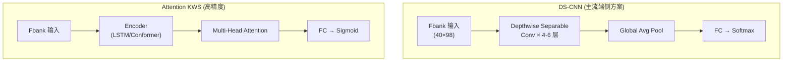
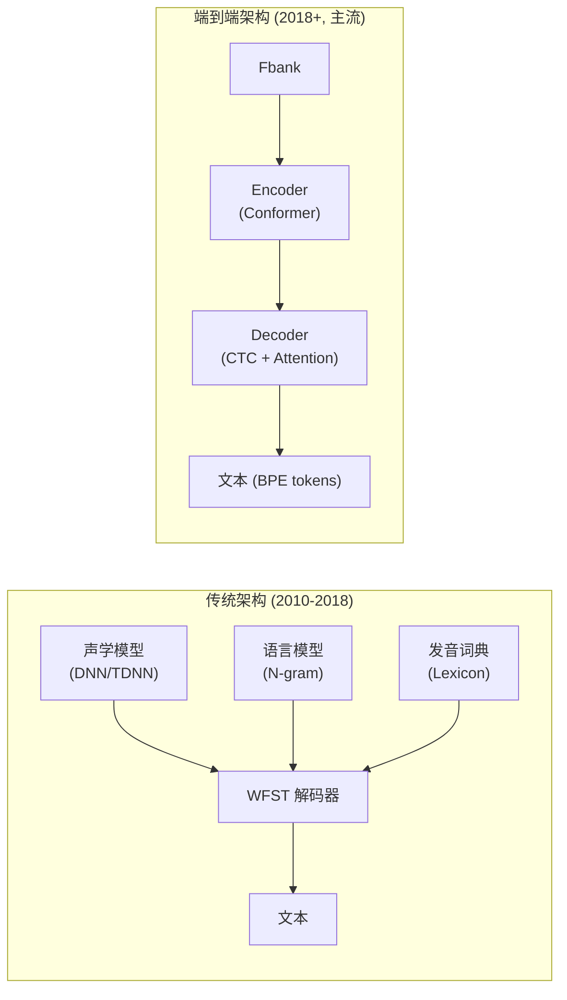
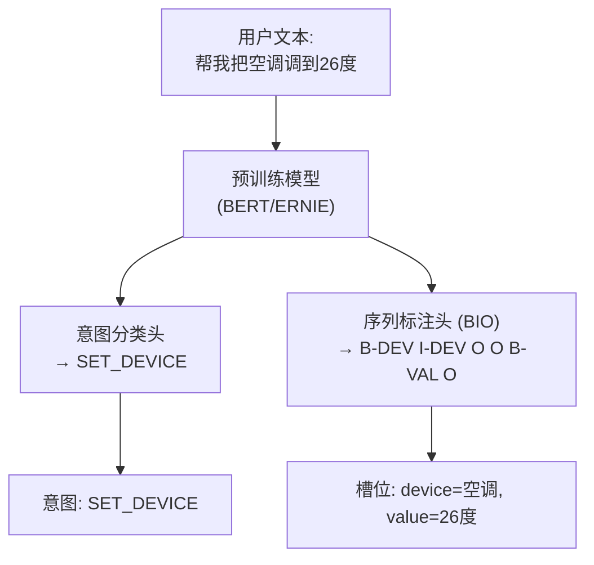
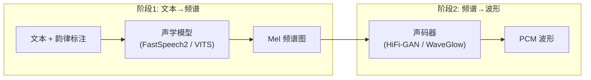
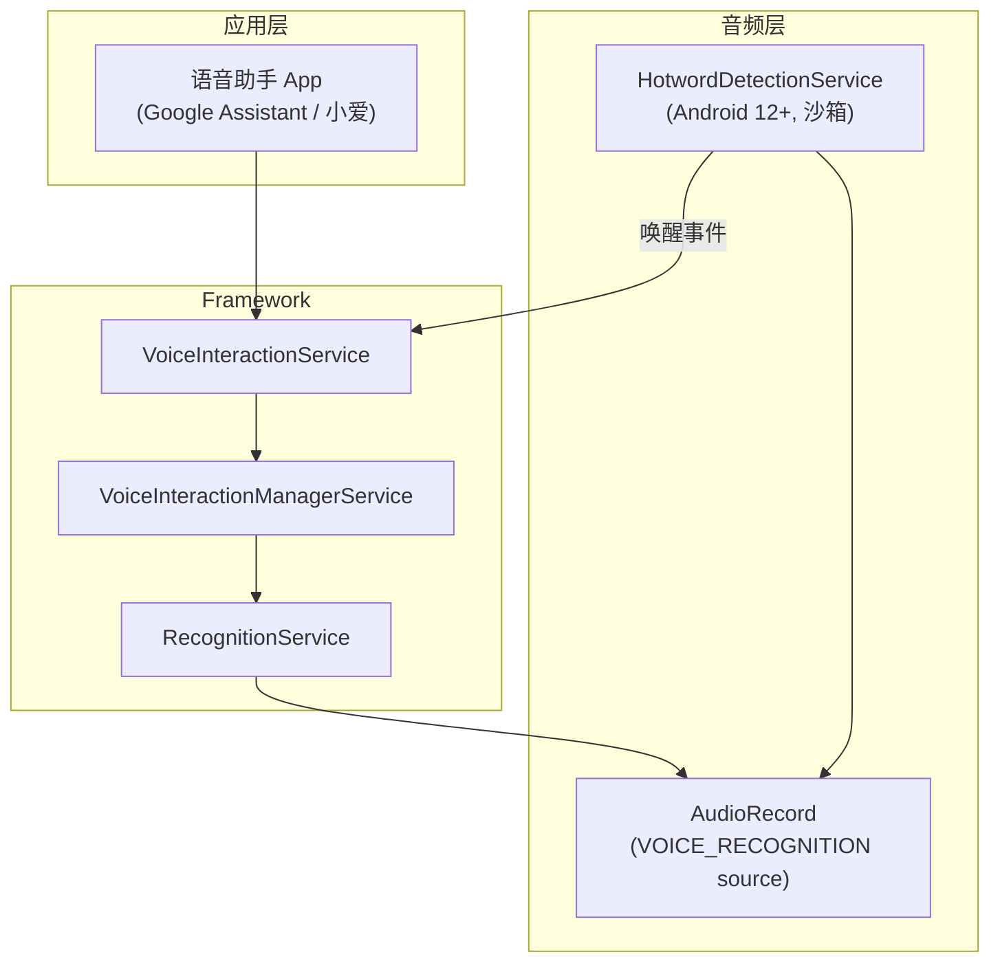

# 语音交互算法 (Voice Interaction: KWS, ASR, NLU, TTS)

语音交互是音频、语言学与深度学习的交叉学科。本章从特征提取到端侧部署，系统解析语音交互全链路的核心算法与工程实践。

---

## 1. 语音交互全链路架构

```mermaid
graph LR
    subgraph Frontend ["语音前端 (DSP/Edge)"]
        MIC["麦克风阵列"] --> VAD["VAD<br/>(语音检测)"]
        VAD --> BF["波束成形"]
        BF --> NS["降噪"]
        NS --> AEC_F["回声消除"]
    end
    
    subgraph Wakeup ["唤醒 (DSP)"]
        AEC_F --> KWD["KWS<br/>(唤醒词检测)"]
    end
    
    subgraph ASR_Block ["语音识别 (AP/Cloud)"]
        KWD -->|"唤醒成功"| FE["特征提取<br/>(MFCC/Fbank)"]
        FE --> AM["声学模型<br/>(Conformer)"]
        AM --> LM["语言模型"]
        LM --> TEXT["文本输出"]
    end
    
    subgraph NLU_Block ["语义理解"]
        TEXT --> INTENT["意图识别"]
        TEXT --> SLOT["槽位填充"]
        INTENT --> ACTION["执行动作"]
        SLOT --> ACTION
    end
    
    subgraph TTS_Block ["语音合成"]
        ACTION --> TTS_AM["声学模型<br/>(FastSpeech2)"]
        TTS_AM --> VOC["声码器<br/>(HiFi-GAN)"]
        VOC --> AUDIO["合成音频"]
    end
```



---

## 2. 特征提取：从波形到频谱

### 2.1 MFCC vs Fbank

| 特征 | MFCC | Fbank (Log-Mel) |
|:---|:---|:---|
| 定义 | Mel 滤波后做 DCT | Mel 滤波后取 log |
| 维度 | 通常 13 维 (+ delta + delta2 = 39) | 通常 40/80 维 |
| 特点 | 各维度去相关 | 保留更多频谱细节 |
| 适用 | 传统 GMM-HMM | 深度学习模型 (主流) |
| 计算量 | 略高 (多一步 DCT) | 较低 |

### 2.2 特征提取完整流程

```
PCM 16kHz → 预加重(0.97) → 分帧(25ms, 步长10ms) → 汉明窗
    → FFT(512点) → |X(k)|² → Mel滤波器(40个三角) → log()
    → [可选] DCT → MFCC

每帧输出:
  Fbank: 40维向量 (每10ms一帧)
  MFCC:  13维向量 + 13维delta + 13维delta-delta = 39维
```

### 2.3 Python 实现参考

```python
import librosa
import numpy as np

# Fbank 特征提取 (深度学习常用)
def extract_fbank(audio_path, n_mels=80, sr=16000):
    y, sr = librosa.load(audio_path, sr=sr)
    # 预加重
    y = np.append(y[0], y[1:] - 0.97 * y[:-1])
    # Mel 频谱
    mel_spec = librosa.feature.melspectrogram(
        y=y, sr=sr, n_fft=512, hop_length=160,  # 10ms hop
        win_length=400,  # 25ms window
        n_mels=n_mels, fmin=20, fmax=8000
    )
    # Log-Mel (Fbank)
    log_mel = np.log(np.maximum(mel_spec, 1e-10))
    return log_mel.T  # shape: (T, n_mels)
```

---

## 3. 语音前端：VAD vs KWS

### 3.1 核心区别

| 特性 | VAD (语音活动检测) | KWS (关键词检测) |
|:---|:---|:---|
| **目标** | 判断"有无人声" | 识别"特定唤醒词" |
| **输出** | 二值: speech / non-speech | 二值: keyword / non-keyword |
| **复杂度** | 极低 (~10 MIPS) | 中等 (~50-200 MIPS) |
| **模型大小** | < 50KB | 200KB - 2MB |
| **运行位置** | LPASS / Always-on DSP | ADSP / LPASS (二级唤醒) |
| **功耗** | < 0.3 mW | 0.5 - 2 mW |
| **典型方案** | WebRTC VAD / 能量阈值 | DS-CNN / CRNN / Attention |

### 3.2 KWS 主流模型架构



**DS-CNN (Depthwise Separable CNN)** 是端侧 KWS 的主流选择：
- 参数量: ~100K-500K
- 精度: 95%+ (针对单个唤醒词)
- 适合 Hexagon DSP / ARM Cortex-M 部署

### 3.3 多级唤醒架构

```
Level 0: VAD (LPASS, < 0.3mW)
  ↓ 检测到人声
Level 1: 轻量 KWD (LPASS, ~1mW, 小模型)
  ↓ 初步匹配
Level 2: 精确 KWD (ADSP, ~5mW, 大模型)
  ↓ 确认唤醒
Level 3: AP 唤醒 → 进入 ASR
```

---

## 4. 语音识别 (ASR)

### 4.1 架构演进



### 4.2 主流 E2E 模型对比

| 模型 | 架构 | 参数量 | WER (LibriSpeech) | 特点 |
|:---|:---|:---|:---|:---|
| **Conformer** | Conv + Transformer | 30-120M | 1.9% (test-clean) | 工业界主流 |
| **Whisper** | Encoder-Decoder Transformer | 39M-1550M | 2.7% | 多语言，鲁棒 |
| **Paraformer** | 非自回归 | 46M | 1.95% | 阿里，流式友好 |
| **Zipformer** | 改进 Conformer | 23-65M | 2.0% | K2, 高效 |
| **WeNet** | Conformer CTC/AED | 30-80M | 2.1% | 开源，国产 |

### 4.3 端侧 ASR 部署方案

| 方案 | 推理框架 | 模型大小 | 适用场景 |
|:---|:---|:---|:---|
| **Qualcomm SNPE** | Hexagon DSP + HTA | 10-50MB | 高通平台端侧 ASR |
| **TFLite** | ARM NEON / GPU Delegate | 20-100MB | 通用 Android |
| **ONNX Runtime** | CPU/GPU/NPU | 20-200MB | 跨平台 |
| **Whisper.cpp** | CPU (AVX2/NEON) | 39M-1.5GB | 离线高精度 |
| **Sherpa-ONNX** | ONNX (多后端) | 10-50MB | 嵌入式/移动 |

### 4.4 流式 vs 非流式

```
非流式 (Offline):
  完整音频 → 一次性送入模型 → 输出完整文本
  优点: 精度最高 (可利用全局上下文)
  缺点: 延迟高 (需等待说完)

流式 (Streaming):
  音频块 (chunk) → 逐块送入 → 增量输出
  方案:
    - CTC greedy/prefix beam search (低延迟)
    - Chunk-based attention (平衡精度和延迟)
    - 动态 chunk (WeNet U2/U2++ 架构)
  
  典型配置:
    chunk_size = 640ms (16 帧)
    右侧上下文 = 4 帧
    首字延迟 < 300ms
```

### 4.5 Conformer 编码器架构详解

**Conformer (Convolution-augmented Transformer)** 是当前 ASR 编码器的事实标准，由 Google (2020) 提出。核心创新：在 Transformer 的自注意力层中嵌入卷积模块，同时捕捉全局依赖和局部特征。

```
Conformer Block 结构 (Macaron-Net 风格):

  Input (T×D)
    │
    ▼
  ┌─────────────────────────────────┐
  │  1. Feed-Forward Module (½)      │  ← 半步残差 (0.5× 缩放)
  │     LayerNorm → Linear → Swish → Dropout → Linear → Dropout
  └───────────────────┬─────────────┘
    │ + 0.5×residual  │
    ▼                 │
  ┌─────────────────────────────────┐
  │  2. Multi-Head Self-Attention    │  ← 全局序列建模
  │     LayerNorm → RelPosAttn(H heads) → Dropout
  └───────────────────┬─────────────┘
    │ + residual      │
    ▼                 │
  ┌─────────────────────────────────┐
  │  3. Convolution Module           │  ← 局部特征提取
  │     LayerNorm → PointwiseConv → GLU → DepthwiseConv(k=31)
  │     → BatchNorm → Swish → PointwiseConv → Dropout
  └───────────────────┬─────────────┘
  │ + residual        │
  ▼                   │
  ┌─────────────────────────────────┐
  │  4. Feed-Forward Module (½)      │  ← 半步残差
  └───────────────────┬─────────────┘
    │ + 0.5×residual  │
    ▼
  LayerNorm → Output (T×D)

关键设计:
  - 相对位置编码 (Relative Positional Encoding): 
    比绝对位置更适合流式 (位移不变性)
  - Depthwise Separable Conv (核大小 k=15~31):
    捕捉帧级局部模式 (如协同发音)
  - Macaron 结构: 两个半步 FFN 夹住 Attention+Conv
    实验证明比单个 FFN 效果更好
  - 典型超参: D=256/512, H=4/8, layers=12/16
```

### 4.6 解码策略：CTC vs Attention vs RNN-T

| 解码方式 | 全称 | 原理 | 延迟 | 精度 | 适用 |
|:---|:---|:---|:---|:---|:---|
| **CTC** | Connectionist Temporal Classification | 帧级独立分类 + blank 对齐 | 低 (逐帧) | 中 | 流式首选 |
| **AED** | Attention-based Encoder-Decoder | 自回归 + 交叉注意力 | 高 (需全句) | 高 | 离线/非流式 |
| **CTC/AED Joint** | — | CTC 辅助训练 + AED 解码 | 中 | 高 | WeNet U2 |
| **RNN-T** | RNN-Transducer | Encoder + Prediction + Joint | 低 (逐帧) | 高 | 端侧主流 |

#### 4.6.1 CTC 解码

```
CTC (Connectionist Temporal Classification):

  原理:
    - 每帧独立预测 token (包含 blank ⟨ε⟩ 符号)
    - 输出序列通过"折叠"规则去重:
      例: a_ε_ε_b_b_ε_c → abc
    
  损失函数:
    L_CTC = -log P(Y|X) = -log Σ_{π∈Align(Y)} Π_t P(π_t|X)
    → 用 Forward-Backward 动态规划高效计算
    
  解码方法:
    1. Greedy: 每帧取 argmax → 快但精度低
    2. Prefix Beam Search: 维护前缀概率 → 精度高
    3. CTC + LM Fusion: 加入外部语言模型重打分
    
  CTC 局限:
    - 条件独立假设: 各帧输出独立 → 无法建模输出间依赖
    - 输出结果可能语法不通顺 (需 LM 补偿)
    
  CTC 优势:
    - 天然流式 (输入多少帧输出多少帧)
    - 单调对齐 → 无需注意力机制
    - 训练收敛快
```

#### 4.6.2 RNN-Transducer (RNN-T)

```
RNN-T 架构:

  Audio frames → [Encoder (Conformer)] → h_enc(t)  ← 声学表示
                                              ↓
  Previous tokens → [Prediction Network (LSTM)] → h_pred(u) ← 语言表示
                                              ↓
                                    [Joint Network]
                                    joint(t,u) = Tanh(Linear(h_enc(t) + h_pred(u)))
                                              ↓
                                    Softmax → P(y|t,u)
                                              ↓
                                    输出: token 或 blank(ε)

  解码过程 (逐帧):
    for each encoder frame t:
      while output != blank:
        predict next token
        update prediction network state
      advance to next frame (t++)
      
  RNN-T 优势:
    - 同时建模声学和语言信息
    - 天然流式 (encoder 逐帧处理)
    - 输出质量优于 CTC (有 prediction network 建模输出依赖)
    
  RNN-T 训练:
    - Transducer Loss: 类似 CTC 的前向-后向算法
    - 计算量大: O(T×U) lattice (T=输入帧数, U=输出长度)
    - 工具: warp-transducer / torchaudio / k2

  端侧部署:
    - Encoder: Conformer 量化 (INT8)
    - Prediction Network: 小 LSTM (2层, 256维)
    - Joint Network: Linear + Tanh + Linear
    - 整体 ~30-50MB (INT8 量化后)
```

### 4.7 中文 ASR 特殊处理

```
中文 ASR 与英文的关键差异:

  1. 建模单元选择:
     - 英文: BPE (Byte Pair Encoding) / WordPiece (~4K-8K tokens)
     - 中文: 字 (Character, ~5K 常用汉字) 或 BPE (~8K-16K)
     - 混合: 中英混合场景用 BPE (支持中英文 code-switching)
     
  2. 无分词问题:
     - 中文无天然词边界 → 用字级建模避免分词错误
     - 词级模型需要词典 + 分词器 (容易引入 OOV)
     
  3. 多音字 (Polyphone):
     - "行": háng (行业) / xíng (行走)
     - "乐": lè (快乐) / yuè (音乐)
     - 解决: 上下文建模 (Transformer 天然擅长)
     
  4. 声调 (Tone):
     - 普通话4声+轻声
     - 声调主要体现在基频 (F0) 变化
     - 现代 E2E 模型隐式学习声调无需显式建模
     
  5. 方言与口音:
     - 粤语、闽南语、四川话等差异巨大
     - 多方言 ASR:多任务训练 / 方言 ID + 适应
     
  6. 热词 (Hotword) 定制:
     - 人名、地名、专有名词识别率低
     - 方案: CTC prefix + hotword boosting
     - 高通/讯飞: 运行时注入热词列表 (偏置解码)
```

### 4.8 LLM (Large Language Model) 时代的语音交互

```
GPT-4o / Gemini 等多模态大模型对语音交互的变革:

传统 Pipeline:
  Audio → ASR → Text → NLU → Action → TTS → Audio
  (多级级联, 每级引入延迟和错误累积)

LLM-Native 语音:
  Audio → [Speech LLM (端到端)] → Audio/Text/Action
  (直接建模语音到语义的映射)

代表方案:
  ┌────────────────────────────────────────────────────┐
  │ GPT-4o (OpenAI):                                    │
  │   - 原生多模态 (audio/text/image 统一 token 空间)  │
  │   - 端到端延迟 ~250ms (vs pipeline ~1-2s)          │
  │   - 支持实时打断、情感表达                          │
  │   - 不公开架构细节                                  │
  ├────────────────────────────────────────────────────┤
  │ Whisper + GPT-4 (级联方案):                         │
  │   Audio → Whisper ASR → Text → GPT-4 → Text → TTS │
  │   端到端延迟 ~2-4s                                  │
  ├────────────────────────────────────────────────────┤
  │ 端侧语音 Agent (趋势):                             │
  │   - Qualcomm: on-device LLM (7B) + ASR + TTS       │
  │   - Apple: Siri + Apple Intelligence 端侧推理      │
  │   - 挑战: 7B 模型 + 语音前端 → 内存/功耗/延迟     │
  └────────────────────────────────────────────────────┘

对音频工程师的影响:
  - 前端 3A/BF 依然不可或缺 (LLM 不解决物理层面问题)
  - 低延迟音频通路更加重要 (LLM 已经很快, 不能让音频拖后腿)
  - 流式推理: 需要 chunk-based audio streaming 给 LLM
  - 端侧部署: NPU/DSP 协同 (前端 DSP + LLM on NPU)
```

---

## 5. 自然语言理解 (NLU)

### 5.1 意图识别 + 槽位填充联合模型



### 5.2 车载/智能家居 NLU 特殊需求

| 需求 | 说明 | 技术方案 |
|:---|:---|:---|
| 多轮对话 | "打开空调" → "调高一点" | 对话状态追踪 (DST) |
| 指代消解 | "把它关了" | 上下文实体链接 |
| 多意图 | "导航去公司，顺便放首歌" | 多标签分类 |
| 方言/口音 | 粤语、川普 | 多方言 ASR + NLU |
| 打断恢复 | 说到一半被打断 | 部分输入理解 |

---

## 6. 语音合成 (TTS)

### 6.1 现代 TTS 两阶段架构



### 6.2 主流 TTS 方案对比

| 方案 | 类型 | 质量 (MOS) | 实时率 (RTF) | 适用 |
|:---|:---|:---|:---|:---|
| **VITS** | 端到端 (一阶段) | 4.3+ | 0.1-0.3 (GPU) | 高质量 |
| **FastSpeech2 + HiFi-GAN** | 两阶段 | 4.1+ | 0.05 (GPU) | 工业主流 |
| **Tacotron2 + WaveGlow** | 两阶段 (自回归) | 4.2+ | 0.5-1.0 | 经典方案 |
| **Edge TTS (Microsoft)** | 云端 API | 4.5+ | 实时 | 云端调用 |
| **Piper** | 轻量端侧 | 3.8+ | 0.1 (CPU) | 离线嵌入式 |

### 6.3 端侧 TTS 挑战

```
端侧 TTS 约束:
  - 模型大小: < 50MB (移动端), < 20MB (嵌入式)
  - 推理延迟: 首帧 < 200ms
  - 实时率 RTF < 1.0 (CPU only, 无 GPU)
  - 音质 MOS > 3.8

优化方法:
  - 知识蒸馏 (Teacher → Student)
  - 量化 (INT8/INT4)
  - 流式合成 (chunk-based generation)
  - 针对 DSP 定点化 (用于车载/IoT)
```

---

## 7. Android VoiceInteraction 框架

### 7.1 系统集成架构



### 7.2 Android 12+ HotwordDetectionService

Android 12 引入了隐私增强的唤醒词检测：

```java
// 唤醒词检测在隔离沙箱中运行，无网络权限
// frameworks/base/core/java/android/service/voice/HotwordDetectionService.java
public abstract class HotwordDetectionService extends Service {
    
    // 接收音频数据进行唤醒词检测
    public void onDetect(ParcelFileDescriptor audioStream,
                         AudioFormat audioFormat,
                         HotwordDetectedResult callback) {
        // 在沙箱中运行 KWS 模型
        // 检测到唤醒词后回调
    }
}
```

**隐私设计**：
- KWS 模型运行在无网络的隔离进程
- 音频数据不会离开设备 (除非唤醒成功)
- 防止恶意 App 偷听

---

## 8. 高通平台语音方案

### 8.1 Qualcomm Voice UI (VUI) 架构

```
高通平台语音交互硬件加速路径:
  LPASS Island (Always-on, < 1mW)
    └── SVA (Snapdragon Voice Activation)
        ├── 一级: 低功耗 VAD
        └── 二级: 唤醒词检测 (SVA 模型)

  ADSP (按需唤醒, ~10-50mW)
    ├── 波束成形 / AEC / NS
    ├── ASR 前端特征提取
    └── SNPE 推理 (端侧 ASR)

  AP (按需唤醒, ~500mW)
    ├── 完整 ASR (Whisper / WeNet)
    ├── NLU 理解
    └── TTS 合成
```

### 8.2 低功耗唤醒性能指标

| 指标 | 要求 | 说明 |
|:---|:---|:---|
| 误唤醒率 (FAR) | < 1次/24h | 在典型噪声环境下 |
| 漏检率 (FRR) | < 5% | 正常语速+3m距离 |
| 唤醒响应延迟 | < 500ms | 从说完到助手响应 |
| 待机功耗 | < 1mW | LPASS 模式 |
| SNR 门限 | 0dB | 唤醒词与噪声等量时仍可唤醒 |

---

## 9. 关键参考 (References)

1.  *Speech and Language Processing* - Jurafsky & Martin (3rd ed.)
2.  [OpenAI Whisper](https://github.com/openai/whisper)
3.  [WeNet: Production E2E Speech Recognition](https://github.com/wenet-e2e/wenet)
4.  [Keyword Spotting with DS-CNN](https://arxiv.org/abs/1711.07128)
5.  [FastSpeech 2: Fast and High-Quality End-to-End Text to Speech](https://arxiv.org/abs/2006.04558)
6.  [Android VoiceInteractionService](https://developer.android.com/reference/android/service/voice/VoiceInteractionService)
7.  [Qualcomm SVA / VUI Documentation](https://developer.qualcomm.com/)
