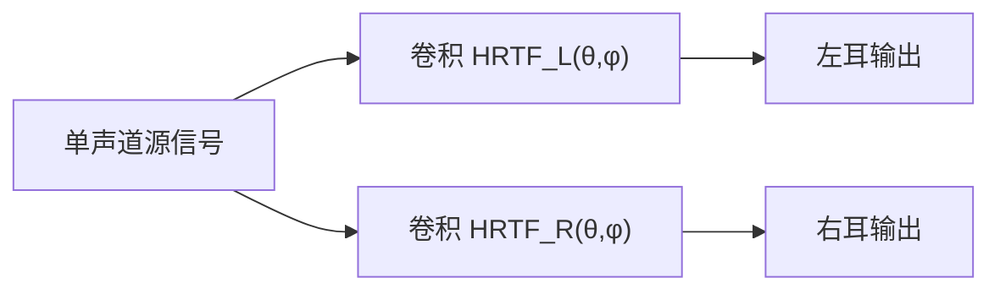
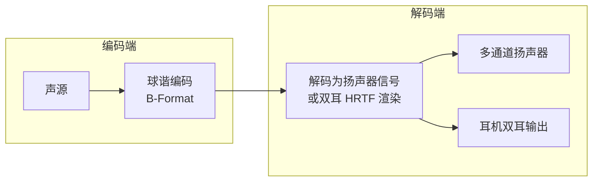
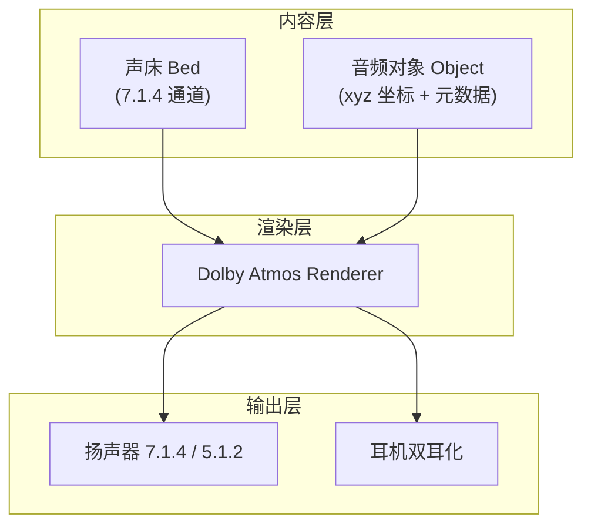

# 空间音频 (Spatial Audio)

空间音频是通过声学算法在听者周围构建三维声场的技术。从早期的立体声到如今的沉浸式全景声，空间音频已成为耳机、车载、XR 等领域的核心竞争力。

---

## 1. 人类空间听觉原理

人类依靠以下线索定位声源，这是所有空间音频算法的物理基础：

### 1.1 双耳线索 (Binaural Cues)

| 线索 | 全称 | 原理 | 适用频段 |
|:---|:---|:---|:---|
| **ITD** | Interaural Time Difference | 声波到达两耳的时间差 | < 1.5kHz |
| **ILD** | Interaural Level Difference | 声波到达两耳的强度差（头部遮挡效应） | > 1.5kHz |

### 1.2 单耳线索：耳廓效应

*   耳廓 (Pinna) 的褶皱对不同方向的声音产生不同的频谱着色。
*   这是区分**前后方向**和**上下高度**的关键线索。

---

## 2. HRTF：空间音频的核心引擎

### 2.1 定义

**HRTF (Head-Related Transfer Function，头相关传递函数)** 描述了从空间中某一点到人耳鼓膜的完整传递函数，包含头部、耳廓、肩部的所有衍射与反射效应。

*   数学表示：对于方位角 $\theta$ 和仰角 $\phi$，左耳 HRTF 为 $H_L(f, \theta, \phi)$

### 2.2 HRTF 渲染流程



当声源位置变化时，实时切换不同角度的 HRTF 滤波器即可感知声源移动。

### 2.3 个性化 HRTF

通用 HRTF 数据集（如 MIT KEMAR）对大部分人有效，但精确的空间感知需要个性化：

| 方法 | 原理 | 精度 | 成本 |
|:---|:---|:---|:---|
| **消声室实测** | 在数百个方向用探头麦测量 | 最高 | 极高 |
| **3D 耳廓扫描** | 通过耳朵照片/扫描 + 数值模拟 | 高 | 中 |
| **AI 推断** | 基于耳朵照片用深度学习估算 | 中 | 低 (Apple Spatial Audio) |

---

## 3. Ambisonics：基于球谐函数的声场编码

### 3.1 核心思想

Ambisonics 不是直接编码"通道"，而是编码**声场本身**。使用球谐函数 (Spherical Harmonics) 将声场分解为不同阶 (Order) 的分量：

*   **FOA (1st Order Ambisonics)**：4 通道 (W, X, Y, Z)，覆盖基本方向感。
*   **HOA (Higher Order)**：$(N+1)^2$ 通道，阶数越高空间分辨率越高。

### 3.2 编解码流程



### 3.3 应用场景

*   **VR/XR 音频**：头部追踪 + 实时 Ambisonics 旋转
*   **YouTube 360° 视频**：采用 FOA 编码
*   **车载声场**：用 HOA 描述车内声场

---

## 4. 商业空间音频方案

### 4.1 杜比全景声 (Dolby Atmos)

*   **基于对象 (Object-Based)**：每个声源携带位置元数据，渲染器实时计算输出。
*   **Renderer**：根据实际扬声器布局或耳机 HRTF 将对象映射到物理通道。
*   **Bed + Object 混合**：固定声床 (如环境音) 用通道编码，运动对象用 Object 编码。



### 4.2 Sony 360 Reality Audio

*   基于 MPEG-H 3D Audio 标准。
*   支持个性化 HRTF（通过 Sony Headphones Connect 拍摄耳朵）。

### 4.3 Apple Spatial Audio

*   动态头部追踪 (Head Tracking)：利用 AirPods Pro 的 IMU 传感器。
*   将 5.1/7.1/Atmos 内容实时双耳化。
*   个性化 HRTF：iPhone TrueDepth 摄像头扫描耳朵。

---

## 5. 关键技术：头部追踪 (Head Tracking)

耳机空间音频的"杀手特性"——当用户转头时，声场保持稳定（如同声源固定在空间中）。

### 5.1 实现原理


### 5.2 延迟要求

*   **运动到声音 (Motion-to-Sound) 延迟 < 30ms**：否则人耳会感知到声场"粘在头上"。
*   实际商用方案（AirPods Pro）延迟约 10-20ms。

---

## 6. 车载空间音频

车载是空间音频的天然应用场景——固定的扬声器布局 + 已知的座位位置：

### 6.1 车载扬声器布局

*   **入门**：4-6 扬声器（门板 + A柱）
*   **中端**：8-12 扬声器 + 低音炮
*   **高端 (如哈曼/B&O)**：16-30+ 扬声器，含天花板声道 (Height Channel)

### 6.2 车载空间音频特点

| 特性 | 耳机空间音频 | 车载空间音频 |
|:---|:---|:---|
| 渲染方式 | HRTF 双耳化 | 真实扬声器阵列回放 |
| 头部追踪 | 必须 (IMU) | 不需要 (听者位置固定) |
| 串扰问题 | 无 | 需要串扰消除 (Crosstalk Cancellation) |
| 声场校正 | 无 | 需要座位级声场校正 (Seat Calibration) |
| Atmos 支持 | 双耳 Renderer | 直接映射扬声器通道 |

---

## 7. Android 空间音频 API

Android 13+ 引入了空间音频支持：

```java
// 创建 Spatializer 实例
Spatializer spatializer = audioManager.getSpatializer();

// 检查是否支持
if (spatializer.getImmersiveAudioLevel() 
        != Spatializer.SPATIALIZER_IMMERSIVE_LEVEL_NONE) {
    // 支持空间音频
    spatializer.setEnabled(true);
}

// 头部追踪回调
spatializer.addOnHeadTrackerAvailableListener(executor, 
    (available) -> {
        if (available) {
            spatializer.setHeadTrackerEnabled(true);
        }
    });
```

---

## 8. HRTF 渲染实现细节

### 8.1 卷积实现

```
HRTF 渲染的核心 = FIR 滤波器卷积:

  HRTF 滤波器长度: 128-512 tap (典型 256 @ 48kHz ≈ 5.3ms)
  
  时域直接卷积:
    y[n] = Σ x[n-k] × h[k], k=0..N-1
    复杂度: O(N×L) per frame (N=滤波器长, L=帧长)
    
  频域快速卷积 (Overlap-Save / Overlap-Add):
    X = FFT(x)
    H = FFT(h)  ← 预计算
    Y = X × H   ← 逐频率复数乘
    y = IFFT(Y)
    复杂度: O(N×logN)
    
  实际实现选择:
    滤波器 < 64 tap:  时域 (NEON 加速)
    滤波器 > 64 tap:  频域 (分区卷积 Partitioned Convolution)
    
  分区卷积 (Uniformly Partitioned):
    将长 HRTF 切成多个短分区 (如每段 128 点)
    每帧只做一次短 FFT + 累加
    → 延迟 = 1 个分区长 (如 128/48000 ≈ 2.67ms)
    → 适合实时应用
```

### 8.2 HRTF 插值

```
问题: HRTF 数据库通常只有有限方向 (如 5° 间隔)
     声源位置可能在两个测量点之间

  插值方法:
  
    1. 最近邻 (Nearest Neighbor):
       选择最近的测量方向 → 有明显"跳跃感"
       
    2. 线性插值 (Bilinear):
       在方位角和仰角两维分别线性插值
       → 简单高效, 大多数实现采用
       
    3. 球面加权插值 (VBAP-style):
       找到包围三角形的 3 个测量点
       → 按重心坐标加权平均
       → 更平滑
       
    4. 频域幅度+相位分别插值:
       幅度: 直接线性插值
       相位: 使用最小相位分解 + ITD 分开插值
       → 避免相位翻转导致的梳状滤波
```

### 8.3 高通平台空间音频实现

```
高通 Snapdragon Sound 空间音频:

  ┌──────────────────────────────────────────────┐
  │ App (Dolby Atmos / 360RA / 系统 Spatializer) │
  │   → 输出多声道 PCM (5.1 / 7.1.4 / Object)  │
  └──────────────────────────────────────────────┘
           │
           ▼
  ┌──────────────────────────────────────────────┐
  │ Android Spatializer Framework                │
  │   → 调用 Spatializer Effect                 │
  │   → 配置: 内容格式 / 设备类型 / 头追踪      │
  └──────────────────────────────────────────────┘
           │
           ▼
  ┌──────────────────────────────────────────────┐
  │ ADSP SPF Graph:                             │
  │   ├── Binaural Renderer Module              │
  │   │     → HRTF 卷积 (频域分区)             │
  │   │     → 房间反射模拟 (Early Reflections)  │
  │   │     → 混响尾巴 (Late Reverb)           │
  │   ├── Head Tracker Interface                │
  │   │     → BT → IMU 数据 → 姿态融合         │
  │   │     → 角度 → HRTF 选择                 │
  │   └── Output: Stereo PCM → Codec DAC       │
  └──────────────────────────────────────────────┘
  
  优势: ADSP 处理 → 低功耗, 低延迟
  延迟: Head Tracking → Audio < 20ms
```

---

## 9. 空间音频质量评估

```
空间音频主观评测维度:

  ┌──────────────────────────────────────────────┐
  │ 维度                    评分方法             │
  ├──────────────────────────────────────────────┤
  │ 定位精度 (Localization) MAA 最小可辨别角度   │
  │ 空间感 (Envelopment)    宽度/包围感评分      │
  │ 距离感 (Distance)       近/远源区分能力      │
  │ 外部化 (Externalization) 声源在头外/头内     │
  │ 前后混淆率              前后误判百分比       │
  │ 音质 (Timbral Quality)  频响着色/失真       │
  │ 头追踪响应             转头时声场稳定性      │
  └──────────────────────────────────────────────┘
  
  行业标准测试:
    - ITU-R BS.1534 (MUSHRA): 多刺激隐蔽参考
    - ITU-R BS.1116: 小损伤分级
    - Localization 测试: 声源方位判断 + 混淆率统计
    
  典型性能指标:
    水平面定位精度:  ±5° (正前方) / ±15° (侧面)
    前后混淆率:     < 10% (好的个性化 HRTF)
    Motion-to-Sound: < 30ms (合格) / < 15ms (优秀)
```

---

## 10. 常见空间音频调试

```bash
# === Android Spatializer 状态 ===
adb shell dumpsys media.audio_flinger | grep -i spatial
adb shell dumpsys audio | grep -iE "spatial|head.track"

# 检查 Spatializer 是否启用
adb shell dumpsys audio | grep "Spatializer"
#   Spatializer: enabled=true, available=true
#   HeadTracker: connected=true, available=true

# 检查输出格式是否支持空间化
adb shell dumpsys media.audio_policy | grep -i "spatializ"

# === 高通 ADSP 空间音频 Graph ===
adb shell cat /proc/asound/card0/agm_dump | grep -i spatial

# === 常见问题 ===
# 空间感不明显:
#   → 检查输出是否为 Stereo (需要 5.1+ 输入)
#   → 检查 HRTF 是否加载
#   → 检查 setEnabled(true) 是否调用

# 转头延迟大:
#   → 检查 BT 传输延迟 (APTX Adaptive < AAC < SBC)
#   → 检查 IMU 数据率 (需要 > 100Hz)
#   → 检查 ADSP processing block size
```

---

## 11. 关键参考 (References)

1.  *3D Audio* - Rozenn Nicol (Springer)
2.  [MIT KEMAR HRTF Dataset](https://sound.media.mit.edu/resources/KEMAR.html)
3.  [Dolby Atmos for Content Creators](https://professional.dolby.com/cinema/dolby-atmos/)
4.  [Ambisonics - Wikipedia](https://en.wikipedia.org/wiki/Ambisonics)
5.  [Apple Spatial Audio Overview](https://developer.apple.com/spatial-audio/)
6.  [Android Spatializer API](https://developer.android.com/reference/android/media/Spatializer)
7.  [SADIE II HRTF Database](https://www.york.ac.uk/sadie-project/database.html)
8.  [Qualcomm Snapdragon Sound - Spatial Audio](https://www.qualcomm.com/products/features/snapdragon-sound)
