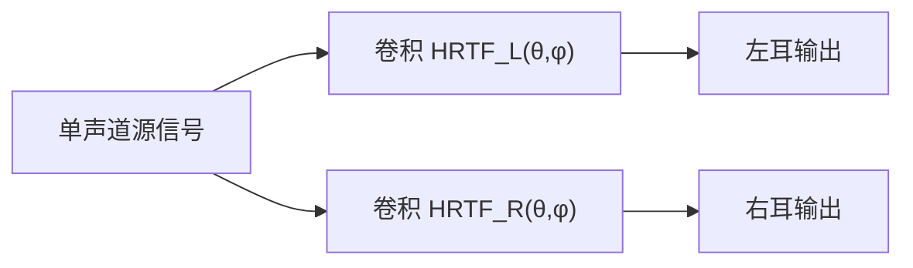
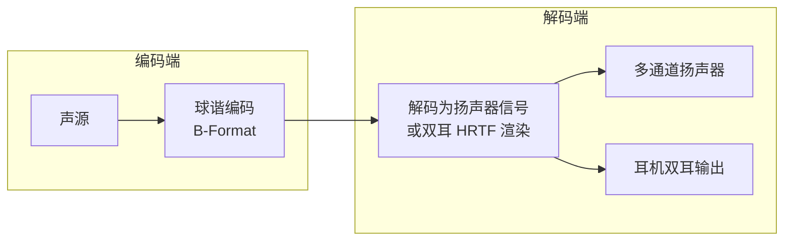
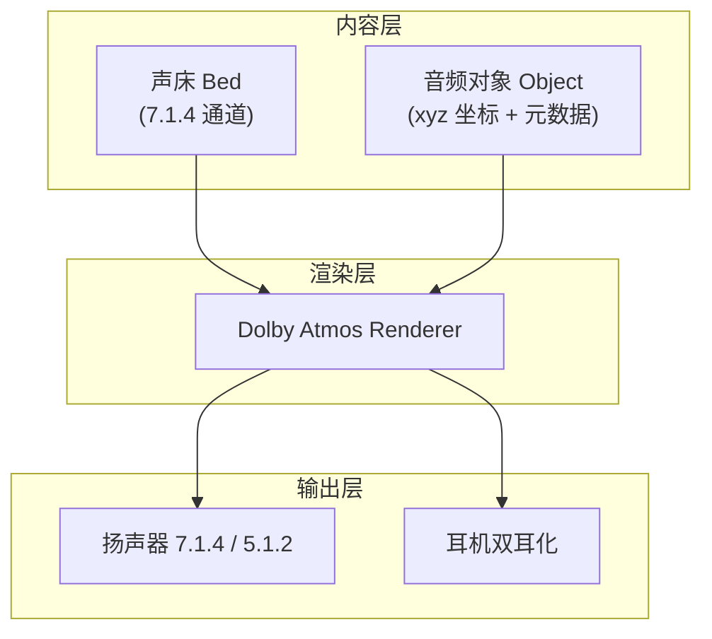

# 空间音频 (Spatial Audio)

空间音频是通过声学算法在听者周围构建三维声场的技术。从早期的立体声到如今的沉浸式全景声，空间音频已成为耳机、车载、XR 等领域的核心竞争力。

---

## 1. 人类空间听觉原理

人类依靠以下线索定位声源，这是所有空间音频算法的物理基础：

### 1.1 双耳线索 (Binaural Cues)

| 线索 | 全称 | 原理 | 适用频段 |
|:---|:---|:---|:---|
| **ITD** | Interaural Time Difference | 声波到达两耳的时间差 | < 1.5kHz |
| **ILD** | Interaural Level Difference | 声波到达两耳的强度差（头部遮挡效应） | > 1.5kHz |

### 1.2 单耳线索：耳廓效应

*   耳廓 (Pinna) 的褶皱对不同方向的声音产生不同的频谱着色。
*   这是区分**前后方向**和**上下高度**的关键线索。

---

## 2. HRTF：空间音频的核心引擎

### 2.1 定义

**HRTF (Head-Related Transfer Function，头相关传递函数)** 描述了从空间中某一点到人耳鼓膜的完整传递函数，包含头部、耳廓、肩部的所有衍射与反射效应。

*   数学表示：对于方位角 $\theta$ 和仰角 $\phi$，左耳 HRTF 为 $H_L(f, \theta, \phi)$

### 2.2 HRTF 渲染流程


```mermaid
graph LR
    MONO[单声道源信号] --> CONV_L["卷积 HRTF_L(θ,φ)"]
    MONO --> CONV_R["卷积 HRTF_R(θ,φ)"]
    CONV_L --> L[左耳输出]
    CONV_R --> R[右耳输出]
```

当声源位置变化时，实时切换不同角度的 HRTF 滤波器即可感知声源移动。

### 2.3 个性化 HRTF

通用 HRTF 数据集（如 MIT KEMAR）对大部分人有效，但精确的空间感知需要个性化：

| 方法 | 原理 | 精度 | 成本 |
|:---|:---|:---|:---|
| **消声室实测** | 在数百个方向用探头麦测量 | 最高 | 极高 |
| **3D 耳廓扫描** | 通过耳朵照片/扫描 + 数值模拟 | 高 | 中 |
| **AI 推断** | 基于耳朵照片用深度学习估算 | 中 | 低 (Apple Spatial Audio) |

---

## 3. Ambisonics：基于球谐函数的声场编码

### 3.1 核心思想

Ambisonics 不是直接编码"通道"，而是编码**声场本身**。使用球谐函数 (Spherical Harmonics) 将声场分解为不同阶 (Order) 的分量：

*   **FOA (1st Order Ambisonics)**：4 通道 (W, X, Y, Z)，覆盖基本方向感。
*   **HOA (Higher Order)**：$(N+1)^2$ 通道，阶数越高空间分辨率越高。

### 3.2 编解码流程


```mermaid
graph LR
    subgraph Encode ["编码端"]
        SRC[声源] --> ENC["球谐编码<br/>B-Format"]
    end
    
    subgraph Decode ["解码端"]
        ENC --> DEC["解码为扬声器信号<br/>或双耳 HRTF 渲染"]
        DEC --> OUT_SPK[多通道扬声器]
        DEC --> OUT_HP[耳机双耳输出]
    end
```

### 3.3 应用场景

*   **VR/XR 音频**：头部追踪 + 实时 Ambisonics 旋转
*   **YouTube 360° 视频**：采用 FOA 编码
*   **车载声场**：用 HOA 描述车内声场

---

## 4. 麦克风阵列与波束成形 (Beamforming)

> **波束成形 (BF, Beamforming)** 是利用多麦克风的空间分布，通过信号处理增强目标方向的声音、抑制其他方向干扰的技术。它是多麦前端处理（Far-field、会议终端、车载）的核心。

### 4.1 麦克风阵列基础

```
阵列几何与波达方向:

  线性阵列 (ULA, Uniform Linear Array):
    MIC₀  MIC₁  MIC₂  ...  MIC_{M-1}
    |--d--|--d--|--d--|
    d: 阵元间距 (inter-element spacing)
    
  平面声波到达阵列时，各麦克风间存在时间差:
    τ_m = m · d · cos(θ) / c
    
    θ: DOA (Direction of Arrival, 波达方向角)
    c: 声速 (~343 m/s @ 20°C)
    m: 第 m 个麦克风索引
    d: 阵元间距

  空间采样定理 (空间 Nyquist):
    d ≤ c / (2·f_max) = λ_min / 2
    
    f_max = 8kHz → d ≤ 343/(2×8000) ≈ 21.4mm
    实际设计: d = 15-40mm (手机); d = 40-80mm (会议设备)

  导向向量 (Steering Vector):
    a(θ, f) = [1, e^{-j2πfτ₁}, e^{-j2πfτ₂}, ..., e^{-j2πfτ_{M-1}}]ᵀ
    
    对于 ULA: a_m(θ, f) = e^{-j2πf·m·d·cos(θ)/c}
```

**常见阵列拓扑**：

| 拓扑 | 阵元数 | 应用场景 | 特点 |
|:---|:---|:---|:---|
| **线性 (Linear)** | 2-8 | 手机、条形音箱 | 仅水平面定位 |
| **圆形 (Circular)** | 4-8 | 智能音箱 (Echo/HomePod) | 360° 全向覆盖 |
| **十字/L形** | 4-6 | 会议终端 | 2D 定位 |
| **平面 (Planar)** | 16-64 | 专业录音/研究 | 3D 高分辨率 |
| **分布式** | 2-4 (远距) | 车载 (仪表盘+顶棚) | 覆盖范围大 |

### 4.2 延迟求和波束成形 (DSB - Delay-and-Sum Beamformer)

最基本的波束成形方法，原理：将各麦克风信号延迟对齐后求和。

```
DSB 原理:
  1. 估计目标方向 θ₀
  2. 计算各麦克风到目标方向的延迟补偿
  3. 补偿延迟后求和 (同相叠加增强目标，异相部分抑制)

时域实现:
  y(n) = (1/M) · Σ_{m=0}^{M-1} x_m(n - τ_m(θ₀))

频域实现 (更灵活):
  Y(f) = wᴴ(f, θ₀) · X(f)
  
  其中:
    X(f) = [X₀(f), X₁(f), ..., X_{M-1}(f)]ᵀ    (M 通道频谱向量)
    w(f, θ₀) = (1/M) · a(θ₀, f)                   (DSB 权重 = 归一化导向向量)
    wᴴ: 权重向量的共轭转置 (Hermitian)

波束图 (Beam Pattern):
  B(θ, f) = wᴴ · a(θ, f) = (1/M) · Σ_{m=0}^{M-1} e^{j2πf·m·d·(cos θ₀ - cos θ)/c}

  → 当 θ = θ₀ 时 |B| = 1 (主瓣最大)
  → 其他方向 |B| < 1 (衰减)
  
DSB 特性:
  - 白噪声增益 (WNG, White Noise Gain): 10·log₁₀(M) dB (M个麦 → +3/+6/+9 dB)
  - 优点: 实现简单、鲁棒、对阵列误差不敏感
  - 缺点: 波束宽、低频抑制能力弱、无法适应干扰
```

```python
import numpy as np

def delay_and_sum_beamformer(mic_signals_freq, d, theta_target, freqs, c=343.0):
    """
    频域 Delay-and-Sum 波束成形
    Args:
        mic_signals_freq: (M, N_freq) 各麦克风频域信号
        d: 阵元间距 (m)
        theta_target: 目标方向角 (rad)
        freqs: 频率向量 (Hz)
        c: 声速
    Returns:
        output_freq: (N_freq,) 波束输出频域信号
    """
    M = mic_signals_freq.shape[0]
    N_freq = len(freqs)
    
    output_freq = np.zeros(N_freq, dtype=complex)
    
    for k, f in enumerate(freqs):
        # 构造导向向量
        steering = np.array([
            np.exp(-1j * 2 * np.pi * f * m * d * np.cos(theta_target) / c)
            for m in range(M)
        ])
        # DSB 权重 = 归一化导向向量
        w = steering / M
        # 波束输出
        output_freq[k] = np.conj(w) @ mic_signals_freq[:, k]
    
    return output_freq
```

### 4.3 MVDR 波束成形 (Minimum Variance Distortionless Response)

> 也称 **Capon Beamformer**。在保证目标方向无失真 (Distortionless) 的约束下，最小化输出功率（即最大抑制干扰+噪声）。

```
MVDR 优化问题:
  min_w  wᴴ Φ_nn w          (最小化噪声+干扰输出功率)
  s.t.   wᴴ a(θ₀) = 1       (目标方向增益恒为 1, 无失真)
  
  其中:
    Φ_nn: 噪声+干扰的空间协方差矩阵 (Noise Covariance Matrix)
           Φ_nn(f) = E[N(f)·Nᴴ(f)]  (M×M 矩阵)
    a(θ₀): 目标方向导向向量

  闭式解 (Lagrange 乘子法):
    w_MVDR(f) = Φ_nn⁻¹(f) · a(θ₀, f) / [aᴴ(θ₀, f) · Φ_nn⁻¹(f) · a(θ₀, f)]

MVDR 关键问题与解决:
  1. Φ_nn 估计:
     - 理想: 仅包含噪声+干扰 (无目标信号) 的协方差
     - 实际: 使用 VAD 标记非语音段估计，或使用混合信号 Φ_xx 近似
     - 改进: 对角加载 (Diagonal Loading): Φ̃_nn = Φ_nn + ε·I (提升鲁棒性)
     
  2. 正则化:
     - Φ_nn 可能病态 (ill-conditioned) → 求逆不稳定
     - 解决: Φ̃_nn = Φ_nn + δ·I, δ = 0.01~0.1 × trace(Φ_nn)/M
     
  3. 实时更新:
     - Φ_nn 用递推平滑: Φ_nn(l) = α·Φ_nn(l-1) + (1-α)·N(l)·Nᴴ(l)

MVDR 特性:
  - 自适应零陷 (Null) 对准干扰方向
  - 目标方向无失真
  - 白噪声增益可能低于 DSB (过度优化导致自噪声放大)
  - 需要准确的 DOA (Direction of Arrival) 估计和 Φ_nn 估计
```

### 4.4 GSC 结构 (Generalized Sidelobe Canceller)

GSC 是 MVDR 的等价实现结构，将约束优化转化为无约束问题，便于自适应实现：

```
GSC 结构分解:

  X(f) ──┬── [Fixed BF (DSB)] ──── d(f) ─────────(+)──→ Y(f)
          │                                        (-)
          └── [Blocking Matrix B] ── u(f) ── [Adaptive Filter W] ── ŷ_noise(f)

  组成:
    1. Fixed Beamformer (上路): DSB 对准目标方向，输出 d(f) = wᴴ_dsb · X(f)
       → 包含目标信号 + 泄漏的噪声/干扰
       
    2. Blocking Matrix B (下路): 阻止目标信号通过，仅保留干扰
       B 满足: Bᴴ · a(θ₀) = 0 (零空间投影)
       u(f) = Bᴴ · X(f) → 仅包含噪声和干扰分量
       
    3. Adaptive Filter W: 用 u(f) 去估计 d(f) 中的噪声成分
       ŷ_noise = Wᴴ · u(f)
       
    4. 输出: Y(f) = d(f) - ŷ_noise(f)
       → 消除了噪声，保留目标语音

  GSC 优势:
    - 自适应部分是无约束 LMS/NLMS → 实现简单
    - 不需要 Φ_nn 的显式逆运算
    - 工业界广泛采用 (高通 Fluence 内部结构即类似 GSC)
    
  GSC 难点:
    - 目标信号泄漏 (Signal Leakage): B 不完美时目标信号进入下路
      → 自适应滤波器会"学会"消除目标语音 → 语音失真
    - 解决: 配合 VAD 冻结自适应 / 约束自适应滤波器范数
```

### 4.5 后滤波器 (Post-Filter) 增强

波束成形输出后，通常级联一个**频域后滤波器**进一步增强 SNR (Signal-to-Noise Ratio)：

```
后滤波器原理:
  在波束成形输出上估计逐频点 SNR，再做 Wiener 增益:
  
  G_post(f) = SNR_BF(f) / (1 + SNR_BF(f))
  
  Y_enhanced(f) = G_post(f) · Y_BF(f)

常用后滤波器:
  1. Zelinski Post-Filter:
     利用各通道间的互功率谱估计目标功率:
     P_signal(f) = Re{ (1/C(M,2)) · Σ_{i≠j} X_i(f)·X_j*(f) }
     P_noise(f)  = (1/M) · Σ_m |X_m(f)|² - P_signal(f)
     G(f) = P_signal / (P_signal + P_noise)
     
  2. MCRA-based Post-Filter:
     对 BF 输出运行 MCRA 噪声估计 + Wiener/MMSE-LSA
     
  3. Neural Post-Filter:
     BF 输出 + 多通道特征 → CNN/RNN → 掩膜估计
     (如 NN-BF: Neural Network enhanced Beamforming)
```

### 4.6 波束成形方案对比

| 方案 | 原理 | 优点 | 缺点 | 适用 |
|:---|:---|:---|:---|:---|
| **DSB** | 延迟对齐求和 | 鲁棒、简单、WNG高 | 波束宽、抑制弱 | 近场/简单场景 |
| **MVDR** | 最小方差无失真 | 自适应零陷、抑制强 | 需 Φ_nn 估计、可能自噪放大 | 远场会议 |
| **GSC** | MVDR 等价结构 | 自适应、工程友好 | 信号泄漏风险 | 工业主流 (高通等) |
| **LCMV** | 多约束 MVDR | 同时保护多方向 | 约束多→自由度少 | 多人场景 |
| **Super-directive** | 最大化方向性指数 | 极窄波束 | WNG 极差、对误差敏感 | 特殊应用 |
| **Neural BF** | NN 估计 mask/权重 | 性能最优 | 计算量大 | 高端设备 |

---

## 5. 声源定位 (DOA Estimation)

> **DOA (Direction of Arrival)** 估计是确定声源相对于麦克风阵列方向的技术。它是波束成形的前置步骤——只有知道声源在哪，才能将波束"指"过去。

### 5.1 GCC-PHAT (Generalized Cross-Correlation with Phase Transform)

最经典、最鲁棒的时延估计方法：

```
GCC-PHAT 原理:
  两麦克风间时延估计 (TDOA, Time Difference of Arrival):
  
  1. 计算互功率谱 (Cross-Power Spectrum):
     G_12(f) = X₁(f) · X₂*(f)
     
  2. PHAT 加权 (仅保留相位信息):
     Ψ_PHAT(f) = G_12(f) / |G_12(f)|
     
  3. IFFT 得到广义互相关函数:
     R_12(τ) = IFFT{ Ψ_PHAT(f) }
     
  4. 峰值搜索:
     τ̂ = argmax_τ R_12(τ)
     
  5. TDOA → DOA:
     θ̂ = arccos(τ̂ · c / d)    (对于 ULA)

  PHAT 的优势:
    - 白化处理 → 对混响环境鲁棒
    - 互相关峰值尖锐 → 定位精度高
    - 计算量低: 一次 FFT + 一次 IFFT
    
  局限:
    - 仅估计两麦间 TDOA → 一对麦只能给出一个角度
    - 多声源时有多个峰 → 需要额外处理区分
    - 远场/高混响时峰值模糊
```

```python
import numpy as np
from scipy.fft import fft, ifft

def gcc_phat(mic1, mic2, fs, max_delay_samples=None):
    """
    GCC-PHAT 时延估计
    Args:
        mic1, mic2: 两通道时域信号
        fs: 采样率
        max_delay_samples: 最大搜索延迟 (samples)
    Returns:
        tdoa_samples: 估计的时延 (samples)
        gcc_curve: GCC-PHAT 互相关曲线
    """
    n = len(mic1) + len(mic2) - 1
    N = 2 ** int(np.ceil(np.log2(n)))  # FFT 长度 (2的幂)
    
    # 频域互功率谱
    X1 = fft(mic1, N)
    X2 = fft(mic2, N)
    G12 = X1 * np.conj(X2)
    
    # PHAT 加权 (仅保留相位)
    G12_phat = G12 / (np.abs(G12) + 1e-10)
    
    # IFFT → 互相关
    gcc_curve = np.real(ifft(G12_phat))
    gcc_curve = np.fft.fftshift(gcc_curve)
    
    # 搜索峰值
    center = N // 2
    if max_delay_samples is None:
        max_delay_samples = N // 2
    
    search_range = gcc_curve[center - max_delay_samples: center + max_delay_samples]
    tdoa_samples = np.argmax(search_range) - max_delay_samples
    
    return tdoa_samples, gcc_curve

def tdoa_to_doa(tdoa_samples, fs, d, c=343.0):
    """TDOA → DOA 角度转换"""
    tdoa_sec = tdoa_samples / fs
    cos_theta = tdoa_sec * c / d
    cos_theta = np.clip(cos_theta, -1.0, 1.0)
    return np.arccos(cos_theta) * 180 / np.pi  # 角度 (度)
```

### 5.2 SRP-PHAT (Steered Response Power with PHAT)

对空间进行网格搜索，找到使波束输出功率最大的方向：

```
SRP-PHAT 算法:
  对候选方向 θ ∈ [0°, 180°] 逐个计算"导向响应功率":
  
  P_SRP(θ) = Σ_{(i,j), i<j} R_ij(τ_ij(θ))
  
  其中:
    R_ij(τ): 麦克风对 (i,j) 的 GCC-PHAT 在延迟 τ 处的值
    τ_ij(θ): 方向 θ 对应的麦对 (i,j) 的理论 TDOA
  
  DOA 估计:
    θ̂ = argmax_θ P_SRP(θ)

  优势:
    - 利用所有麦克风对 → 比单对 GCC-PHAT 更鲁棒
    - 对混响和噪声有较好的抗干扰性
    - 多声源: P_SRP 可能有多个峰
    
  计算优化:
    - 粗搜索 (5° 步长) + 精搜索 (1° 步长)
    - 预计算各角度对应的 TDOA lookup table
    - 分帧处理: 每 20-50ms 更新一次 DOA
```

### 5.3 MUSIC 算法 (Multiple Signal Classification)

基于子空间分解的高分辨率 DOA 估计：

```
MUSIC 算法步骤:
  1. 估计空间协方差矩阵:
     R_xx = E[X(f)·Xᴴ(f)] ≈ (1/L) Σ_{l=1}^L X_l · X_lᴴ    (L 个快拍)
  
  2. 特征分解:
     R_xx = U·Λ·Uᴴ
     → 按特征值从大到小排列
     → 前 K 个大特征值对应信号子空间 U_s
     → 后 M-K 个小特征值对应噪声子空间 U_n
     (K: 声源数，需预估)
  
  3. MUSIC 伪谱:
     P_MUSIC(θ) = 1 / (aᴴ(θ) · U_n · U_nᴴ · a(θ))
     
     → 当 a(θ) 落入信号子空间时，与 U_n 正交 → 分母→0 → 谱值→∞ → 尖峰
  
  4. 峰值搜索:
     θ̂_1, θ̂_2, ..., θ̂_K = K 个最大峰值的位置

MUSIC 特性:
  - 超分辨率: 可分辨间距 < 波束宽度的多声源
  - 需要知道声源数 K (或用 MDL/AIC 准则估计)
  - 计算量: 特征分解 O(M³) + 谱搜索
  - 对相干源 (如多径反射) 失效 → 需空间平滑 (Spatial Smoothing)
  - 窄带假设: 需要逐频点做，或宽带 MUSIC (iSTFT)
```

### 5.4 DOA 方案对比

| 方法 | 分辨率 | 多源能力 | 计算量 | 混响鲁棒性 | 适用 |
|:---|:---|:---|:---|:---|:---|
| **GCC-PHAT** | 中等 | 弱 (多峰模糊) | 低 | 好 (PHAT 白化) | 实时嵌入式 |
| **SRP-PHAT** | 中等 | 中 (多峰) | 中 | 好 | 智能音箱 |
| **MUSIC** | 高 (超分辨) | 强 (K 源) | 高 (EVD) | 差 (相干源) | 研究/高端 |
| **ESPRIT** | 高 | 强 | 中 (无需谱搜索) | 差 | 研究 |
| **Neural DOA** | 高 | 强 | 高 (CNN/RNN) | 好 | 高端设备 |

---

## 6. 串扰消除与房间声学模拟

### 6.1 串扰消除 (Crosstalk Cancellation, CTC)

在扬声器回放场景（非耳机），左扬声器的声音会到达右耳（串扰），破坏双耳空间信息。CTC 通过预处理信号来消除这个串扰：

```
串扰问题:

  SPK_L ─────────────── → 左耳 (直达)
    ╲                    ╱
     ╲── 串扰路径 ──→ 右耳 (不想要的)
    
  SPK_R ─────────────── → 右耳 (直达)
    ╲
     ╲── 串扰路径 ──→ 左耳 (不想要的)

数学模型:
  [E_L]   [H_LL  H_LR] [S_L]
  [E_R] = [H_RL  H_RR] [S_R]
  
  E: 耳朵接收信号, S: 扬声器输出信号, H: 传递函数矩阵
  
  CTC 目标: 设计预滤波器 C，使:
  [S_L]   [C_LL  C_LR] [D_L]
  [S_R] = [C_RL  C_RR] [D_R]
  
  满足: H · C = I (单位矩阵)
  即: C = H⁻¹

  逆滤波器:
    C(f) = H⁻¹(f) = (1/det(H)) · [H_RR  -H_LR]
                                    [-H_RL  H_LL]

CTC 实际困难:
  1. H 依赖头部位置 → 听者移动时 CTC 失效
  2. 逆滤波器可能不稳定 (H 接近奇异)
  3. 有效区域 (Sweet Spot) 很小 (~±5cm)
  4. 低频 CTC 效果差 (波长>>头宽，串扰路径差异小)

解决方案:
  - 正则化逆: C = Hᴴ(HHᴴ + εI)⁻¹ (防止不稳定)
  - 头部追踪: 跟踪听者位置动态更新 C
  - 车载优势: 听者位置相对固定 → CTC 效果好
  - 多区域 CTC (Multipoint): 优化多个听者位置的 Sweet Spot
```

### 6.2 房间声学模拟 (Room Acoustics Simulation)

空间音频渲染需要模拟声音在房间中的传播行为（反射、混响），主要方法：

```
房间脉冲响应 (RIR, Room Impulse Response) 组成:

  h(t)
  |
  |▎ ← 直达声 (Direct Sound, 0-5ms)
  | ▎▎▎ ← 早期反射 (Early Reflections, 5-50ms)
  |  ▎▎▎▎▎▎ → 提供空间感/房间大小信息
  |   ░░░░░░░░░░░░ ← 晚期混响 (Late Reverberation, >50ms)
  |    ░░░░░░░░░░ → 指数衰减 (RT60 决定衰减速率)
  |     ░░░░░░░
  |      ░░░░░
  |       ░░░
  └────────────────── t

模拟方法:

  1. 镜像源法 (ISM, Image Source Method):
     - 原理: 将墙壁反射等价为"镜像"声源
     - 每次反射产生一个虚拟声源
     - N 阶反射 → ~6^N 个镜像源 (指数增长)
     - 适合: 矩形房间的早期反射 (1-3 阶)
     - 经典实现: Allen & Berkley (1979)
     
  2. 射线追踪 (Ray Tracing):
     - 从声源发射大量"声线" (10K-100K)
     - 追踪每条声线的反射/散射路径
     - 到达接收器位置时记录能量和延迟
     - 适合: 复杂几何空间、高阶反射
     - 计算量大但可 GPU 加速
     
  3. 统计混响模型 (Late Reverb):
     - 晚期混响用统计方法生成 (如 FDN, Feedback Delay Network)
     - 参数: RT60, 混响密度, 频率特性
     - 计算高效，适合实时渲染
     
  4. 波动方程数值解 (FDTD/BEM):
     - 精确但极度耗计算
     - 仅用于低频 (<500Hz) 精确模拟
     - 研究/离线使用

实时渲染策略:
  直达声:    直接衰减 + HRTF 卷积
  早期反射:  ISM (6-20 个主要反射) + HRTF
  晚期混响:  FDN 人工混响器 (参数化)
  
  高通 ADSP 实现:
    - Early Reflections Module: 预计算 ISM 反射点 + 实时 HRTF 卷积
    - Late Reverb Module: FDN 结构 (4-8 延迟线 + 反馈矩阵)
```

### 6.3 FDN (Feedback Delay Network) 混响器

```
FDN 结构 (人工混响的标准实现):

  Input ──┬──→ [z^{-d₁}] ──→ ┐
           ├──→ [z^{-d₂}] ──→ ├──→ [反馈矩阵 A] ──┬──→ Output
           ├──→ [z^{-d₃}] ──→ ┤                    │
           └──→ [z^{-d₄}] ──→ ┘                    │
                                                     │
           ┌─── 反馈 ←──────────────────────────────┘
           │
           ▼ (吸收滤波器: 每次反馈乘以衰减)
           
  参数:
    - d₁...d_N: 延迟线长度 (互质, 决定混响密度)
    - A: N×N 反馈矩阵 (正交/酉矩阵, 保证能量守恒)
       常用: Hadamard 矩阵, Householder 矩阵
    - 吸收滤波器: 低通 IIR, 模拟高频吸收 (真实房间特性)
    - RT60 = -60 / (20·log₁₀|eigenvalue(A·absorption)|) × d_avg/fs

  典型参数:
    - N = 8-16 个延迟线
    - 延迟: 50-5000 samples (互质选取)
    - 复杂度: O(N² + N·d_max) per sample → 适合实时
```

---

## 7. 商业空间音频方案

### 4.1 杜比全景声 (Dolby Atmos)

*   **基于对象 (Object-Based)**：每个声源携带位置元数据，渲染器实时计算输出。
*   **Renderer**：根据实际扬声器布局或耳机 HRTF 将对象映射到物理通道。
*   **Bed + Object 混合**：固定声床 (如环境音) 用通道编码，运动对象用 Object 编码。


```mermaid
graph TD
    subgraph Content ["内容层"]
        BED["声床 Bed<br/>(7.1.4 通道)"]
        OBJ["音频对象 Object<br/>(xyz 坐标 + 元数据)"]
    end
    
    subgraph Renderer ["渲染层"]
        RND[Dolby Atmos Renderer]
    end
    
    subgraph Output ["输出层"]
        SPK["扬声器 7.1.4 / 5.1.2"]
        HP["耳机双耳化"]
    end
    
    BED --> RND
    OBJ --> RND
    RND --> SPK
    RND --> HP
```

### 4.2 Sony 360 Reality Audio

*   基于 MPEG-H 3D Audio 标准。
*   支持个性化 HRTF（通过 Sony Headphones Connect 拍摄耳朵）。

### 4.3 Apple Spatial Audio

*   动态头部追踪 (Head Tracking)：利用 AirPods Pro 的 IMU 传感器。
*   将 5.1/7.1/Atmos 内容实时双耳化。
*   个性化 HRTF：iPhone TrueDepth 摄像头扫描耳朵。

---

## 8. 关键技术：头部追踪 (Head Tracking)

耳机空间音频的"杀手特性"——当用户转头时，声场保持稳定（如同声源固定在空间中）。

### 5.1 实现原理


```mermaid
graph LR
    IMU["IMU 传感器<br/>(陀螺仪 + 加速度计)"] --> FUSION["姿态融合算法<br/>(互补/卡尔曼滤波)"]
    FUSION --> |"Yaw/Pitch/Roll"| HRTF_SEL["HRTF 滤波器<br/>角度更新"]
    HRTF_SEL --> RENDER["双耳渲染输出"]
```

### 5.2 延迟要求

*   **运动到声音 (Motion-to-Sound) 延迟 < 30ms**：否则人耳会感知到声场"粘在头上"。
*   实际商用方案（AirPods Pro）延迟约 10-20ms。

---

## 9. 车载空间音频

车载是空间音频的天然应用场景——固定的扬声器布局 + 已知的座位位置：

### 6.1 车载扬声器布局

*   **入门**：4-6 扬声器（门板 + A柱）
*   **中端**：8-12 扬声器 + 低音炮
*   **高端 (如哈曼/B&O)**：16-30+ 扬声器，含天花板声道 (Height Channel)

### 6.2 车载空间音频特点

| 特性 | 耳机空间音频 | 车载空间音频 |
|:---|:---|:---|
| 渲染方式 | HRTF 双耳化 | 真实扬声器阵列回放 |
| 头部追踪 | 必须 (IMU) | 不需要 (听者位置固定) |
| 串扰问题 | 无 | 需要串扰消除 (Crosstalk Cancellation) |
| 声场校正 | 无 | 需要座位级声场校正 (Seat Calibration) |
| Atmos 支持 | 双耳 Renderer | 直接映射扬声器通道 |

---

## 10. Android 空间音频 API

Android 13+ 引入了空间音频支持：

```java
// 创建 Spatializer 实例
Spatializer spatializer = audioManager.getSpatializer();

// 检查是否支持
if (spatializer.getImmersiveAudioLevel() 
        != Spatializer.SPATIALIZER_IMMERSIVE_LEVEL_NONE) {
    // 支持空间音频
    spatializer.setEnabled(true);
}

// 头部追踪回调
spatializer.addOnHeadTrackerAvailableListener(executor, 
    (available) -> {
        if (available) {
            spatializer.setHeadTrackerEnabled(true);
        }
    });
```

---

## 11. HRTF 渲染实现细节

### 8.1 卷积实现

```
HRTF 渲染的核心 = FIR (Finite Impulse Response, 有限脉冲响应) 滤波器卷积:

  HRTF 滤波器长度: 128-512 tap (典型 256 @ 48kHz ≈ 5.3ms)
  
  时域直接卷积:
    y[n] = Σ x[n-k] × h[k], k=0..N-1
    复杂度: O(N×L) per frame (N=滤波器长, L=帧长)
    
  频域快速卷积 (Overlap-Save / Overlap-Add):
    X = FFT(x)
    H = FFT(h)  ← 预计算
    Y = X × H   ← 逐频率复数乘
    y = IFFT(Y)
    复杂度: O(N×logN)
    
  实际实现选择:
    滤波器 < 64 tap:  时域 (NEON 加速)
    滤波器 > 64 tap:  频域 (分区卷积 Partitioned Convolution)
    
  分区卷积 (Uniformly Partitioned):
    将长 HRTF 切成多个短分区 (如每段 128 点)
    每帧只做一次短 FFT + 累加
    → 延迟 = 1 个分区长 (如 128/48000 ≈ 2.67ms)
    → 适合实时应用
```

### 8.2 HRTF 插值

```
问题: HRTF 数据库通常只有有限方向 (如 5° 间隔)
     声源位置可能在两个测量点之间

  插值方法:
  
    1. 最近邻 (Nearest Neighbor):
       选择最近的测量方向 → 有明显"跳跃感"
       
    2. 线性插值 (Bilinear):
       在方位角和仰角两维分别线性插值
       → 简单高效, 大多数实现采用
       
    3. 球面加权插值 (VBAP-style):
       找到包围三角形的 3 个测量点
       → 按重心坐标加权平均
       → 更平滑
       
    4. 频域幅度+相位分别插值:
       幅度: 直接线性插值
       相位: 使用最小相位分解 + ITD 分开插值
       → 避免相位翻转导致的梳状滤波
```

### 8.3 高通平台空间音频实现

```
高通 Snapdragon Sound 空间音频:

  ┌──────────────────────────────────────────────┐
  │ App (Dolby Atmos / 360RA / 系统 Spatializer) │
  │   → 输出多声道 PCM (5.1 / 7.1.4 / Object)  │
  └──────────────────────────────────────────────┘
           │
           ▼
  ┌──────────────────────────────────────────────┐
  │ Android Spatializer Framework                │
  │   → 调用 Spatializer Effect                 │
  │   → 配置: 内容格式 / 设备类型 / 头追踪      │
  └──────────────────────────────────────────────┘
           │
           ▼
  ┌──────────────────────────────────────────────┐
  │ ADSP SPF Graph:                             │
  │   ├── Binaural Renderer Module              │
  │   │     → HRTF 卷积 (频域分区)             │
  │   │     → 房间反射模拟 (Early Reflections)  │
  │   │     → 混响尾巴 (Late Reverb)           │
  │   ├── Head Tracker Interface                │
  │   │     → BT → IMU 数据 → 姿态融合         │
  │   │     → 角度 → HRTF 选择                 │
  │   └── Output: Stereo PCM → Codec DAC       │
  └──────────────────────────────────────────────┘
  
  优势: ADSP 处理 → 低功耗, 低延迟
  延迟: Head Tracking → Audio < 20ms
```

---

## 12. 空间音频质量评估

```
空间音频主观评测维度:

  ┌──────────────────────────────────────────────┐
  │ 维度                    评分方法             │
  ├──────────────────────────────────────────────┤
  │ 定位精度 (Localization) MAA 最小可辨别角度   │
  │ 空间感 (Envelopment)    宽度/包围感评分      │
  │ 距离感 (Distance)       近/远源区分能力      │
  │ 外部化 (Externalization) 声源在头外/头内     │
  │ 前后混淆率              前后误判百分比       │
  │ 音质 (Timbral Quality)  频响着色/失真       │
  │ 头追踪响应             转头时声场稳定性      │
  └──────────────────────────────────────────────┘
  
  行业标准测试:
    - ITU-R BS.1534 (MUSHRA): 多刺激隐蔽参考
    - ITU-R BS.1116: 小损伤分级
    - Localization 测试: 声源方位判断 + 混淆率统计
    
  典型性能指标:
    水平面定位精度:  ±5° (正前方) / ±15° (侧面)
    前后混淆率:     < 10% (好的个性化 HRTF)
    Motion-to-Sound: < 30ms (合格) / < 15ms (优秀)
```

---

## 13. 常见空间音频调试

```bash
# === Android Spatializer 状态 ===
adb shell dumpsys media.audio_flinger | grep -i spatial
adb shell dumpsys audio | grep -iE "spatial|head.track"

# 检查 Spatializer 是否启用
adb shell dumpsys audio | grep "Spatializer"
#   Spatializer: enabled=true, available=true
#   HeadTracker: connected=true, available=true

# 检查输出格式是否支持空间化
adb shell dumpsys media.audio_policy | grep -i "spatializ"

# === 高通 ADSP 空间音频 Graph ===
adb shell cat /proc/asound/card0/agm_dump | grep -i spatial

# === 常见问题 ===
# 空间感不明显:
#   → 检查输出是否为 Stereo (需要 5.1+ 输入)
#   → 检查 HRTF 是否加载
#   → 检查 setEnabled(true) 是否调用

# 转头延迟大:
#   → 检查 BT 传输延迟 (APTX Adaptive < AAC < SBC)
#   → 检查 IMU 数据率 (需要 > 100Hz)
#   → 检查 ADSP processing block size
```

---

## 14. 关键参考 (References)

1.  *3D Audio* - Rozenn Nicol (Springer)
2.  [MIT KEMAR HRTF Dataset](https://sound.media.mit.edu/resources/KEMAR.html)
3.  [Dolby Atmos for Content Creators](https://professional.dolby.com/cinema/dolby-atmos/)
4.  [Ambisonics - Wikipedia](https://en.wikipedia.org/wiki/Ambisonics)
5.  [Apple Spatial Audio Overview](https://developer.apple.com/spatial-audio/)
6.  [Android Spatializer API](https://developer.android.com/reference/android/media/Spatializer)
7.  [SADIE II HRTF Database](https://www.york.ac.uk/sadie-project/database.html)
8.  [Qualcomm Snapdragon Sound - Spatial Audio](https://www.qualcomm.com/products/features/snapdragon-sound)
