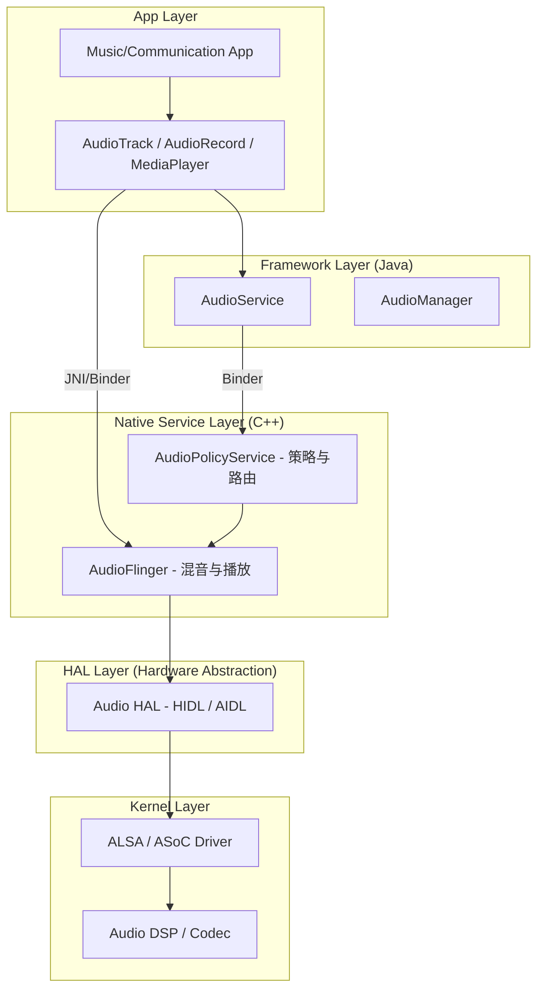

# Android 音频系统概览 (Android Audio Stack Overview)

Android 音频系统是 Android 框架中最复杂、最深奥的子系统之一。它负责从应用层到底层硬件的音频流管理、路由决策以及音频处理。

---

## 1. 整体架构 (High-Level Architecture)

Android 音频栈遵循典型的分层架构，从上到下可分为五个主要层级：

---

## 2. 各层级核心职责

### 2.1 应用层 (App Layer)
开发者使用 Java/Kotlin API（如 `AudioTrack` 用于原始 PCM 播放，`AudioRecord` 用于录音）或更高级的接口（如 `ExoPlayer`, `Oboe`）。

### 2.2 Framework 层 (Java)
*   **AudioService**：负责系统音量控制、音频焦点 (Audio Focus) 管理。
*   **AudioManager**：App 访问音频系统的主要入口。

### 2.3 Native 服务层 (C++)
这是 Android 音频的心脏，包含两个关键进程（通常运行在 `audioserver` 进程中）：
*   **AudioFlinger**：音频引擎。负责音频流的混音 (Mixing)、重采样 (Resampling)、音量调节以及将数据写入 HAL。
*   **AudioPolicyService**：策略引擎。负责决定“音频从哪里播放”（如：耳机拔出后自动切换到扬声器）。

### 2.4 HAL 层 (Hardware Abstraction Layer)
将通用的音频服务与具体的硬件驱动解耦。定义了 `IDevice` 和 `IStream` 等接口。

### 2.5 Kernel 层 (内核)
主要基于 **ALSA (Advanced Linux Sound Architecture)**。ASoC (ALSA System on Chip) 负责 SoC 内部 DSP 与外部 Codec 的驱动交互。

---

## 3. 进程隔离模型 (Process Isolation Model)

为了提高系统的安全性和稳定性，Android 将音频逻辑拆分到了四个核心进程中：

1.  **APP 进程**：运行 Java API (`AudioTrack`) 和 JNI，通过 Binder 与 `audioserver` 交互。
2.  **SystemServer 进程**：运行 `AudioService` (Java)，处理高层级策略、音量管理和音频焦点。
3.  **AudioServer 进程 (核心)**：运行 `AudioFlinger` 和 `AudioPolicyService` (C++)。这是混音、重采样和策略决策的发生地。
4.  **AudioHAL 进程**：硬件抽象层独立进程。将复杂的硬件驱动逻辑与框架解耦，崩溃时不会导致 `audioserver` 重启。

---

## 4. 车载场景下的特殊集成：CPMS 与 VHAL

在 Android Automotive (AAOS) 中，音频栈需要与车辆电源管理紧密同步。
*   **CarPowerManagementService (CPMS)**：监听车辆电源状态（如：上电、待机、关机）。
*   **同步逻辑**：在车辆冷启动时，音频系统必须在“Wait for VHAL”阶段就绪，确保倒车雷达等安全音能第一时间响起。

---

## 5. 关键参考 (References)

1.  [Android Open Source Project - Audio](https://source.android.com/devices/audio)
2.  [Embedded Android - Karim Yaghmour](https://www.oreilly.com/library/view/embedded-android/9781449327958/)

---
*Next Topic: [AudioTrack 深度解析](./02-AudioTrack-Deep-Dive.md)*
