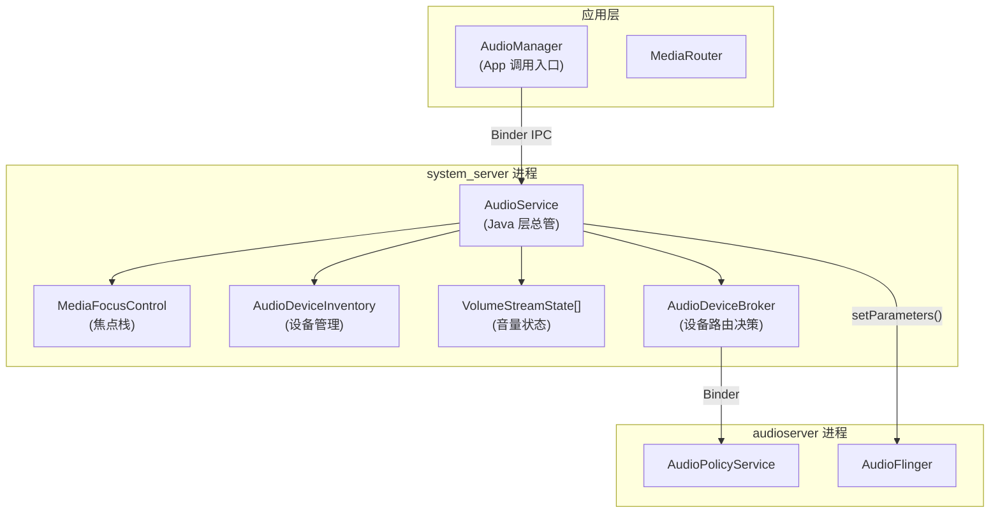
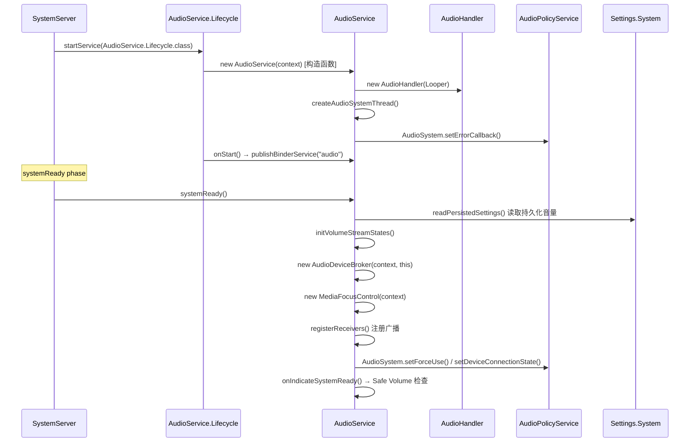
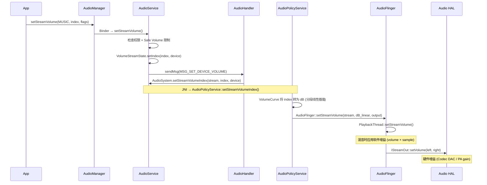
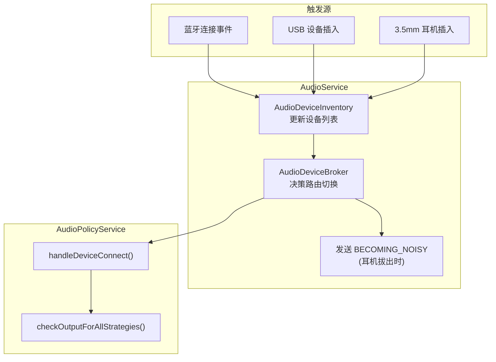
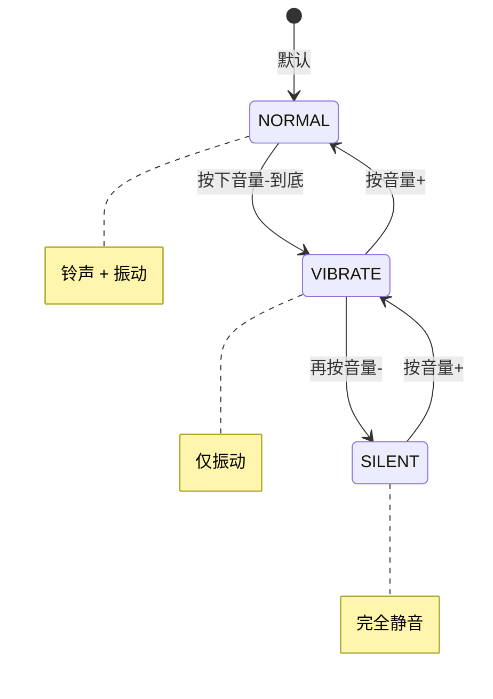
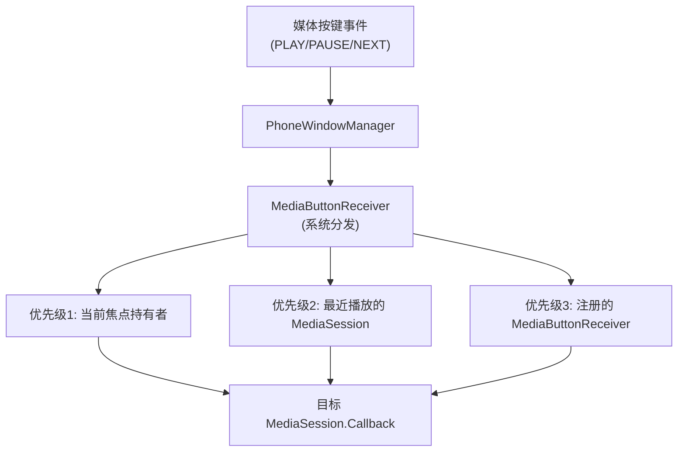

# AudioService 系统管理中心

`AudioService` 是 Android 音频框架在 Java 层的核心，运行在 `system_server` 进程中。它扮演着"总管"的角色，协调应用层请求与 Native 层服务，管理音量、设备路由、音频焦点、Ringer Mode 和媒体按键分发。

---

## 1. AudioService 在系统中的位置



---

## 2. 启动与初始化

### 2.1 启动时序

> 基于 Android 14 (AOSP `main` 分支) 源码分析。AudioService 由 SystemServer 在 `startOtherServices()` 阶段启动。



**关键源码对应** (路径: `frameworks/base/services/core/java/com/android/server/audio/`):

```java
// === SystemServer.java (startOtherServices) ===
// frameworks/base/services/java/com/android/server/SystemServer.java
mSystemServiceManager.startService(AudioService.Lifecycle.class);

// === AudioService.Lifecycle (内部类) ===
// frameworks/base/services/core/java/com/android/server/audio/AudioService.java
public static final class Lifecycle extends SystemService {
    private AudioService mService;
    
    public Lifecycle(Context context) {
        super(context);
        // 构造 AudioService 实例
        mService = new AudioService(context);
    }
    
    @Override
    public void onStart() {
        // 注册为系统服务, 使 AudioManager 可通过 Binder 调用
        publishBinderService(Context.AUDIO_SERVICE, mService);
    }
    
    @Override
    public void onBootPhase(int phase) {
        if (phase == SystemService.PHASE_ACTIVITY_MANAGER_READY) {
            mService.systemReady();
        }
    }
}
```

```java
// === AudioService 构造函数 (关键初始化) ===
public AudioService(Context context) {
    mContext = context;
    // 1. 创建音频处理线程和 Handler
    mAudioHandler = new AudioHandler(AudioSystemThread.get().getLooper());
    
    // 2. 建立与 native AudioPolicyService 的错误回调
    AudioSystem.setErrorCallback(mAudioSystemCallback);
    
    // 3. 初始化音量流状态数组 (每个 stream type 一个)
    mStreamStates = new VolumeStreamState[AudioSystem.getNumStreamTypes()];
    
    // 4. 创建音量控制器
    mSoundDoseHelper = new SoundDoseHelper(this, context);
}
```

```java
// === systemReady() — 系统就绪后的完整初始化 ===
public void systemReady() {
    // 1. 读取持久化设置 (数据库中保存的音量值)
    readPersistedSettings();  // → Settings.System / Settings.Secure
    
    // 2. 初始化设备路由管理
    mDeviceBroker = new AudioDeviceBroker(mContext, this);
    mDeviceBroker.onSystemReady();
    
    // 3. 初始化焦点管理
    mMediaFocusControl = new MediaFocusControl(mContext, mPlayerFocusEnforcer);
    
    // 4. 注册广播接收器 (监听耳机插拔/蓝牙连接等)
    registerReceivers();
    
    // 5. 安全音量初始化
    mSoundDoseHelper.onSystemReady();
    
    // 6. 通知 AudioPolicyService 系统已就绪
    AudioSystem.setParameters("restarting=false");
}
```

### 2.2 核心内部组件

| 组件 | 职责 | 源码路径 (相对 `frameworks/base/`) |
|:---|:---|:---|
| **AudioService** | 总调度入口 | `services/core/.../audio/AudioService.java` |
| **AudioService.Lifecycle** | SystemService 生命周期管理 | AudioService.java 内部类 |
| **AudioHandler** | 异步消息处理 (避免 Binder 线程阻塞) | AudioService.java 内部类 |
| **VolumeStreamState** | 每个 Stream × Device 的音量 Index 状态 | AudioService.java 内部类 |
| **MediaFocusControl** | 焦点栈管理与仲裁 | `services/core/.../audio/MediaFocusControl.java` |
| **AudioDeviceBroker** |设备路由决策 (连接/断开/切换) | `services/core/.../audio/AudioDeviceBroker.java` |
| **AudioDeviceInventory** | 已连接设备清单维护 | `services/core/.../audio/AudioDeviceInventory.java` |
| **SoundDoseHelper** | 听力安全/安全音量计时 | `services/core/.../audio/SoundDoseHelper.java` |
| **AudioSystemAdapter** | AudioSystem JNI 调用的封装代理 | `services/core/.../audio/AudioSystemAdapter.java` |
| **SpatializerHelper** | 空间音频 Spatializer 管理 (Android 13+) | `services/core/.../audio/SpatializerHelper.java` |

**组件协作时序** (以设备连接为例):

```java
// 当蓝牙 A2DP 连接时的调用链:
// BluetoothAdapter → AudioDeviceBroker.postBluetoothA2dpDeviceConnectionStateSuppressNoisyIntent()
//   → AudioDeviceInventory.onSetA2dpSinkConnectionState()
//     → AudioSystem.setDeviceConnectionState()  [JNI → AudioPolicyService]
//       → AudioPolicyManager::setDeviceConnectionState()
//         → checkOutputForAllStrategies() → 路由切换
//   → AudioService.postUpdateRingerModeServiceInt()
//   → (如果需要) sendBecomingNoisyIntent()
```

---

## 3. 音量管理

### 3.1 音量 Index → dB 映射

Android 使用整数 Index 表示音量（如 0-15），最终需要映射为 dB 值下发给 AudioFlinger。**映射并非简单线性**，而是通过 Volume Curve 分段线性插值。

```java
// VolumeStreamState 核心逻辑
// 每个 Stream + Device 组合都有独立的 Index
class VolumeStreamState {
    private int mIndexMin;  // 最小 Index (通常 1, 0 表示静音)
    private int mIndexMax;  // 最大 Index (如 MUSIC=15, VOICE_CALL=7)
    
    // 设备 → 当前 Index 的映射 (每个设备独立保存)
    private final SparseIntArray mIndexMap = new SparseIntArray();
    // Key: AudioSystem.DEVICE_OUT_xxx (Speaker/Headset/BT_A2DP...)
    // Value: 当前 Index 值
}
```

**各 Stream 的 Index 范围** (Android 14 默认):

| Stream | Min Index | Max Index | 用途 |
|:---|:---|:---|:---|
| VOICE_CALL | 1 | 7 | 通话 |
| SYSTEM | 0 | 7 | 系统音效 |
| RING | 0 | 7 | 铃声 |
| MUSIC | 0 | 15 | 媒体 |
| ALARM | 1 | 7 | 闹钟 |
| NOTIFICATION | 0 | 7 | 通知 |
| BLUETOOTH_SCO | 1 | 7 | 蓝牙通话 |
| ACCESSIBILITY | 1 | 15 | 无障碍 |

**Index → dB 转换过程** (非简单线性):
```
实际流程:
  1. AudioService 将 index 归一化为百分比: pct = (index - min) / (max - min) × 100
  2. AudioPolicyManager 查询 Volume Curve (分段线性)
  3. 在曲线控制点之间做线性插值得到 dB 值

Volume Curve 示例 (STREAM_MUSIC / Speaker):
  控制点: (0%, -58dB), (33%, -26dB), (66%, -10dB), (100%, 0dB)
  
  index=10, max=15 → pct = 66.7%
  落在 (66%, -10dB) 和 (100%, 0dB) 之间
  插值: dB = -10 + (66.7-66)/(100-66) × (0-(-10)) = -9.8 dB
  
  注意: 非线性曲线的设计意图是让音量旋钮感知更均匀 (符合人耳对数特性)
```

### 3.2 音量曲线 (Volume Curves)

在 `audio_policy_volumes.xml` 中定义非线性映射曲线：

```xml
<!-- default_volume_tables.xml -->
<volume_group name="STREAM_MUSIC">
    <volume deviceCategory="DEVICE_CATEGORY_SPEAKER">
        <point>0,   -5800</point>  <!-- Index 0% → -58dB -->
        <point>33,  -2600</point>  <!-- Index 33% → -26dB -->
        <point>66,  -1000</point>  <!-- Index 66% → -10dB -->
        <point>100,     0</point>  <!-- Index 100% → 0dB -->
    </volume>
    <volume deviceCategory="DEVICE_CATEGORY_HEADSET">
        <point>0,   -4400</point>
        <point>33,  -2200</point>
        <point>66,   -700</point>
        <point>100,     0</point>
    </volume>
</volume_group>
```

### 3.3 音量设置完整调用链



**源码对应：**

```java
// === AudioService.setStreamVolume() ===
// frameworks/base/services/core/java/com/android/server/audio/AudioService.java
public void setStreamVolume(int streamType, int index, int flags, String callingPackage) {
    ensureValidStreamType(streamType);
    // Safe Volume: 耳机场景限制最大音量
    if (mSoundDoseHelper != null && isFixedVolumeDevice(device)) {
        index = Math.min(index, safeMediaVolumeIndex);
    }
    // 更新内存中的 Index
    mStreamStates[streamType].setIndex(index, device, callingPackage);
    // 异步处理, 避免阻塞 Binder 调用线程
    sendMsg(mAudioHandler, MSG_SET_DEVICE_VOLUME, ...);
}

// === AudioHandler 处理 MSG_SET_DEVICE_VOLUME ===
case MSG_SET_DEVICE_VOLUME:
    setDeviceVolume((VolumeStreamState) msg.obj, msg.arg1);
    break;

private void setDeviceVolume(VolumeStreamState streamState, int device) {
    // 通过 JNI 调用到 native AudioPolicyService
    AudioSystem.setStreamVolumeIndex(streamState.mStreamType,
            streamState.getIndex(device), device);
    // 持久化到数据库
    sendMsg(MSG_PERSIST_VOLUME, ...);
}
```

```cpp
// === AudioPolicyManager::setStreamVolumeIndex() ===
// frameworks/av/services/audiopolicy/managerdefault/AudioPolicyManager.cpp
status_t AudioPolicyManager::setStreamVolumeIndex(audio_stream_type_t stream,
                                                   int index,
                                                   audio_devices_t device) {
    // 1. Volume Curve: index → dB (分段线性插值)
    float volumeDb = mVolumeCurves->volIndexToDb(stream, deviceCategory, index);
    
    // 2. 对匹配的所有 output 设置音量
    for (const auto& [_, outputDesc] : mOutputs) {
        if (outputDesc->isStreamActive(stream)) {
            // → AudioFlinger::setStreamVolume()
            checkAndSetVolume(stream, volumeDb, outputDesc, device);
        }
    }
    return NO_ERROR;
}

// === AudioFlinger::PlaybackThread::setStreamVolume() ===
// frameworks/av/services/audioflinger/Threads.cpp
void AudioFlinger::PlaybackThread::setStreamVolume(audio_stream_type_t stream, float value) {
    mStreamTypes[stream].volume = value;
    // 在 threadLoop_mix() 中, 每个 Track 的采样值乘以此 volume
    // 若 HAL 支持硬件音量, 则调用 mOutput->stream->setVolume(left, right)
}
```

### 3.4 音频焦点 (Audio Focus) 概览

> 音频焦点的完整机制详见 [AudioFocus 详解](./09-AudioFocus.md)，此处仅说明与 AudioService 的关联。

音频焦点由 `MediaFocusControl` 管理，解决多应用同时播放音频时的竞争问题。AudioService 作为焦点请求的 Binder 入口：

```java
// 调用链: App → AudioManager.requestAudioFocus()
//   → AudioService.requestAudioFocus()  [Binder]
//     → MediaFocusControl.requestAudioFocus(AudioFocusInfo)
//       → 焦点栈仲裁 → 通知被抢占者 AUDIOFOCUS_LOSS / LOSS_TRANSIENT
//       → 返回 AUDIOFOCUS_REQUEST_GRANTED / DELAYED / FAILED
```

**焦点类型速查：**

| 焦点类型 | 行为 | 典型场景 |
|:---|:---|:---|
| `GAIN` | 长期独占，他人收到 LOSS | 音乐播放 |
| `GAIN_TRANSIENT` | 短期独占 | 通话、语音助手 |
| `GAIN_TRANSIENT_MAY_DUCK` | 允许他人降低音量继续播放 | 导航提示 |
| `GAIN_TRANSIENT_EXCLUSIVE` | 独占 (系统音也静) | 语音录制 |

**关键行为 (Android 8.0+)：** 系统自动 Ducking — 框架通过 `PlaybackActivityMonitor` 跟踪活跃 AudioTrack，被 duck 的播放器自动降低 14dB，App 无需自行处理。

### 3.5 Stream Type 与 AudioAttributes

Android 5.0 起推荐使用 `AudioAttributes` 替代传统 Stream Type，提供更细粒度的音频分类：

```java
// 传统方式 (已废弃但仍兼容):
audioManager.setStreamVolume(AudioManager.STREAM_MUSIC, index, 0);

// 推荐方式 (AudioAttributes):
AudioAttributes attrs = new AudioAttributes.Builder()
    .setUsage(AudioAttributes.USAGE_MEDIA)            // 为什么播放
    .setContentType(AudioAttributes.CONTENT_TYPE_MUSIC)  // 播放什么
    .build();
```

**Stream Type → AudioAttributes 映射关系：**

| Stream Type | Usage | ContentType | 备注 |
|:---|:---|:---|:---|
| STREAM_MUSIC | USAGE_MEDIA | CONTENT_TYPE_MUSIC | 媒体播放 |
| STREAM_VOICE_CALL | USAGE_VOICE_COMMUNICATION | CONTENT_TYPE_SPEECH | VoIP/电话 |
| STREAM_RING | USAGE_NOTIFICATION_RINGTONE | — | 来电铃声 |
| STREAM_ALARM | USAGE_ALARM | — | 闹钟 |
| STREAM_NOTIFICATION | USAGE_NOTIFICATION | — | 通知音 |
| STREAM_SYSTEM | USAGE_ASSISTANCE_SONIFICATION | — | 按键音等 |
| STREAM_DTMF | USAGE_VOICE_COMMUNICATION_SIGNALLING | — | 拨号音 |

**AudioAttributes 在 AudioPolicyManager 中的路由决策：**
```cpp
// frameworks/av/services/audiopolicy/managerdefault/AudioPolicyManager.cpp
// getOutputForAttr() 根据 AudioAttributes 选择 output
//   usage → ProductStrategy → 设备选择
//   这比传统 stream type 更灵活, 支持自定义 strategy 扩展
```

---

## 4. 设备路由决策

### 4.1 设备连接/断开流程



### 4.2 设备优先级 (路由策略)

设备选择由 `AudioPolicyManager` 根据 **ProductStrategy** (Android 14) 决定，不同使用场景优先级不同：

```
媒体播放策略 (STRATEGY_MEDIA):
  优先级 (从高到低):
    1. 蓝牙 A2DP / LE Audio (已连接且非通话)
    2. USB Audio 设备
    3. 有线耳机 (3.5mm 4-pole / 3-pole)
    4. 扬声器 (默认)
    
通话策略 (STRATEGY_PHONE):
  优先级:
    1. 蓝牙 HFP/SCO (通话模式)
    2. USB Audio (通话)
    3. 有线耳麦 (带 MIC)
    4. 听筒 (Earpiece)
    * 免提时切换到扬声器
    
铃声/通知策略 (STRATEGY_SONIFICATION):
  优先级:
    1. 扬声器 (始终) + 当前已连接输出 (并发)
    注意: 铃声同时从扬声器和耳机输出 (确保不漏接电话)

输入设备策略:
  语音通话:
    1. 蓝牙 SCO MIC
    2. 有线耳麦 MIC
    3. 底部 MIC (手持) / 顶部 MIC (免提)
  语音识别:
    1. 有线耳麦 MIC
    2. 前置 MIC (面向用户)
    3. 内建 MIC 阵列
```

**源码对应：**
```cpp
// frameworks/av/services/audiopolicy/enginedefault/src/Engine.cpp
// Engine::getDevicesForProductStrategy() 根据 strategy + 可用设备列表决定输出设备
// 每个 strategy 有独立的设备优先级判断逻辑
```

### 4.3 BECOMING_NOISY 机制

当输出设备从"私密"切换到"公开"时（如耳机拔出→扬声器），AudioService 广播 `ACTION_AUDIO_BECOMING_NOISY`：

```java
// AudioService.java
private void sendBecomingNoisyIntent() {
    // 通知所有注册了此 Intent 的 App (如音乐播放器)
    // App 收到后应该暂停播放，避免突然外放
    sendBroadcastToAll(new Intent(AudioManager.ACTION_AUDIO_BECOMING_NOISY));
}
```

---

## 5. Ringer Mode 状态机



> **注意：** `RINGER_MODE_SILENT` 与 DND (Do Not Disturb) 是不同机制。SILENT 由 AudioService 管理（仅影响铃声/通知音量），DND 由 `NotificationManagerService` 的 `ZenModeHelper` 管理（可阻止通知展示）。Android 7.0+ 两者会联动：开启 DND 时自动设置对应 Ringer Mode。

**Ringer Mode 对 Stream 的影响**：

| Stream | NORMAL | VIBRATE | SILENT |
|:---|:---|:---|:---|
| RING | 正常播放 | 静音+振动 | 静音 |
| NOTIFICATION | 正常播放 | 静音+振动 | 静音 |
| ALARM | 正常播放 | 正常播放 | 正常播放 |
| MUSIC | 正常播放 | 正常播放 | 正常播放 |
| VOICE_CALL | 正常播放 | 正常播放 | 正常播放 |

**源码对应：**
```java
// AudioService.setRingerModeInternal() → setRingerModeInt()
//   根据 ringerMode 设置 STREAM_RING / STREAM_NOTIFICATION 的 mute 状态
//   VIBRATE 模式: muteStream + triggerVibration
//   SILENT 模式: muteStream only
```

---

## 6. 媒体按键分发

### 6.1 分发优先级



### 6.2 AudioService 中的处理

```java
// AudioService.java
public void dispatchMediaKeyEvent(KeyEvent keyEvent) {
    // 优先发给有音频焦点的 Session
    MediaFocusControl mfc = getMediaFocusControl();
    if (!mfc.dispatchMediaKeyEvent(keyEvent)) {
        // 焦点持有者没处理 → 发给最后活跃的 Session
        mMediaSessionService.dispatchMediaKeyEvent(keyEvent, false);
    }
}
```

---

## 7. Safe Volume (听力保护)

### 7.1 触发条件

```
Safe Volume 逻辑 (EU/中国法规):
  条件: 输出设备 == 耳机 (有线/蓝牙)
        AND 当前 Index > Safe Index (通常 Index 10/15)
        AND 累计使用时间 > 20小时 (连续高音量)
  
  动作:
    1. 弹出警告对话框
    2. 自动下调音量到 Safe Index
    3. 用户可手动恢复 (但会重新计时)
```

### 7.2 常见问题排查

| 现象 | 原因 | 排查 |
|:---|:---|:---|
| 耳机音量自动变小 | Safe Volume 触发 | `dumpsys audio` 查看 safe volume state |
| 插耳机音量与拔耳机不一致 | 每个设备独立 Index | 检查 `VolumeStreamState` per-device index |
| 调音量影响其他流 | Volume alias | 检查 `STREAM_VOLUME_ALIAS[]` 映射 |
| BT 连接后无声 | A2DP 音量未同步 | 检查 `setAbsoluteVolume()` |

---

## 8. 调试命令

```bash
# 完整 AudioService dump
dumpsys audio

# 查看当前音量状态
dumpsys audio | grep -A 20 "Stream volumes"

# 查看设备连接状态
dumpsys audio | grep -A 10 "Devices"

# 查看 Ringer Mode
dumpsys audio | grep "Ringer mode"

# 查看焦点栈
dumpsys audio | grep -A 20 "Media Focus Control"

# 查看 Safe Volume 状态
dumpsys audio | grep -i "safe"

# 实时观察音量变化 (logcat)
adb logcat -s AudioService:V VolumeStreamState:V

# 观察设备路由切换
adb logcat -s AudioDeviceBroker:V AudioDeviceInventory:V
```

---

## 9. Handler 消息机制

AudioService 使用 `AudioHandler` (运行在独立 `AudioSystemThread` 上) 处理异步消息，避免 Binder 线程阻塞。

**为什么需要 Handler？**
```
问题: AudioService 的 API 通过 Binder 调用 (如 setStreamVolume)
      Binder 线程池有限 (默认 16 线程)
      如果在 Binder 线程中直接调用 native (可能耗时 几十ms)
      → 线程池耗尽 → 系统卡死

解决: 将耗时操作 post 到 AudioHandler 串行执行
      Binder 线程只做参数校验 + sendMsg → 立即返回
```

**关键消息分类：**

```java
// === 音量相关 ===
private static final int MSG_SET_DEVICE_VOLUME = 0;     // 设置设备音量 → JNI
private static final int MSG_PERSIST_VOLUME = 1;         // 持久化音量到 Settings.System
private static final int MSG_SET_ALL_VOLUMES = 12;       // 批量设置所有流的音量
private static final int MSG_NOTIFY_VOL_EVENT = 28;      // 通知音量变化事件给监听者

// === 设备路由相关 ===
private static final int MSG_SET_FORCE_USE = 16;         // 强制使用某设备 (如强制Speaker)
private static final int MSG_BT_HEADSET_CNCT_FAILED = 17;  // 蓝牙耳机连接失败处理
private static final int MSG_SET_A2DP_SINK_CONNECTION_STATE = 102; // A2DP 连接状态变化
private static final int MSG_SET_HEARING_AID_CONNECTION_STATE = 104; // 助听器连接
private static final int MSG_BLE_BROADCAST_AUDIO_CONNECTION_STATE = 106; // LE Audio

// === 系统状态 ===
private static final int MSG_BROADCAST_AUDIO_BECOMING_NOISY = 15; // 耳机拔出广播
private static final int MSG_DISPATCH_AUDIO_SERVER_STATE = 23;    // audioserver 崩溃/恢复
private static final int MSG_INDICATE_SYSTEM_READY = 26;          // 系统就绪通知

// === 播放/录音监控 ===
private static final int MSG_PLAYBACK_CONFIG_CHANGE = 29;   // 播放配置变化
private static final int MSG_RECORDING_CONFIG_CHANGE = 37;  // 录音配置变化

// === 蓝牙音量同步 ===
private static final int MSG_SET_ABSOLUTE_VOLUME_INDEX = 105; // A2DP 绝对音量同步
```

**消息处理模式：**
```java
// sendMsg 的延迟机制 — 避免频繁写数据库
sendMsg(mAudioHandler, MSG_PERSIST_VOLUME, SENDMSG_QUEUE,
        device, 0, streamState, PERSIST_DELAY);  // PERSIST_DELAY = 500ms

// SENDMSG_REPLACE: 同类消息只保留最新 (防止积压)
// SENDMSG_QUEUE: 排队顺序执行
// SENDMSG_NOOP: 如果已存在同类消息则不发送
```

---

## 10. 关键参考 (References)

1.  [AOSP Source: AudioService.java](https://android.googlesource.com/platform/frameworks/base/+/master/services/core/java/com/android/server/audio/AudioService.java)
2.  [AOSP Source: AudioDeviceBroker.java](https://android.googlesource.com/platform/frameworks/base/+/master/services/core/java/com/android/server/audio/AudioDeviceBroker.java)
3.  [Android Volume Control](https://source.android.com/docs/core/audio/volume)
4.  [Android Audio Focus](https://developer.android.com/guide/topics/media-apps/audio-focus)

---
*Next Topic: [AudioTrack 播放流程解析](./03-AudioTrack.md)*
