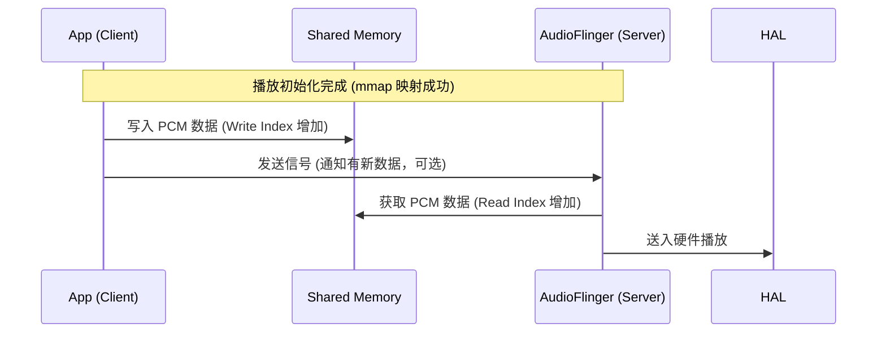

# AudioTrack 深度解析 (AudioTrack Deep Dive)

`AudioTrack` 是 Android 播放链路的起点。对于开发者，它是播放 PCM 的工具；对于架构师，它是理解 **Linux 共享内存、Binder 异步通信、实时调度** 的最佳案例。

---

## 1. Java 层核心 API 使用与避坑

在 Java 层，实例化一个 `AudioTrack` 需要精确配置参数。

```java
// 核心配置示例
AudioAttributes attributes = new AudioAttributes.Builder()
        .setUsage(AudioAttributes.USAGE_MEDIA) // 用途：多媒体
        .setContentType(AudioAttributes.CONTENT_TYPE_MUSIC) // 内容：音乐
        .build();

AudioFormat format = new AudioFormat.Builder()
        .setEncoding(AudioFormat.ENCODING_PCM_16BIT) // 量化精度
        .setSampleRate(44100) // 采样率
        .setChannelMask(AudioFormat.CHANNEL_OUT_STEREO) // 双声道
        .build();

// 获取系统建议的最小缓冲区（非常重要，决定了是否会卡顿）
int bufferSizeInBytes = AudioTrack.getMinBufferSize(44100, 
                    AudioFormat.CHANNEL_OUT_STEREO, 
                    AudioFormat.ENCODING_PCM_16BIT);

AudioTrack track = new AudioTrack(attributes, format, bufferSizeInBytes, 
                    AudioTrack.MODE_STREAM, AudioManager.AUDIO_SESSION_ID_GENERATE);
```

### 🧠 🧠 深度思考：为什么要有 getMinBufferSize？
`getMinBufferSize` 返回的不是一个随便的数字，它是由底层 HAL 层上报的硬件周期（Period Size）决定的。如果你的缓冲区小于这个值，AudioFlinger 还没来得及混合数据，硬件已经读完了，就会产生 **Underflow（断音/爆音）**。

---

## 2. JNI 层的“桥梁”作用

Java 层的 `AudioTrack.java` 只是个壳，核心逻辑在 Native 层的 `android_media_AudioTrack.cpp` 中。

```cpp
// 简化版的 JNI 逻辑展示 (frameworks/base/core/jni/android_media_AudioTrack.cpp)
static jint android_media_AudioTrack_setup(JNIEnv *env, jobject thiz, ...) {
    // 1. 在 Native 层创建一个真正的 AudioTrack 对象 (C++)
    // libaudioclient 提供的核心类
    sp<AudioTrack> lpTrack = new AudioTrack();
    
    // 2. 将 Native 对象的指针存入 Java 对象的私有成员变量变量 mNativeTrackInJavaObj 中
    // 这样后续的 write/play 才能找到对应的 C++ 对象
    env->SetLongField(thiz, javaAudioTrackFields.nativeTrackInJavaObj, (jlong)lpTrack.get());
}
```

---

## 3. Native 层：与 AudioFlinger 的握手

这是专家最关心的部分。在 `AudioTrack::createTrack_l` (AudioTrack.cpp) 中，会发起 Binder 调用请求 `AudioFlinger` 创建对应的后端。

```cpp
// AudioTrack.cpp 核心逻辑
status_t AudioTrack::createTrack_l() {
    // 通过 IAudioFlinger Binder 接口向 audioserver 发送请求
    sp<IAudioTrack> track = audioFlinger->createTrack(input, output, &status);
    
    // 🚀 核心关键：获取共享内存！
    // cblk (Control Block) 包含 write/read 指针等同步信息
    mAudioTrackShared = track->getCblk(); 
    // buffers 则是存放真正的音频 PCM 数据
    mDataMemory = track->getBuffers();    
}
```

### 🚀 匿名共享内存机制 (Anonymous Shared Memory)
为了解决大数据量跨进程传输，Android 不直接通过 Binder 传音频数据，而是：
1.  **AudioFlinger** 创建一块匿名共享内存（ashmem）。
2.  通过 Binder 将该内存的 **文件描述符 (File Descriptor, fd)** 返回给 **App 进程**。
3.  两边进程分别执行 `mmap()`，将该 fd 映射到各自的地址空间。
4.  **零拷贝 (Zero-copy)**：App 写入数据，AudioFlinger 立即就能读取。

---

## 4. 生产者-消费者模型 (Proxy 模式)

AudioTrack 内部维护了一个环形缓冲区。为了保证线程安全，引入了 `AudioTrackClientProxy` 和 `AudioTrackServerProxy`。

*   **App (Producer)**：调用 `write()` -> `AudioTrackClientProxy::obtainBuffer()` -> 填充 PCM -> `releaseBuffer()` (更新写指针)。
*   **AudioFlinger (Consumer)**：`AudioTrackServerProxy::obtainBuffer()` (读取数据) -> 送入混音器 -> `releaseBuffer()` (更新读指针)。



---

## 5. 常见实战问题与专家级建议

1.  **阻塞式 write()**：在 `MODE_STREAM` 下，如果共享内存写满了，`write()` 会阻塞当前线程。千万不要在 UI 线程调用！
2.  **AudioTrack 状态机**：调用 `stop()` 后立即调用 `write()` 可能会失败。必须等待状态迁移完成。
3.  **音画同步 (Sync)**：在播放视频时，必须使用 `AudioTrack::getTimestamp`。这个时间戳来自硬件反馈，代表了声音真正从扬声器发出的时间，比系统 `uptimeMillis()` 准确得多。

---
*下一章：[AudioRecord 录音全链路源码级剖析](./03-AudioRecord.md)*
