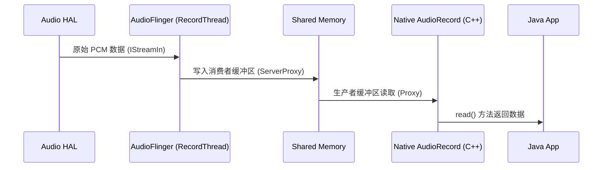

# AudioRecord 录音流程解析 (AudioRecord Deep Dive)

`AudioRecord` 是 Android 应用层采集原始 PCM 音频数据的核心 API。它的实现逻辑与 `AudioTrack` 对称，但数据流向相反：从硬件到 AudioFlinger 再到应用。

---

## 1. 核心概念：音频源 (AudioSource)

在创建 AudioRecord 时，必须指定 `AudioSource`。这决定了音频数据的来源以及系统会对其进行何种预处理。

*   **MIC**：普通麦克风音频，不带特殊处理。
*   **VOICE_COMMUNICATION**：语音通话模式。系统会自动开启 **3A 算法**（AEC, ANS, AGC）。
*   **VOICE_RECOGNITION**：语音识别模式。旨在减少处理延迟，并关闭非线性的增强功能。
*   **CAMCORDER**：摄像机模式。通常使用具有指向性的麦克风。

---

## 2. 录音数据流向 (Data Flow)

与播放类似，录音也使用共享内存机制来保证数据传输效率。

---

## 3. 核心 API 工作逻辑

### 3.1 实例化与准备
1.  调用 `new AudioRecord()`。
2.  Native 层创建 `RecordTrack` 并与 AudioFlinger 建立 Binder 链接。
3.  分配录音专用的共享内存。

### 3.2 录音循环
应用通常启动一个独立的线程来执行以下操作：
1.  `startRecording()`：通知 AudioFlinger 开始采集。
2.  **死循环执行 `read()`**：这是一个阻塞调用。当共享内存中有足够数据时，它会将数据拷贝到应用提供的 byte 数组或 ByteBuffer 中。
3.  数据处理：将 PCM 发送到网络或存储到文件（如 .wav）。

---

## 4. 关键配置与优化

*   **MinBufferSize**：必须使用 `getMinBufferSize()`。设置过小会导致实例化失败；设置过大虽然更稳定，但会增加数据返回给应用的延迟。
*   **权限要求**：必须在 AndroidManifest 中声明 `RECORD_AUDIO`，且 Android 6.0+ 需要运行时动态申请。
*   **10米外录音 (Privacy)**：当应用退到后台时，AudioRecord 通常会被系统静音（Silent），这是 Android 隐私保护机制的一部分。

---

## 5. 关键参考 (References)

1.  [Android Developer: AudioRecord](https://developer.android.com/reference/android/media/AudioRecord)
2.  [AOSP Source: AudioRecord.cpp](https://android.googlesource.com/platform/frameworks/av/+/master/media/libaudioclient/AudioRecord.cpp)

---
*Next Topic: [AudioFlinger 混音引擎详解](./04-AudioFlinger/README.md)*
