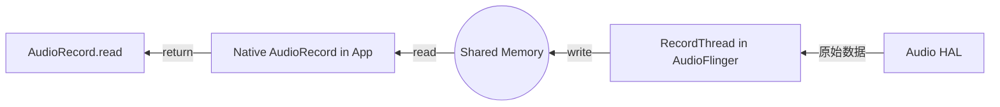

# AudioRecord 录音流程解析 (AudioRecord Deep Dive)

`AudioRecord` 是应用层获取原始音频数据的源头。对于初学者，它是“录音器”；对于专业人员，它是理解 **音频前端处理 (Preprocessing)、实时流传输、以及内核驱动采集** 的窗口。

---

## 1. 核心实战：实例化与 AudioSource 选择

在 Android 中，录音的“意图”由 `AudioSource` 决定。这直接影响到底层 DSP 会加载什么样的算法模块。

```java
// 专业录音配置示例
int sampleRate = 16000; // 语音识别常用采样率
int channelConfig = AudioFormat.CHANNEL_IN_MONO; // 单声道
int audioFormat = AudioFormat.ENCODING_PCM_16BIT;

int bufferSize = AudioRecord.getMinBufferSize(sampleRate, channelConfig, audioFormat);

// 🚀 专家建议：如果是通话或交互，务必选择 VOICE_COMMUNICATION
AudioRecord recorder = new AudioRecord(
        MediaRecorder.AudioSource.VOICE_COMMUNICATION, // 关键：开启底层 3A (AEC, ANS, AGC)
        sampleRate,
        channelConfig,
        audioFormat,
        bufferSize
);
```

### 🧠 🧠 深度思考：VOICE_COMMUNICATION 的魔力
当你选择这个 Source 时，`AudioPolicyService` 会识别出这是一个通话场景。它会自动向 `AudioFlinger` 发出指令，加载 **AEC (回声消除)** 和 **NS (降噪)** 的效果插件。如果硬件 DSP 支持这些算法，处理会发生在硬件层，极大地降低 CPU 负载。

---

## 2. JNI 与 Native 层的绑定

类似于 AudioTrack，`AudioRecord.cpp` 在 Native 层负责与 `audioserver` 进程交互。

```cpp
// AudioRecord.cpp 核心逻辑展示
status_t AudioRecord::set(...) {
    // 1. 获取 AudioFlinger 代理
    const sp<IAudioFlinger>& audioFlinger = AudioSystem::get_audio_flinger();
    
    // 2. 发起 Binder 调用请求创建 RecordTrack
    sp<IAudioRecord> record = audioFlinger->openRecord(...);
    
    // 3. 获取录音专用的共享内存
    mAudioRecordShared = record->getCblk();
}
```

---

## 3. 录音数据流：反向 Proxy 模型

录音的数据流向与播放正好相反，但机制相同。

*   **AudioFlinger (Producer)**：从 HAL 层读取 PCM 数据 -> 写入共享内存的 `ServerProxy` -> 更新写指针。
*   **App (Consumer)**：调用 `read()` -> 从共享内存的 `Proxy` 读取数据 -> 更新读指针 -> 返回给 Java 层。



---

## 4. 源码级解析：read() 为什么是阻塞的？

当你调用 `recorder.read(buffer, 0, size)` 时，JNI 层会调用 Native 层的 `read()` 方法。

```cpp
// AudioRecord.cpp 简化逻辑
ssize_t AudioRecord::read(void* buffer, size_t userSize, ...) {
    // 1. 尝试从共享内存获取可用数据块
    AudioRecordClientProxy::obtainBuffer(&audioBuffer, ...);
    
    // 2. 如果共享内存没数据，且没设置非阻塞标志，则进入等待 (Wait)
    // 这是通过 pthread_cond_wait 或类似的同步机制实现的
    if (no_data) {
        mCblk->cv.wait(mLock); 
    }
    
    // 3. 拷贝数据到应用缓冲区
    memcpy(buffer, audioBuffer.mRaw, actualSize);
}
```

---

## 5. 专家级调优与常见坑点

1.  **数据丢失 (Overrun)**：如果应用层处理 `read()` 返回的数据太慢，共享内存会被写满，AudioFlinger 产生的数据没地方放就会被丢弃。
    *   *方案*：在独立的高优先级线程中执行 `read()`，只负责把数据存入队列，不进行耗时逻辑处理。
2.  **静音检测**：Android 10+ 引入了权限管理加强。如果应用进入后台，`read()` 依然能返回数据，但返回的全部是 **0 (静音数据)**。
3.  **多客户端冲突**：某些低端硬件不支持多个 App 同时录音。当第二个 App 尝试 `startRecording()` 时，可能会抛出异常或导致第一个 App 被强行停止。

---
*下一章：音频心脏 [AudioFlinger 混音引擎源码深度解析](./04-AudioFlinger/README.md)*
