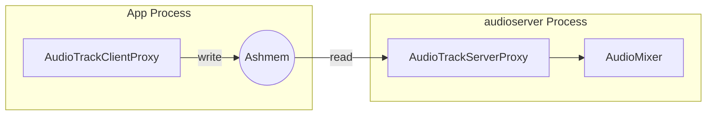

# AudioFlinger 混音引擎深度解析

`AudioFlinger` 是 Android 音频系统的“心脏”。它是一个典型的 **多线程、多任务、软硬结合** 的音频处理引擎。

---

## 1. 核心线程模型源码剖析

AudioFlinger 的核心工作是在一系列 `threadLoop` 中完成的。每一种音频输出设备或特殊路径都对应一个线程。

### 1.1 PlaybackThread 类型详解
*   **MixerThread (通用混音)**：用于常规音频播放，支持多流混音、重采样和音效。
*   **DirectOutputThread (直接输出)**：用于压缩格式（如 AC3, DTS）或高采样率无损音频，绕过 Android 混音器直接送入驱动。
*   **OffloadThread (硬件卸载)**：专门为长音频设计，将原始压缩数据直接推给 DSP 解码，极大节省主 CPU 功耗。
*   **FastMixer**：运行在实时优先级，周期通常为 5ms，解决 Android 早期严重的触屏交互音频延迟。

### 1.2 threadLoop 核心逻辑 (Threads.cpp)
```cpp
// 简化后的 threadLoop 核心逻辑
bool AudioFlinger::PlaybackThread::threadLoop() {
    while (!exitPending()) {
        // 1. 等待信号 (由 App 填充共享内存或硬件中断触发)
        mWaitWorkCV.wait(mLock);

        // 2. 准备阶段 (Check Active Tracks)
        // 🚀 专家点：这里会锁定 mActiveTracks 集合，计算哪些流需要混音
        prepareTracks_l();

        // 3. 执行真正的混音 (AudioMixer)
        if (mAudioMixer != nullptr) {
            // 这里会进行叠加、重采样 (SRC)、音量比例计算
            mAudioMixer->process();
        }

        // 4. 将混音后的数据通过 HAL 写入硬件
        // 这是一个阻塞调用，控制了 threadLoop 的实际频率
        mOutput->write(mSinkBuffer, mNormalFrameCount);
    }
}
```

---

## 2. 混音器深度解析：AudioMixer

`AudioMixer` 内部使用了一个复杂的状态机来管理每一个 Track。

### 2.1 混音的核心步骤
1.  **重采样 (Resampling)**：如果 App 是 44.1k，硬件是 48k，使用线性插值或多相滤波器进行转换。
2.  **音量映射 (Volume Ramping)**：应用淡入淡出（Fading）防止音量突跳产生爆音。
3.  **声道变换**：单声道转双声道，或 5.1 转双声道。

### 🧠 🧠 深度思考：饱和截断处理 (Saturation)
在叠加多个 PCM 信号时，如果数值超过了 16-bit 的范围（-32768 to 32767），会出现“炸音”。AudioMixer 内部使用了 **饱和算法 (Saturation)**：
$Sample_{out} = \text{clamp}(Sample_1 + Sample_2, \min, \max)$
而不是简单的自然溢出，确保在大响度下声音不“糊”。

---

## 3. 内存共享机制：Track 与 Proxy

AudioFlinger 如何获取 App 的数据？通过 `Track` 对象和共享内存。

*   **Track**：在 AudioFlinger 侧对应一个音频流实例。
*   **Proxy**：一组辅助类（`AudioTrackClientProxy` 和 `AudioTrackServerProxy`）。
    *   **AudioTrackClientProxy**：运行在 App 进程，负责申请 buffer 并通知 Server 端有新数据。
    *   **AudioTrackServerProxy**：运行在 AudioFlinger 侧，负责从共享内存中“拾取”数据，并维护 `hw_ptr`。它通过原子操作管理读写指针（sw_ptr, hw_ptr），保证 App 写入与 AudioFlinger 读取的同步。



---

## 4. 常见问题排查与 Dump 分析

当你怀疑音频卡顿时，执行：
`adb shell dumpsys media.audio_flinger`

### 4.1 关键字段解读
*   **Active tracks**：当前正在发声的应用列表。
*   **Underruns**：如果该数值持续增长，说明线程调度太慢或数据供应不足。
*   **Frames written**：发送给硬件的总帧数，用于判断链路是否卡死。

---
*下一章：策略大脑 [AudioPolicy 路由管理与策略源码解析](../05-AudioPolicy/README.md)*
