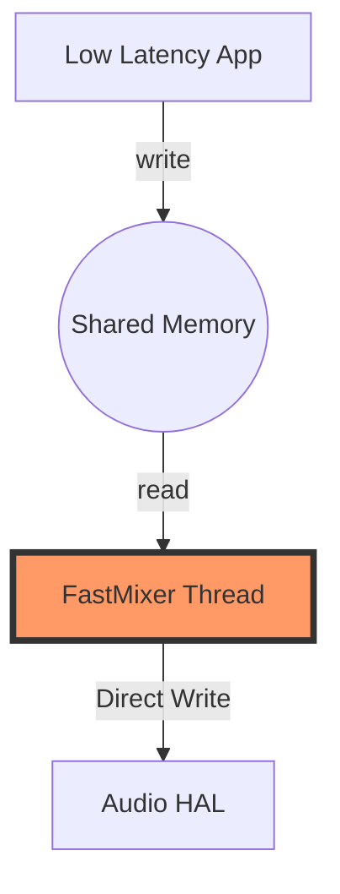

# AudioFlinger 混音引擎详解 (AudioFlinger Deep Dive)

`AudioFlinger` 是 Android 音频系统的“心脏”。它是一个典型的 **多线程、多任务、软硬结合** 的音频处理引擎。

---

## 1. 核心线程模型源码剖析

AudioFlinger 的核心工作是在一系列 `threadLoop` 中完成的。每一种音频输出设备或特殊路径都对应一个线程。

### 1.1 PlaybackThread::threadLoop 伪代码
所有播放线程的基类。它的工作逻辑是一个死循环：

```cpp
// 简化后的 threadLoop 核心逻辑 (Threads.cpp)
bool AudioFlinger::PlaybackThread::threadLoop() {
    while (!exitPending()) {
        // 1. 等待混音信号 (例如：硬件缓冲区需要更多数据)
        mWaitWorkCV.wait(mLock);

        // 2. 处理配置变更 (如采样率切换、音效添加)
        processConfigEvents_l();

        // 3. 准备混音 (从 ActiveTracks 中获取数据)
        // 🚀 专家点：这里会检查哪些 App 的 Track 已经写好了数据
        prepareTracks_l();

        // 4. 执行真正的混音 (AudioMixer)
        // 如果有多个 App 在放歌，这里会将 PCM 数值进行叠加
        mAudioMixer->process();

        // 5. 将混音后的数据通过 HAL 写入硬件
        mOutput->write(mSinkBuffer, mNormalFrameCount);
    }
}
```

---

## 2. 混音器深度解析：AudioMixer

`AudioMixer` 并不是简单的 $A + B$。它包含：
*   **重采样 (Resampling)**：如果 App A 是 44.1k，App B 是 48k，它会先将 A 重采样为 48k。
*   **音量控制 (Volume Scaling)**：应用淡入淡出、音量线性/对数转换。
*   **格式转换**：如 24-bit 转 16-bit PCM。

### 🧠 🧠 深度思考：饱和截断处理
在叠加多个 PCM 信号时，如果数值超过了 16-bit 的范围（-32768 to 32767），会出现“炸音”。AudioMixer 内部使用了 **饱和算法 (Saturation)**：
$Sample_{out} = \text{clamp}(Sample_1 + Sample_2, \min, \max)$
而不是简单的自然溢出。

---

## 3. 低延迟的救星：FastMixer

为了解决 Android 早期严重的音频延迟问题，Google 引入了 FastMixer。

*   **普通 MixerThread**：工作周期通常是 20ms - 40ms，受 CPU 负载波动影响大。
*   **FastMixer**：
    *   运行在 **SCHED_FIFO** (实时优先级)。
    *   周期极短（通常为 5ms）。
    *   **绕过通用 AudioMixer**：它使用更精简、汇编优化的简单混音逻辑。



---

## 4. 常见问题排查 (专家级)

### 4.1 如何判断混音是否卡顿？
观察 `adb shell dumpsys media.audio_flinger` 的输出。
*   **Underruns (UR)**：如果这个数值在增加，说明 App 填充共享内存太慢，或者 MixerThread 调度太慢。
*   **Thread Usage**：查看线程的 CPU 占用。如果接近 100%，则需要考虑开启 Offload（硬件卸载）。

### 4.2 什么是 OffloadThread？
当你在播放超长的 MP3 且电量较低时，AudioFlinger 会启动 `OffloadThread`。
*   **逻辑**：它不进行混音，而是直接把压缩后的 MP3 数据推给 DSP。
*   **目的**：让主 CPU 彻底休眠，由功耗极低的 DSP 完成解码，实现超长待机。

---
*下一章：策略大脑 [AudioPolicy 路由管理与策略源码解析](../05-AudioPolicy/README.md)*
