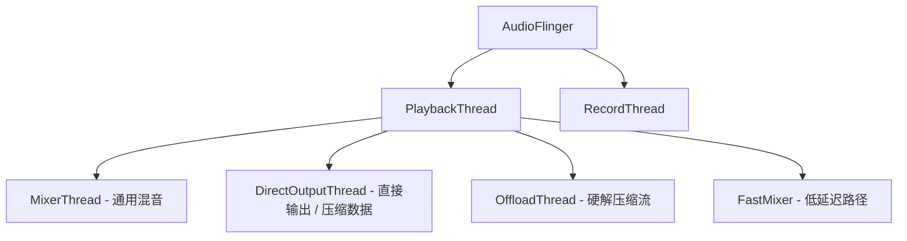
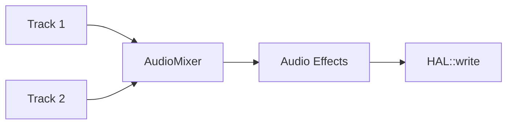

# AudioFlinger 混音引擎详解 (AudioFlinger Deep Dive)

`AudioFlinger` 是 Android 音频系统服务的核心实现，运行在 `audioserver` 进程中。它是音频数据的“终点”（播放）和“起点”（录音）。

---

## 1. AudioFlinger 的核心职责

1.  **管理播放和录音线程**：根据硬件输出设备创建不同的工作线程。
2.  **混音 (Mixing)**：将多个 App 的音频流混合成一路发送给硬件。
3.  **重采样 (Resampling)**：将不同采样率的音频流统一转换为硬件支持的采样率（通常为 48kHz）。
4.  **音效处理**：管理全局或特定会话的音频特效。

---

## 2. 内部线程模型 (Thread Model)

AudioFlinger 为每个音频输出设备（Output Device）维护至少一个线程。

### 2.1 MixerThread (混音线程)
最常用的线程。它包含一个 `AudioMixer` 对象。
*   **工作循环**：等待数据 -> 混音 -> 处理音效 -> 写入 HAL。

### 2.2 FastMixer
为了解决 Android 早期严重的音频延迟问题而设计。它运行在更高的调度优先级，绕过复杂的混音逻辑，直接处理低延迟音频流。

---

## 3. Track 与 PlaybackThread

在 AudioFlinger 内部，每个应用创建的 AudioTrack 都对应一个 `Track` 对象。

*   **Track**：应用数据的代理，持有共享内存。
*   **ActiveTracks**：线程当前正在处理的 Track 集合。如果一个 Track 停止发送数据，它会从 ActiveTracks 中移除，以节省计算资源。

---

## 4. 数据处理链路

---

## 5. 关键参考 (References)

1.  [AOSP Source: AudioFlinger.cpp](https://android.googlesource.com/platform/frameworks/av/+/master/services/audioflinger/AudioFlinger.cpp)
2.  [Android Audio Framework - Deep Dive](https://source.android.com/devices/audio/architecture)

---
*Next Topic: [AudioPolicy 策略管理详解](../05-AudioPolicy/README.md)*
