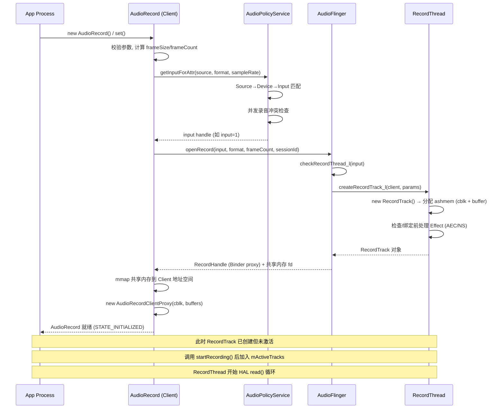
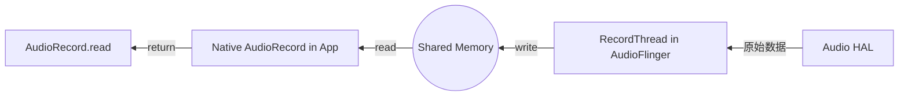
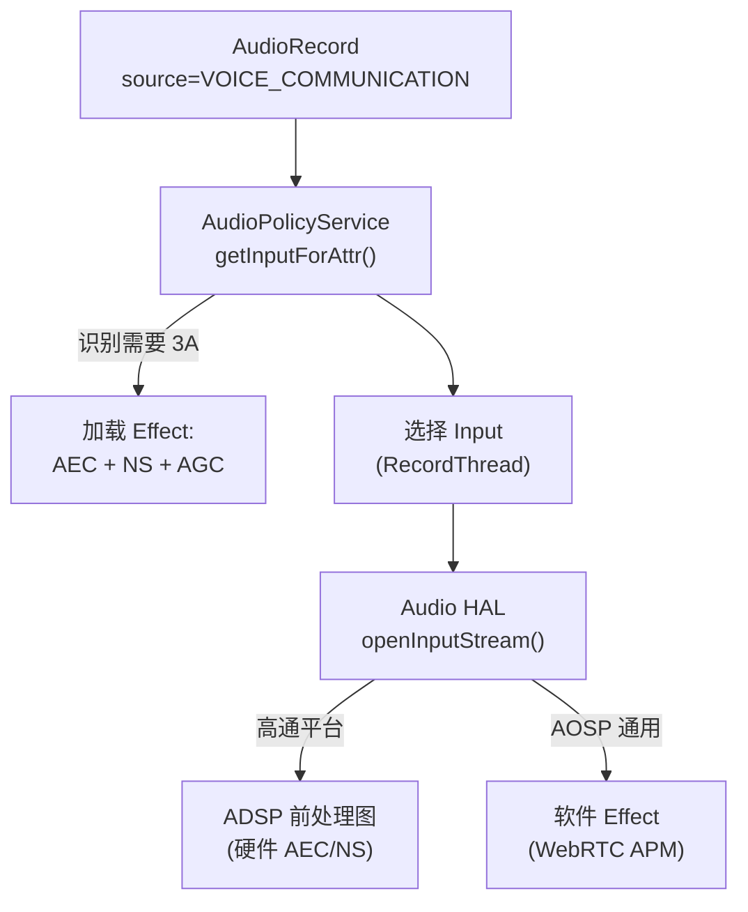
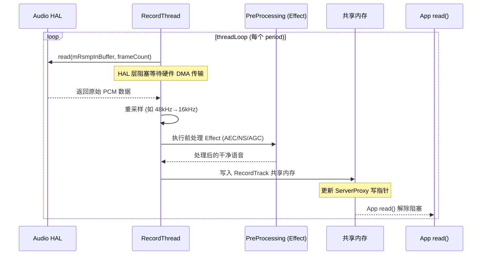
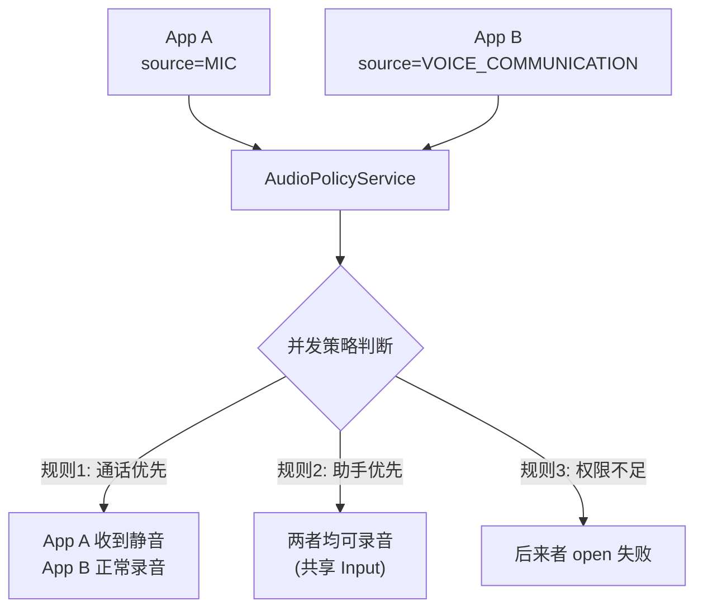

# AudioRecord 录音流程解析 (AudioRecord Deep Dive)

`AudioRecord` 是应用层获取原始音频数据的源头。对于初学者，它是“录音器”；对于专业人员，它是理解 **音频前端处理 (Preprocessing)、实时流传输、以及内核驱动采集** 的窗口。

---

## 1. 核心实战：实例化与 AudioSource 选择

在 Android 中，录音的“意图”由 `AudioSource` 决定。这直接影响到底层 DSP 会加载什么样的算法模块。

```java
// 专业录音配置示例
int sampleRate = 16000; // 语音识别常用采样率
int channelConfig = AudioFormat.CHANNEL_IN_MONO; // 单声道
int audioFormat = AudioFormat.ENCODING_PCM_16BIT;

int bufferSize = AudioRecord.getMinBufferSize(sampleRate, channelConfig, audioFormat);

// 🚀 专家建议：如果是通话或交互，务必选择 VOICE_COMMUNICATION
AudioRecord recorder = new AudioRecord(
        MediaRecorder.AudioSource.VOICE_COMMUNICATION, // 关键：开启底层 3A (AEC, ANS, AGC)
        sampleRate,
        channelConfig,
        audioFormat,
        bufferSize
);
```

### 🧠 🧠 深度思考：VOICE_COMMUNICATION 的魔力
当你选择这个 Source 时，`AudioPolicyService` 会识别出这是一个通话场景。它会自动向 `AudioFlinger` 发出指令，加载 **AEC (回声消除)** 和 **NS (降噪)** 的效果插件。如果硬件 DSP 支持这些算法，处理会发生在硬件层，极大地降低 CPU 负载。

---

## 2. JNI 与 Native 层的绑定

类似于 AudioTrack，`AudioRecord.cpp` 在 Native 层负责与 `audioserver` 进程交互。

```cpp
// AudioRecord.cpp 核心逻辑展示
status_t AudioRecord::set(...) {
    // 1. 获取 AudioFlinger 代理
    const sp<IAudioFlinger>& audioFlinger = AudioSystem::get_audio_flinger();
    
    // 2. 发起 Binder 调用请求创建 RecordTrack
    sp<IAudioRecord> record = audioFlinger->openRecord(...);
    
    // 3. 获取录音专用的共享内存
    mAudioRecordShared = record->getCblk();
}
```

---

## 3. Native 层：录音初始化全链路 (Expert Only)

录音的启动逻辑与播放对称，涉及复杂的跨进程握手。其核心调用栈如下：

### 3.1 核心调用栈源码级解析 (Call Stack)

```
完整调用链概览:

App: new AudioRecord()
 └→ AudioRecord::set()                         [libaudioclient, Client 进程]
     ├→ audio_is_valid_format() / 参数校验
     ├→ mFrameSize = channels × bytesPerSample
     └→ openRecord_l()                          [核心创建逻辑]
         ├→ AudioSystem::getInputForAttr()      [Binder → AudioPolicyService]
         │    └→ AudioPolicyManager::getInputForAttr()
         │         ├→ getDeviceForInputSource()  [AudioSource → 输入设备]
         │         ├→ getInputForDevice()        [设备 → input 句柄]
         │         │    └→ 匹配 source/format/samplingRate 选择最佳 input
         │         └→ addAudioPatch() (建立输入设备→MixPort连接)
         │
         ├→ AudioFlinger::openRecord()          [Binder IPC → audioserver]
         │    ├→ checkRecordThread_l(input)      [input → RecordThread]
         │    ├→ RecordThread::createRecordTrack_l()
         │    │    ├→ new RecordTrack(thread, client, ...)
         │    │    │    ├→ TrackBase::TrackBase()
         │    │    │    │    ├→ 分配 ashmem (共享内存)
         │    │    │    │    ├→ 初始化 audio_track_cblk_t (控制块)
         │    │    │    │    └→ mmap 映射到 Client 地址空间
         │    │    │    └→ 初始化 AudioRecordServerProxy
         │    │    └→ 前处理 Effect 检查 (AEC/NS/AGC)
         │    └→ return RecordHandle (Binder 代理)
         │
         └→ 初始化 Client 侧代理
              ├→ mCblk = record->getCblk()       [获取控制块指针]
              ├→ mBuffers = record->getBuffers()  [获取数据区指针]
              └→ new AudioRecordClientProxy(mCblk, mBuffers, frameCount)
```

### 3.2 AudioRecord::set() — 参数校验与配置

```cpp
// frameworks/av/media/libaudioclient/AudioRecord.cpp
status_t AudioRecord::set(audio_source_t inputSource, uint32_t sampleRate,
                         audio_format_t format, audio_channel_mask_t channelMask,
                         size_t frameCount, callback_t cbf, ...) {
    // 1. 格式校验
    if (!audio_is_valid_format(format)) return BAD_VALUE;
    if (!audio_is_input_channel(channelMask)) return BAD_VALUE;
    
    // 2. 保存 AudioSource — 决定后续的路由和前处理策略
    mAttributes.source = inputSource;
    // VOICE_COMMUNICATION → 后续会加载 AEC/NS/AGC
    // UNPROCESSED → 不加载任何前处理
    
    // 3. 计算帧大小
    uint32_t channelCount = audio_channel_count_from_in_mask(channelMask);
    mFrameSize = audio_bytes_per_sample(format) * channelCount;
    // 例: PCM_16BIT + MONO → 2 × 1 = 2 bytes/frame
    
    // 4. 采样率处理
    if (sampleRate == 0) {
        sampleRate = DEFAULT_SAMPLE_RATE;  // 通常 44100 或 48000
    }
    mSampleRate = sampleRate;
    
    // 5. frameCount 处理 (0 表示让系统决定)
    //    与 AudioTrack 不同, 录音侧由 HAL 的 period 和采样率比决定
    
    // 6. Callback 模式设置
    if (cbf != nullptr) {
        mCbf = cbf;
        // 会创建内部 AudioRecordThread 用于回调
    }
    
    // 7. 进入核心创建流程
    return openRecord_l(0 /*epoch position*/, opPackageName);
}
```

### 3.3 AudioSystem::getInputForAttr() — Policy 输入路由决策

```cpp
// frameworks/av/media/libaudioclient/AudioSystem.cpp
// 这是一个跨进程 Binder 调用, 最终到达 AudioPolicyService

// AudioPolicyManager 侧的处理:
// frameworks/av/services/audiopolicy/managerdefault/AudioPolicyManager.cpp
status_t AudioPolicyManager::getInputForAttr(const audio_attributes_t *attr,
                                              audio_io_handle_t *input,
                                              audio_session_t session,
                                              audio_devices_t *selectedDeviceId, ...) {
    // 1. AudioSource → 输入设备
    //    VOICE_COMMUNICATION → 底部 MIC (支持 AEC 参考信号)
    //    CAMCORDER → 多麦阵列 (方向性增强)
    //    HOTWORD → 低功耗 DSP 通路 (LPI)
    audio_devices_t device = getDeviceForInputSource(attr->source);
    
    // 2. 检查并发录音冲突
    //    如果已有 VOICE_COMMUNICATION 在录音, 新的 MIC 请求可能被静音
    status_t status = checkConcurrentCapture(session, attr->source);
    
    // 3. 设备 + source + format → 选择最佳 input (对应 RecordThread)
    *input = getInputForDevice(device, session, attr->source,
                               config->sample_rate, config->format,
                               config->channel_mask, flags);
    
    // 4. 如果没有现成 input → 打开新的 HAL inputStream
    //    内部: AudioFlinger::openInput() → HAL openInputStream()
    
    // 5. 创建 AudioPatch (输入设备 → MixPort 连接)
    addAudioPatch(patchHandle, inputDevice, mixPort);
    
    return NO_ERROR;
}
```

**input 句柄 (audio_io_handle_t) 的本质：**
```
audio_io_handle_t 是一个整数 ID, 对应 AudioFlinger 中的一个 RecordThread。
每个 RecordThread 绑定一个 HAL 输入流 (StreamIn):

  input=1 → RecordThread (primary_input, Built-In Mic, 48kHz)
  input=2 → RecordThread (voice_call_input, Modem Voice RX)
  input=3 → RecordThread (usb_input, USB Mic, 96kHz)
  input=4 → RecordThread (mmap_input, MMAP low-latency)

同一物理设备通常只有一个 input (不同于 output 可有多种 flags)
多个 App 录同一个 input 时, 共享 RecordThread (多 RecordTrack)
```

### 3.4 AudioFlinger::openRecord() — 资源分配

```cpp
// frameworks/av/services/audioflinger/AudioFlinger.cpp
sp<IAudioRecord> AudioFlinger::openRecord(const media::OpenRecordRequest& request,
                                           media::OpenRecordResponse* response,
                                           status_t *status) {
    // 1. 查找目标 RecordThread
    RecordThread *thread = checkRecordThread_l(input);
    if (thread == nullptr) {
        *status = BAD_VALUE;  // input 不存在
        return nullptr;
    }
    
    // 2. 在 Thread 中创建 RecordTrack
    sp<RecordThread::RecordTrack> recordTrack;
    recordTrack = thread->createRecordTrack_l(client, attr,
                                              &sampleRate, format, channelMask,
                                              &frameCount, sessionId,
                                              &notificationFrameCount, flags, ...);
    
    // 3. 填充输出参数 (告诉 Client 实际分配了什么)
    response->inputId = thread->id();
    response->sampleRate = thread->sampleRate();  // HAL 实际采样率
    response->frameCount = frameCount;             // 实际分配的 buffer 大小
    
    // 4. 检查是否需要加载前处理 Effect
    //    如果 source=VOICE_COMMUNICATION, 且 session 匹配:
    //    AudioPolicyService 已预先指定了 AEC/NS effect → 此处绑定到 RecordTrack
    
    // 5. 返回 Binder 接口 (RecordHandle 包装 RecordTrack)
    recordHandle = new RecordHandle(recordTrack);
    return recordHandle;
}
```

### 3.5 共享内存分配与 cblk 初始化

```cpp
// frameworks/av/services/audioflinger/TrackBase.cpp
// 与 AudioTrack 共用同一基类 TrackBase, 共享内存分配逻辑完全一致
AudioFlinger::TrackBase::TrackBase(..., size_t bufferSize) {
    size_t size = sizeof(audio_track_cblk_t);  // 控制块 (~64 bytes)
    size_t bufferOffset = size;                  // 数据区紧跟控制块之后
    size += bufferSize;                          // 总共享内存 = cblk + data buffer
    
    // 1. 分配匿名共享内存 (ashmem)
    mCblkMemory = client->allocator().allocate(size);
    // allocator 内部: ashmem_create_region("AudioRecord", size)
    //   → /dev/ashmem 创建匿名共享内存区域
    //   → mmap 映射到当前进程 (audioserver)
    
    // 2. 获取 cblk 指针 (共享内存起始位置)
    void *iMem = mCblkMemory->unsecurePointer();
    mCblk = static_cast<audio_track_cblk_t*>(iMem);
    
    // 3. placement new 初始化控制块
    new (mCblk) audio_track_cblk_t();
    
    // 4. 数据区指针 (紧跟 cblk 之后)
    mBuffer = (char*)mCblk + bufferOffset;
    // 此区域是环形缓冲区的 backing memory
}
```

**录音场景下 cblk 的角色反转：**
```
与 AudioTrack 的关键差异 — 生产者/消费者角色互换:

  AudioTrack (播放):
    Producer = App (AudioTrackClientProxy, 写入 PCM)
    Consumer = AudioFlinger (AudioTrackServerProxy, 读取送 HAL)
    
  AudioRecord (录音):
    Producer = AudioFlinger (AudioRecordServerProxy, 从 HAL 读取写入)
    Consumer = App (AudioRecordClientProxy, 调用 read() 消费)

cblk 控制块结构相同 (audio_track_cblk_t), 但:
  mFront: 由 Consumer 更新 (录音时是 App 侧)
  mRear:  由 Producer 更新 (录音时是 Server 侧)
  available = mRear - mFront (App 可读的帧数)
  
  Overrun 条件: mRear - mFront >= frameCount
    → Server 写满了, App 还没读 → 旧数据被覆盖 → 丢帧
```

### 3.6 重采样决策 (Resampler)

```cpp
// frameworks/av/services/audioflinger/Threads.cpp
// RecordThread::createRecordTrack_l() 中判断是否需要重采样

bool needsResampling = (sampleRate != thread->sampleRate());
// 例: App 请求 16kHz, 但 HAL input 实际运行在 48kHz → 需要重采样 (下采样)

// 与 AudioTrack 的差异:
//   AudioTrack: 重采样在 AudioMixer (MixerThread) 中执行
//   AudioRecord: 重采样在 RecordThread 中执行 (每个 RecordTrack 独立重采样)

// RecordThread::threadLoop() 中:
if (recordTrack->needsResampler()) {
    // 使用 ResamplerBufferProvider:
    //   HAL 以 48kHz 采集 → 重采样为 App 请求的 16kHz
    //   下采样比例 = 48000/16000 = 3:1
    //   使用多相滤波器 (Polyphase), 先低通滤波再抽取
    recordTrack->mResampler->resample(
        recordTrack->mSink.raw, framesOut, recordTrack->mResamplerBufferProvider);
}

// 多 RecordTrack 共享同一 RecordThread 时:
//   Track A: 需要 16kHz → 独立 Resampler 实例 (48→16)
//   Track B: 需要 48kHz → 无需重采样, 直接拷贝
//   Track C: 需要 44100Hz → 独立 Resampler 实例 (48→44.1)
```

### 3.7 Client 侧代理初始化 (回到 Client 进程)

```cpp
// AudioRecord::openRecord_l() 后半段 (Binder 返回后)
status_t AudioRecord::openRecord_l(size_t epoch, const String16& opPackageName) {
    // ... getInputForAttr / openRecord 完成后 ...
    
    // 1. 从 RecordHandle 获取共享内存的 fd (通过 Binder 传递)
    sp<IMemory> iMem = record->getCblk();
    // 内部: Binder 传递了 ashmem fd → Client 进程 mmap 同一块物理内存
    
    // 2. 获取 cblk 和 buffer 指针 (Client 视角)
    mCblk = static_cast<audio_track_cblk_t*>(iMem->unsecurePointer());
    mBuffers = record->getBuffers();  // 数据区起始地址
    
    // 3. 创建 Client 侧 Proxy (注意：录音是 Consumer)
    mProxy = new AudioRecordClientProxy(mCblk, mBuffers, mFrameCount, mFrameSize);
    // AudioRecordClientProxy 继承自 ClientProxy
    // 核心方法: obtainBuffer() — 等待 Server 写入数据后获取可读区域
    //           releaseBuffer() — 更新 mFront 读指针
    
    // 4. 设置 epoch (位置基准, 用于 getPosition)
    mProxy->setEpoch(epoch);
    
    // 5. 记录 AF 侧参数
    mAfSampleRate = response.sampleRate;    // HAL 实际采样率
    mAfFrameCount = response.frameCount;    // AF 侧 buffer 大小
    mNotificationFramesAct = response.notificationFrameCount;
    
    return NO_ERROR;
}
```

### 3.8 初始化完整时序图



---

## 4. 录音数据流：反向 Proxy 模型

录音的数据流向与播放正好相反，但机制相同。

*   **AudioFlinger (Producer)**：从 HAL 层读取 PCM 数据 -> 写入共享内存的 `ServerProxy` -> 更新写指针。
*   **App (Consumer)**：调用 `read()` -> 从共享内存的 `Proxy` 读取数据 -> 更新读指针 -> 返回给 Java 层。



---

## 5. AudioSource 与前处理算法的关系

AudioSource 的选择直接决定了录音链路上加载的 DSP 算法：

| AudioSource | 典型用途 | 前处理算法 | 路由倾向 |
|:---|:---|:---|:---|
| `DEFAULT` / `MIC` | 普通录音 | 无 / 基本 ANS | 主麦克风 |
| `VOICE_COMMUNICATION` | VoIP 通话 | **AEC + ANS + AGC** | 底部麦+参考信号 |
| `VOICE_RECOGNITION` | 语音识别 | 轻度 ANS (保留语音细节) | 主麦克风 |
| `CAMCORDER` | 视频录制 | 风噪抑制 + 方向增强 | 多麦阵列 |
| `UNPROCESSED` | 原始录音 (测量用) | **无任何处理** | 主麦克风 |
| `VOICE_PERFORMANCE` | K歌/乐器 | 轻度 ANS，无 AGC | 主麦克风 |
| `HOTWORD` | 语音唤醒 (系统) | KWD 模型 | 低功耗 LPI 通路 |

### 5.1 前处理加载链路



### 5.2 UNPROCESSED 的重要性

对于音频质量测试、声学测量，必须使用 `UNPROCESSED`：
- 绕过所有 ANS/AGC/AEC
- 获取原始 ADC 输出
- Android CTS 中用于验证 HAL 频响和底噪指标

---

## 6. read() 详细流程与阻塞机制

### 6.1 read() 源码级解析

```cpp
// AudioRecord.cpp
ssize_t AudioRecord::read(void* buffer, size_t userSize, bool blocking) {
    size_t bytesRead = 0;
    
    while (bytesRead < userSize) {
        Buffer audioBuffer;
        audioBuffer.frameCount = (userSize - bytesRead) / mFrameSize;
        
        // 1. 从共享内存获取可用数据
        status_t err = mProxy->obtainBuffer(&audioBuffer, 
            blocking ? &ClientProxy::kForever : &ClientProxy::kNonBlocking);
        
        if (err != NO_ERROR) {
            if (err == WOULD_BLOCK) break;  // 非阻塞模式: 返回已读数量
            if (err == DEAD_OBJECT) {
                // AudioFlinger 已死, 需要 restore
                restoreRecord_l("read");
                continue;
            }
        }
        
        // 2. 拷贝数据到应用缓冲区
        memcpy((char*)buffer + bytesRead, audioBuffer.raw, audioBuffer.size);
        bytesRead += audioBuffer.size;
        
        // 3. 释放缓冲区 (更新读指针)
        mProxy->releaseBuffer(&audioBuffer);
    }
    return bytesRead;
}
```

### 6.2 阻塞 vs 非阻塞

| 模式 | 行为 | 使用场景 |
|:---|:---|:---|
| **阻塞 (默认)** | read() 在没数据时 wait，直到 RecordThread 写入 | 简单录音 App |
| **非阻塞** | 立即返回可用数据量 (可能为 0) | 实时处理 + 自定义调度 |

---

## 7. RecordThread 内部工作机制

AudioFlinger 的 RecordThread 是录音数据的"搬运工"：



### 7.1 重采样场景

当 App 请求 16kHz 但 HAL 只支持 48kHz 时，RecordThread 内部执行重采样：

```cpp
// RecordThread::threadLoop() 中的重采样逻辑
if (mResampler != nullptr) {
    // HAL 以 48kHz 采集，App 需要 16kHz
    // 比例 = 48000/16000 = 3:1
    mResampler->resample(mRsmpOutBuffer, framesOut, this);
}
```

---

## 8. 并发录音与权限控制

### 8.1 多客户端并发录音 (Android 10+)

Android 10 引入了并发录音策略，由 AudioPolicy 控制：



**并发录音规则优先级**：
1. 通话 App (`VOICE_COMMUNICATION`) > 普通录音
2. 持有 `CAPTURE_AUDIO_OUTPUT` 权限的系统 App 可同时录音
3. 助手 App (`HOTWORD`) 可在后台持续监听
4. 普通 App 之间互斥（后来者 open 成功但收到静音数据）

### 8.2 后台录音限制 (Android 9+)

```java
// 应用进入后台后的行为:
// - read() 仍然返回成功
// - 但返回的数据全部为 0 (静音)
// - 不会收到任何错误或异常
// - 回到前台后自动恢复真实数据

// 豁免条件:
// 1. 前台 Service (带有 Notification)
// 2. Accessibility Service
// 3. 系统 UID 应用
```

---

## 9. MMAP 录音路径

与播放类似，录音也支持 MMAP 超低延迟模式：

```
常规录音延迟:
  HAL Buffer (5ms) + RecordThread (5ms) + App Buffer (10ms) = ~20ms

MMAP 录音延迟:
  DMA Buffer 共享 → App 直接读取 = ~2-5ms
```

AAudio 使用 MMAP 录音时，数据从硬件 DMA buffer 直接映射到 App 进程，完全绕过 RecordThread。

---

## 10. startRecording() 启动流程

### 10.1 调用栈源码解析

```cpp
// frameworks/av/media/libaudioclient/AudioRecord.cpp
status_t AudioRecord::start(AudioSystem::sync_event_t event, audio_session_t triggerSession) {
    AutoMutex lock(mLock);
    
    if (mActive) return NO_ERROR;  // 已经在录音
    
    // 1. 标记为活跃
    mActive = true;
    
    // 2. 重置 Client Proxy 位置
    mProxy->start();
    
    // 3. 通过 Binder 通知 AudioFlinger 侧激活 RecordTrack
    status_t status = mAudioRecord->start(event, triggerSession);
    
    if (status != NO_ERROR) {
        mActive = false;
        ALOGE("AudioRecord::start() failed, status=%d", status);
    }
    
    return status;
}
```

### 10.2 Server 侧 (AudioFlinger) 处理

```cpp
// frameworks/av/services/audioflinger/Tracks.cpp
status_t AudioFlinger::RecordThread::RecordTrack::start(
        AudioSystem::sync_event_t event, audio_session_t triggerSession) {
    // 1. 切换状态
    mState = ACTIVE;
    
    // 2. 加入 RecordThread 的活跃列表
    RecordThread *recordThread = (RecordThread *)thread.get();
    return recordThread->start(this, event, triggerSession);
}

// frameworks/av/services/audioflinger/Threads.cpp
status_t AudioFlinger::RecordThread::start(RecordTrack* recordTrack, ...) {
    // 加入 mActiveTracks
    mActiveTracks.add(recordTrack);
    
    // 如果是第一个活跃 Track，需要激活 HAL input stream
    if (mActiveTracks.size() == 1) {
        // 开始从 HAL 读取数据
        mStartStopCond.signal();  // 唤醒 threadLoop
    }
    
    return NO_ERROR;
}
```

### 10.3 时序总结

```
App: recorder.startRecording()
  → AudioRecord::start()
    → mAudioRecord->start() [Binder IPC]
      → RecordHandle::start()
        → RecordTrack::start()
          → mState = ACTIVE
          → RecordThread::start(track)
            → mActiveTracks.add(track)
            → 唤醒 threadLoop() (如果在 standby)
              → threadLoop() 开始 HAL read()
              → 数据写入共享内存
              → App read() 可以获取数据
```

---

## 11. Callback 事件回调机制

### 11.1 Native Callback 事件类型

```cpp
// frameworks/av/media/libaudioclient/include/media/AudioRecord.h
class AudioRecord {
public:
    enum event_type {
        EVENT_MORE_DATA = 0,      // 有更多数据可读 (callback mode 核心事件)
        EVENT_OVERRUN = 1,        // 缓冲区上溢 (App 读取太慢)
        EVENT_MARKER = 2,         // 到达设定的帧位置标记
        EVENT_NEW_POS = 3,        // 位置更新通知 (周期性)
        EVENT_NEW_IAUDIORECORD = 4, // RecordTrack 被重建 (AudioFlinger 恢复后)
    };
    
    // 回调函数签名
    typedef void (*callback_t)(int event, void* user, void* info);
};
```

### 11.2 Callback 模式录音

```cpp
// Callback 模式: RecordThread 有数据时主动通知 App
void recordCallback(int event, void* user, void* info) {
    switch (event) {
        case AudioRecord::EVENT_MORE_DATA: {
            AudioRecord::Buffer* buf = (AudioRecord::Buffer*)info;
            // buf->raw 中已有录音数据, buf->size 为字节数
            processAudio(buf->raw, buf->size);
            break;
        }
        case AudioRecord::EVENT_OVERRUN:
            ALOGW("Recording overrun! Data lost.");
            break;
    }
}

// 创建 callback 模式的 AudioRecord
sp<AudioRecord> record = new AudioRecord();
record->set(AUDIO_SOURCE_MIC,
            16000,                    // sampleRate
            AUDIO_FORMAT_PCM_16_BIT,
            AUDIO_CHANNEL_IN_MONO,
            frameCount,
            recordCallback,           // 回调函数
            userData,                  // 上下文
            notificationFrames);      // 每 N 帧回调一次
```

### 11.3 Callback 线程模型

```
Callback 模式录音内部原理:

  AudioRecord 内部创建 AudioRecordThread:
    → 独立线程, 优先级 ANDROID_PRIORITY_AUDIO
    → threadLoop() 循环:
      1. mProxy->obtainBuffer() — 等待可读数据
      2. 调用 mCbf(EVENT_MORE_DATA, ...) — 通知 App 处理
      3. mProxy->releaseBuffer() — 释放已消费数据

  与 read() 模式对比:
    ┌──────────────┬───────────────────────┬───────────────────────┐
    │              │ read() 模式           │ Callback 模式          │
    ├──────────────┼───────────────────────┼───────────────────────┤
    │ 线程管理     │ App 自建线程循环 read │ 系统自动创建线程       │
    │ 数据获取     │ App 主动 pull         │ 系统 push 给 App      │
    │ 延迟控制     │ 取决于 read 频率      │ 系统按 period 推送    │
    │ 适用场景     │ 简单录音/文件写入     │ 实时处理/低延迟       │
    │ Overrun 风险 │ 较高 (App 调度不确定) │ 较低 (高优先级线程)   │
    └──────────────┴───────────────────────┴───────────────────────┘
```

---

## 12. getMinBufferSize 计算原理

### 12.1 计算公式

```cpp
// frameworks/av/media/libaudioclient/AudioRecord.cpp
status_t AudioRecord::getMinFrameCount(
        size_t* frameCount,
        uint32_t sampleRate,
        audio_format_t format,
        audio_channel_mask_t channelMask) {
    
    // 1. 获取 HAL 层的 period size (从 AudioFlinger 查询)
    size_t afFrameCount;
    status_t status = AudioSystem::getFrameCount(input, &afFrameCount);
    
    uint32_t afSampleRate;
    status = AudioSystem::getSamplingRate(input, &afSampleRate);
    
    // 2. 计算最小帧数:
    //    App 需要的 buffer ≥ HAL 的 2 个 period (双缓冲保证)
    //    如果 App 采样率与 HAL 不同, 需要按比例调整
    size_t minFrameCount = afFrameCount * sampleRate / afSampleRate;
    
    // 3. 乘以安全系数 (至少 2 个 period)
    minFrameCount = max(minFrameCount, sampleRate / 100);  // 至少 10ms
    *frameCount = minFrameCount * 2;  // 双缓冲
    
    return NO_ERROR;
}
```

### 12.2 计算示例

```
场景: App 请求 16kHz, HAL 实际运行在 48kHz, period = 240 frames

计算:
  afFrameCount = 240 (HAL period)
  afSampleRate = 48000
  appSampleRate = 16000
  
  minFrameCount = 240 × 16000 / 48000 = 80 frames
  安全下限 = 16000 / 100 = 160 frames (10ms)
  取 max(80, 160) = 160 frames
  最终: 160 × 2 = 320 frames (双缓冲)
  
  getMinBufferSize 返回:
    320 frames × 1 channel × 2 bytes(16bit) = 640 bytes

实际建议: 使用 2× ~ 4× getMinBufferSize 以降低 overrun 风险
```

---

## 13. restoreRecord_l() — AudioFlinger 崩溃恢复

### 13.1 恢复机制

```cpp
// frameworks/av/media/libaudioclient/AudioRecord.cpp
status_t AudioRecord::restoreRecord_l(const char *from) {
    ALOGW("dead IAudioRecord, creating a new one from %s()", from);
    
    // 1. 标记需要恢复
    mFlags = mOrigFlags;
    
    // 2. 重新向 AudioPolicy 查询 input
    audio_io_handle_t input;
    status_t result = AudioSystem::getInputForAttr(&mAttributes, &input, ...);
    
    // 3. 重新打开 Record (与初始化流程相同)
    result = openRecord_l(mSampleRate, mFormat, mFrameCount, mSessionId, ...);
    
    if (result == NO_ERROR) {
        // 4. 如果之前在录音, 重新 start
        if (mActive) {
            mAudioRecord->start(AudioSystem::SYNC_EVENT_SAME, 
                               AUDIO_SESSION_NONE);
        }
        // 5. 触发回调通知 App
        // EVENT_NEW_IAUDIORECORD
    }
    
    return result;
}
```

### 13.2 触发时机与 App 影响

```
AudioFlinger 崩溃恢复时序 (录音):

  audioserver 崩溃重启
       │
       ▼
  App 侧 AudioRecord 下次调用 read()
    → obtainBuffer() 返回 DEAD_OBJECT
       │
       ▼
  restoreRecord_l() 被触发:
    → 重新 getInputForAttr() (可能 MIC 路由已变化)
    → 重新 openRecord_l()
    → 重新 start()
    → 录音恢复 (可能丢失 ~200-500ms 数据)

App 感知:
  - read() 可能返回比预期少的数据
  - 一次性丢失约 200ms 录音
  - 之后自动恢复正常
  - Callback 模式: 收到 EVENT_NEW_IAUDIORECORD 通知

与 AudioTrack 的差异:
  - AudioTrack 恢复后可以继续从断点播放 (位置可恢复)
  - AudioRecord 录音数据是实时的，丢失不可恢复
```

---

## 14. 调试实战

### 14.1 核心调试命令

```bash
# 查看录音线程状态
adb shell dumpsys media.audio_flinger | grep -A 30 "Record"

# 查看当前活跃的录音客户端
adb shell dumpsys media.audio_flinger | grep -i "RecordTrack"

# 查看录音相关 Effect
adb shell dumpsys media.audio_flinger | grep -B2 -A5 "PreProcessing"

# 实时监控录音日志
adb logcat -s AudioRecord AudioFlinger AudioPolicyService

# 查看并发录音状态
adb shell dumpsys audio | grep -A 20 "Recording"
```

### 14.2 常见问题排查

| 问题 | 根因 | 解决方案 |
|:---|:---|:---|
| **read() 返回静音** | App 在后台 / 权限不足 | 使用前台 Service + 检查 RECORD_AUDIO 权限 |
| **Overrun (数据丢失)** | App read() 太慢 | 独立高优先级线程 + 队列缓冲 |
| **AEC 不生效** | 未使用 VOICE_COMMUNICATION | 切换 AudioSource + 确认 HAL 支持 |
| **录音有底噪** | AGC 过度放大 | 尝试 UNPROCESSED Source 对比 |
| **多 App 录音冲突** | 硬件不支持并发 | 检查 `audio_policy_configuration.xml` maxActiveCount |
| **16kHz 打开失败** | HAL 不支持该采样率 | 使用 HAL 支持的采样率，系统自动重采样 |

---

## 15. 关键参考 (References)

1.  [AOSP AudioRecord.cpp](https://android.googlesource.com/platform/frameworks/av/+/refs/heads/main/media/libaudioclient/AudioRecord.cpp)
2.  [Android Developer: AudioRecord](https://developer.android.com/reference/android/media/AudioRecord)
3.  [Android Audio Capture](https://source.android.com/docs/core/audio/capture)
4.  [Concurrent Audio Capture](https://source.android.com/docs/core/audio/concurrent-audio-capture)

---
*下一章：[AudioFlinger 混音引擎深度解析](./05-AudioFlinger.md)*
