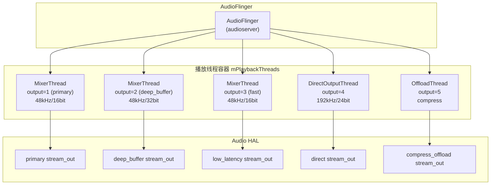
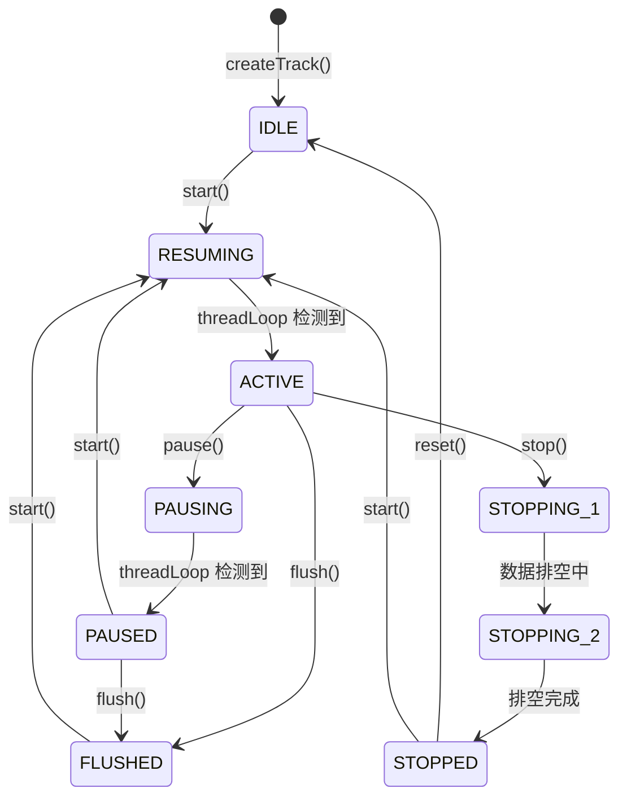
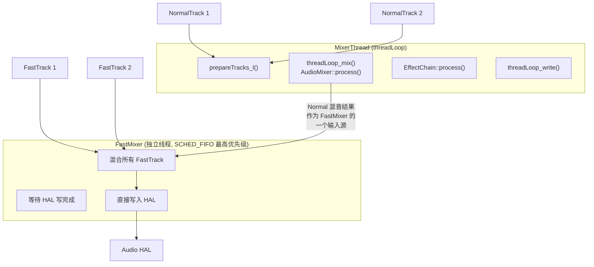
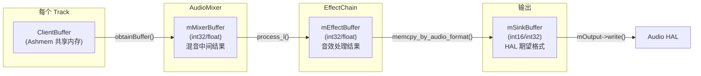
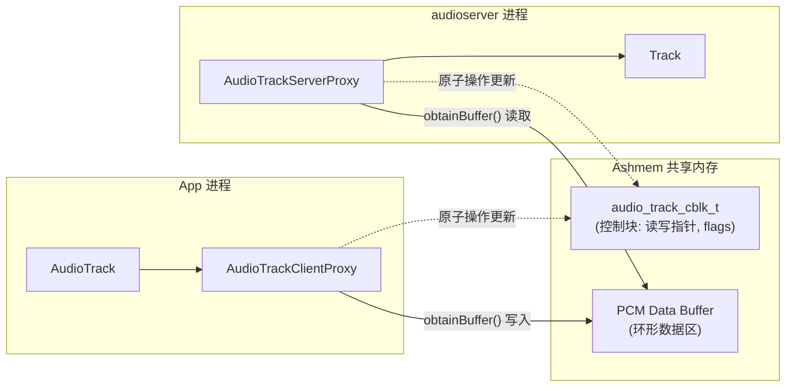

# AudioFlinger 混音引擎深度解析

`AudioFlinger` 是 Android 音频系统的“心脏”，运行在 `audioserver` 进程中。它负责管理所有的音频流、执行软件混音、重采样，并最终通过 HAL 层将数据推送到硬件。

---

## 1. 启动与初始化流程 (Initialization Sequence)

### 1.1 进程启动与实例化
1.  **启动入口**：系统解析 `audioserver.rc`，启动 `/system/bin/audioserver`。
2.  **实例化**：`main_audioserver.cpp` 调用 `AudioFlinger::instantiate()`。
3.  **构造函数**：初始化 `mPlaybackThreads`, `mRecordThreads` 等容器，并创建 `DevicesFactoryHalInterface` 句柄用于 HAL 加载。

### 1.2 HAL 加载链路 (Loading HAL)
当 AudioPolicy 请求加载硬件模块时，链路如下：
`AudioFlinger::loadHwModule_l()` 
-> `DevicesFactoryHalHidl::openDevice()`
-> `DevicesFactory::loadAudioInterface()`
-> **`hw_get_module_by_class(AUDIO_HARDWARE_MODULE_ID, if_name, &mod)`**
*此步骤会根据 `audio.primary.so` 等厂商库名称在系统目录中进行 dlopen 加载。*

### 1.3 输出线程创建时机

AudioPolicy 在解析 `audio_policy_configuration.xml` 后，会对每个 `<mixPort>` 调用：
```
AudioPolicyManager::initialize()
  → openOutput()
    → AudioFlinger::openOutput_l()
      → 根据 flags 创建对应线程类型
```

创建线程时的 flag 映射：
| Flag 组合 | 创建的线程类型 |
|:---|:---|
| `AUDIO_OUTPUT_FLAG_PRIMARY` | MixerThread (主输出) |
| `AUDIO_OUTPUT_FLAG_DEEP_BUFFER` | MixerThread (深缓冲) |
| `AUDIO_OUTPUT_FLAG_FAST` | MixerThread (低延迟) |
| `AUDIO_OUTPUT_FLAG_DIRECT` | DirectOutputThread |
| `AUDIO_OUTPUT_FLAG_COMPRESS_OFFLOAD` | OffloadThread |

---

## 2. 线程模型全景图 (Thread Model)

AudioFlinger 为每个物理输出设备创建一个线程实例。

| 线程类 | 标志 (Flags) | 职责 |
| :--- | :--- | :--- |
| **MixerThread** | `PRIMARY`, `FAST`, `DEEP_BUFFER` | **通用混音**。支持多路流叠加、SRC 和音效处理。 |
| **DirectOutputThread** | `DIRECT` | **直通播放**。跳过 AudioMixer，适用于无损或高位深音频。 |
| **OffloadThread** | `COMPRESS_OFFLOAD` | **硬件卸载**。将压缩流直接推给 DSP 解码，主 CPU 休眠。 |
| **DuplicatingThread** | - | **镜像播放**。将一路流复制到多个输出（如：扬声器与蓝牙同步）。 |
| **RecordThread** | - | **录音线程**。从 HAL 读取数据，分发给各 RecordTrack。 |
| **MmapPlaybackThread** | `MMAP_NOIRQ` | **MMAP 播放**。AAudio 独占模式，应用直写 DMA Buffer。 |
| **MmapCaptureThread** | `MMAP_NOIRQ` | **MMAP 录音**。AAudio 独占模式，应用直读 DMA Buffer。 |

### 2.1 线程与 Output 的对应关系



### 2.2 线程优先级与调度

| 线程类型 | 调度策略 | 优先级 | 周期 |
|:---|:---|:---|:---|
| **MixerThread (Fast)** | `SCHED_FIFO` | 最高 (通常为 2-3) | ~5ms (取决于 HAL buffer size) |
| **MixerThread (Normal)** | `SCHED_FIFO` | 次高 | ~20ms (deep_buffer) |
| **OffloadThread** | `SCHED_NORMAL` | 普通 | 按 DSP 回调驱动 |

---

## 3. Track 生命周期管理

### 3.1 Track 的创建

当 App 通过 `AudioTrack` 请求播放时，AudioFlinger 在对应的 PlaybackThread 中创建一个 `Track` 对象：

```cpp
// AudioFlinger::createTrack() 核心流程
sp<IAudioTrack> AudioFlinger::createTrack(const CreateTrackInput& input, ...) {
    // 1. 让 AudioPolicy 选择最佳 output
    audio_io_handle_t output = AudioSystem::getOutputForAttr(...);
    
    // 2. 在目标 PlaybackThread 中创建 Track
    PlaybackThread *thread = checkPlaybackThread_l(output);
    track = thread->createTrack_l(client, streamType, sampleRate,
                                   format, channelMask, frameCount,
                                   sharedBuffer, flags, ...);
    
    // 3. 创建共享内存 (Ashmem) 用于 Client-Server 数据交换
    // Track 内部创建 AudioTrackServerProxy
    return track;
}
```

### 3.2 Track 状态机



**关键细节**：
*   状态切换是**异步**的——App 调用 `pause()` 只是设置一个标记，真正的状态转换发生在 `threadLoop` 的 `prepareTracks_l()` 中
*   `STOPPING_1 → STOPPING_2`：确保 Track 中的残余数据被完整播放（drain），而非突然截断

### 3.3 Track 类型层次

```
TrackBase
├── Track              // 标准播放 Track
│   ├── TimedTrack     // 带时间戳的 Track (已废弃)
│   └── OutputTrack    // DuplicatingThread 的内部 Track
├── RecordTrack        // 录音 Track
└── PatchTrack         // AudioPatch 内部数据传输 Track
```

---

## 4. FastTrack vs NormalTrack 深度对比

这是 AudioFlinger 中最重要的性能分界线。

### 4.1 对比表

| 特性 | NormalTrack | FastTrack |
|:---|:---|:---|
| **Buffer 大小** | 较大 (通常 ≥ 4 × HAL buffer) | 等于 HAL buffer size |
| **混音位置** | AudioMixer (软件混音) | FastMixer (独立高优先级线程) |
| **重采样** | 支持任意采样率 | **不支持**，必须匹配 HAL 采样率 |
| **音效** | 支持完整 EffectChain | **不支持** Session 级音效 |
| **音量控制** | 软件增益 (精细) | 软件增益 (有限) |
| **最大数量** | 无限制 | 通常 ≤ 7-8 条 |
| **延迟** | ~50-200ms | ~5-20ms |
| **Underrun 容忍度** | 高 (大 buffer 缓冲) | 低 (容易出现 glitch) |

### 4.2 FastMixer 工作原理



**核心机制**：NormalTrack 的混音结果被当作 FastMixer 的「一条虚拟 FastTrack」混入最终输出。

### 4.3 FastTrack 准入条件

App 创建 AudioTrack 时携带 `AUDIO_OUTPUT_FLAG_FAST`，但 AudioFlinger 会严格检查：

```cpp
// PlaybackThread::createTrack_l() 中的 FastTrack 准入检查
bool isFastTrack = false;
if (flags & AUDIO_OUTPUT_FLAG_FAST) {
    if (
        // 1. 采样率必须与 HAL 一致（不能重采样）
        (sampleRate == mSampleRate) &&
        // 2. 声道数匹配
        (channelMask == mChannelMask) &&
        // 3. 格式匹配
        audio_is_linear_pcm(format) &&
        // 4. 不能有 Session 级音效
        (sessionId == AUDIO_SESSION_OUTPUT_MIX || !hasAudioSession(sessionId)) &&
        // 5. FastMixer 存在且未满
        (mFastTrackAvailMask != 0)
    ) {
        isFastTrack = true;
    } else {
        // 降级为 NormalTrack，App 可能不知情
        flags = (audio_output_flags_t)(flags & ~AUDIO_OUTPUT_FLAG_FAST);
    }
}
```

---

## 5. threadLoop 核心循环源码级剖析

所有播放线程的基类逻辑都在 `threadLoop()` 这个死循环中。

### 5.1 完整处理流程 (Threads.cpp)
```cpp
bool AudioFlinger::PlaybackThread::threadLoop() {
    while (!exitPending()) {
        // ========== 阶段 0: 等待与休眠管理 ==========
        // 如果没有活跃 Track，线程进入条件等待 (mWaitWorkCV)
        // 新 Track start() 时通过 broadcast() 唤醒
        threadLoop_standby();   // 超时后进入 Standby
        
        // ========== 阶段 1: 准备 Track ==========
        // 遍历 mActiveTracks，检查每个 Track 状态
        // 配置 AudioMixer 的 Buffer 地址和增益
        mMixerStatus = prepareTracks_l(&tracksToRemove);

        // ========== 阶段 2: 执行混音 ==========
        // 调用 mAudioMixer->process()，多路 Track 数据合并到 mMixerBuffer
        if (mMixerStatus == MIXER_TRACKS_READY) {
            threadLoop_mix();
        }

        // ========== 阶段 3: 音效处理 ==========
        // EffectChain 输入 = mMixerBuffer，输出 = mEffectBuffer
        for (auto& chain : mEffectChains) chain->process_l();

        // ========== 阶段 4: 格式转换 ==========
        // 将处理结果从内部格式 (通常 float/int32) 转换为 HAL 期望的格式
        // mEffectBuffer → mSinkBuffer (HAL 写入缓冲区)
        threadLoop_sleepTime();  // 计算本次写入应等待的时间

        // ========== 阶段 5: 写入硬件 ==========
        // mOutput->write(mSinkBuffer, mixBufferSize)
        // 最终穿透 HAL → TinyALSA → ALSA Driver → Codec
        threadLoop_write();
        
        // ========== 阶段 6: 清理 ==========
        threadLoop_removeTracks(tracksToRemove);
    }
}
```

### 5.2 Buffer 链路详解

理解 AudioFlinger 内部的 Buffer 传递是定位音频问题的关键：



**格式转换路径**：
*   Track 数据 (int16) → Mixer 内部 (**float32**，Android 9+) → Effect 处理 (float32) → Sink (**int16/int32**，匹配 HAL)
*   使用 `memcpy_by_audio_format()` 执行格式转换，包含 dither 处理避免截断噪声

---

## 6. AudioMixer 混音器深度细节

`AudioMixer` 运行在 `libaudioprocessing.so` 中，它是通过 `setParameter` 接口进行配置的。

### 6.1 Buffer 挂载路径
在 `MixerThread::prepareTracks_l` 中：
```cpp
// 将混音器的输出缓冲区设置为线程的临时混音缓冲区
mAudioMixer->setParameter(trackId, AudioMixer::TRACK, AudioMixer::MAIN_BUFFER, (void *)mMixerBuffer);
```

### 6.2 饱和截断算法 (Saturation)
对于每个采样点 $n$，AudioMixer 使用汇编优化的饱和指令：
$Sample_{out} = \text{clamp}(\sum Sample_i \times Gain_i, -32768, 32767)$
这保证了当多路大响度声音叠加时，结果不会产生整数溢出的尖锐杂音（炸音）。

### 6.3 混音处理函数选择策略

AudioMixer 根据 Track 的属性动态选择最优的处理函数（hook）：

| 场景 | 选择的 Hook 函数 | 特点 |
|:---|:---|:---|
| 单 Track + 无增益变化 + 无重采样 | `process__nop` / `process__oneTrack16BitsStereoNoResampling` | 零开销直通 |
| 多 Track + 16bit + 无重采样 | `process__genericNoResampling` | 整数混音，NEON 优化 |
| 需要重采样 | `process__genericResampling` | 调用 Resampler |
| 通用 (float 内部格式) | `process__oneTrack...` / `process__noResampleOneTrack` | Android 9+ 默认 float |

### 6.4 增益控制与 Ramp

为避免音量突变产生 Pop/Click 噪声，AudioMixer 使用**增益渐变 (Gain Ramp)**：

```cpp
// 每次 process() 调用中，逐 frame 渐变
for (size_t i = 0; i < frameCount; i++) {
    // 线性插值: 从 prevGain 渐变到 targetGain
    float gain = prevGain + (targetGain - prevGain) * i / frameCount;
    out[i] = in[i] * gain;
}
```

渐变通常在一个 buffer 周期内完成（~5-20ms），人耳不可感知。

---

## 7. 重采样器 (Resampler) 深度解析

当 Track 的采样率与 PlaybackThread 的 HAL 采样率不一致时，AudioMixer 自动启用重采样器。

### 7.1 重采样质量等级

| 质量等级 | 滤波器阶数 | CPU 开销 | 适用场景 |
|:---|:---|:---|:---|
| `DYN_LOW_QUALITY` | 4 阶 | 最低 | 通知音、提示音 |
| `DYN_MED_QUALITY` | 8 阶 | 中等 | 通话语音 |
| `DYN_HIGH_QUALITY` | 20 阶 | 较高 | 音乐播放 (默认) |
| `AUDIO_RESAMPLER_QUALITY_MAX` | 32+ 阶 | 最高 | 专业音频 |

### 7.2 动态多相滤波器 (Polyphase Resampling)

```
输入: 44100Hz → 输出: 48000Hz

转换比 = 48000 / 44100 = 160 / 147

多相滤波器:
  - 先上采样 160 倍 (插零)
  - 多相 FIR 滤波 (抗混叠)
  - 再下采样 147 倍 (抽取)
  - 实际通过查表避免插零/抽取，直接计算目标样本
```

### 7.3 重采样导致的延迟

重采样器引入的额外延迟 = 滤波器长度 / 2：
*   `DYN_HIGH_QUALITY`: ~1ms 额外延迟
*   这也是 **FastTrack 不支持重采样**的根本原因——无法接受额外延迟

---

## 8. 内存共享机制：Ashmem 与 Proxy

为了实现零拷贝，Android 使用 `AudioTrackServerProxy` 和 `AudioTrackClientProxy` 管理环形缓冲区。

### 8.1 环形缓冲区结构



### 8.2 Proxy 的原子操作

*   `obtainBuffer()`：申请一块可写/可读的内存
*   `releaseBuffer()`：更新 `sw_ptr` (应用侧) 或 `hw_ptr` (Flinger 侧)
*   **同步逻辑**：Client 写入数据后更新指针，Server 端在 `threadLoop` 循环中检测到指针变化即开始消费

### 8.3 Buffer 大小计算

AudioFlinger 为 Track 分配 Buffer 时的计算逻辑：

```
NormalTrack:
  frameCount = max(minFrameCount, requestedFrameCount)
  minFrameCount = afFrameCount * 2  // 至少 2 倍 HAL buffer
  
  例: HAL buffer = 960 frames @ 48kHz (20ms)
  → minFrameCount = 1920 frames (40ms)
  → 实际 buffer ≈ 40-80ms 的数据

FastTrack:
  frameCount = HAL buffer size  // 等于 HAL buffer
  例: HAL buffer = 240 frames @ 48kHz (5ms)
  → buffer = 5ms

Deep Buffer:
  frameCount = afFrameCount * N  // N 通常为 4-8
  → 实际 buffer ≈ 80-160ms
```

### 8.4 Underrun 与 Overrun 处理

| 问题 | 方向 | 原因 | 表现 | 处理 |
|:---|:---|:---|:---|:---|
| **Underrun** | 播放 | App 写数据太慢 | 卡顿/爆音 (glitch) | 插入静音帧, 计数器 +1 |
| **Overrun** | 录音 | App 读数据太慢 | 数据丢失 | 覆盖旧数据, 计数器 +1 |

---

## 9. 专家调试与 Dump 实战分析

### 9.1 获取 Dump 信息

```bash
# 完整 AudioFlinger dump
adb shell dumpsys media.audio_flinger

# 仅查看指定 output 的信息
adb shell dumpsys media.audio_flinger -o <output_id>

# 查看线程延迟统计 (histogram)
adb shell dumpsys media.audio_flinger --latency
```

### 9.2 Dump 输出关键字段解读

```
Output thread 0xb4000078deadbeef, name=AudioOut_2, tid=1234
  Mixer: 48000Hz, 2 ch, format 0x1 (AUDIO_FORMAT_PCM_16_BIT)
  Normal mixer: tracks=3, active=2, fastTracks=1
  HAL format: 0x1, HAL buffer size: 960 frames (20.00ms)
  Frames written: 14400000          ← 已写入硬件的总帧数
  Standby: no                       ← 线程是否处于待机
  
  Track 0x... (session 1)
    Type:   0 (NORMAL)              ← Track 类型
    Status: ACTIVE                  ← 当前状态
    Sample rate: 44100              ← 注意: 与 HAL 48000 不同 → 触发重采样
    Format: PCM_16_BIT
    Channel mask: 0x3 (stereo)
    Buffer frameCount: 3840         ← 共享内存大小 (≈80ms)
    Server frameCount: 12345678     ← Server 已消费的帧数
    Underruns: 3                    ← ⚠️ Underrun 次数，>0 表示 App 写太慢
    Flushed: 0
    Gain: L=1.000 R=1.000           ← 左右声道增益
```

### 9.3 常见问题定位清单

| 现象 | 关注的 Dump 字段 | 排查方向 |
|:---|:---|:---|
| **播放卡顿/爆音** | `Underruns > 0` | App 写入速度不足，检查 App 是否被调度抢占 |
| **播放无声** | `Frames written = 0` 或 Track `Status != ACTIVE` | 检查路由 / HAL / 驱动 |
| **音质异常** | `Sample rate` 与 HAL 不匹配 | 重采样质量问题，检查是否触发了低质量重采样 |
| **延迟过高** | `Buffer frameCount` 过大 | 检查是否误用了 DEEP_BUFFER flag |
| **音效未生效** | `Effect Chains` 为空 | 检查 Session ID 绑定 / EffectFactory 注册 |
| **功耗异常** | `Standby: no` (无播放时) | 某个 Track 未正确 stop/release |

### 9.4 实时监控脚本

```bash
# 持续监控 Underrun 变化
watch -n 1 'adb shell dumpsys media.audio_flinger | grep -E "Underrun|Active|Standby"'

# 监控音频线程 CPU 占用
adb shell top -H -p $(adb shell pidof audioserver) -n 1

# 查看音频 HAL 调用时序 (perfetto trace)
adb shell perfetto --txt -c - <<EOF
buffers { size_kb: 63488 }
data_sources {
  config {
    name: "linux.ftrace"
    ftrace_config {
      ftrace_events: "sched/sched_switch"
      ftrace_events: "power/cpu_frequency"
      atrace_categories: "audio"
    }
  }
}
duration_ms: 5000
EOF
```

---
*Next Topic: [AudioPolicy 策略管理深度解析](./06-AudioPolicy.md)*
