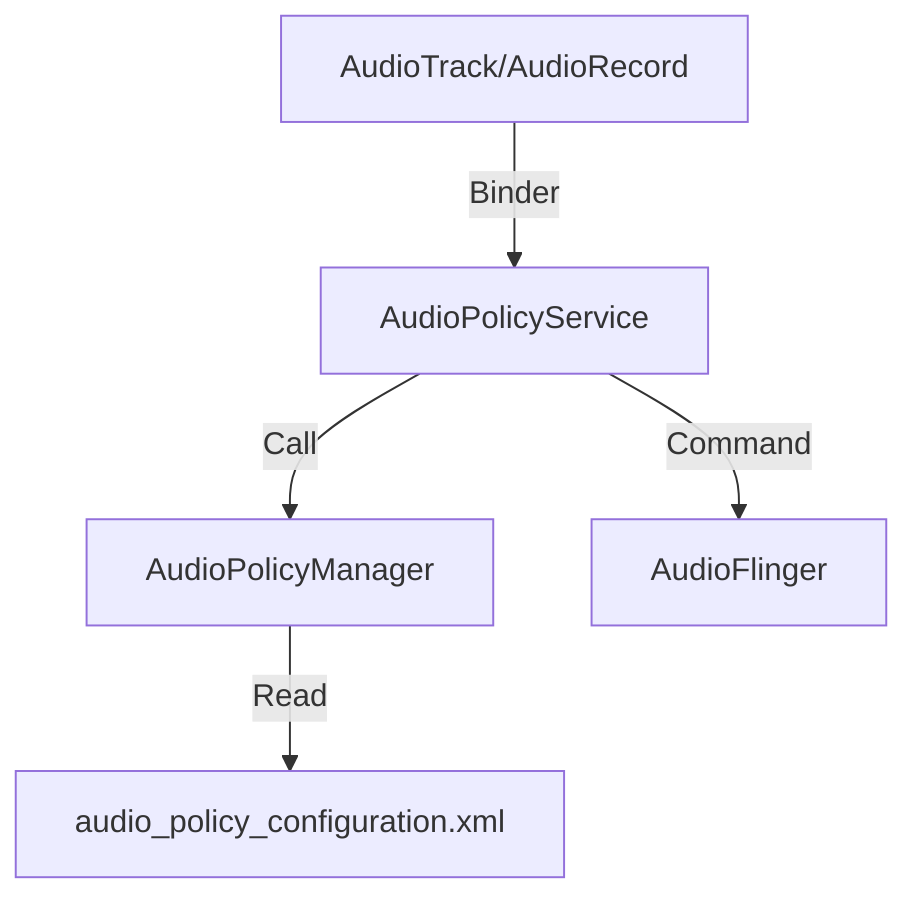

# AudioPolicy 策略管理深度解析

`AudioPolicy` 是 Android 音频系统的“大脑”。它负责决策音频应该去哪里（路由）、多大声（音量）以及谁能说话（焦点）。

---

## 1. 核心架构：Service vs. Manager

`AudioPolicy` 的设计体现了 Android **策略与执行分离** 的思想。

*   **AudioPolicyService (APS)**：
    *   作为宿主服务，接收来自 Java 层（AudioService）或 Native 层（AudioTrack）的 Binder 请求。
    *   管理命令队列，将耗时的策略计算异步化。
*   **AudioPolicyManager (APM)**：
    *   纯 C++ 实现，包含核心算法逻辑。
    *   **职责**：路由计算、音量曲线转换、配置加载。



---

## 2. 路由决策逻辑深度拆解

系统如何决定音频流发往扬声器还是耳机？这是一套基于 **Usage -> Strategy -> Device** 的推导过程。

### 2.1 推导路径
1.  **Usage (用途)**：App 定义。例如 `USAGE_MEDIA`。
2.  **Strategy (策略)**：系统映射。例如 `USAGE_MEDIA` 属于 `STRATEGY_MEDIA`。
3.  **Preferred Device**：用户手动选择的优先设备。
4.  **Available Devices**：当前物理在线的设备列表。
5.  **Output Device**：根据优先级矩阵计算最终出口。

```cpp
// AudioPolicyManager.cpp 伪代码逻辑
audio_devices_t AudioPolicyManager::getDeviceForStrategy(routing_strategy strategy) {
    // 优先级排序示例：
    // 通话时：蓝牙耳机(SCO) > 有线耳机 > 听筒
    if (strategy == STRATEGY_PHONE) {
        if (mBluetoothAvailable) return AUDIO_DEVICE_OUT_BLUETOOTH_SCO;
        if (mWiredHeadsetAvailable) return AUDIO_DEVICE_OUT_WIRED_HEADSET;
        return AUDIO_DEVICE_OUT_EARPIECE;
    }
}
```

---

## 3. 音量控制曲线 (Volume Curves)

Android 不直接使用 0-100% 的线性增益，而是使用非线性的**对数映射**，以匹配人耳的听觉特性。

*   **Volume Index**：用户看到的音量条数值（如 0-15）。
*   **Index to dB**：在配置文件中定义了不同 Index 对应的分贝值。
*   **dB to Amplification**：公式为 $Amplification = 10^{(dB/20)}$。

---

## 4. 音频焦点 (Audio Focus) 机制

多个 App 同时放歌时，谁该闭嘴？

1.  **抢占式请求**：App A 发起播放，必须先 `requestAudioFocus`。
2.  **栈式管理**：系统维护一个焦点栈。
3.  **处理结果**：
    *   `Loss Transient (Ducking)`：音量自动降低。
    *   `Loss Transient`：暂时暂停播放。
    *   `Loss`：彻底停止。

---

## 5. 专家调试：配置文件与 Dump

### 5.1 audio_policy_configuration.xml
该文件定义了声卡的“能力矩阵”。
*   **Modules**：如 `primary`, `usb`, `a2dp`。
*   **Routes**：定义了哪个 MixPort 可以连接到哪个 DevicePort。

### 5.2 调试神级命令
`adb shell dumpsys media.audio_policy`
*   **mAvailableOutputDevices**：查看系统是否识别到了硬件。
*   **mOutputs**：查看当前每一个活跃流的路由路径、采样率和 Flags。

---
*下一模块：[05. Linux 音频子系统 (Linux Audio Subsystem) - 驱动实战](../../05-Linux-Audio-Subsystem/README.md)*
