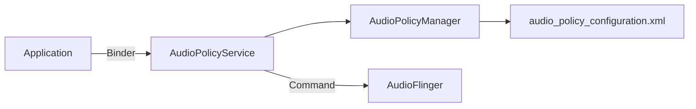

# AudioPolicy 策略管理详解 (AudioPolicy Deep Dive)

如果说 AudioFlinger 是音频系统的“肌肉（执行者）”，那么 `AudioPolicy` 就是“大脑（决策者）”。它决定了音频流应该走哪条路径、音量如何控制以及如何处理音频焦点冲突。

---

## 1. AudioPolicy 的核心职责

1.  **路由决策 (Routing)**：决定音频流从哪个设备输出（如：扬声器、耳机、蓝牙）。
2.  **音量管理 (Volume)**：根据音频类型（Stream Type） and 当前输出设备计算最终音量。
3.  **音频焦点 (Audio Focus)**：协调多个 App 之间的播放冲突。
4.  **配置解析**：读取 `audio_policy_configuration.xml`，了解系统的硬件能力。

---

## 2. 系统架构 (Service vs. Manager)

AudioPolicy 由两个核心部分组成：

*   **AudioPolicyService (APS)**：位于 Native 层，作为 Binder 服务供其他模块调用。
*   **AudioPolicyManager (APM)**：具体的策略逻辑实现类。APS 将几乎所有的决策请求都转发给 APM。

---

## 3. 路由决策流程 (The Routing Decision)

当 App 开始播放音频时，APM 会根据以下三要素进行路由匹配：

1.  **Usage (用途)**：例如 `USAGE_MEDIA` (音乐), `USAGE_ALARM` (闹钟)。
2.  **ContentType (内容类型)**：例如 `CONTENT_TYPE_MUSIC`, `CONTENT_TYPE_SPEECH`。
3.  **AudioAttributes**：封装了上述信息的对象。

### 3.1 决策链路
**Usage -> Strategy (策略) -> Output Device (输出设备)**

例如：
*   如果 Usage 是 `USAGE_NOTIFICATION`，系统可能映射到 `STRATEGY_SONIFICATION` 策略，该策略倾向于同时从扬声器和耳机输出。

---

## 4. 配置文件解析 (audio_policy_configuration.xml)

这是定义 Android 音频硬件“地图”的文件。它定义了：
*   **Modules**：如 `primary` (主板), `a2dp` (蓝牙), `usb`。
*   **MixPorts**：AudioFlinger 提供的流入口（采样率、格式等）。
*   **DevicePorts**：实际的物理设备（Speaker, Mic, Headset）。
*   **Routes**：定义了 MixPorts 和 DevicePorts 之间哪些是相通的。

---

## 5. 关键参考 (References)

1.  [AOSP Source: AudioPolicyManager.cpp](https://android.googlesource.com/platform/frameworks/av/+/master/services/audiopolicy/managerdefault/AudioPolicyManager.cpp)
2.  [Android Configuration: Audio Policy](https://source.android.com/devices/audio/config-policy)

---
*Next Topic: [Audio HAL 与 ALSA 底层驱动](../06-AudioHAL.md)*
