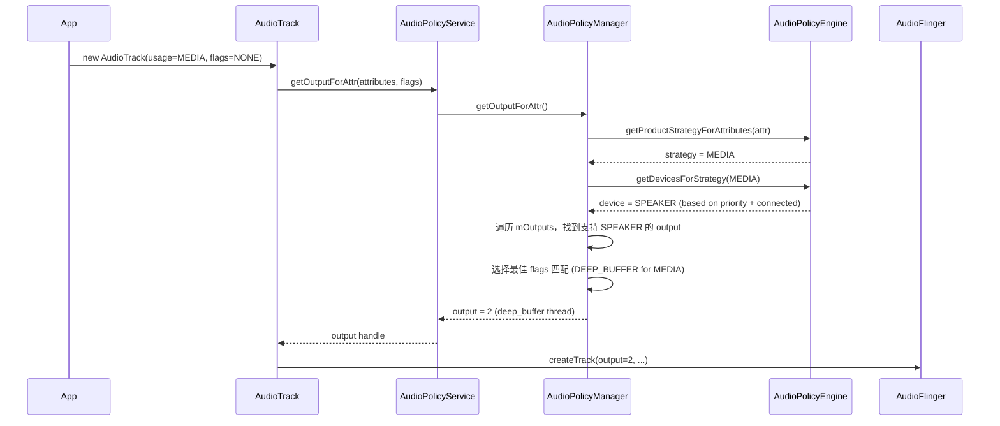
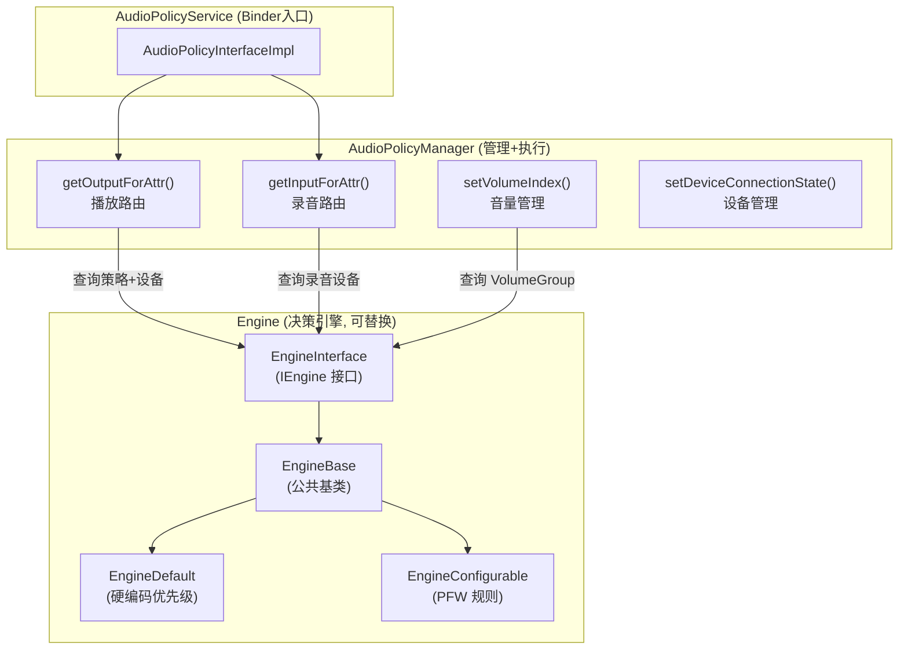
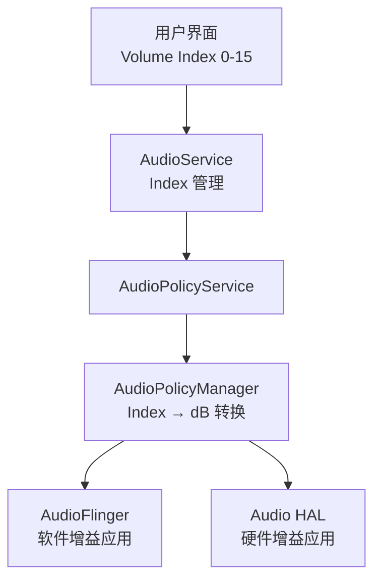
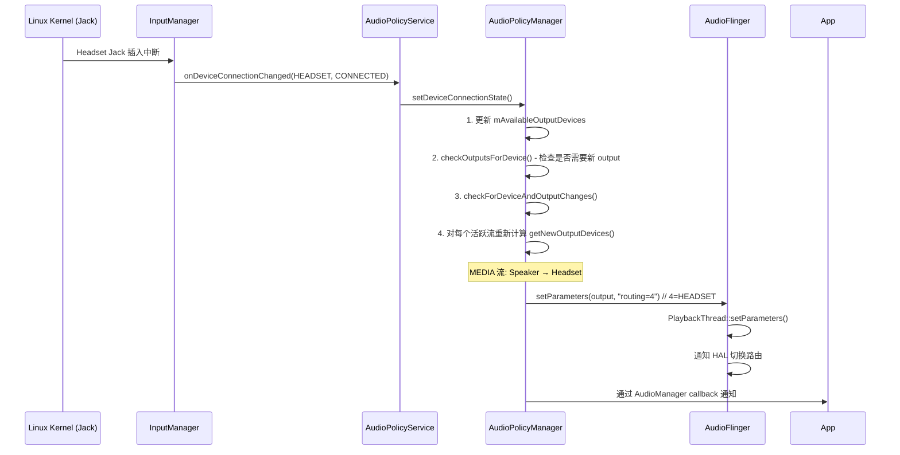

# AudioPolicy 策略管理深度解析

`AudioPolicy` 是 Android 音频系统的“大脑”，负责回答一个终极问题：**“在这个时刻，这路声音，应该发往哪个物理设备？”**

---

## 1. 启动与初始化全链路 (Initialization)

`AudioPolicy` 服务紧随 `AudioFlinger` 之后由 `audioserver` 进程启动。

### 1.1 生命周期入口：onFirstRef()
在 `AudioPolicyService` 实例化时，会执行关键配置：
1.  **创建命令线程**：启动 `AudioCommandThread`，负责执行异步的路由切换。
2.  **加载 Manager**：调用 `loadAudioPolicyManager()`。
3.  **实例化内核**：系统根据 `libaudiopolicyengine.so` 的厂商实现，动态创建 `AudioPolicyManager` 实例。

### 1.2 配置文件解析 (Serialization)
`AudioPolicyManager` 在构造函数中调用 `loadConfig()`。其核心是 `PolicySerializer`，它递归地将 XML 标签转换为 C++ 对象模型。

| XML 标签 | C++ 实体类 | 核心职责 |
| :--- | :--- | :--- |
| `<module>` | `HwModule` | 代表一个硬件库（如 `primary`, `usb`）。 |
| `<mixPort>` | `IOProfile` | 代表流入口。定义了采样率、格式及 `maxActiveCount`。 |
| `<devicePort>`| `DeviceDescriptor` | 代表物理设备（如 `SPEAKER`, `WIRED_HEADSET`）。 |
| `<route>` | `AudioRoute` | 定义 `mixPort` 到 `devicePort` 的拓扑通路。 |

### 1.3 audio_policy_configuration.xml 完整结构解析

```xml
<audioPolicyConfiguration version="7.0">
  <!-- 全局配置 -->
  <globalConfiguration speaker_drc_enabled="true"/>
  
  <modules>
    <!-- ============ 主硬件模块 ============ -->
    <module name="primary" halVersion="3.0">
      <attachedDevices>
        <item>Speaker</item>         <!-- 开机即在线的设备 -->
        <item>Built-In Mic</item>
      </attachedDevices>
      <defaultOutputDevice>Speaker</defaultOutputDevice>
      
      <mixPorts>
        <!-- 每个 mixPort 对应 AudioFlinger 的一个 PlaybackThread -->
        <mixPort name="primary output" role="source"
                 flags="AUDIO_OUTPUT_FLAG_PRIMARY">
          <profile name="" format="AUDIO_FORMAT_PCM_16_BIT"
                   samplingRates="48000" channelMasks="AUDIO_CHANNEL_OUT_STEREO"/>
        </mixPort>
        
        <mixPort name="deep_buffer" role="source"
                 flags="AUDIO_OUTPUT_FLAG_DEEP_BUFFER">
          <profile name="" format="AUDIO_FORMAT_PCM_16_BIT"
                   samplingRates="48000" channelMasks="AUDIO_CHANNEL_OUT_STEREO"/>
        </mixPort>
        
        <mixPort name="low_latency" role="source"
                 flags="AUDIO_OUTPUT_FLAG_FAST">
          <profile name="" format="AUDIO_FORMAT_PCM_16_BIT"
                   samplingRates="48000" channelMasks="AUDIO_CHANNEL_OUT_STEREO"/>
        </mixPort>
        
        <mixPort name="compress_offload" role="source"
                 flags="AUDIO_OUTPUT_FLAG_DIRECT|AUDIO_OUTPUT_FLAG_COMPRESS_OFFLOAD|AUDIO_OUTPUT_FLAG_NON_BLOCKING">
          <profile name="" format="AUDIO_FORMAT_AAC_LC"
                   samplingRates="44100,48000" channelMasks="AUDIO_CHANNEL_OUT_STEREO"/>
        </mixPort>
        
        <!-- 录音端 -->
        <mixPort name="primary input" role="sink">
          <profile name="" format="AUDIO_FORMAT_PCM_16_BIT"
                   samplingRates="8000,16000,48000"
                   channelMasks="AUDIO_CHANNEL_IN_MONO,AUDIO_CHANNEL_IN_STEREO"/>
        </mixPort>
      </mixPorts>
      
      <devicePorts>
        <devicePort tagName="Speaker" type="AUDIO_DEVICE_OUT_SPEAKER" role="sink"/>
        <devicePort tagName="Wired Headset" type="AUDIO_DEVICE_OUT_WIRED_HEADSET" role="sink"/>
        <devicePort tagName="BT SCO Headset" type="AUDIO_DEVICE_OUT_BLUETOOTH_SCO_HEADSET" role="sink"/>
        <devicePort tagName="Built-In Mic" type="AUDIO_DEVICE_IN_BUILTIN_MIC" role="source"/>
      </devicePorts>
      
      <routes>
        <!-- route: 定义 mixPort 可以连接到哪些 devicePort -->
        <route type="mix" sink="Speaker"
               sources="primary output,deep_buffer,low_latency"/>
        <route type="mix" sink="Wired Headset"
               sources="primary output,deep_buffer,low_latency"/>
        <route type="mix" sink="BT SCO Headset"
               sources="primary output"/>
      </routes>
    </module>
    
    <!-- ============ USB 模块 ============ -->
    <module name="usb" halVersion="2.0">
      <!-- ... -->
    </module>
    
    <!-- ============ 蓝牙 A2DP 模块 ============ -->
    <module name="a2dp" halVersion="2.0">
      <!-- ... -->
    </module>
  </modules>
</audioPolicyConfiguration>
```

**关键理解**：
*   `<route>` 决定了“哪些流能发往哪些设备”，是路由的**物理约束**
*   `flags` 决定了 AudioFlinger 创建哪种类型的线程
*   `maxActiveCount`（默认无限）可限制并发流数，常用于 DIRECT output

---

## 2. AOSP 源码目录结构详解

AudioPolicy 源码位于 `frameworks/av/services/audiopolicy/`，按职责分为多个子目录：

```
frameworks/av/services/audiopolicy/
├── service/                          ← AudioPolicyService (Binder 服务入口)
├── managerdefault/                   ← AudioPolicyManager (核心路由管理)
├── common/                           ← 公共数据结构 & 描述符
├── engine/                           ← Engine 接口 + 公共基类
│   ├── interface/                    ← IEngine 抽象接口定义
│   └── common/                       ← EngineBase 公共逻辑
├── enginedefault/                    ← 默认路由引擎 (硬编码优先级)
├── engineconfigurable/               ← 可配置路由引擎 (PFW 规则)
└── config/                           ← XML 解析器 (PolicySerializer)
```

### 2.1 service/ — Binder 服务层

```
service/
├── AudioPolicyService.cpp            ← Binder 服务主体, 接收 Framework 层调用
├── AudioPolicyService.h
├── AudioPolicyInterfaceImpl.cpp      ← IAudioPolicyService 接口的具体实现
│     实现方法:
│       getOutputForAttr()            → 播放路由入口
│       getInputForAttr()             → 录音路由入口
│       startOutput() / stopOutput()  → 通知流开始/停止
│       startInput() / stopInput()    → 通知录音开始/停止
│       setDeviceConnectionState()    → 设备插拔通知
│       setForceUse()                 → 强制路由 (如: 强制扬声器)
│
├── AudioPolicyClientImpl.cpp         ← 反向调用 AudioFlinger 的客户端
│     实现方法:
│       loadHwModule()                → 加载 HAL 库 (primary/usb/a2dp)
│       openOutput()                  → 创建 PlaybackThread
│       openInput()                   → 创建 RecordThread
│       closeOutput() / closeInput()
│       createAudioPatch()            → 建立端到端音频连接
│       setParameters()               → 向 HAL 发送参数
│
└── AudioPolicyEffects.cpp            ← 管理 audio_effects.xml 中的自动挂载效果
      读取 /vendor/etc/audio_effects.xml
      根据 input source / output stream 自动添加效果
      例: VOICE_COMMUNICATION → 自动挂载 AEC + NS
```

```
调用关系:

  Java AudioService / AudioManager
        ↓ (Binder IPC)
  AudioPolicyService (service/)
        ↓ (委托)
  AudioPolicyManager (managerdefault/)
        ↓ (查询策略)
  Engine (enginedefault/ 或 engineconfigurable/)
        ↓ (结果返回)
  AudioPolicyManager
        ↓ (执行路由切换)
  AudioPolicyClientImpl → AudioFlinger
```

### 2.2 managerdefault/ — 核心路由管理器

```
managerdefault/
├── AudioPolicyManager.cpp            ← 路由决策核心实现 (~8000 行, 最重要的文件)
└── AudioPolicyManager.h

AudioPolicyManager 核心职责:
  1. 配置解析: loadConfig() → PolicySerializer 解析 XML → 构建 HwModule 树
  2. 设备管理: setDeviceConnectionState() → 维护已连接设备列表
  3. 播放路由: getOutputForAttr() → 为音频流选择 output + device
  4. 录音路由: getInputForAttr() → 为录音请求选择 input + device
  5. 音量管理: setVolumeIndexForAttributes() → Index 转 dB 并下发
  6. AudioPatch: createAudioPatch() → 建立端到端音频连接
  7. 设备变化: checkForDeviceAndOutputChanges() → 重新路由所有活跃流

关键数据成员:
  mOutputs:                SwAudioOutputCollection   ← 所有已打开的 output
  mInputs:                 SwAudioInputCollection    ← 所有已打开的 input
  mAvailableOutputDevices: DeviceVector              ← 当前已连接的输出设备
  mAvailableInputDevices:  DeviceVector              ← 当前已连接的输入设备
  mEngine:                 EngineInstance*            ← 路由引擎指针
  mHwModules:              HwModuleCollection         ← 所有硬件模块
  mAudioPatches:           AudioPatchCollection       ← 当前活跃的 Patch

核心方法调用关系 (播放):
  getOutputForAttr()
    → mEngine->getProductStrategyForAttributes(attr)     // 获取策略
    → mEngine->getOutputDevicesForAttributes(attr, ...)  // 获取设备
    → getOutputForDevices(devices, flags)                 // 找到 output
       → 遍历 mOutputs, 匹配 device + flags

核心方法调用关系 (录音):
  getInputForAttr()
    → mEngine->getInputDeviceForAttributes(attr)         // 获取录音设备
    → getInputProfile(device, samplingRate, format, ...)  // 找到 input profile
    → mpClientInterface->openInput(...)                   // 打开 RecordThread
```

### 2.3 engine/interface/ — 引擎抽象接口

```
engine/interface/
└── EngineInterface.h                 ← IEngine 核心接口

IEngine 关键接口方法:

  // ===== 播放路由 =====
  getProductStrategyForAttributes(const audio_attributes_t &attr)
    → 将 AudioAttributes (usage + content_type) 映射为 ProductStrategy

  getOutputDevicesForAttributes(attr, availableDevices, outputs)
    → 根据 Strategy + 已连接设备 + ForceUse → 选择输出设备

  // ===== 录音路由 =====
  getInputDeviceForAttributes(const audio_attributes_t &attr,
                               sp<AudioPolicyMix> *mix = nullptr)
    → 根据 AudioAttributes (source) → 选择输入设备

  // ===== 音量/流映射 =====
  getStreamTypeForAttributes(attr)
    → 将 AudioAttributes 映射为 audio_stream_type_t (兼容旧版音量接口)

  getVolumeGroupForAttributes(attr)
    → 获取音量组 (统一音量控制)

  // ===== ForceUse 控制 =====
  setForceUse(audio_policy_force_use_t usage, audio_policy_forced_cfg_t config)
    → 强制路由覆盖: 如 FOR_COMMUNICATION → FORCE_BT_SCO (强制蓝牙通话)

  getForceUse(audio_policy_force_use_t usage)
    → 查询当前 ForceUse 设置
```

### 2.4 enginedefault/ — 默认引擎 (硬编码优先级)

```
enginedefault/
├── src/
│   └── Engine.cpp                    ← 核心: 设备选择优先级 (硬编码 C++)
├── include/
│   └── AudioPolicyEngineInstance.h
└── Android.bp                        → 编译为 libaudiopolicyenginedefault.so

核心函数:
  - getDevicesForProductStrategy()   ← 播放设备选择 (按 Strategy 分支)
  - getDeviceForInputSource()        ← 录音设备选择 (按 Source 分支)

两者均为巨大的 switch-case, 基于 ForceUse + 已连接设备 做优先级判断。
→ 播放设备选择详解见 §4.4
→ 录音设备选择 AOSP 源码分析见 §5.2.1
```

### 2.5 engineconfigurable/ — 可配置引擎 (PFW)

```
engineconfigurable/
├── src/
│   └── Engine.cpp                    ← PFW 引擎入口
├── parameter-framework/              ← PFW 插件
│   ├── plugin/                       ← 自定义 PFW 插件 (Device/Strategy/Stream)
│   └── examples/                     ← 配置示例
├── wrapper/
│   └── ParameterManagerWrapper.cpp   ← 封装 PFW 的 C++ 接口
└── Android.bp                        → 编译为 libaudiopolicyengineconfigurable.so

通过 Parameter Framework (PFW) 将路由决策外部化为 XML 规则, 无需改 C++ 代码。
适用于 AAOS 车载多音区等需要灵活定制路由的场景。
→ PFW 完整架构、Criteria、Rules 配置详解见 §4.5
```

### 2.6 common/ — 公共数据结构

```
common/managerdefinitions/src/
├── AudioOutputDescriptor.cpp    ← 封装一个已打开的 output (PlaybackThread)
├── AudioInputDescriptor.cpp     ← 封装一个已打开的 input (RecordThread)
├── DeviceDescriptor.cpp         ← 设备描述: type + address + name + encodedFormats
├── HwModule.cpp                 ← 硬件模块: 包含 IOProfile + DeviceDescriptor
├── IOProfile.cpp                ← I/O 配置: 采样率/格式/通道/flags/支持的设备列表
├── AudioRoute.cpp               ← mixPort → devicePort 拓扑连接
├── ClientDescriptor.cpp         ← 一个 AudioTrack/AudioRecord 客户端
├── AudioPolicyMix.cpp           ← 动态 Policy Mix (registerAudioPolicy)
└── Serializer.cpp               ← XML 序列化/反序列化 (PolicySerializer)

关键类关系图:
  HwModule (e.g. "primary")
    ├── mOutputProfiles[]
    │     ├── IOProfile "deep_buffer" (role=SOURCE, flags=DEEP_BUFFER)
    │     │     └── supportedDevices: [Speaker, Headset, USB]
    │     ├── IOProfile "low_latency" (role=SOURCE, flags=FAST)
    │     │     └── supportedDevices: [Speaker, Headset]
    │     └── IOProfile "compress_offload" (role=SOURCE, flags=DIRECT|COMPRESS)
    │           └── supportedDevices: [Speaker, Headset, BT_A2DP]
    ├── mInputProfiles[]
    │     └── IOProfile "primary input" (role=SINK)
    │           └── supportedDevices: [Built-In Mic, Headset Mic, BT SCO]
    └── mDeclaredDevices[]
          ├── DeviceDescriptor "Speaker" (type=OUT_SPEAKER)
          ├── DeviceDescriptor "Headset" (type=OUT_WIRED_HEADSET)
          └── DeviceDescriptor "Built-In Mic" (type=IN_BUILTIN_MIC)

  运行时:
  AudioOutputDescriptor (对应一个 PlaybackThread)
    ├── mProfile → IOProfile ("deep_buffer")
    ├── mDevices → DeviceVector [当前路由到的设备]
    ├── mClients → TrackClientDescriptor 列表 [正在播放的 Track]
    ├── mFlags   → AUDIO_OUTPUT_FLAG_DEEP_BUFFER
    └── mId      → audio_io_handle_t (AudioFlinger 中的 thread ID)

  AudioInputDescriptor (对应一个 RecordThread)
    ├── mProfile → IOProfile ("primary input")
    ├── mDevice  → DeviceDescriptor [当前录音设备]
    ├── mClients → RecordClientDescriptor 列表
    └── mId      → audio_io_handle_t
```

### 2.7 config/ — XML 解析器

```
config/
├── src/
│   └── AudioPolicyConfig.cpp
└── include/
    └── AudioPolicyConfig.h

解析流程:
  AudioPolicyManager::loadConfig()
    → PolicySerializer::deserialize("audio_policy_configuration.xml")
      → 解析 <modules>  → HwModule 对象
      → 解析 <mixPorts> → IOProfile 对象
      → 解析 <devicePorts> → DeviceDescriptor 对象
      → 解析 <routes>  → AudioRoute 对象 (建立 mixPort↔devicePort 拓扑)
      → 解析 <xi:include> → 合并多个分片 XML

配置文件搜索优先级: 见 §10.1
```

---

## 3. 路由决策逻辑深度拆解

这是一套基于 **Usage -> Strategy -> Device** 的推导模型。

### 3.1 推导三部曲
1.  **Match Strategy**：App 定义 `Usage` (如 `USAGE_MEDIA`)，系统查询 `getStrategyForUsage()` 得到策略（如 `STRATEGY_MEDIA`）。
2.  **Match Device**：调用核心算法 `getDeviceForStrategy(strategy)`。
    *   **优先级逻辑**：例如在 `STRATEGY_PHONE` 下，优先级顺序为：蓝牙 SCO > 有线耳机 > 听筒 > 扬声器。
3.  **Choose Output**：根据选择的 Device，在 `HwModule` 集合中寻找最匹配的 `IOProfile`，最终找到对应的 `PlaybackThread`。

### 3.2 完整路由决策流程图



### 3.3 设备优先级矩阵 (Device Selection Priority)

| Strategy | 优先级顺序 (从高到低) |
|:---|:---|
| **STRATEGY_PHONE** | BT SCO → Hearing Aid → Wired Headset → Earpiece → Speaker |
| **STRATEGY_MEDIA** | BT A2DP → Hearing Aid → Wired Headset → USB → Speaker |
| **STRATEGY_SONIFICATION** | Speaker (强制) + 当前 MEDIA 设备 (Dual output) |
| **STRATEGY_DTMF** | 跟随 STRATEGY_PHONE 的设备 |
| **STRATEGY_ENFORCED_AUDIBLE** | Speaker (强制外放，如快门声) |

### 3.4 Output 选择策略 (flags 匹配)

确定设备后，还需要选择哪个 Output（即哪个 PlaybackThread）：

```cpp
// AudioPolicyManager::getOutputForDevices()
// 匹配逻辑: 找到支持目标 device 且 flags 最匹配的 output
for (auto& output : mOutputs) {
    // 1. output 必须支持目标 device
    if (!output->supportedDevices().contains(device)) continue;
    
    // 2. flags 匹配优先级:
    //    - DIRECT: 严格匹配
    //    - DEEP_BUFFER: MEDIA 类默认首选
    //    - PRIMARY: 通用后备
    //    - FAST: 低延迟场景专用
    compatScore = computeCompatibilityScore(requestFlags, output->flags);
}
```

| App Usage | 默认匹配的 Flag | 对应 Thread |
|:---|:---|:---|
| MEDIA (音乐) | `DEEP_BUFFER` | MixerThread (大缓冲，省电) |
| NOTIFICATION | `PRIMARY` | MixerThread (主输出) |
| GAME | `FAST` | MixerThread (低延迟) |
| VOICE_COMMUNICATION | `PRIMARY` + 打开回声消除 | MixerThread |
| 无损音乐 (hi-res) | `DIRECT` | DirectOutputThread |

---

## 4. AudioPolicyEngine 深度解析

路由决策的核心逻辑并非固化在 `AudioPolicyManager` 中，而是通过可插拔的 **Engine** 实现。

### 4.1 Engine 在整体架构中的位置



**核心设计思想**：
- `AudioPolicyManager` 负责**管理**（维护 Output/Input 列表、设备列表、Patch）和**执行**（调用 AudioFlinger 开关设备）
- `Engine` 只负责**决策**（告诉 Manager 应该选什么设备）
- 两者通过 `EngineInterface` 解耦，厂商可替换 Engine 而不改 Manager

### 4.2 Engine 类继承与调用关系

```
源码路径与编译产物:

  engine/interface/EngineInterface.h     ← 纯虚接口
  engine/common/src/EngineBase.cpp       ← 公共基类 (策略映射/音量组/ForceUse 存储)
  enginedefault/src/Engine.cpp           ← libaudiopolicyenginedefault.so
  engineconfigurable/src/Engine.cpp      ← libaudiopolicyengineconfigurable.so

类继承:
  EngineInterface (纯虚接口)
    └── EngineBase (实现通用逻辑)
          ├── enginedefault::Engine   ← 手机默认
          └── engineconfigurable::Engine  ← 车载/定制

EngineBase 通用逻辑 (两个引擎共享):
  - loadAudioPolicyEngineConfig(): 解析 audio_policy_engine_configuration.xml
  - ProductStrategy 管理: AudioAttributes ↔ Strategy 映射表
  - VolumeGroup 管理: Strategy ↔ Stream ↔ VolumeGroup 映射
  - ForceUse 存储: mForceUse[] 数组 (设置/查询强制路由)
  - 音量曲线: loadVolumeCurves() → 各 VolumeGroup 的 dB 映射表

Engine-specific 逻辑 (各自实现):
  - getDevicesForProductStrategy()  ← 播放设备选择 (核心差异点!)
  - getDeviceForInputSource()       ← 录音设备选择
```

### 4.3 APM ↔ Engine 完整调用序列

```
═══════════════════════════════════════════════════════════════
场景: App 请求播放音乐 (usage=MEDIA)
═══════════════════════════════════════════════════════════════

AudioPolicyManager::getOutputForAttr(attr, ...)
  │
  │  ① 获取 ProductStrategy
  ├──→ mEngine->getProductStrategyForAttributes(attr)
  │      EngineBase 实现:
  │        遍历 mProductStrategies (从 XML 加载的映射表)
  │        匹配 attr.usage == USAGE_MEDIA
  │        → 返回 PRODUCT_STRATEGY_MEDIA
  │
  │  ② 获取应选输出设备
  ├──→ mEngine->getOutputDevicesForAttributes(attr, availableDevices, outputs)
  │      EngineDefault 实现:
  │        → getDevicesForProductStrategy(PRODUCT_STRATEGY_MEDIA)
  │           switch(strategy) { case MEDIA: ... } (见 section 2.4)
  │        → 返回 DeviceVector {BT_A2DP} 或 {SPEAKER}
  │
  │      EngineConfigurable 实现:
  │        → ParameterManagerWrapper::getDeviceForStrategy(MEDIA)
  │           PFW 查询: applyConfiguration() → 匹配规则 → 返回设备
  │        → 返回 DeviceVector {BT_A2DP} 或 {SPEAKER}
  │
  │  ③ APM 自己完成: 根据设备找到最佳 Output
  ├──→ getOutputForDevices(devices, session, flags)
  │      遍历 mOutputs:
  │        - output 必须支持目标 device
  │        - output flags 与请求 flags 匹配度最高
  │      → 返回 output handle (e.g. deep_buffer thread)
  │
  └──→ 返回给调用者: (output, selectedDevice, strategy)

═══════════════════════════════════════════════════════════════
场景: App 请求录音 (source=VOICE_COMMUNICATION)
═══════════════════════════════════════════════════════════════

AudioPolicyManager::getInputForAttr(attr, ...)
  │
  │  ① 获取录音设备
  ├──→ mEngine->getInputDeviceForAttributes(attr)
  │      EngineDefault 实现:
  │        → getDeviceForInputSource(VOICE_COMMUNICATION)
  │           if (ForceUse(FOR_COMMUNICATION) == FORCE_BT_SCO
  │               && isConnected(BT_SCO_HEADSET))
  │             → BT_SCO_HEADSET
  │           if (isConnected(WIRED_HEADSET))
  │             → WIRED_HEADSET
  │           → BUILTIN_MIC
  │
  │  ② APM 自己完成: 查找 InputProfile + 打开 Input
  └──→ (后续见 section 5.1)

═══════════════════════════════════════════════════════════════
场景: 设备连接状态变化 (耳机插入)
═══════════════════════════════════════════════════════════════

AudioPolicyManager::setDeviceConnectionState(HEADSET, CONNECTED)
  │
  ├── 更新 mAvailableOutputDevices / mAvailableInputDevices
  │
  ├── checkForDeviceAndOutputChanges()
  │     对每个活跃的 output/strategy:
  │       ① 重新查询 Engine:
  │          mEngine->getOutputDevicesForAttributes(...)
  │            → 由于 HEADSET 已连接, MEDIA 策略现在返回 HEADSET
  │       ② 如果设备变了 → setOutputDevices(output, newDevices)
  │            → createAudioPatch() 或 setParameters("routing=...")
  │
  └── 对 EngineConfigurable:
        wrapper->setCriterionValue("AvailableOutputDevices",
                                    SPEAKER|HEADSET|BT_A2DP)
        → PFW 自动 re-evaluate 所有 Domain → 可能改变多个 Strategy 的设备
```

### 4.4 Default Engine 详解

```
文件: frameworks/av/services/audiopolicy/enginedefault/src/Engine.cpp
编译产物: libaudiopolicyenginedefault.so

核心函数签名:
  DeviceVector Engine::getOutputDevicesForAttributes(
      const audio_attributes_t &attr,
      const DeviceVector &availableOutputDevices,
      const SwAudioOutputCollection &outputs) const

内部实现:
  1. getProductStrategyForAttributes(attr) → strategy
  2. getDevicesForProductStrategy(strategy):
       → 大 switch-case, 检查 ForceUse + 已连接设备
       → 返回 DeviceVector

完整优先级 (STRATEGY_MEDIA):
  ┌────┬──────────────────────────────────┬────────────────────────┐
  │ 序 │ 条件                              │ 选择的设备              │
  ├────┼──────────────────────────────────┼────────────────────────┤
  │ 1  │ Hearing Aid 已连接                │ HEARING_AID            │
  │ 2  │ BT A2DP 已连接                   │ BT_A2DP                │
  │    │ 且 ForceUse != FORCE_NO_BT_A2DP  │                        │
  │ 3  │ BT LE Audio 已连接               │ BLE_HEADSET            │
  │ 4  │ 有线耳机已连接                    │ WIRED_HEADSET          │
  │ 5  │ USB 设备已连接                    │ USB_DEVICE/USB_HEADSET │
  │ 6  │ HDMI 已连接                      │ AUX_DIGITAL            │
  │ 7  │ Dock 已连接且 ForceUse=DOCK      │ ANLG_DOCK/DGTL_DOCK    │
  │ 8  │ 以上都不满足                      │ SPEAKER (默认)         │
  └────┴──────────────────────────────────┴────────────────────────┘

ForceUse 触发场景:
  用户按 "免提" → AudioService.setForceUse(FOR_COMMUNICATION, FORCE_SPEAKER)
    → APM 转发给 Engine: mEngine->setForceUse(FOR_COMMUNICATION, FORCE_SPEAKER)
    → Engine 存储到 mForceUse[FOR_COMMUNICATION] = FORCE_SPEAKER
    → APM 调用 checkForDeviceAndOutputChanges() 重新路由
    → STRATEGY_PHONE: EARPIECE → SPEAKER

优缺点:
  ✅ 代码直观, 容易用 logcat 跟踪决策过程
  ✅ 执行效率高 (纯 C++ 条件判断)
  ❌ OEM 修改需改源码重编译 → 不利于产品线差异化
  ❌ 无法动态调整优先级 (如: 某款车需要 USB 优先于 BT)
```

### 4.5 Configurable Engine (PFW) 详解

```
文件: frameworks/av/services/audiopolicy/engineconfigurable/
编译产物: libaudiopolicyengineconfigurable.so

PFW 三大核心概念:

  1. Criteria (决策条件):
     定义系统当前状态变量, Engine 负责实时更新:
     ┌──────────────────────────────┬─────────────────────────────────┐
     │ Criterion 名称                │ 值的含义                         │
     ├──────────────────────────────┼─────────────────────────────────┤
     │ AvailableOutputDevices       │ 位掩码: 当前已连接的输出设备      │
     │ AvailableInputDevices        │ 位掩码: 当前已连接的输入设备      │
     │ TelephonyMode                │ 枚举: Normal/Ringtone/InCall/... │
     │ ForceUseForCommunication     │ 枚举: None/Speaker/BtSco        │
     │ ForceUseForMedia             │ 枚举: None/NoBtA2dp/Speaker     │
     │ ForceUseForRecord            │ 枚举: None/BtSco                │
     └──────────────────────────────┴─────────────────────────────────┘
  
  2. Domains (决策域):
     每个 Domain 对应一个要决定的参数 (如: MEDIA 策略的输出设备)
     Domain 内部有多个 Configuration (配置项), 按优先级排列
  
  3. Rules (规则):
     每个 Configuration 有一条规则, 描述 "在什么条件下选择此配置"

完整配置文件关系:

  audio_policy_engine_configuration.xml (入口)
    ├── <productStrategies>
    │     <ProductStrategy name="STRATEGY_MEDIA">
    │       <AttributesGroup usage="USAGE_MEDIA" content_type="CONTENT_TYPE_MUSIC"/>
    │       <AttributesGroup usage="USAGE_GAME"/>
    │     </ProductStrategy>
    │
    ├── <criterionTypes>
    │     <criterion_type name="OutputDevicesMaskType" type="inclusive">
    │       <values>
    │         <value literal="Speaker" numerical="0x2"/>
    │         <value literal="WiredHeadset" numerical="0x4"/>
    │         <value literal="BtA2dp" numerical="0x80"/>
    │       </values>
    │     </criterion_type>
    │
    ├── <criteria>
    │     <criterion name="AvailableOutputDevices"
    │                type="OutputDevicesMaskType" default="Speaker"/>
    │
    └── 引用 PFW Settings 文件:
          <Settings> → 外部 XML 文件定义 Domain/Rule

PFW Settings 文件示例 (决策规则):

  <Domain name="DeviceForStrategy.Media">
    <Configuration name="BtA2dp" priority="0">  ← 最高优先级
      <CompoundRule Type="All">
        <SelectionCriterionRule SelectionCriterion="AvailableOutputDevices"
                                MatchesWhen="Includes" Value="BtA2dp"/>
        <SelectionCriterionRule SelectionCriterion="ForceUseForMedia"
                                MatchesWhen="IsNot" Value="ForceNoBtA2dp"/>
      </CompoundRule>
      <Parameter name="device">BtA2dp</Parameter>
    </Configuration>
    
    <Configuration name="WiredHeadset" priority="1">
      <CompoundRule Type="All">
        <SelectionCriterionRule SelectionCriterion="AvailableOutputDevices"
                                MatchesWhen="Includes" Value="WiredHeadset"/>
      </CompoundRule>
      <Parameter name="device">WiredHeadset</Parameter>
    </Configuration>
    
    <Configuration name="Speaker" priority="2">  ← 默认 (最低优先级)
      <CompoundRule Type="All"/>  ← 无条件, 永真
      <Parameter name="device">Speaker</Parameter>
    </Configuration>
  </Domain>

运行时调用流程:
  1. 设备变化 → APM 调用 Engine::setDeviceConnectionState()
  2. Engine → ParameterManagerWrapper::setCriterionValue(
       "AvailableOutputDevices", SPEAKER|BT_A2DP)
  3. PFW::applyConfiguration() → 遍历所有 Domain
  4. 每个 Domain 按 priority 顺序检查 Configuration 的 Rule
  5. 第一个 Rule 匹配成功 → 该 Configuration 的 Parameter 生效
  6. APM 读取结果: wrapper->getDeviceForStrategy("MEDIA") → BT_A2DP

调试 PFW:
  # 查看当前所有 Criteria 值
  adb shell parameter-connector getParameter /Audio/...
  
  # 查看某个 Domain 当前选中的 Configuration
  adb shell dumpsys media.audio_policy | grep -A 5 "PFW"

优缺点:
  ✅ 路由规则完全可配置, OEM 无需改 C++ 代码
  ✅ 适合车载多音区 / 多 Bus 等复杂场景
  ✅ 同一二进制支持不同产品线 (换 XML 即可)
  ❌ 学习成本高, PFW 文档稀少
  ❌ 运行时 Rule 匹配有额外开销
  ❌ 调试困难 (不如 C++ 直接打断点)
```

### 4.6 如何选择 Engine

| 场景 | 推荐引擎 | 理由 |
|:---|:---|:---|
| 标准手机 | `enginedefault` | 逻辑简单、性能好、AOSP 默认 |
| AAOS 车载 | `engineconfigurable` | 多音区多 Bus、OEM 需灵活定制路由 |
| IoT/穿戴 | `enginedefault` | 设备少、路由简单 |
| 需要动态切换策略 | `engineconfigurable` | 可热更新 XML 不重编译 |

**编译选择方式**（`device.mk`）：
```makefile
# 手机 (默认)
PRODUCT_PACKAGES += libaudiopolicyenginedefault

# 车载
PRODUCT_PACKAGES += libaudiopolicyengineconfigurable
```

**运行时加载**：`AudioPolicyManager` 构造函数中通过 `dlopen` 加载对应 `.so`，系统只会存在一个 Engine 实例。

---

## 5. 录音设备选择详解 (Recording Device Selection)

### 5.1 getInputForAttr() 完整调用链

```
App: new AudioRecord(source=VOICE_RECOGNITION, sampleRate=16000, ...)
  ↓ (Binder)
AudioPolicyService::getInputForAttr()
  ↓
AudioPolicyManager::getInputForAttr(attr, input, session, uid, ...)
  │
  ├── Step 1: 确定录音设备
  │     mEngine->getInputDeviceForAttributes(attr)
  │       → 根据 audio_attributes_t.source 选择设备
  │       → 例: SOURCE_VOICE_RECOGNITION → BUILTIN_MIC
  │       → 例: SOURCE_VOICE_COMMUNICATION + BT SCO 连接 → BT_SCO_HEADSET
  │
  ├── Step 2: 检查权限与并发
  │     → SOURCE_VOICE_UPLINK 需要 CAPTURE_AUDIO_OUTPUT 权限
  │     → 检查并发录音冲突 (见 5.3)
  │
  ├── Step 3: 查找合适的 InputProfile
  │     getInputProfile(device, sampleRate, format, channelMask, flags)
  │       → 遍历所有 HwModule 的 mInputProfiles
  │       → 找到支持目标 device + 采样率 + 格式的 IOProfile
  │
  ├── Step 4: 打开 Input (如果新的 profile)
  │     mpClientInterface->openInput(module, &input, ...)
  │       → AudioFlinger 创建 RecordThread
  │       → 返回 audio_io_handle_t
  │
  └── Step 5: 注册客户端
        addInput(input, inputDesc)
        inputDesc->addClient(clientDesc)
```

### 5.2 录音 Source → 设备 → 处理 完整映射

```
┌───────────────────────────┬──────────────────────┬──────────────────────────┐
│ AudioSource               │ 默认设备             │ 系统自动应用的处理         │
├───────────────────────────┼──────────────────────┼──────────────────────────┤
│ DEFAULT / MIC             │ BUILTIN_MIC          │ 平台默认 3A              │
│ VOICE_UPLINK             │ TELEPHONY_RX         │ 无 (原始下行)            │
│ VOICE_DOWNLINK           │ TELEPHONY_RX         │ 无                       │
│ VOICE_CALL               │ TELEPHONY_RX + MIC   │ 上下行混合               │
│ CAMCORDER                │ BACK_MIC             │ 轻度降噪, 保留环境声     │
│ VOICE_RECOGNITION        │ BUILTIN_MIC          │ 自动增益 (AGC)           │
│ VOICE_COMMUNICATION      │ BUILTIN_MIC/BT_SCO   │ AEC + NS + AGC (全套 3A) │
│ UNPROCESSED              │ BUILTIN_MIC          │ 无处理 (Raw PCM)         │
│ VOICE_PERFORMANCE        │ BUILTIN_MIC          │ 低延迟, 无 AEC           │
│ HOTWORD                  │ BUILTIN_MIC (LPI)    │ 低功耗路径, 持续监听      │
│ ECHO_REFERENCE           │ ECHO_REFERENCE       │ 回采信号 (给 AEC 用)     │
└───────────────────────────┴──────────────────────┴──────────────────────────┘

设备选择受 ForceUse 影响:
  ForceUse(FOR_RECORD) == FORCE_BT_SCO
    → VOICE_RECOGNITION / VOICE_COMMUNICATION 使用 BT_SCO_HEADSET
  ForceUse(FOR_COMMUNICATION) == FORCE_SPEAKER
    → VOICE_COMMUNICATION 仍用 BUILTIN_MIC (免提通话用主 MIC)

有线耳机自动切换:
  耳机插入且 source != CAMCORDER:
    → 切换到 WIRED_HEADSET (耳机线控 MIC)
  耳机插入且 source == CAMCORDER:
    → 保持 BACK_MIC (摄像场景不用耳机 MIC)
```

### 5.2.1 Source → 设备选择的底层决策逻辑

上表只列出了"默认设备"，实际选择由 Engine 内部的 `getDeviceForInputSource()` 函数完成，**依据三层叠加规则**：

```
═══════════════════════════════════════════════════════════════════
三层决策模型:
═══════════════════════════════════════════════════════════════════

  ┌─────────────────────────────────────────────────────────────┐
  │ 第一层: source 语义 → 决定"设备类别"                         │
  │                                                              │
  │  不同 source 在物理上需要不同的采集点:                        │
  │                                                              │
  │  SOURCE_MIC / VOICE_*      → 通话类 MIC (前置, 靠近嘴)     │
  │  SOURCE_CAMCORDER          → 后置 MIC (靠近摄像头)          │
  │  SOURCE_VOICE_CALL         → TELEPHONY_RX (Modem 侧信号)   │
  │  SOURCE_ECHO_REFERENCE    → 回采通道 (DAC 输出端 loopback) │
  │                                                              │
  │  这一层是固定的语义映射, 不随设备连接状态变化                 │
  ├─────────────────────────────────────────────────────────────┤
  │ 第二层: ForceUse → 可覆盖默认选择                            │
  │                                                              │
  │  由 AudioService / TelecomService 在运行时设置:             │
  │                                                              │
  │  FORCE_BT_SCO  → 强制蓝牙 SCO MIC (通话切 BT 耳机时)       │
  │  FORCE_SPEAKER → 免提模式, 但录音仍用 BUILTIN_MIC           │
  │  FORCE_NONE    → 不强制, 走正常优先级                        │
  │                                                              │
  │  ForceUse 优先级最高, 一旦设置, 跳过第三层的优先级排序       │
  ├─────────────────────────────────────────────────────────────┤
  │ 第三层: availableDevices → 按固定优先级选第一个已连接的设备  │
  │                                                              │
  │  通用 MIC 类 source (MIC/VOICE_RECOGNITION/VOICE_COMM/      │
  │  VOICE_PERFORMANCE/UNPROCESSED/HOTWORD) 共用的优先级:        │
  │                                                              │
  │    优先级 1: BT_SCO_HEADSET     (仅当 ForceUse=BT_SCO)      │
  │    优先级 2: WIRED_HEADSET      (有线耳机自带 MIC)           │
  │    优先级 3: USB_HEADSET        (USB 耳机)                   │
  │    优先级 4: USB_DEVICE         (USB 外接 MIC)               │
  │    优先级 5: BLUETOOTH_BLE      (BLE 音频输入, Android 13+)  │
  │    优先级 6: BUILTIN_MIC        (内置 MIC, 默认兜底)         │
  │                                                              │
  │  核心思想: 外接设备 > 内置设备                                │
  │  (外接 MIC 离嘴更近, 信噪比更高, 用户主动插入 = 主动选择)    │
  └─────────────────────────────────────────────────────────────┘
```

**AOSP 源码分析** — 来自 `frameworks/av/services/audiopolicy/enginedefault/src/Engine.cpp`（AOSP main 分支）

> 源码链接: https://cs.android.com/android/platform/superproject/main/+/main:frameworks/av/services/audiopolicy/enginedefault/src/Engine.cpp

---

#### Part 1: 函数入口 — 获取上下文 & 通话中强制覆盖

```cpp
sp<DeviceDescriptor> Engine::getDeviceForInputSource(audio_source_t inputSource) const
{
    const DeviceVector availableOutputDevices = getApmObserver()->getAvailableOutputDevices();
    const DeviceVector availableInputDevices = getApmObserver()->getAvailableInputDevices();
    const SwAudioOutputCollection &outputs = getApmObserver()->getOutputs();
    DeviceVector availableDevices = availableInputDevices;
    sp<AudioOutputDescriptor> primaryOutput = outputs.getPrimaryOutput();
    DeviceVector availablePrimaryDevices = primaryOutput == nullptr ? DeviceVector()
            : availableInputDevices.getDevicesFromHwModule(primaryOutput->getModuleHandle());
    sp<DeviceDescriptor> device;

    // when a call is active, force device selection to match source VOICE_COMMUNICATION
    // for most other input sources to avoid rerouting call TX audio
    if (isInCall()) {
        switch (inputSource) {
        case AUDIO_SOURCE_DEFAULT:
        case AUDIO_SOURCE_MIC:
        case AUDIO_SOURCE_VOICE_RECOGNITION:
        case AUDIO_SOURCE_UNPROCESSED:
        case AUDIO_SOURCE_HOTWORD:
        case AUDIO_SOURCE_CAMCORDER:
        case AUDIO_SOURCE_VOICE_PERFORMANCE:
        case AUDIO_SOURCE_ULTRASOUND:
            inputSource = AUDIO_SOURCE_VOICE_COMMUNICATION;
            break;
        default:
            break;
        }
    }
```

**分析：**
- `availableDevices` 就是当前已连接的所有输入设备集合（动态变化）
- `availablePrimaryDevices` 是与 primary output 同一 HW module 的输入设备子集 — 用于限制通话时只能用 primary HAL 上的 MIC
- **关键设计**：`isInCall()` 时几乎所有普通 source 都被**强制重写为 `VOICE_COMMUNICATION`**，避免第三方 App 录音时干扰通话 TX 路由。只有 `VOICE_CALL`、`ECHO_REFERENCE`、`FM_TUNER`、`REMOTE_SUBMIX` 等特殊 source 不受影响

---

#### Part 2: 优先设备 & 禁用设备 过滤

```cpp
    // Use the preferred device for the input source if it is available.
    DeviceVector preferredInputDevices = getPreferredAvailableDevicesForInputSource(
            availableDevices, inputSource);
    if (!preferredInputDevices.isEmpty()) {
        return preferredInputDevices[0];
    }
    // Remove the disabled device for the input source from the available input device list.
    DeviceVector disabledInputDevices = getDisabledDevicesForInputSource(
            availableDevices, inputSource);
    availableDevices.remove(disabledInputDevices);

    audio_devices_t commDeviceType =
        getPreferredDeviceTypeForLegacyStrategy(availableOutputDevices, STRATEGY_PHONE);
```

**分析：**
- `getPreferredAvailableDevicesForInputSource()`：查询 `setCommunicationDevice()` / `setPreferredDeviceForCapturePreset()` 设置的用户偏好设备，**优先级最高，直接返回**
- `getDisabledDevicesForInputSource()`：从可用列表中移除被 API 标记为 disabled 的设备
- `commDeviceType`：获取当前 **STRATEGY_PHONE 策略首选的输出设备类型**（如 BT_SCO_HEADSET、SPEAKER、BLE_HEADSET），后续用它决定录音端是否跟随蓝牙

---

#### Part 3: `DEFAULT` / `MIC` — 通用录音

```cpp
    switch (inputSource) {
    case AUDIO_SOURCE_DEFAULT:
    case AUDIO_SOURCE_MIC:
        device = availableDevices.getDevice(
                AUDIO_DEVICE_IN_BLUETOOTH_A2DP, String8(""), AUDIO_FORMAT_DEFAULT);
        if (device != nullptr) break;
        if (audio_is_bluetooth_out_sco_device(commDeviceType)) {
            device = availableDevices.getDevice(
                    AUDIO_DEVICE_IN_BLUETOOTH_SCO_HEADSET, String8(""), AUDIO_FORMAT_DEFAULT);
            if (device != nullptr) break;
        }
        device = availableDevices.getFirstExistingDevice({
                AUDIO_DEVICE_IN_WIRED_HEADSET,
                AUDIO_DEVICE_IN_USB_HEADSET, AUDIO_DEVICE_IN_USB_DEVICE,
                AUDIO_DEVICE_IN_BLUETOOTH_BLE, AUDIO_DEVICE_IN_BUILTIN_MIC});
        break;
```

**分析：**
- **最高优先**：`BLUETOOTH_A2DP` 输入（A2DP source，如车载 BT 音乐回传，较罕见）
- **BT SCO 条件进入**：仅当当前通话策略的输出设备是 SCO 类时，才尝试 SCO MIC —— 这就是"ForceUse"间接生效的方式（`commDeviceType` 由 `setForceUse(FOR_COMMUNICATION, FORCE_BT_SCO)` 间接影响）
- **固定优先级链**：`WIRED_HEADSET > USB_HEADSET > USB_DEVICE > BLE > BUILTIN_MIC`
- 核心原则：**外接 > 内置**（外接离嘴更近，信噪比更高）

---

#### Part 4: `VOICE_COMMUNICATION` — 通话/VoIP 录音

```cpp
    case AUDIO_SOURCE_VOICE_COMMUNICATION:
        // Allow only use of devices on primary input if in call and HAL does not support routing
        // to voice call path.
        if ((getPhoneState() == AUDIO_MODE_IN_CALL) &&
                (availableOutputDevices.getDevice(AUDIO_DEVICE_OUT_TELEPHONY_TX,
                        String8(""), AUDIO_FORMAT_DEFAULT)) == nullptr) {
            if (!availablePrimaryDevices.isEmpty()) {
                availableDevices = availablePrimaryDevices;
            }
        }

        if (audio_is_bluetooth_out_sco_device(commDeviceType)) {
            device = availableDevices.getDevice(
                    AUDIO_DEVICE_IN_BLUETOOTH_SCO_HEADSET, String8(""), AUDIO_FORMAT_DEFAULT);
            if (device != nullptr) {
                break;
            }
        }
        switch (commDeviceType) {
        case AUDIO_DEVICE_OUT_SPEAKER:
            device = availableDevices.getFirstExistingDevice({
                    AUDIO_DEVICE_IN_BACK_MIC, AUDIO_DEVICE_IN_BUILTIN_MIC,
                    AUDIO_DEVICE_IN_USB_DEVICE, AUDIO_DEVICE_IN_USB_HEADSET});
            break;
        case AUDIO_DEVICE_OUT_BLE_HEADSET:
            device = availableDevices.getDevice(
                    AUDIO_DEVICE_IN_BLE_HEADSET, String8(""), AUDIO_FORMAT_DEFAULT);
            if (device != nullptr) {
                break;
            }
            ALOG("LE Audio selected for communication but input device not available");
            FALLTHROUGH_INTENDED;
        default:    // FORCE_NONE
            device = availableDevices.getFirstExistingDevice({
                    AUDIO_DEVICE_IN_WIRED_HEADSET, AUDIO_DEVICE_IN_USB_HEADSET,
                    AUDIO_DEVICE_IN_USB_DEVICE, AUDIO_DEVICE_IN_BLUETOOTH_BLE,
                    AUDIO_DEVICE_IN_BUILTIN_MIC});
            break;
        }
        break;
```

**分析：**
- **通话模式下 primary HAL 限制**：如果 `TELEPHONY_TX` 输出设备不存在（老旧 HAL < 3.0），则只允许使用 primary HW module 的输入设备，防止跨 HAL 路由
- **SCO 最高优先**：与 Part 3 同理，当输出走 SCO 时录音也走 SCO MIC
- **SPEAKER 免提模式特殊分支**：优先用 `BACK_MIC` 做 AEC 参考（远离扬声器），其次 `BUILTIN_MIC`，然后 USB
- **BLE_HEADSET 分支**：LE Audio 录音优先匹配 BLE 输入设备，找不到则 fallthrough 到 default（有线 > USB > BLE > 内置 MIC）
- **default 子 case** = `FORCE_NONE`，走标准外接优先级链

---

#### Part 5: 语音识别 & HOTWORD

```cpp
    case AUDIO_SOURCE_VOICE_RECOGNITION:
    case AUDIO_SOURCE_UNPROCESSED:
        if (audio_is_bluetooth_out_sco_device(commDeviceType)) {
            device = availableDevices.getDevice(
                    AUDIO_DEVICE_IN_BLUETOOTH_SCO_HEADSET, String8(""), AUDIO_FORMAT_DEFAULT);
            if (device != nullptr) break;
        }
        // we need to make BLUETOOTH_BLE has higher priority than BUILTIN_MIC,
        // because sometimes user want to do voice search by bt remote
        // even if BUILDIN_MIC is available.
        device = availableDevices.getFirstExistingDevice({
                AUDIO_DEVICE_IN_WIRED_HEADSET,
                AUDIO_DEVICE_IN_USB_HEADSET, AUDIO_DEVICE_IN_USB_DEVICE,
                AUDIO_DEVICE_IN_BLUETOOTH_BLE, AUDIO_DEVICE_IN_BUILTIN_MIC});
        break;

    case AUDIO_SOURCE_HOTWORD:
        // We should not use primary output criteria for Hotword but rather limit
        // to devices attached to the same HW module as the build in mic
        if (!availablePrimaryDevices.isEmpty()) {
            availableDevices = availablePrimaryDevices;
        }
        if (audio_is_bluetooth_out_sco_device(commDeviceType)) {
            device = availableDevices.getDevice(
                    AUDIO_DEVICE_IN_BLUETOOTH_SCO_HEADSET, String8(""), AUDIO_FORMAT_DEFAULT);
            if (device != nullptr) break;
        }
        device = availableDevices.getFirstExistingDevice({
                AUDIO_DEVICE_IN_WIRED_HEADSET,
                AUDIO_DEVICE_IN_USB_HEADSET, AUDIO_DEVICE_IN_USB_DEVICE,
                AUDIO_DEVICE_IN_BUILTIN_MIC});
        break;
```

**分析：**
- `VOICE_RECOGNITION` / `UNPROCESSED`：优先级与 `MIC` 相同，但注意 AOSP 注释 — **BLE 优先于 BUILTIN_MIC**，因为用户可能想通过 BT 遥控器做语音搜索
- `HOTWORD`（唤醒词检测）关键区别：
  - **限制为 primary HW module 设备**：唤醒词通常由 DSP 低功耗检测，必须在同一 HAL 内处理
  - **不包含 `BLUETOOTH_BLE`**：低功耗唤醒不走蓝牙（功耗太高）
  - 优先级链中少了 BLE，只有 `WIRED > USB > BUILTIN_MIC`

---

#### Part 6: CAMCORDER & 固定设备映射

```cpp
    case AUDIO_SOURCE_CAMCORDER:
        // For a device without built-in mic, adding usb device
        device = availableDevices.getFirstExistingDevice({
                AUDIO_DEVICE_IN_BACK_MIC, AUDIO_DEVICE_IN_BUILTIN_MIC,
                AUDIO_DEVICE_IN_USB_DEVICE});
        break;

    case AUDIO_SOURCE_VOICE_DOWNLINK:
    case AUDIO_SOURCE_VOICE_CALL:
    case AUDIO_SOURCE_VOICE_UPLINK:
        device = availableDevices.getDevice(
                AUDIO_DEVICE_IN_VOICE_CALL, String8(""), AUDIO_FORMAT_DEFAULT);
        break;

    case AUDIO_SOURCE_VOICE_PERFORMANCE:
        device = availableDevices.getFirstExistingDevice({
                AUDIO_DEVICE_IN_WIRED_HEADSET, AUDIO_DEVICE_IN_USB_HEADSET,
                AUDIO_DEVICE_IN_USB_DEVICE, AUDIO_DEVICE_IN_BLUETOOTH_BLE,
                AUDIO_DEVICE_IN_BUILTIN_MIC});
        break;

    case AUDIO_SOURCE_REMOTE_SUBMIX:
        device = availableDevices.getDevice(
                AUDIO_DEVICE_IN_REMOTE_SUBMIX, String8(""), AUDIO_FORMAT_DEFAULT);
        break;
    case AUDIO_SOURCE_FM_TUNER:
        device = availableDevices.getDevice(
                AUDIO_DEVICE_IN_FM_TUNER, String8(""), AUDIO_FORMAT_DEFAULT);
        break;
    case AUDIO_SOURCE_ECHO_REFERENCE:
        device = availableDevices.getDevice(
                AUDIO_DEVICE_IN_ECHO_REFERENCE, String8(""), AUDIO_FORMAT_DEFAULT);
        break;
    case AUDIO_SOURCE_ULTRASOUND:
        device = availableDevices.getFirstExistingDevice({
                AUDIO_DEVICE_IN_BUILTIN_MIC, AUDIO_DEVICE_IN_BACK_MIC});
        break;
    default:
        ALOGW("getDeviceForInputSource() invalid input source %d", inputSource);
        break;
    }
```

**分析：**
- **`CAMCORDER`**：`BACK_MIC > BUILTIN_MIC > USB_DEVICE`。注释说明"无内置 MIC 的设备才走 USB"。**关键：不跟随耳机切换**，即使插了有线耳机仍用后置 MIC，因为录视频需要靠近镜头的 MIC
- **`VOICE_CALL` / `VOICE_UPLINK` / `VOICE_DOWNLINK`**：固定映射到 `VOICE_CALL` 虚拟设备（即 Modem TELEPHONY_RX 侧），不受外接设备影响
- **`VOICE_PERFORMANCE`**：K歌专用 source，优先级链与通用 MIC 类相同（`WIRED > USB > BLE > BUILTIN`），但**不受 SCO 影响**（不会去查 `commDeviceType`），因为 K 歌场景不走通话链路
- **`REMOTE_SUBMIX` / `FM_TUNER` / `ECHO_REFERENCE`**：固定映射到对应的虚拟/专用设备，不走任何优先级
- **`ULTRASOUND`**：超声波感应优先用 `BUILTIN_MIC`，其次 `BACK_MIC`（与其他 source 相反，因为超声波传感器通常集成在前面板）

---

#### Part 7: 兜底逻辑

```cpp
    if (device == nullptr) {
        ALOGV("getDeviceForInputSource() no device found for source %d", inputSource);
        device = availableDevices.getDevice(
                AUDIO_DEVICE_IN_STUB, String8(""), AUDIO_FORMAT_DEFAULT);
        ALOGE_IF(device == nullptr,
                 "getDeviceForInputSource() no default device defined");
    }
    return device;
}
```

**分析：**
- 所有 case 都没命中时，返回 `STUB` 设备（HAL 中的空实现占位符）
- 如果连 STUB 都没有则打 `ALOGE`，表示 `audio_policy_configuration.xml` 配置缺失

**为什么这样设计？**

```
┌─────────────────────────────┬────────────────────────────────────────────┐
│ 设计选择                     │ 原因                                      │
├─────────────────────────────┼────────────────────────────────────────────┤
│ CAMCORDER → BACK_MIC        │ 录视频需要靠近镜头的 MIC 收环境声,        │
│                              │ 前置 MIC 会收到用户呼吸声/说话声          │
├─────────────────────────────┼────────────────────────────────────────────┤
│ 外接设备优先于内置           │ 用户插耳机/USB 麦 = 主动选择更好的采集设备 │
│                              │ 外接 MIC 距嘴更近, 信噪比 (SNR) 更高      │
├─────────────────────────────┼────────────────────────────────────────────┤
│ ForceUse 可覆盖所有          │ 系统级强制切换 (如通话强制走 BT SCO),     │
│                              │ 即使有线耳机也插着, 也要用蓝牙 MIC        │
├─────────────────────────────┼────────────────────────────────────────────┤
│ VOICE_PERFORMANCE 不加 AEC  │ K歌用户一定戴耳机, 无回声问题;            │
│                              │ 加 AEC 反而损失人声质感和低频              │
├─────────────────────────────┼────────────────────────────────────────────┤
│ ECHO_REFERENCE → 专用设备    │ 回采信号来自 DAC 输出端的 loopback,       │
│                              │ 物理上不是 MIC, 需要 ADSP 内部路由        │
├─────────────────────────────┼────────────────────────────────────────────┤
│ CAMCORDER 不跟随耳机切换     │ 即使插了耳机, 录视频仍用 BACK_MIC,       │
│                              │ 因为耳机 MIC 收不到环境声 (被衣领遮挡)    │
├─────────────────────────────┼────────────────────────────────────────────┤
│ VOICE_COMM 用 FOR_COMM      │ 通信 source 受通话管理控制 (TelecomService)│
│ 其他用 FOR_RECORD            │ 非通信 source 受录音策略控制 (AudioService)│
│                              │ 两套 ForceUse 独立, 互不干扰              │
└─────────────────────────────┴────────────────────────────────────────────┘
```

### 5.3 并发录音冲突处理

```
Android 10+ 允许多个 App 同时录音, 但有优先级规则:

并发策略 (AudioPolicyManager::getInputForAttr 中检查):

  优先级从高到低:
    1. 通话录音 (VOICE_CALL / VOICE_UPLINK / VOICE_DOWNLINK)
    2. 辅助功能 (Accessibility)
    3. 前台 App 录音
    4. 后台 App 录音
    5. 语音热词 (HOTWORD)

  冲突处理规则:
    ┌─────────────────────┬───────────────────┬──────────────────┐
    │ 已有录音             │ 新请求             │ 结果              │
    ├─────────────────────┼───────────────────┼──────────────────┤
    │ 前台 App (普通)      │ 前台 App (VoIP)   │ 两者共存          │
    │ 前台 App (普通)      │ 后台 App          │ 后台被静音        │
    │ 前台 App (VoIP)     │ 通话录音           │ 两者共存          │
    │ 语音助手 (HOTWORD)   │ 前台 App (任意)   │ HOTWORD 让出      │
    │ 前台 App (普通)      │ 另一前台 App      │ 两者共存 (混音)   │
    └─────────────────────┴───────────────────┴──────────────────┘

  AudioRecordClient 中的关键属性:
    uid:          App 的 UID (判断前台/后台)
    source:       AudioSource (判断优先级)
    silenced:     是否被静音 (低优先级录音被 silence)
    active:       是否正在活跃录音
    
  当冲突发生时:
    → 低优先级 Client 的 silenced = true
    → RecordThread 仍在运行, 但向该 Client 注入静音数据
    → 被静音的 App 收到 onSilenceChanged(true) 回调
```

### 5.4 同 Source 多 AudioRecord 并发的完整实现机制

以 K歌 场景为例：同一个 App 内创建两个 AudioRecord，都使用 `SOURCE_MIC`：
- **AudioRecord A**: 送算法做实时音高检测 / 变声处理
- **AudioRecord B**: 录制原始人声用于打分 / 回放

```
═══════════════════════════════════════════════════════════════════
核心问题: 两个 AudioRecord 请求相同的 source + device，
         AudioPolicy 和 AudioFlinger 各做了什么？
═══════════════════════════════════════════════════════════════════

答案的关键: AudioPolicy 层面可能复用同一个 Input，
           也可能打开两个独立 Input —— 取决于参数是否兼容。
           AudioFlinger 层面的 RecordThread 天然支持多 Client。

下面按完整时序展开：
```

#### 5.4.1 AudioRecord A 创建 (第一个录音)

```
App 调用: new AudioRecord(source=MIC, rate=48000, format=PCM_16BIT, channel=MONO)
  ↓ Binder
AudioPolicyService::getInputForAttr(attr_A, ...)
  ↓
AudioPolicyManager::getInputForAttr()
  │
  ├── Step 1: mEngine->getInputDeviceForAttributes(attr_A)
  │     → source=MIC → BUILTIN_MIC
  │
  ├── Step 2: 权限+并发检查
  │     → 当前无其他录音, 无冲突
  │
  ├── Step 3: getInputProfile(BUILTIN_MIC, 48000, PCM_16BIT, MONO, flags=0)
  │     → 遍历 audio_policy_configuration.xml 的 <inputPorts>
  │     → 匹配到 IOProfile "primary input"
  │
  ├── Step 4: 当前没有可复用的 Input → 新建
  │     mpClientInterface->openInput(module, &input_handle_1, ...)
  │       → AudioFlinger::openInput_l()
  │         → 创建 RecordThread (thread_1)
  │         → HAL stream_in->open(BUILTIN_MIC, 48000, PCM_16BIT, MONO)
  │         → 返回 audio_io_handle_t = 42
  │
  ├── Step 5: 创建 AudioInputDescriptor (inputDesc_1)
  │     inputDesc_1->mIOHandle = 42
  │     inputDesc_1->mDevice = BUILTIN_MIC
  │     inputDesc_1->mProfile = "primary input"
  │     mInputs.add(42, inputDesc_1)
  │
  └── Step 6: 注册客户端
        clientDesc_A = new RecordClientDescriptor(uid, session_A, source=MIC, ...)
        inputDesc_1->addClient(clientDesc_A)
        → 返回 input=42 给 App

App 拿到 input=42:
  → AudioFlinger::createRecord(input=42, ...)
    → RecordThread(42)->createRecordTrack_l(...)
      → 创建 RecordTrack_A (分配 Ashmem 共享内存)
      → track_A 加入 RecordThread 的 mTracks
  → App 调用 AudioRecord.startRecording()
    → track_A 变 ACTIVE
    → track_A 加入 mActiveTracks
```

#### 5.4.2 AudioRecord B 创建 (第二个录音, 同 source)

```
App 调用: new AudioRecord(source=MIC, rate=48000, format=PCM_16BIT, channel=MONO)
  ↓ Binder
AudioPolicyManager::getInputForAttr()
  │
  ├── Step 1: 同样得到 BUILTIN_MIC
  │
  ├── Step 2: 并发检查
  │     → 检查已有 Client: clientDesc_A (同 App, 同 uid, 前台)
  │     → 同 App + 同 source + 同 device → 允许并发
  │     → 两者优先级相同 → 都不被 silenced
  │
  ├── Step 3: getInputProfile() → 同样匹配到 "primary input"
  │
  ├── ★ Step 4: 关键判断 — 是否复用已有 Input?
  │
  │   AudioPolicyManager 遍历 mInputs, 找到 inputDesc_1:
  │     条件检查:
  │       ✓ inputDesc_1->mProfile == 匹配到的 IOProfile
  │       ✓ inputDesc_1->mDevice == BUILTIN_MIC (同设备)
  │       ✓ inputDesc_1 的采样参数兼容 (同采样率/格式/声道)
  │       ✓ inputDesc_1 未处于关闭状态
  │     → 全部满足 → 复用! 不需要 openInput()
  │
  │   ⚠ 如果参数不兼容 (如 B 要 16000Hz 而 A 已占用 48000Hz):
  │     → 无法复用 → 新建第二个 Input (openInput → 新的 RecordThread)
  │     → HAL 层面看到两个 stream_in 同时打开同一个 MIC
  │     → 是否支持取决于 HAL 实现 (大多数平台支持, ADSP 内部 fan-out)
  │
  ├── Step 5: (复用场景) 只添加 Client, 不新建 Input
  │     clientDesc_B = new RecordClientDescriptor(uid, session_B, source=MIC, ...)
  │     inputDesc_1->addClient(clientDesc_B)
  │     → 返回 input=42 (与 A 相同!)
  │
  └── 结果: inputDesc_1 现在有两个 Client: [clientDesc_A, clientDesc_B]

App 拿到 input=42:
  → AudioFlinger::createRecord(input=42, ...)
    → RecordThread(42)->createRecordTrack_l(...)
      → 创建 RecordTrack_B (独立的 Ashmem 共享内存)
      → track_B 也加入 RecordThread(42) 的 mTracks
  → App 调用 AudioRecord.startRecording()
    → track_B 变 ACTIVE, 加入 mActiveTracks
```

#### 5.4.3 RecordThread 如何同时服务多个 RecordTrack

```
此时 RecordThread(42) 的状态:
  mActiveTracks = [track_A, track_B]
  mInput = HAL stream_in (BUILTIN_MIC, 48000Hz)

═══════════════════════════════════════════════════════════════════
RecordThread::threadLoop() — 每个周期 (~20ms):
═══════════════════════════════════════════════════════════════════

  ① 从 HAL 读取一批 PCM 帧:
     mInput->read(mRsmpInBuffer, mBufferSize)
       → HAL 返回 960 frames (20ms @ 48kHz)
       → mRsmpInBuffer 中是这 20ms 的原始 MIC 数据

  ② 遍历每个活跃 RecordTrack, 分别"分发"数据:

     for (sp<RecordTrack>& track : mActiveTracks) {
       
       // 2a. 检查此 Track 是否需要重采样
       //     (如果 Track 请求 16000Hz 而 HAL 是 48000Hz)
       if (track->needsResampling()) {
           mResampler->resample(track->mRsmpOutBuffer, ...)
           sourceBuffer = track->mRsmpOutBuffer
       } else {
           sourceBuffer = mRsmpInBuffer  // 直接使用原始数据
       }
       
       // 2b. 检查此 Track 是否被 silenced (并发优先级低)
       if (track->isSilenced()) {
           memset(trackBuffer, 0, size)   // 注入静音
       } else {
           memcpy(trackBuffer, sourceBuffer, size)  // 复制真实数据
       }
       
       // 2c. 写入此 Track 的共享内存
       track->releaseBuffer(&buffer)
         → 更新 AudioRecordServerProxy 的写指针
         → App 侧的 AudioRecordClientProxy 检测到新数据可读
     }

  ③ 结果:
     track_A 的共享内存: [20ms 真实 MIC 数据] ← App 的算法线程读取
     track_B 的共享内存: [20ms 真实 MIC 数据] ← App 的录制线程读取
     两者拿到的是**同一份** HAL 数据的**独立副本**

═══════════════════════════════════════════════════════════════════
内存视角:
═══════════════════════════════════════════════════════════════════

  HAL stream_in (硬件)
       │ read()
       ▼
  ┌─────────────────┐
  │  mRsmpInBuffer   │  ← RecordThread 的内部缓冲 (只有一份)
  │  [960 frames]    │
  └─────┬─────┬─────┘
        │     │
   memcpy    memcpy     ← 每个 Track 独立复制
        │     │
        ▼     ▼
  ┌─────────┐ ┌─────────┐
  │ Track_A  │ │ Track_B  │
  │ Ashmem   │ │ Ashmem   │  ← 独立的环形缓冲区 (Ashmem 共享内存)
  │ [cblk+buf]│ │ [cblk+buf]│
  └─────┬────┘ └─────┬────┘
        │            │
        ▼            ▼
   App 算法线程  App 录制线程   ← 各自通过 AudioRecordClientProxy 读取
   (音高检测)   (打分/存储)
```

#### 5.4.4 K歌场景的参数差异处理

```
实际 K歌中, 两个 AudioRecord 可能参数不同:

  AudioRecord A (算法): source=MIC, rate=16000, MONO    ← 算法只需低采样率
  AudioRecord B (录制): source=MIC, rate=48000, STEREO  ← 录制需要高质量

这时候会发生什么?

  ★ 情况 1: 两个 AudioRecord 复用同一个 Input (HAL 48000Hz)
    
    getInputForAttr(B) 发现 inputDesc_1 已存在:
      → inputDesc_1 HAL 采样率 = 48000, Track B 请求 48000 → 兼容
      → 但 Track A 请求 16000 → 需要重采样
    
    RecordThread 处理:
      HAL read: 48000Hz 原始数据
        → Track A: RecordBufferConverter 做 48000→16000 重采样 + stereo→mono
        → Track B: 直接 memcpy (参数一致, 无需转换)
    
    注意: RecordThread 打开 HAL 时选择"最高规格":
      多个 Client 中取 max(sampleRate), max(channelCount)
      确保不丢失精度, 低规格 Track 通过 RecordBufferConverter 下采样

  ★ 情况 2: 两个 AudioRecord 使用不同 Input
    
    如果 IOProfile 不兼容 (如 A 需要 FAST flag, B 不需要):
      → AudioPolicy 为 B 打开第二个 Input (input_handle_2 = 43)
      → AudioFlinger 创建第二个 RecordThread(43)
      → HAL 层面有两个 stream_in 同时打开 BUILTIN_MIC
      → ADSP 内部做 fan-out (同一路 MIC → 分发给两个 stream)
    
    架构图:
      BUILTIN_MIC → ADSP → stream_in_1 → RecordThread(42) → Track_A
                        └→ stream_in_2 → RecordThread(43) → Track_B
```

#### 5.4.5 AudioInputDescriptor 的 Client 管理

```
AudioInputDescriptor 是 AudioPolicy 管理录音 Input 的核心数据结构:

class AudioInputDescriptor {
    audio_io_handle_t mIOHandle;        // AudioFlinger 返回的 handle
    sp<IOProfile>     mProfile;         // 对应的 HwModule IOProfile
    DeviceVector      mDevices;         // 当前使用的录音设备
    
    // ★ 关键: 多 Client 管理
    RecordClientMap   mClients;         // uid → RecordClientDescriptor 列表
    
    // 获取活跃 Client 中最高优先级的 source
    audio_source_t getHighestPrioritySource();
    
    // 检查是否有活跃的 Client
    bool isActive() const;
    
    // 获取某 Client 是否应该被 silenced
    bool isSilenced(uid_t uid) const;
};

RecordClientDescriptor 记录每个 AudioRecord:
  - uid:       App 的 UID
  - session:   AudioSession ID (唯一标识)
  - source:    AudioSource (MIC/VOICE_RECOGNITION/...)
  - flags:     AUDIO_INPUT_FLAG_FAST / AUDIO_INPUT_FLAG_MMAP_NOIRQ / ...
  - silenced:  是否被静音
  - portId:    AudioPort ID (唯一)
  - active:    是否正在录音

当 inputDesc 有多个 Client 时:
  - 如果某 Client stop() → 从 activeClients 移除, 但 Client 仍在 mClients 中
  - 如果某 Client 释放 → removeClient(), 从 mClients 删除
  - 最后一个 Client 移除时 → APM 调用 closeInput() → AudioFlinger 销毁 RecordThread
```

#### 5.4.6 同 App 同 Source 并发 vs 跨 App 并发的区别

```
┌──────────────────────┬────────────────────────┬────────────────────────┐
│                      │ 同 App 内多 AudioRecord │ 不同 App 多 AudioRecord │
├──────────────────────┼────────────────────────┼────────────────────────┤
│ UID                  │ 相同                    │ 不同                    │
│ 是否需要并发权限      │ 不需要                  │ Android 10+ 框架允许    │
│ 优先级冲突            │ 不会 (同 uid 同等优先级)│ 按规则 silenced         │
│ Input 复用            │ 通常复用 (参数兼容时)   │ 同样可复用              │
│ 数据独立性            │ 各自独立 Ashmem Buffer  │ 各自独立 Ashmem Buffer  │
│ 一方关闭影响另一方?   │ 不影响                  │ 不影响                  │
│ 被静音情况            │ 不会互相静音            │ 低优先级方被静音        │
│ K歌典型场景           │ 算法 + 录制 (本节重点) │ K歌 App + 语音助手       │
└──────────────────────┴────────────────────────┴────────────────────────┘

K歌 App 最佳实践:
  1. 两个 AudioRecord 用相同参数 (48000Hz, MONO, PCM_16BIT)
     → 保证复用同一个 Input, 无额外 HAL 资源开销
     → 算法端如果只需 16000Hz, 在 App 层做下采样 (比 HAL 层更可控)
  
  2. 如果必须不同参数:
     → 第一个用 48000Hz 高质量, 第二个也用 48000Hz
     → 避免让 AudioPolicy 被迫开两个 Input (浪费 ADSP 资源)
  
  3. 推荐使用 VOICE_PERFORMANCE source:
     → 低延迟路径, 不自动加 AEC/NS
     → 人声原汁原味, 适合后期 App 自己加效果
  
  4. 如果需要精确同步两个 AudioRecord 的时间戳:
     → 因为复用同一个 RecordThread, 两个 Track 在同一个 threadLoop
        周期内被填充数据 → 天然帧对齐 (同一批 HAL read 数据)
     → 跨 Input 场景则需要用 AudioTimestamp 做对齐
```

### 5.5 录音场景实例分析

```
场景 1: 语音助手唤醒 + 用户打开录音 App

  初始状态:
    Input 1: HOTWORD (低功耗持续监听, BUILTIN_MIC, LPI路径)
  
  用户打开录音 App:
    新请求: SOURCE_MIC, 前台 App
    → getInputForAttr() 选择 BUILTIN_MIC
    → 优先级: 前台 App > HOTWORD
    → HOTWORD 客户端被 silenced (让出 MIC)
    → 录音 App 正常录音
  
  用户关闭录音 App:
    → 录音 App 释放 Input
    → HOTWORD 恢复活跃 (silenced = false)

场景 2: 微信语音通话 + 另一个 App 想录音

  初始状态:
    Input 1: VOICE_COMMUNICATION (微信 VoIP, BUILTIN_MIC, 3A 全开)
  
  后台 App 请求录音:
    新请求: SOURCE_MIC, 后台 App
    → 优先级: 前台 VoIP > 后台普通录音
    → 后台 App 被 silenced
    → 微信通话不受影响

场景 3: 摄像时耳机插入

  初始状态:
    Input 1: CAMCORDER (BACK_MIC, 录制视频)
  
  用户插入有线耳机:
    → setDeviceConnectionState(WIRED_HEADSET, CONNECTED)
    → AudioPolicyManager 重新评估所有 input
    → source == CAMCORDER → 保持 BACK_MIC (不切换!)
    → 原因: 摄像场景需要靠近镜头的 MIC 收录环境声
  
  如果是 SOURCE_MIC (普通录音):
    → 切换到 WIRED_HEADSET MIC

场景 4: K歌 App 多路录音与混音 (Karaoke)

  K歌核心需求:
    - 录制人声 (MIC)
    - 同时播放伴奏 (MEDIA output)
    - 实时耳返 (低延迟监听自己的声音)
    - 混音后输出 (人声 + 伴奏 → 录制/推流)

  典型实现方案:

  ┌─────────────────────────────────────────────────────────────┐
  │ 方案 A: 标准 Android API (大多数 K歌 App)                     │
  ├─────────────────────────────────────────────────────────────┤
  │                                                             │
  │  AudioRecord (source=MIC/VOICE_PERFORMANCE)                 │
  │    → BUILTIN_MIC / WIRED_HEADSET MIC                       │
  │    → 采集人声 PCM                                           │
  │                                                             │
  │  AudioTrack (usage=MEDIA)                                   │
  │    → 播放伴奏 → WIRED_HEADSET (或 Speaker)                  │
  │                                                             │
  │  App 层混音:                                                 │
  │    人声 PCM + 伴奏 PCM → 软件混音 → 输出/录制/推流           │
  │                                                             │
  │  耳返实现:                                                   │
  │    方式1: AudioTrack(flags=FAST) 回放 MIC 数据 (延迟~20ms)   │
  │    方式2: 厂商 HAL 直通 (MIC→耳机, 延迟<5ms)                │
  │    方式3: OpenSL ES / AAudio MMAP 模式 (延迟~10ms)          │
  │                                                             │
  │  Source 选择:                                                │
  │    VOICE_PERFORMANCE: 专为 K歌 设计                          │
  │      - 低延迟采集                                            │
  │      - 不自动应用 AEC (因为不需要消除伴奏回声, 用户戴耳机)    │
  │      - 不自动应用 NS (保留人声原始质感)                       │
  │    MIC + UNPROCESSED: 备选, 完全不处理                       │
  │                                                             │
  └─────────────────────────────────────────────────────────────┘

  ┌─────────────────────────────────────────────────────────────┐
  │ 方案 B: ECHO_REFERENCE 回采 (专业 K歌 方案)                  │
  ├─────────────────────────────────────────────────────────────┤
  │                                                             │
  │  AudioRecord 1: source=MIC → 人声采集                       │
  │  AudioRecord 2: source=ECHO_REFERENCE → 回采播放端信号       │
  │    → 获取 Speaker/耳机正在播放的伴奏信号                     │
  │    → 用于精确对齐人声与伴奏的时间戳                          │
  │                                                             │
  │  优势: 可以实现精准的人声-伴奏同步, 即使不戴耳机             │
  │  要求: Android 10+, 需要 MODIFY_AUDIO_ROUTING 权限           │
  │                                                             │
  └─────────────────────────────────────────────────────────────┘

  ┌─────────────────────────────────────────────────────────────┐
  │ 方案 C: 高通平台 K歌 方案 (ADSP 内处理)                      │
  ├─────────────────────────────────────────────────────────────┤
  │                                                             │
  │  利用高通 AudioReach/CAPI 在 ADSP 内完成:                    │
  │                                                             │
  │  ADSP Topology:                                             │
  │    MIC In → [CAPI: NS] → [CAPI: 变声/混响]                  │
  │                                   ↓                         │
  │    Music In → [CAPI: Mixer] ← 人声处理后                    │
  │                    ↓                                        │
  │               [CAPI: Limiter] → SPK/耳机 Out                │
  │                    ↓                                        │
  │               [Loopback] → App (录制/推流)                   │
  │                                                             │
  │  优势:                                                       │
  │    - 超低延迟 (全在 ADSP, 不经过 AP 侧)                     │
  │    - CPU 零负载 (App 不参与实时混音)                          │
  │    - 可加硬件变声/混响效果                                   │
  │  劣势:                                                       │
  │    - 需要定制 HAL + ADSP topology                            │
  │    - 平台强绑定                                             │
  │                                                             │
  └─────────────────────────────────────────────────────────────┘

  AudioPolicy 层面的 K歌 配置要点:
    1. audio_policy_configuration.xml 中需要 low_latency input:
       <mixPort name="fast_input" role="sink"
                flags="AUDIO_INPUT_FLAG_FAST">
         <profile format="AUDIO_FORMAT_PCM_16_BIT"
                  samplingRates="48000"
                  channelMasks="AUDIO_CHANNEL_IN_MONO"/>
       </mixPort>
    
    2. 确保 MIC 路由到 fast_input 而非普通 primary input
    3. 耳返: 如果 HAL 支持内部 loopback, 通过 createAudioPatch:
       patch: BUILTIN_MIC → WIRED_HEADSET (硬件直通, 无 AP 延迟)
    4. 如果不支持硬件耳返:
       App 用 AAudio (MMAP) 读 MIC + 写耳机, 延迟可控制在 ~10ms
```

---

## 6. 音量控制体系 (Volume Systems)

Android 使用**非线性对数映射**来匹配人耳感官。

### 6.1 音量架构全景



### 6.2 配置文件加载
系统通过 `EngineBase::loadAudioPolicyEngineConfig()` 加载 `audio_policy_volumes.xml`。
*   **Volume Group**：将多个相似 Context 归类统一调节
*   **Index to dB**：定义用户界面数值（如 0-15 级）到物理增益（dB）的转换表
*   **增益计算**：$Amplification = 10^{(\text{dB}/20)}$

### 6.3 音量曲线配置示例

```xml
<!-- audio_policy_volumes.xml -->
<volume_group>
    <name>music</name>
    <indexMin>0</indexMin>
    <indexMax>15</indexMax>
    <volume deviceCategory="DEVICE_CATEGORY_SPEAKER">
        <point>0,-5800</point>   <!-- index=0 → -58 dB (接近静音) -->
        <point>33,-3350</point>  <!-- index=5 → -33.5 dB -->
        <point>66,-1350</point>  <!-- index=10 → -13.5 dB -->
        <point>100,0</point>     <!-- index=15 → 0 dB (最大音量) -->
    </volume>
    <volume deviceCategory="DEVICE_CATEGORY_HEADSET">
        <!-- 耳机单独的音量曲线, 通常最大值更低保护听力 -->
        <point>0,-5800</point>
        <point>33,-4000</point>
        <point>66,-1700</point>
        <point>100,-100</point>  <!-- 最大 -1 dB -->
    </volume>
</volume_group>
```

### 6.4 音量下发路径源码跟踪

```
AudioService.setStreamVolume(STREAM_MUSIC, index)
  → AudioSystem::setStreamVolumeIndex(stream, index, device)
    → AudioPolicyManager::setVolumeIndexForAttributes(attr, index, device)
      → 计算 dB = volIndexToDb(index, device)  // 查表插值
      → AudioPolicyManager::setVolumeCurveIndex()
      → AudioFlinger::setStreamVolume(output, stream, value_linear)
        → PlaybackThread::setStreamVolume()  // 应用到对应 Track
```

---

## 7. 设备连接/断开处理

### 7.1 耳机插入全链路



### 7.2 蓝牙 A2DP 连接的特殊处理

蓝牙 A2DP 连接与有线耳机不同，涉及**跨模块路由**：

```
1. BT 服务通知 AudioPolicy: A2DP 设备已连接
2. APM 加载 a2dp HAL module (AudioFlinger::loadHwModule)
3. APM 创建新的 DirectOutput (AudioFlinger::openOutput)
4. APM 将 MEDIA 流从 primary output 迁移到 a2dp output
5. 创建 DuplicatingThread (如果需要同时输出到 Speaker)
```

---

## 8. 关键交互：APM 与 AudioFlinger

当路由发生变化时（如：插拔耳机），APM 通过 `AudioPolicyClientInterface` 发起联动：
1.  **`loadHwModule()`**：通知 Flinger 加载新的厂商库。
2.  **`openOutput()`**：指示 Flinger 创建对应的 `PlaybackThread`。
3.  **`setParameters()`**：直接向 HAL 发送键值对（如 `routing=2`），触发硬件开关切换。
4.  **`moveEffects()`**：当流迁移时，将音效链迁移到新 output。
5.  **`createAudioPatch()`** (Android 6+)：更现代的路由方式，直接建立端到端连接。

### 8.1 AudioPatch 机制

Android 6.0 引入的 Patch 机制更灵活：

```cpp
// 创建一个从 MIC 到外部 DSP 的直连 Patch
struct audio_patch patch;
patch.num_sources = 1;
patch.sources[0].type = AUDIO_PORT_TYPE_DEVICE;
patch.sources[0].ext.device.type = AUDIO_DEVICE_IN_BUILTIN_MIC;

patch.num_sinks = 1;
patch.sinks[0].type = AUDIO_PORT_TYPE_DEVICE;
patch.sinks[0].ext.device.type = AUDIO_DEVICE_OUT_BUS; // 车载 Bus
patch.sinks[0].ext.device.address = "bus0_media";

audioPolicyManager->createAudioPatch(&patch, &patchHandle);
// 硬件直连, 不经过 AudioFlinger 混音
```

### 8.2 Dynamic Policy Mix (`registerAudioPolicy`)

Android 5.0+ 引入的动态策略机制，允许**特权 App 在运行时拦截/重定向音频流**，而无需修改 AudioPolicy 配置文件。

**核心 API：**
```java
// frameworks/base/media/java/android/media/audiopolicy/AudioPolicy.java
AudioPolicy policy = new AudioPolicy.Builder(context)
    .addMix(new AudioMix.Builder(mixingRule)
        .setRouteFlags(AudioMix.ROUTE_FLAG_LOOP_BACK)  // 回环到 App
        .setFormat(new AudioFormat.Builder()
            .setSampleRate(48000)
            .setChannelMask(AudioFormat.CHANNEL_OUT_STEREO)
            .build())
        .build())
    .build();

// 注册后, 匹配规则的音频流会被路由到此 Policy 的虚拟设备
audioManager.registerAudioPolicy(policy);
```

**内部机制：**
```
App 调用 registerAudioPolicy()
  → AudioService → AudioPolicyService::registerPolicyMixes()
    → AudioPolicyManager::registerPolicyMixes()
      → 创建 AudioPolicyMix 对象, 加入 mPolicyMixes 列表
      → 创建虚拟 REMOTE_SUBMIX 设备 (有唯一地址)
      → openOutput() → AudioFlinger 创建 MixerThread
      
后续 getOutputForAttr() 检查每个流:
  → 如果 AudioAttributes 匹配 MixingRule 的 criteria
    → 路由到 PolicyMix 的虚拟 REMOTE_SUBMIX output
    → 注册 App 通过 REMOTE_SUBMIX input 读取数据

MixingRule 匹配条件 (可组合):
  - Usage:       USAGE_MEDIA / USAGE_GAME / ...
  - UID:         特定 App 的音频流
  - Session ID:  特定 AudioTrack 的 session
```

**典型应用场景：**

| 场景 | 使用方式 |
|:---|:---|
| **屏幕录制** (Screen Capture) | `ROUTE_FLAG_LOOP_BACK` 拦截所有 MEDIA 音频回环到录屏 App |
| **语音助手** | 拦截 MIC 输入流做 ASR (自动语音识别) |
| **车载音频隔离** | 按 UID 将不同 App 音频路由到不同 Bus |
| **监听/审计** | 系统级 App 监听特定 Usage 的音频流 |

**权限要求：** 需要 `MODIFY_AUDIO_ROUTING` 系统权限（仅系统签名 App / 特权 App 可使用）。

---

## 9. AAOS 车载特殊策略

车载场景下 AudioPolicy 有显著差异：

### 9.1 与手机的关键差异

| 特性 | 手机 | 车载 (AAOS) |
|:---|:---|:---|
| **路由基础** | 设备类型 (Speaker/Headset) | Bus 地址 (bus0_media) |
| **音量管理** | StreamType 分类 | Volume Group + AudioContext |
| **焦点逻辑** | 标准 AudioFocus | CarAudioFocus (自定义矩阵) |
| **多输出** | 通常单输出 | 多音区多 Bus 并行输出 |
| **外部音源** | 无 | 收音机/雷达通过 AudioControl HAL |

### 9.2 Bus 路由配置

```xml
<!-- 车载: car_audio_configuration.xml 替代了标准 audio_policy_configuration.xml 的部分职责 -->
<zone name="primary" isPrimary="true">
  <volumeGroups>
    <group name="media">
      <device address="bus0_media">
        <context context="music"/>
        <context context="movie"/>
      </device>
    </group>
    <group name="navigation">
      <device address="bus1_nav">
        <context context="navigation"/>
      </device>
    </group>
  </volumeGroups>
</zone>
```

核心思路：车载不再依赖“设备类型”路由，而是通过 **AudioContext → Bus 地址** 直接映射，一个 Context 专属一条 Bus。

---

## 10. 专家调试与 Dump 实战

### 10.1 配置文件路径搜索优先级
系统按以下优先级查找 `audio_policy_configuration.xml`：
1. `/odm/etc/`
2. `/vendor/etc/audio/sku_<variant>/`
3. `/vendor/etc/`
4. `/system/etc/`

### 10.2 核心调试命令

```bash
# 完整 AudioPolicy dump
adb shell dumpsys media.audio_policy

# 查看当前在线设备
adb shell dumpsys media.audio_policy | grep "Available output"

# 查看所有 output 及其属性
adb shell dumpsys media.audio_policy | grep -A 15 "mOutputs"

# 查看当前活跃流的路由策略
adb shell dumpsys media.audio_policy | grep -A 5 "Strategy"

# 查看音量曲线配置
adb shell dumpsys media.audio_policy | grep -A 20 "Volume"

# AudioPatch 列表
adb shell dumpsys media.audio_policy | grep -A 10 "Patch"
```

### 10.3 Dump 输出关键字段解读

```
- Available output devices:
  Device 1:
    - type: AUDIO_DEVICE_OUT_SPEAKER        ← 扬声器在线
  Device 2:
    - type: AUDIO_DEVICE_OUT_WIRED_HEADSET  ← 耳机已插入
  Device 3:
    - type: AUDIO_DEVICE_OUT_BLUETOOTH_A2DP ← 蓝牙已连接

- Outputs:
  Output 1 (MixerThread deep_buffer):
    Devices: Speaker
    Flags: AUDIO_OUTPUT_FLAG_DEEP_BUFFER
    Sampling rate: 48000
    Clients:                                ← 当前使用此 output 的 Track
      - Session 101: usage=MEDIA, flags=0   ← 音乐 App 播放中
  
  Output 3 (DirectOutputThread):
    Devices: BT A2DP
    Flags: AUDIO_OUTPUT_FLAG_DIRECT
    Sampling rate: 96000
```

### 10.4 常见问题定位

| 现象 | 检查要点 | 解决方向 |
|:---|:---|:---|
| **插耳机后声音仍从扬声器出** | `Available output devices` 是否包含 Headset | Jack 检测驱动问题 |
| **音乐 App 不走蓝牙** | Output 列表是否有 A2DP output | 检查 BT 连接状态 / HAL 加载 |
| **通话无声** | STRATEGY_PHONE 对应的 Device | 检查 SCO 连接 / 路由配置 |
| **音量调节无效** | Volume Group 映射 | 检查 Stream 到 Group 的映射 |
| **无法播放无损** | DIRECT output 是否存在 | 检查 `<mixPort>` flags 配置 |
| **多 App 同时播放冲突** | Clients 列表 | 检查 AudioFocus 逻辑 |

### 10.5 动态修改路由 (调试用)

```bash
# 强制设置输出设备 (调试用, 需 root)
adb shell audio_hal_cmd set_device_connection_state \
    AUDIO_DEVICE_OUT_WIRED_HEADSET AUDIO_POLICY_DEVICE_STATE_AVAILABLE ""

# 模拟耳机插入 (input inject)
adb shell input keyevent KEYCODE_HEADSETHOOK

# 查看实时路由变化 (结合 logcat)
adb logcat -s AudioPolicyManager:V AudioPolicyService:V
```

---

## 相关章节

AudioPolicy 是音频决策层，以下相关主题在专门章节中深入展开：

- **AudioFlinger 执行层**：线程模型、混音引擎、Track 生命周期、共享内存机制 → [05-AudioFlinger.md](./05-AudioFlinger.md)
- **音效自动挂载**：AudioPolicyEffects 根据 source/stream 自动添加效果的完整机制 → [08-AudioEffect.md](./08-AudioEffect.md)
- **音频焦点仲裁**：多 App 音频冲突的焦点栈管理与 Duck/Fade 执行 → [09-AudioFocus.md](./09-AudioFocus.md)
- **VoIP/通话链路**：通话场景下 AudioPolicy 路由与 3A 处理的端到端流程 → [11-VoIP-Call-Chain.md](./11-VoIP-Call-Chain.md)

---
*Next Topic: [Audio HAL 接口规范](./07-AudioHAL.md)*
