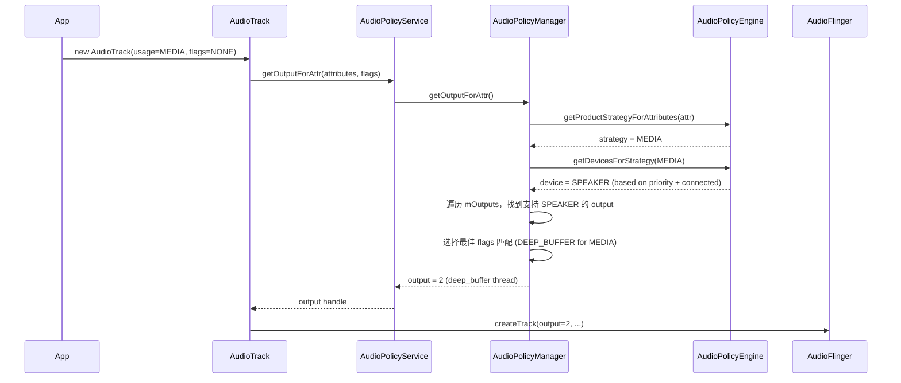
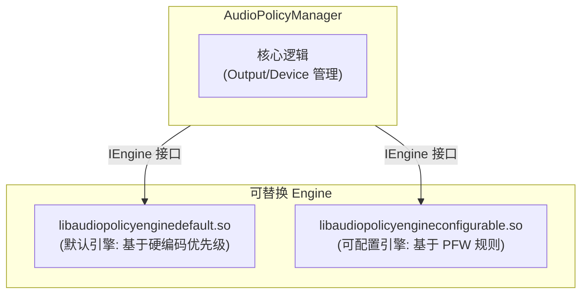
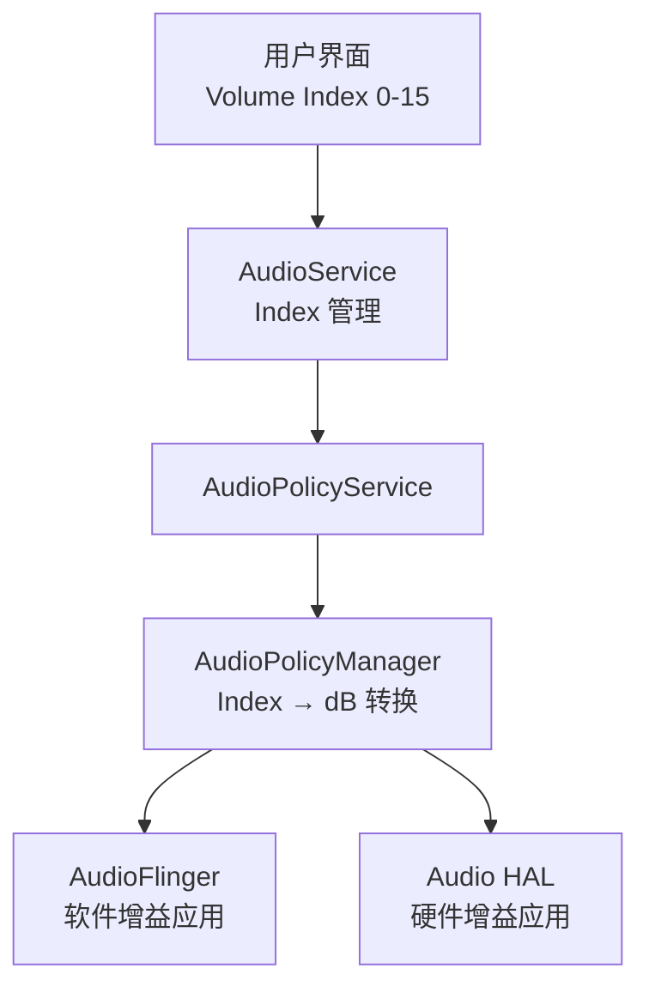
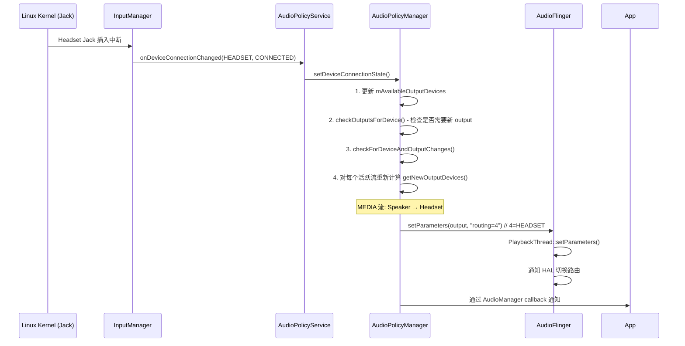

# AudioPolicy 策略管理深度解析

`AudioPolicy` 是 Android 音频系统的“大脑”，负责回答一个终极问题：**“在这个时刻，这路声音，应该发往哪个物理设备？”**

---

## 1. 启动与初始化全链路 (Initialization)

`AudioPolicy` 服务紧随 `AudioFlinger` 之后由 `audioserver` 进程启动。

### 1.1 生命周期入口：onFirstRef()
在 `AudioPolicyService` 实例化时，会执行关键配置：
1.  **创建命令线程**：启动 `AudioCommandThread`，负责执行异步的路由切换。
2.  **加载 Manager**：调用 `loadAudioPolicyManager()`。
3.  **实例化内核**：系统根据 `libaudiopolicyengine.so` 的厂商实现，动态创建 `AudioPolicyManager` 实例。

### 1.2 配置文件解析 (Serialization)
`AudioPolicyManager` 在构造函数中调用 `loadConfig()`。其核心是 `PolicySerializer`，它递归地将 XML 标签转换为 C++ 对象模型。

| XML 标签 | C++ 实体类 | 核心职责 |
| :--- | :--- | :--- |
| `<module>` | `HwModule` | 代表一个硬件库（如 `primary`, `usb`）。 |
| `<mixPort>` | `IOProfile` | 代表流入口。定义了采样率、格式及 `maxActiveCount`。 |
| `<devicePort>`| `DeviceDescriptor` | 代表物理设备（如 `SPEAKER`, `WIRED_HEADSET`）。 |
| `<route>` | `AudioRoute` | 定义 `mixPort` 到 `devicePort` 的拓扑通路。 |

### 1.3 audio_policy_configuration.xml 完整结构解析

```xml
<audioPolicyConfiguration version="7.0">
  <!-- 全局配置 -->
  <globalConfiguration speaker_drc_enabled="true"/>
  
  <modules>
    <!-- ============ 主硬件模块 ============ -->
    <module name="primary" halVersion="3.0">
      <attachedDevices>
        <item>Speaker</item>         <!-- 开机即在线的设备 -->
        <item>Built-In Mic</item>
      </attachedDevices>
      <defaultOutputDevice>Speaker</defaultOutputDevice>
      
      <mixPorts>
        <!-- 每个 mixPort 对应 AudioFlinger 的一个 PlaybackThread -->
        <mixPort name="primary output" role="source"
                 flags="AUDIO_OUTPUT_FLAG_PRIMARY">
          <profile name="" format="AUDIO_FORMAT_PCM_16_BIT"
                   samplingRates="48000" channelMasks="AUDIO_CHANNEL_OUT_STEREO"/>
        </mixPort>
        
        <mixPort name="deep_buffer" role="source"
                 flags="AUDIO_OUTPUT_FLAG_DEEP_BUFFER">
          <profile name="" format="AUDIO_FORMAT_PCM_16_BIT"
                   samplingRates="48000" channelMasks="AUDIO_CHANNEL_OUT_STEREO"/>
        </mixPort>
        
        <mixPort name="low_latency" role="source"
                 flags="AUDIO_OUTPUT_FLAG_FAST">
          <profile name="" format="AUDIO_FORMAT_PCM_16_BIT"
                   samplingRates="48000" channelMasks="AUDIO_CHANNEL_OUT_STEREO"/>
        </mixPort>
        
        <mixPort name="compress_offload" role="source"
                 flags="AUDIO_OUTPUT_FLAG_DIRECT|AUDIO_OUTPUT_FLAG_COMPRESS_OFFLOAD|AUDIO_OUTPUT_FLAG_NON_BLOCKING">
          <profile name="" format="AUDIO_FORMAT_AAC_LC"
                   samplingRates="44100,48000" channelMasks="AUDIO_CHANNEL_OUT_STEREO"/>
        </mixPort>
        
        <!-- 录音端 -->
        <mixPort name="primary input" role="sink">
          <profile name="" format="AUDIO_FORMAT_PCM_16_BIT"
                   samplingRates="8000,16000,48000"
                   channelMasks="AUDIO_CHANNEL_IN_MONO,AUDIO_CHANNEL_IN_STEREO"/>
        </mixPort>
      </mixPorts>
      
      <devicePorts>
        <devicePort tagName="Speaker" type="AUDIO_DEVICE_OUT_SPEAKER" role="sink"/>
        <devicePort tagName="Wired Headset" type="AUDIO_DEVICE_OUT_WIRED_HEADSET" role="sink"/>
        <devicePort tagName="BT SCO Headset" type="AUDIO_DEVICE_OUT_BLUETOOTH_SCO_HEADSET" role="sink"/>
        <devicePort tagName="Built-In Mic" type="AUDIO_DEVICE_IN_BUILTIN_MIC" role="source"/>
      </devicePorts>
      
      <routes>
        <!-- route: 定义 mixPort 可以连接到哪些 devicePort -->
        <route type="mix" sink="Speaker"
               sources="primary output,deep_buffer,low_latency"/>
        <route type="mix" sink="Wired Headset"
               sources="primary output,deep_buffer,low_latency"/>
        <route type="mix" sink="BT SCO Headset"
               sources="primary output"/>
      </routes>
    </module>
    
    <!-- ============ USB 模块 ============ -->
    <module name="usb" halVersion="2.0">
      <!-- ... -->
    </module>
    
    <!-- ============ 蓝牙 A2DP 模块 ============ -->
    <module name="a2dp" halVersion="2.0">
      <!-- ... -->
    </module>
  </modules>
</audioPolicyConfiguration>
```

**关键理解**：
*   `<route>` 决定了“哪些流能发往哪些设备”，是路由的**物理约束**
*   `flags` 决定了 AudioFlinger 创建哪种类型的线程
*   `maxActiveCount`（默认无限）可限制并发流数，常用于 DIRECT output

---

## 2. 路由决策逻辑深度拆解

这是一套基于 **Usage -> Strategy -> Device** 的推导模型。

### 2.1 推导三部曲
1.  **Match Strategy**：App 定义 `Usage` (如 `USAGE_MEDIA`)，系统查询 `getStrategyForUsage()` 得到策略（如 `STRATEGY_MEDIA`）。
2.  **Match Device**：调用核心算法 `getDeviceForStrategy(strategy)`。
    *   **优先级逻辑**：例如在 `STRATEGY_PHONE` 下，优先级顺序为：蓝牙 SCO > 有线耳机 > 听筒 > 扬声器。
3.  **Choose Output**：根据选择的 Device，在 `HwModule` 集合中寻找最匹配的 `IOProfile`，最终找到对应的 `PlaybackThread`。

### 2.2 完整路由决策流程图



### 2.3 设备优先级矩阵 (Device Selection Priority)

| Strategy | 优先级顺序 (从高到低) |
|:---|:---|
| **STRATEGY_PHONE** | BT SCO → Hearing Aid → Wired Headset → Earpiece → Speaker |
| **STRATEGY_MEDIA** | BT A2DP → Hearing Aid → Wired Headset → USB → Speaker |
| **STRATEGY_SONIFICATION** | Speaker (强制) + 当前 MEDIA 设备 (Dual output) |
| **STRATEGY_DTMF** | 跟随 STRATEGY_PHONE 的设备 |
| **STRATEGY_ENFORCED_AUDIBLE** | Speaker (强制外放，如快门声) |

### 2.4 Output 选择策略 (flags 匹配)

确定设备后，还需要选择哪个 Output（即哪个 PlaybackThread）：

```cpp
// AudioPolicyManager::getOutputForDevices()
// 匹配逻辑: 找到支持目标 device 且 flags 最匹配的 output
for (auto& output : mOutputs) {
    // 1. output 必须支持目标 device
    if (!output->supportedDevices().contains(device)) continue;
    
    // 2. flags 匹配优先级:
    //    - DIRECT: 严格匹配
    //    - DEEP_BUFFER: MEDIA 类默认首选
    //    - PRIMARY: 通用后备
    //    - FAST: 低延迟场景专用
    compatScore = computeCompatibilityScore(requestFlags, output->flags);
}
```

| App Usage | 默认匹配的 Flag | 对应 Thread |
|:---|:---|:---|
| MEDIA (音乐) | `DEEP_BUFFER` | MixerThread (大缓冲，省电) |
| NOTIFICATION | `PRIMARY` | MixerThread (主输出) |
| GAME | `FAST` | MixerThread (低延迟) |
| VOICE_COMMUNICATION | `PRIMARY` + 打开回声消除 | MixerThread |
| 无损音乐 (hi-res) | `DIRECT` | DirectOutputThread |

---

## 3. AudioPolicyEngine 可替换架构

路由决策的核心逻辑并非固化在 `AudioPolicyManager` 中，而是通过可插拔的 **Engine** 实现：



### 3.1 Default Engine

*   优先级规则硬编码在 C++ 中
*   逻辑简单直接，适合手机场景
*   修改需重新编译

### 3.2 Configurable Engine (PFW)

基于 Intel’s **Parameter Framework (PFW)** 的规则引擎：

```
audio_policy_engine_configuration.xml
├── ProductStrategies     // 定义策略与 Attributes 的映射
├── Criteria             // 定义决策条件 (设备连接状态, 通话状态...)
├── CriterionTypes       // 条件的取值类型
└── Domains/Rules        // 决策规则 (if-then 条件)
```

**优势**：可在不重新编译的情况下，通过修改 XML 调整路由规则。车载 (AAOS) 场景常用。

---

## 4. 音量控制体系 (Volume Systems)

Android 使用**非线性对数映射**来匹配人耳感官。

### 4.1 音量架构全景



### 4.2 配置文件加载
系统通过 `EngineBase::loadAudioPolicyEngineConfig()` 加载 `audio_policy_volumes.xml`。
*   **Volume Group**：将多个相似 Context 归类统一调节
*   **Index to dB**：定义用户界面数值（如 0-15 级）到物理增益（dB）的转换表
*   **增益计算**：$Amplification = 10^{(\text{dB}/20)}$

### 4.3 音量曲线配置示例

```xml
<!-- audio_policy_volumes.xml -->
<volume_group>
    <name>music</name>
    <indexMin>0</indexMin>
    <indexMax>15</indexMax>
    <volume deviceCategory="DEVICE_CATEGORY_SPEAKER">
        <point>0,-5800</point>   <!-- index=0 → -58 dB (接近静音) -->
        <point>33,-3350</point>  <!-- index=5 → -33.5 dB -->
        <point>66,-1350</point>  <!-- index=10 → -13.5 dB -->
        <point>100,0</point>     <!-- index=15 → 0 dB (最大音量) -->
    </volume>
    <volume deviceCategory="DEVICE_CATEGORY_HEADSET">
        <!-- 耳机单独的音量曲线, 通常最大值更低保护听力 -->
        <point>0,-5800</point>
        <point>33,-4000</point>
        <point>66,-1700</point>
        <point>100,-100</point>  <!-- 最大 -1 dB -->
    </volume>
</volume_group>
```

### 4.4 音量下发路径源码跟踪

```
AudioService.setStreamVolume(STREAM_MUSIC, index)
  → AudioSystem::setStreamVolumeIndex(stream, index, device)
    → AudioPolicyManager::setVolumeIndexForAttributes(attr, index, device)
      → 计算 dB = volIndexToDb(index, device)  // 查表插值
      → AudioPolicyManager::setVolumeCurveIndex()
      → AudioFlinger::setStreamVolume(output, stream, value_linear)
        → PlaybackThread::setStreamVolume()  // 应用到对应 Track
```

---

## 5. 设备连接/断开处理

### 5.1 耳机插入全链路



### 5.2 蓝牙 A2DP 连接的特殊处理

蓝牙 A2DP 连接与有线耳机不同，涉及**跨模块路由**：

```
1. BT 服务通知 AudioPolicy: A2DP 设备已连接
2. APM 加载 a2dp HAL module (AudioFlinger::loadHwModule)
3. APM 创建新的 DirectOutput (AudioFlinger::openOutput)
4. APM 将 MEDIA 流从 primary output 迁移到 a2dp output
5. 创建 DuplicatingThread (如果需要同时输出到 Speaker)
```

---

## 6. 关键交互：APM 与 AudioFlinger

当路由发生变化时（如：插拔耳机），APM 通过 `AudioPolicyClientInterface` 发起联动：
1.  **`loadHwModule()`**：通知 Flinger 加载新的厂商库。
2.  **`openOutput()`**：指示 Flinger 创建对应的 `PlaybackThread`。
3.  **`setParameters()`**：直接向 HAL 发送键值对（如 `routing=2`），触发硬件开关切换。
4.  **`moveEffects()`**：当流迁移时，将音效链迁移到新 output。
5.  **`createAudioPatch()`** (Android 6+)：更现代的路由方式，直接建立端到端连接。

### 6.1 AudioPatch 机制

Android 6.0 引入的 Patch 机制更灵活：

```cpp
// 创建一个从 MIC 到外部 DSP 的直连 Patch
struct audio_patch patch;
patch.num_sources = 1;
patch.sources[0].type = AUDIO_PORT_TYPE_DEVICE;
patch.sources[0].ext.device.type = AUDIO_DEVICE_IN_BUILTIN_MIC;

patch.num_sinks = 1;
patch.sinks[0].type = AUDIO_PORT_TYPE_DEVICE;
patch.sinks[0].ext.device.type = AUDIO_DEVICE_OUT_BUS; // 车载 Bus
patch.sinks[0].ext.device.address = "bus0_media";

audioPolicyManager->createAudioPatch(&patch, &patchHandle);
// 硬件直连, 不经过 AudioFlinger 混音
```

---

## 7. AAOS 车载特殊策略

车载场景下 AudioPolicy 有显著差异：

### 7.1 与手机的关键差异

| 特性 | 手机 | 车载 (AAOS) |
|:---|:---|:---|
| **路由基础** | 设备类型 (Speaker/Headset) | Bus 地址 (bus0_media) |
| **音量管理** | StreamType 分类 | Volume Group + AudioContext |
| **焦点逻辑** | 标准 AudioFocus | CarAudioFocus (自定义矩阵) |
| **多输出** | 通常单输出 | 多音区多 Bus 并行输出 |
| **外部音源** | 无 | 收音机/雷达通过 AudioControl HAL |

### 7.2 Bus 路由配置

```xml
<!-- 车载: car_audio_configuration.xml 替代了标准 audio_policy_configuration.xml 的部分职责 -->
<zone name="primary" isPrimary="true">
  <volumeGroups>
    <group name="media">
      <device address="bus0_media">
        <context context="music"/>
        <context context="movie"/>
      </device>
    </group>
    <group name="navigation">
      <device address="bus1_nav">
        <context context="navigation"/>
      </device>
    </group>
  </volumeGroups>
</zone>
```

核心思路：车载不再依赖“设备类型”路由，而是通过 **AudioContext → Bus 地址** 直接映射，一个 Context 专属一条 Bus。

---

## 8. 专家调试与 Dump 实战

### 8.1 配置文件路径搜索优先级
系统按以下优先级查找 `audio_policy_configuration.xml`：
1. `/odm/etc/`
2. `/vendor/etc/audio/sku_<variant>/`
3. `/vendor/etc/`
4. `/system/etc/`

### 8.2 核心调试命令

```bash
# 完整 AudioPolicy dump
adb shell dumpsys media.audio_policy

# 查看当前在线设备
adb shell dumpsys media.audio_policy | grep "Available output"

# 查看所有 output 及其属性
adb shell dumpsys media.audio_policy | grep -A 15 "mOutputs"

# 查看当前活跃流的路由策略
adb shell dumpsys media.audio_policy | grep -A 5 "Strategy"

# 查看音量曲线配置
adb shell dumpsys media.audio_policy | grep -A 20 "Volume"

# AudioPatch 列表
adb shell dumpsys media.audio_policy | grep -A 10 "Patch"
```

### 8.3 Dump 输出关键字段解读

```
- Available output devices:
  Device 1:
    - type: AUDIO_DEVICE_OUT_SPEAKER        ← 扬声器在线
  Device 2:
    - type: AUDIO_DEVICE_OUT_WIRED_HEADSET  ← 耳机已插入
  Device 3:
    - type: AUDIO_DEVICE_OUT_BLUETOOTH_A2DP ← 蓝牙已连接

- Outputs:
  Output 1 (MixerThread deep_buffer):
    Devices: Speaker
    Flags: AUDIO_OUTPUT_FLAG_DEEP_BUFFER
    Sampling rate: 48000
    Clients:                                ← 当前使用此 output 的 Track
      - Session 101: usage=MEDIA, flags=0   ← 音乐 App 播放中
  
  Output 3 (DirectOutputThread):
    Devices: BT A2DP
    Flags: AUDIO_OUTPUT_FLAG_DIRECT
    Sampling rate: 96000
```

### 8.4 常见问题定位

| 现象 | 检查要点 | 解决方向 |
|:---|:---|:---|
| **插耳机后声音仍从扬声器出** | `Available output devices` 是否包含 Headset | Jack 检测驱动问题 |
| **音乐 App 不走蓝牙** | Output 列表是否有 A2DP output | 检查 BT 连接状态 / HAL 加载 |
| **通话无声** | STRATEGY_PHONE 对应的 Device | 检查 SCO 连接 / 路由配置 |
| **音量调节无效** | Volume Group 映射 | 检查 Stream 到 Group 的映射 |
| **无法播放无损** | DIRECT output 是否存在 | 检查 `<mixPort>` flags 配置 |
| **多 App 同时播放冲突** | Clients 列表 | 检查 AudioFocus 逻辑 |

### 8.5 动态修改路由 (调试用)

```bash
# 强制设置输出设备 (调试用, 需 root)
adb shell audio_hal_cmd set_device_connection_state \
    AUDIO_DEVICE_OUT_WIRED_HEADSET AUDIO_POLICY_DEVICE_STATE_AVAILABLE ""

# 模拟耳机插入 (input inject)
adb shell input keyevent KEYCODE_HEADSETHOOK

# 查看实时路由变化 (结合 logcat)
adb logcat -s AudioPolicyManager:V AudioPolicyService:V
```

---
*Next Topic: [Audio HAL 接口规范](./07-AudioHAL.md)*
