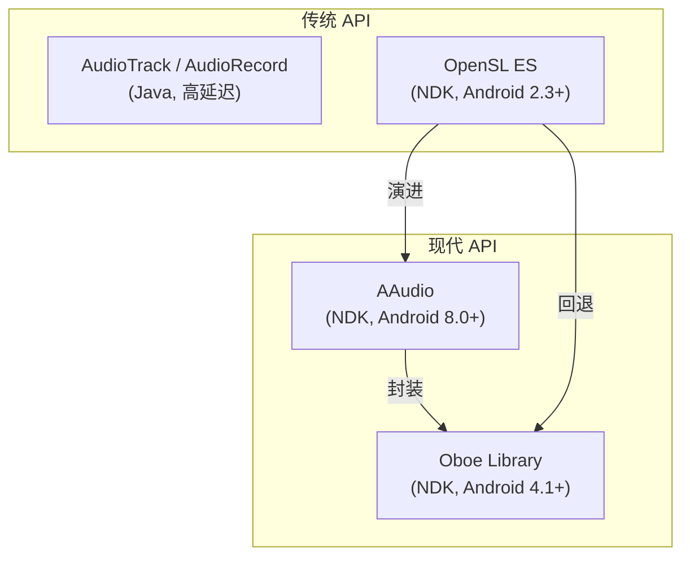
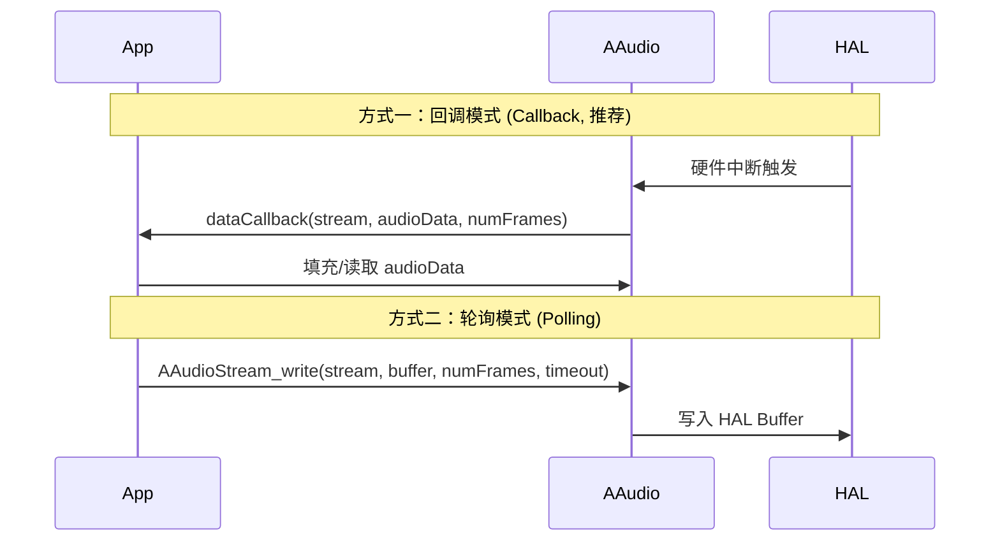
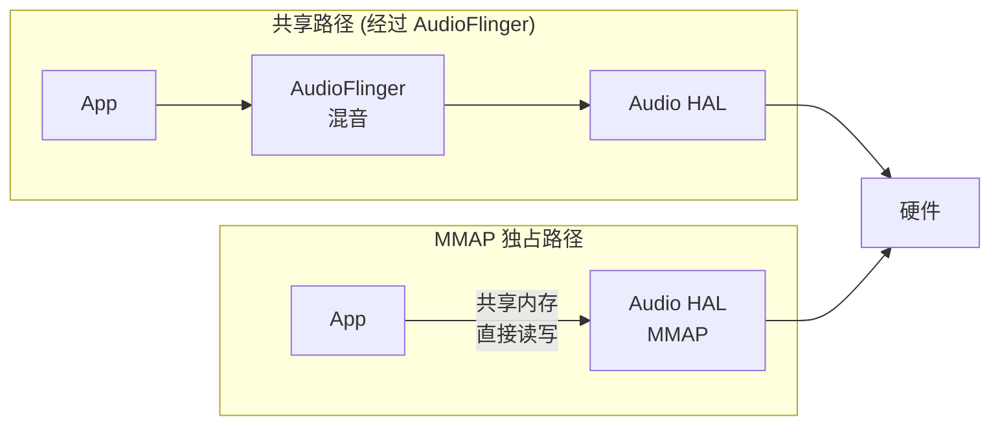

# Oboe 与 AAudio：Android 低延迟音频 API

Android 原生音频长期饱受高延迟困扰。Google 先后推出 **AAudio** (Android 8.0+) 和 **Oboe** (跨版本兼容库)，为游戏、K歌、实时通话等场景提供了高性能音频通路。

---

## 1. API 演进与定位



| API | 最低版本 | 语言 | 延迟 | 推荐场景 |
|:---|:---|:---|:---|:---|
| **AudioTrack/AudioRecord** | API 3 | Java/Kotlin | 高 (~100ms+) | 一般音乐播放 |
| **OpenSL ES** | API 9 | C/C++ | 中 (~40ms) | 旧项目兼容 |
| **AAudio** | API 26 (8.0) | C | 低 (~10ms) | 新项目直接使用 |
| **Oboe** | API 16 (4.1) | C++ | 低 | **推荐首选**，自动适配 |

---

## 2. AAudio 核心架构

### 2.1 关键概念

*   **AAudioStream**：核心对象，代表一条音频流（播放或录音）。
*   **Performance Mode**：
    *   `AAUDIO_PERFORMANCE_MODE_LOW_LATENCY` — 最低延迟
    *   `AAUDIO_PERFORMANCE_MODE_POWER_SAVING` — 省电优先
    *   `AAUDIO_PERFORMANCE_MODE_NONE` — 默认
*   **Sharing Mode**：
    *   `AAUDIO_SHARING_MODE_EXCLUSIVE` — 独占硬件，最低延迟
    *   `AAUDIO_SHARING_MODE_SHARED` — 经过 AudioFlinger 混音

### 2.2 数据传递模型

AAudio 支持两种数据回调模式：



**回调模式**延迟最低，因为数据填充直接在音频线程中完成，避免了线程切换开销。

### 2.3 AAudio 代码示例：低延迟播放

```c
#include <aaudio/AAudio.h>

// 数据回调函数 — 在高优先级音频线程中执行
aaudio_data_callback_result_t dataCallback(
        AAudioStream *stream,
        void *userData,
        void *audioData,
        int32_t numFrames) {
    // 生成或处理音频数据
    float *output = (float *)audioData;
    for (int i = 0; i < numFrames; i++) {
        output[i] = sinf(2.0f * M_PI * 440.0f * phase);
        phase += 1.0f / 48000.0f;
    }
    return AAUDIO_CALLBACK_RESULT_CONTINUE;
}

void startLowLatencyPlayback() {
    AAudioStreamBuilder *builder;
    AAudioStream *stream;
    
    // 1. 创建 Builder
    AAudio_createStreamBuilder(&builder);
    
    // 2. 配置参数
    AAudioStreamBuilder_setDirection(builder, AAUDIO_DIRECTION_OUTPUT);
    AAudioStreamBuilder_setPerformanceMode(builder, 
        AAUDIO_PERFORMANCE_MODE_LOW_LATENCY);
    AAudioStreamBuilder_setSharingMode(builder, 
        AAUDIO_SHARING_MODE_EXCLUSIVE);
    AAudioStreamBuilder_setSampleRate(builder, 48000);
    AAudioStreamBuilder_setChannelCount(builder, 1);
    AAudioStreamBuilder_setFormat(builder, AAUDIO_FORMAT_PCM_FLOAT);
    AAudioStreamBuilder_setDataCallback(builder, dataCallback, NULL);
    
    // 3. 打开流
    aaudio_result_t result = AAudioStreamBuilder_openStream(builder, &stream);
    if (result != AAUDIO_OK) {
        // 错误处理
        return;
    }
    
    // 4. 查询实际参数
    int32_t bufferSize = AAudioStream_getBufferSizeInFrames(stream);
    int32_t framesPerBurst = AAudioStream_getFramesPerBurst(stream);
    // 设置 buffer 为 2 个 burst，平衡延迟与稳定性
    AAudioStream_setBufferSizeInFrames(stream, framesPerBurst * 2);
    
    // 5. 启动播放
    AAudioStream_requestStart(stream);
    
    // 清理
    AAudioStreamBuilder_delete(builder);
}
```

### 2.4 MMAP 独占模式：延迟的极限

当请求 `EXCLUSIVE` + `LOW_LATENCY` 时，AAudio 尝试使用 **MMAP (Memory-Mapped)** 路径：



*   **MMAP 路径**：App 与 HAL 共享同一块内存，省去 AudioFlinger 拷贝与混音，延迟可低至 **< 10ms (RTT)**。
*   **条件**：设备 HAL 必须实现 `IStream::createMmapBuffer()`；并非所有设备支持。

---

## 3. Oboe：推荐的生产级方案

### 3.1 为什么用 Oboe 而不是直接用 AAudio？

| 问题 | AAudio 原生 | Oboe 方案 |
|:---|:---|:---|
| 旧设备兼容 | ❌ 仅 Android 8.0+ | ✅ 自动回退到 OpenSL ES (4.1+) |
| 断流恢复 | ❌ 需手动处理 | ✅ 内置自动重连 |
| API 复杂度 | 较高 (C 风格) | 较低 (C++ Builder 模式) |
| 错误处理 | 需逐步检查 | 内置错误回调 |

### 3.2 Oboe 代码示例

```cpp
#include <oboe/Oboe.h>

class MyCallback : public oboe::AudioStreamDataCallback {
public:
    oboe::DataCallbackResult onAudioReady(
            oboe::AudioStream *stream,
            void *audioData,
            int32_t numFrames) override {
        auto *output = static_cast<float *>(audioData);
        for (int i = 0; i < numFrames; i++) {
            output[i] = sinf(2.0f * M_PI * 440.0f * mPhase);
            mPhase += 1.0f / (float)stream->getSampleRate();
        }
        return oboe::DataCallbackResult::Continue;
    }
private:
    float mPhase = 0.0f;
};

class MyErrorCallback : public oboe::AudioStreamErrorCallback {
public:
    void onErrorAfterClose(oboe::AudioStream *stream, 
                           oboe::Result error) override {
        // 自动重建流
        // Oboe 内置 LiveEffect 示例展示了完整重连逻辑
    }
};

void startOboePlayback() {
    MyCallback myCallback;
    MyErrorCallback myErrorCallback;
    std::shared_ptr<oboe::AudioStream> stream;
    
    oboe::AudioStreamBuilder builder;
    builder.setDirection(oboe::Direction::Output)
           ->setPerformanceMode(oboe::PerformanceMode::LowLatency)
           ->setSharingMode(oboe::SharingMode::Exclusive)
           ->setFormat(oboe::AudioFormat::Float)
           ->setChannelCount(oboe::ChannelCount::Mono)
           ->setSampleRate(48000)
           ->setDataCallback(&myCallback)
           ->setErrorCallback(&myErrorCallback);
    
    oboe::Result result = builder.openStream(stream);
    if (result != oboe::Result::OK) {
        return;
    }
    
    stream->requestStart();
}
```

### 3.3 Gradle 集成

```groovy
// app/build.gradle
android {
    defaultConfig {
        externalNativeBuild {
            cmake {
                cppFlags "-std=c++17"
            }
        }
    }
}

dependencies {
    implementation 'com.google.oboe:oboe:1.9.0'
}
```

```cmake
# CMakeLists.txt
find_package(oboe REQUIRED CONFIG)
target_link_libraries(your_target oboe::oboe)
```

---

## 4. 延迟优化实战指南

### 4.1 端到端延迟构成

```
总延迟 (Round-Trip Latency) = 
    App 处理延迟
  + Output Buffer 延迟 (Buffer Size / Sample Rate)
  + DAC 转换延迟
  + 扬声器/耳机物理延迟
  + 声学传播延迟
  + 麦克风物理延迟
  + ADC 转换延迟
  + Input Buffer 延迟
  + App 读取延迟
```

### 4.2 优化 Checklist

| 优化项 | 具体做法 | 影响 |
|:---|:---|:---|
| **使用回调模式** | `setDataCallback()` | 避免线程切换 |
| **请求独占模式** | `setSharingMode(Exclusive)` | 跳过 AudioFlinger |
| **低延迟性能模式** | `setPerformanceMode(LowLatency)` | 触发 MMAP 路径 |
| **最小 Buffer** | `setBufferSizeInFrames(framesPerBurst * 2)` | 降低缓冲延迟 |
| **避免回调中阻塞** | 禁止 malloc/lock/IO | 防止 Underrun |
| **使用 Float 格式** | `setFormat(Float)` | 减少格式转换 |
| **48kHz 采样率** | 匹配硬件原生采样率 | 避免重采样 |

### 4.3 回调函数中的禁忌

回调运行在高优先级实时线程中，以下操作**绝对禁止**：

```
❌ malloc / new / free / delete    — 堆分配可能触发 GC 或锁竞争
❌ mutex / lock / synchronized     — 可能导致优先级反转
❌ 文件 I/O / 网络请求             — 延迟不可控
❌ Log 输出                        — Android Log 内部有锁
❌ JNI 调用 Java 层                — 可能触发 GC
```

**推荐做法**：使用 **Lock-free Ring Buffer** (无锁环形缓冲区) 在回调线程与其他线程之间传递数据。

---

## 5. 延迟测量方法

### 5.1 Loopback 测试

```bash
# 使用 Oboe 官方测试 App "OboeTester"
# 1. 安装 OboeTester APK
# 2. 选择 "Round Trip Latency" 测试
# 3. 将扬声器输出对准麦克风（或用回路线缆）
# 4. 读取 RTT 延迟值
```

### 5.2 WALT 硬件测试

Google **WALT (Wireless Android Latency Timer)** 是专业的延迟测量硬件：
*   Audio Output Latency：测量从 App 写入到声音发出
*   Audio Input Latency：测量从声音到达到 App 读取
*   精度：< 1ms

### 5.3 代码内时间戳

```cpp
// AAudio 提供硬件时间戳
int64_t framePosition, timeNanos;
AAudioStream_getTimestamp(stream, CLOCK_MONOTONIC, 
                          &framePosition, &timeNanos);
// 可计算当前延迟 = (framesWritten - framePosition) / sampleRate
```

---

## 6. 常见问题排查

| 问题 | 可能原因 | 解决方案 |
|:---|:---|:---|
| 延迟高于预期 | 回退到了 Shared 模式 | 检查 `getSharingMode()` 实际值 |
| Underrun 爆音 | Buffer 过小或回调耗时过长 | 增大 Buffer 或优化回调处理 |
| 独占模式失败 | 设备不支持 MMAP | 回退到 Shared 模式，这是正常行为 |
| 采样率不匹配 | 未使用设备原生采样率 | 使用 `getSampleRate()` 查询后适配 |
| 断流后无声 | 流被路由变化中断 | 使用 Oboe 自动重连或手动监听断流 |

---

## 7. 关键参考 (References)

1.  [Oboe GitHub Repository](https://github.com/google/oboe)
2.  [AAudio Official Documentation](https://developer.android.com/ndk/guides/audio/aaudio/aaudio)
3.  [High-Performance Audio on Android - Google](https://developer.android.com/ndk/guides/audio)
4.  [OboeTester - Latency Measurement App](https://github.com/google/oboe/tree/main/apps/OboeTester)
5.  [WALT Latency Timer](https://github.com/nicknijsure/walt)
6.  *Android High Performance Audio* - Oboe documentation
