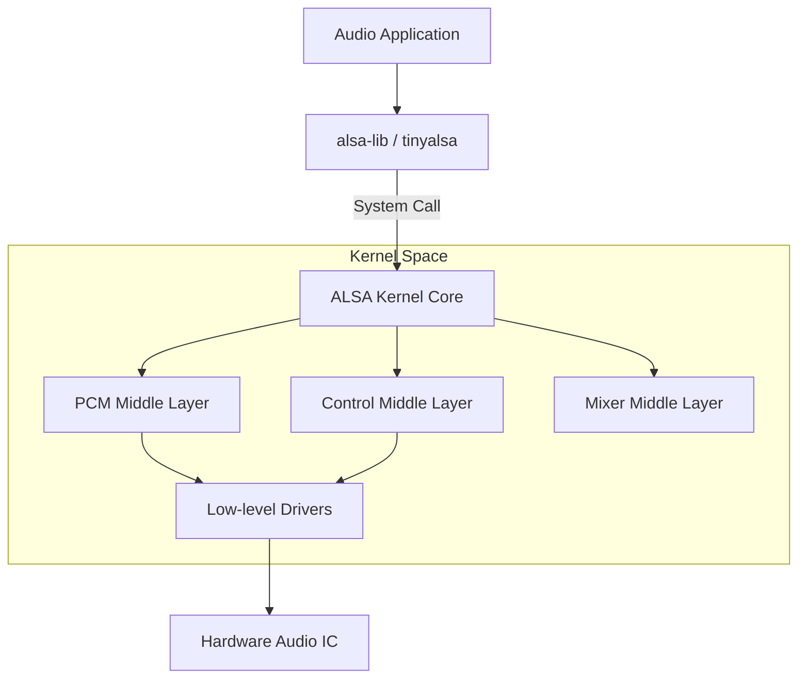

# ALSA 核心架构 (Advanced Linux Sound Architecture)

ALSA 是 Linux 内核中负责音频的主流子系统。它不仅提供了复杂的音频驱动模型，还提供了一套标准的用户态库来简化音频应用开发。

---

## 1. ALSA 系统架构 (System Architecture)

ALSA 栈由用户空间库、内核中间层和底层驱动三部分组成。

---

## 2. 内核态接口设备 (Device Nodes)

在 Linux 系统中，音频设备节点通常位于 `/dev/snd/` 目录下。

*   **pcmC0D0p**：Card 0, Device 0, Playback。用于音频播放。
*   **pcmC0D0c**：Card 0, Device 0, Capture。用于音频采集。
*   **controlC0**：用于音频控制（如：调节音量、切换开关）。
*   **timer**：用于音频处理的定时同步。

---

## 3. 核心抽象概念

### 3.1 声卡 (Sound Card)
一个声卡代表一个物理实体（如一个 SoC 内部的音频子系统）。一个声卡下可以有多个 Device。

### 3.2 PCM (Pulse Code Modulation)
ALSA 的核心，负责处理数字音频流。它定义了硬件缓冲区的管理方式（Ring Buffer）以及采样频率、格式等参数。

### 3.3 Mixer (混音/控制)
负责调节增益（Gain）、静音（Mute）、选择路径（Mux）。这些控制项统称为 **Kcontrol**。

---

## 4. ALSA 库：alsa-lib vs. tinyalsa

*   **alsa-lib (Standard)**：功能极其强大且复杂，包含插件系统（如重采样、软混音），广泛用于桌面 Linux 系统（Ubuntu, Debian）。
*   **tinyalsa (Lightweight)**：去除了所有复杂插件，只保留对内核接口的最简封装。广泛用于 **Android** 和嵌入式系统，追求高效和低延迟。

---

## 5. 关键参考 (References)

1.  [ALSA Project Official Site](https://www.alsa-project.org/)
2.  [Linux Kernel Documentation: Sound](https://www.kernel.org/doc/html/latest/sound/index.html)
3.  *Linux Sound Subsystem* - Jaroslav Kysela

---
*Next Topic: [ASoC 驱动模型详解](./02-ASoC-Driver-Model.md)*
