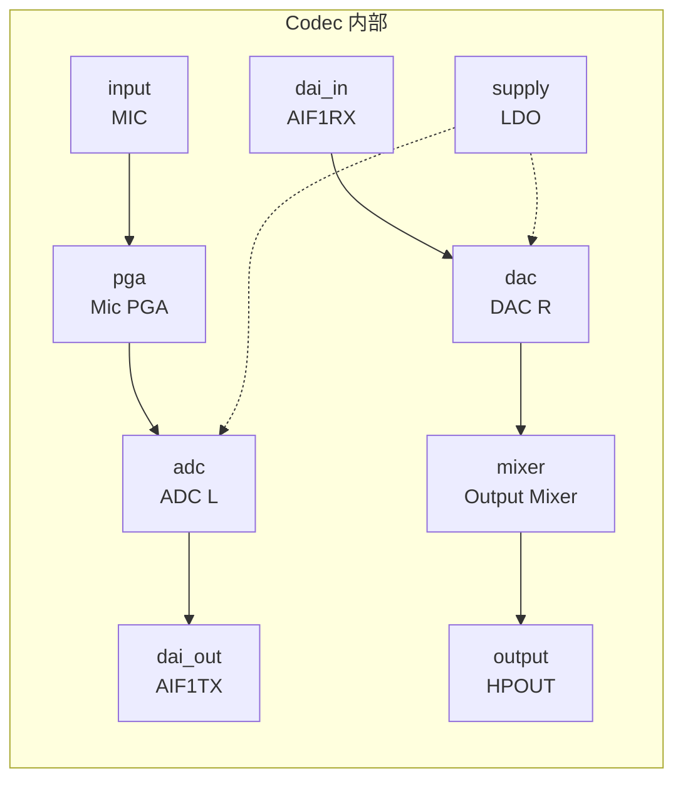
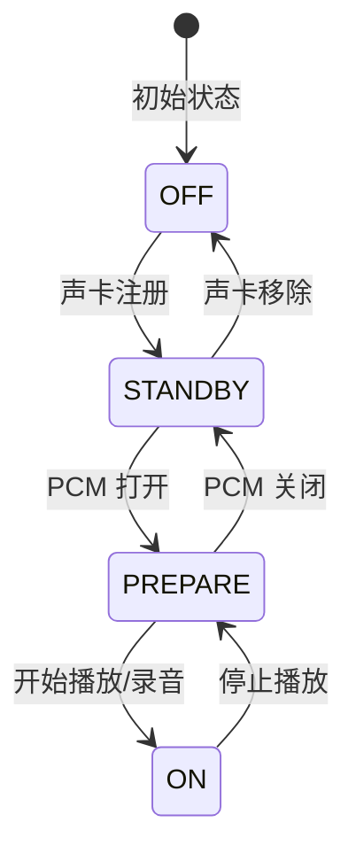
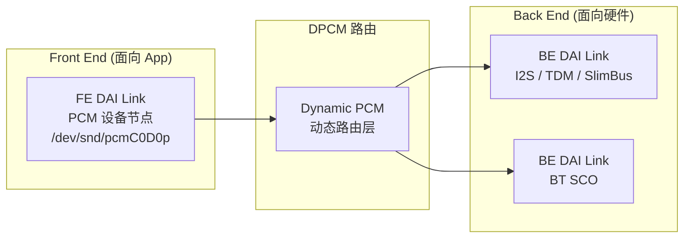

# ASoC 驱动模型 (ALSA System on Chip)

ASoC 层的目标是将音频驱动标准化。本章解析 ASoC 如何通过声明式的方式管理复杂的 SoC 音频系统。

---

## 1. DAPM：动态音频电源管理

DAPM 是 ASoC 最精妙的设计。它将声卡中的每个电路块抽象为 **Widget**。

### 1.1 Widget 类型完整分类

| Widget 类型 | 宏 | 说明 |
|:---|:---|:---|
| **端点类** | `snd_soc_dapm_input` / `output` | 物理引脚 (Mic Jack / Speaker Out) |
| **转换器** | `snd_soc_dapm_adc` / `dac` | 模数/数模转换 |
| **混音器** | `snd_soc_dapm_mixer` / `mixer_named_ctl` | 多输入混合，带 kcontrol |
| **放大器** | `snd_soc_dapm_pga` | 可编程增益放大器 |
| **多路开关** | `snd_soc_dapm_mux` / `demux` | 多选一开关 |
| **电源** | `snd_soc_dapm_supply` / `regulator` | 电源域、时钟等依赖 |
| **DAI** | `snd_soc_dapm_dai_in` / `dai_out` | 数字音频接口端点 |
| **虚拟** | `snd_soc_dapm_pre` / `post` | 加电前后回调钩子 |

### 1.2 Widget 图示例



### 1.3 自动寻路逻辑 (Power-Up Walk)

DAPM 内部维护了一张**有向图**。
1.  当应用层打开 PCM 流时，DAPM 会从 `SND_SOC_DAPM_DAC` 开始，寻找一条通往 `SND_SOC_DAPM_OUTPUT` 的路径。
2.  **只有路径上被选中的 Widget 才会上电**，其余所有电路保持关断。
3.  这实现了“零代码参与”的深度节能。

### 1.4 电源序列 (Power Sequencing)

```
加电顺序 (从源到孿):
  supply (LDO) → input (MIC) → pga (Mic PGA) → adc (ADC) → dai_out (AIF1TX)

断电顺序 (从孿到源):
  dai_out (AIF1TX) → adc (ADC) → pga (Mic PGA) → input (MIC) → supply (LDO)
```

**关键细节**：
*   `supply` 类型 Widget 有引用计数，多个依赖者共享同一电源
*   `snd_soc_dapm_pre/post` 可插入自定义加电/断电回调
*   Widget 的 `event` 回调可在 `SND_SOC_DAPM_PRE_PMU` / `POST_PMU` / `PRE_PMD` / `POST_PMD` 时机执行

### 1.5 DAPM Bias Level 状态机



*   **OFF**：Codec 完全断电
*   **STANDBY**：最低功耗待机，可快速唤醒
*   **PREPARE**：时钟已开启，等待数据
*   **ON**：正在传输音频数据

### 1.6 DAPM 代码示例

```c
// Codec 驱动中声明 Widget
static const struct snd_soc_dapm_widget my_codec_widgets[] = {
    SND_SOC_DAPM_INPUT("MIC"),
    SND_SOC_DAPM_PGA("Mic PGA", CODEC_REG_PGA, 7, 0, NULL, 0),
    SND_SOC_DAPM_ADC("ADC", "Capture", CODEC_REG_ADC, 7, 0),
    SND_SOC_DAPM_DAC("DAC", "Playback", CODEC_REG_DAC, 7, 0),
    SND_SOC_DAPM_OUTPUT("HPOUT"),
    SND_SOC_DAPM_SUPPLY("LDO", CODEC_REG_PWR, 0, 0, NULL, 0),
};

// 声明路由
static const struct snd_soc_dapm_route my_codec_routes[] = {
    { "Mic PGA",  NULL,     "MIC" },
    { "ADC",      NULL,     "Mic PGA" },
    { "ADC",      NULL,     "LDO" },     // ADC 依赖 LDO 电源
    { "DAC",      NULL,     "LDO" },
    { "HPOUT",    NULL,     "DAC" },
};
```

---

## 2. DAI Link：数据链路的定义

DAI Link 是 Machine 驱动的核心，它定义了数据从哪里流向哪里。

```c
// Machine 驱动示例代码 (C)
static struct snd_soc_dai_link my_machine_dai[] = {
    {
        .name = "HiFi-Audio",
        .stream_name = "HiFi-Playback",
        .cpu_dai_name = "soc-i2s.0", // SoC 侧 I2S
        .codec_dai_name = "rt5640-hifi", // Codec 侧 I2S
        .platform_name = "soc-audio.0", // DMA 驱动
        .codec_name = "rt5640.0-001c", // Codec I2C 地址
        .dai_fmt = SND_SOC_DAIFMT_I2S | SND_SOC_DAIFMT_NB_NF | SND_SOC_DAIFMT_CBM_CFM,
    },
};
```

### 2.1 FE (Front End) 与 BE (Back End) 概念

在复杂 SoC 中（如高通平台），DAI Link 被拆分为前端和后端：



*   **FE**：提供 PCM 设备节点给上层 (AudioFlinger/tinyplay)
*   **BE**：对接物理硬件 (I2S/TDM/SlimBus)
*   **DPCM (Dynamic PCM)**：允许运行时动态切换 FE 到 BE 的映射关系

---

## 3. DMA 传输机制

DMA 是 ALSA 音频数据传输的核心，实现 CPU 零拷贝的数据搬移。

### 3.1 环形缓冲区 (Ring Buffer)

```
ALSA DMA Ring Buffer 结构:

│◀─────── buffer_size (frames) ───────▶│
┌─────┬─────┬─────┬─────┬─────┬─────┬─────┬─────┐
│ P0  │ P1  │ P2  │ P3  │ P4  │ P5  │ P6  │ P7  │  ← 8 个 Period
└─────┴─────┴─────┴─────┴─────┴─────┴─────┴─────┘
     ▲                                    ▲
     │ hw_ptr (硬件指针)                  │ app_ptr (应用指针)
     │ DMA 当前读取位置                   │ App 当前写入位置

period_size = buffer_size / periods
每当 DMA 完成一个 period 的传输 → 触发中断 → 通知应用填充下一个 period
```

### 3.2 关键参数

| 参数 | 含义 | 典型值 |
|:---|:---|:---|
| **buffer_size** | 环形缓冲区总帧数 | 1920 frames (40ms @ 48kHz) |
| **period_size** | 每次 DMA 传输的帧数 | 240 frames (5ms @ 48kHz) |
| **periods** | buffer_size / period_size | 8 |
| **start_threshold** | 开始 DMA 传输的闀值 | 1 period |
| **stop_threshold** | Underrun 判定闀值 | buffer_size |

### 3.3 Period 与延迟的关系

```
最小硬件延迟 = period_size / sample_rate
  例: 240 / 48000 = 5ms

最大缓冲延迟 = buffer_size / sample_rate
  例: 1920 / 48000 = 40ms

period_size 越小:
  ✓ 延迟越低
  ✗ 中断频率越高，CPU 开销越大
  ✗ Underrun 风险越高
```

### 3.4 DMA 驱动实现框架

```c
// Platform 驱动中的 DMA 操作集
static const struct snd_soc_component_driver my_dma_component = {
    .open       = my_dma_open,
    .close      = my_dma_close,
    .hw_params  = my_dma_hw_params,  // 配置 DMA buffer
    .trigger    = my_dma_trigger,    // 启动/停止 DMA
    .pointer    = my_dma_pointer,    // 返回当前 hw_ptr
    .pcm_construct = my_dma_pcm_new, // 分配 DMA buffer
};

// trigger 实现
static int my_dma_trigger(struct snd_soc_component *component,
                          struct snd_pcm_substream *substream, int cmd) {
    switch (cmd) {
    case SNDRV_PCM_TRIGGER_START:
    case SNDRV_PCM_TRIGGER_RESUME:
        dma_engine_start(dma_chan);  // 启动 DMA 传输
        break;
    case SNDRV_PCM_TRIGGER_STOP:
    case SNDRV_PCM_TRIGGER_SUSPEND:
        dma_engine_stop(dma_chan);   // 停止 DMA
        break;
    }
    return 0;
}
```

---

## 4. Device Tree 音频节点解析

现代嵌入式 Linux 通过 Device Tree (DTS) 描述音频硬件连接。

### 4.1 典型音频 DTS 结构

```dts
// 声卡节点 (Machine Driver 绑定)
sound {
    compatible = "simple-audio-card";  // 或厂商自定义
    simple-audio-card,name = "My-Sound-Card";
    simple-audio-card,format = "i2s";
    simple-audio-card,bitclock-master = <&codec_dai>;
    simple-audio-card,frame-master = <&codec_dai>;
    
    // CPU 侧 DAI
    simple-audio-card,cpu {
        sound-dai = <&i2s0>;     // 引用 I2S 控制器节点
    };
    
    // Codec 侧 DAI
    codec_dai: simple-audio-card,codec {
        sound-dai = <&rt5640>;   // 引用 Codec 节点
    };
};

// I2S 控制器节点
i2s0: i2s@ff880000 {
    compatible = "vendor,i2s-controller";
    reg = <0xff880000 0x1000>;
    interrupts = <GIC_SPI 35 IRQ_TYPE_LEVEL_HIGH>;
    clocks = <&cru SCLK_I2S0>, <&cru HCLK_I2S0>;
    clock-names = "i2s_clk", "i2s_hclk";
    dmas = <&dmac 10>, <&dmac 11>;
    dma-names = "tx", "rx";
    #sound-dai-cells = <0>;
};

// Codec 节点 (通常挂在 I2C 总线上)
&i2c1 {
    rt5640: codec@1c {
        compatible = "realtek,rt5640";
        reg = <0x1c>;            // I2C 地址
        #sound-dai-cells = <0>;
        realtek,ldo1-en-gpios = <&gpio 42 GPIO_ACTIVE_HIGH>;
    };
};
```

### 4.2 高通平台车载音频 DTS 示例

```dts
// 高通平台多链路音频 DTS (简化)
sound {
    compatible = "qcom,sa8295-sndcard";
    qcom,model = "sa8295-adp-star-snd-card";
    
    // TDM 链路: SoC → 外部功放
    dai-link@0 {
        link-name = "Primary TDM RX";
        cpu { sound-dai = <&q6afedai PRIMARY_TDM_RX_0>; };
        codec { sound-dai = <&ext_amp 0>; };
    };
    
    // I2S 链路: SoC → Codec (主驾区)
    dai-link@1 {
        link-name = "Driver Zone Codec";
        cpu { sound-dai = <&q6afedai SECONDARY_MI2S_RX>; };
        codec { sound-dai = <&wcd938x 0>; };
    };
    
    // A2B 链路: SoC → A2B Transceiver → 远端麦克风/扬声器
    dai-link@2 {
        link-name = "A2B Bus";
        cpu { sound-dai = <&q6afedai TERTIARY_TDM_RX_0>; };
        codec { sound-dai = <&ad2428w 0>; };
    };
};
```

---

## 5. ASoC 调试完整指南

ASoC 将其所有状态暴露在 Linux 的 DebugFS 中：

### 5.1 DAPM 状态调试

```bash
# 查看 Bias Level
adb shell cat /sys/kernel/debug/asoc/<card>/dapm/bias_level

# 查看所有 Widget 电源状态
adb shell cat /sys/kernel/debug/asoc/<card>/dapm_widgets
# 输出示例:
#  DAC L: On           ← DAC 已上电
#  Mic PGA: Off        ← PGA 未上电 (未录音)
#  HPOUT: On           ← 耳机输出活跃
#  Speaker Amp: Off    ← 扬声器关闭

# 查看通路 (Routes)
adb shell cat /sys/kernel/debug/asoc/<card>/dapm_routes
```

### 5.2 Codec 寄存器访问

```bash
# 查看 Codec 名称
adb shell cat /sys/kernel/debug/asoc/codecs

# 读取寄存器 (regmap)
adb shell cat /sys/kernel/debug/regmap/<codec>/registers

# 写寄存器 (调试用，极度危险)
adb shell echo "0x10 0x3F" > /sys/kernel/debug/regmap/<codec>/registers
```

### 5.3 PCM 设备状态

```bash
# 查看所有 PCM 设备
adb shell cat /proc/asound/pcm
# 输出: 00-00: HiFi-Audio rt5640-hifi-0 : : playback 1 : capture 1

# 查看当前硬件参数
adb shell cat /proc/asound/card0/pcm0p/sub0/hw_params
# 输出:
#  format: S16_LE
#  channels: 2
#  rate: 48000
#  period_size: 240
#  buffer_size: 1920

# 查看当前传输状态
adb shell cat /proc/asound/card0/pcm0p/sub0/status
# 输出:
#  state: RUNNING
#  hw_ptr: 12345678
#  appl_ptr: 12345918
```

### 5.4 常见问题排查

| 现象 | 检查要点 | 工具 |
|:---|:---|:---|
| 声卡未注册 | DTS 节点是否被正确解析 | `dmesg \| grep snd` |
| PCM 打开失败 | hw_params 是否支持 | `tinymix`, `aplay -l` |
| 播放无声 | DAPM Widget 是否上电 | `dapm_widgets` |
| Pop/Click 噪音 | 电源序列是否正确 | DAPM event 回调 |
| Underrun | period_size 是否过小 | `hw_params` + `status` |
| 时钟漂移 | BCLK/LRCLK 配置 | 示波器测 I2S 信号 |

---

## 6. 关键参考 (References)

1.  [Linux Kernel: ASoC Design Overview](https://www.kernel.org/doc/html/latest/sound/soc/overview.html)
2.  [DAPM internals - Wolfson Microelectronics](https://www.alsa-project.org/wiki/DAPM)
3.  [Linux Kernel: Writing an ASoC Codec Driver](https://www.kernel.org/doc/html/latest/sound/soc/codec.html)
4.  [Device Tree Bindings for Sound](https://www.kernel.org/doc/html/latest/devicetree/bindings/sound/)
5.  *Linux Device Drivers, 4th Edition* - Chapter: Sound
