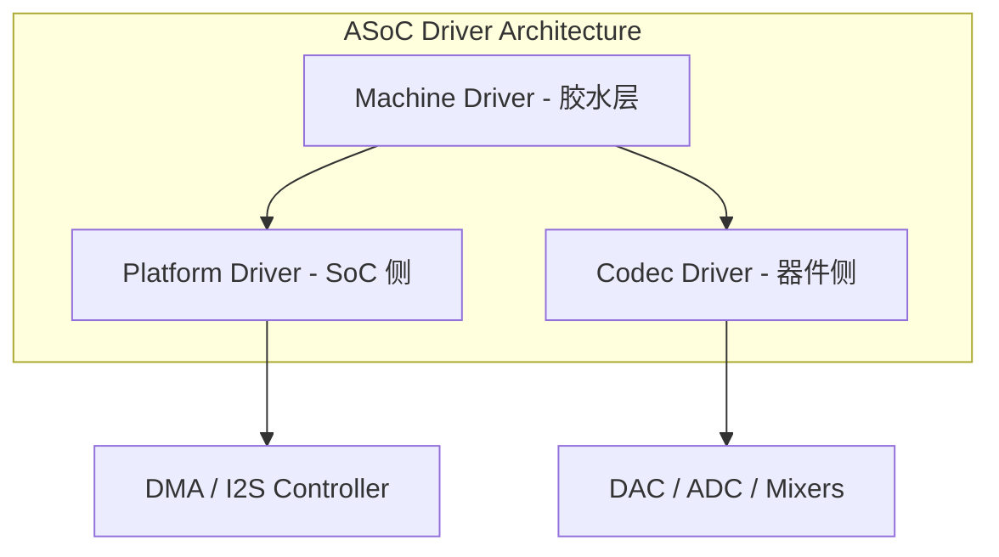

# ASoC 驱动模型 (ALSA System on Chip)

ASoC 是 ALSA 的一个子项目，专门为嵌入式系统（SoC + 外部 Codec）设计。它的目标是将音频驱动划分为可复用的通用模块，解决早期 Linux 音频驱动代码大量重复的问题。

---

## 1. 三大核心组件 (Three Pillars of ASoC)

ASoC 将一个完整的音频驱动划分为三个独立的部分：

### 1.1 Codec Driver (编解码器驱动)
负责外部音频芯片的配置。
*   **职责**：配置寄存器、设置采样率、管理音频路径（Route）。
*   **独立性**：Codec 驱动不应包含任何 SoC 特定的代码。

### 1.2 Platform Driver (平台驱动)
负责 SoC 内部的音频子系统。
*   **CPU DAI (Digital Audio Interface)**：如 SoC 的 I2S, TDM 控制器驱动。
*   **DMA 驱动**：负责将内存中的音频数据传输到 I2S 控制器。

### 1.3 Machine Driver (机器驱动)
扮演“胶水”角色，将特定的 Platform 和 Codec 连接起来。
*   **职责**：定义链路 (DAI Link)、处理特定的板级 GPIO（如耳机插拔检测）。

---

## 2. DAPM (Dynamic Audio Power Management)

DAPM 是 ASoC 的灵魂，它能**自动**且**动态**地管理整个音频路径的电源。

*   **基本原理**：将音频硬件抽象为一系列 **Widget (小部件)**（如：ADC, DAC, Mixer, Mux）。
*   **自动开关**：DAPM 引擎会根据当前是否在录音 or 播放，自动计算出一条完整的音频通路，并只开启该通路上的节点，其余节点自动断电以省电。

---

## 3. DAI (Digital Audio Interface)

DAI 是 ASoC 中定义的数字音频接口标准。
*   **种类**：I2S, PCM, TDM, AC97。
*   **对齐**：Machine 驱动必须确保 CPU 侧和 Codec 侧的 DAI 参数（位宽、时钟、主从模式）完全匹配。

---

## 4. 关键参考 (References)

1.  [Linux Kernel: ASoC Documentation](https://www.kernel.org/doc/html/latest/sound/soc/index.html)
2.  *ALSA System on Chip (ASoC) Layer* - Liam Girdwood
3.  [DAPM - Dynamic Audio Power Management](https://www.alsa-project.org/wiki/DAPM)

---
*Next Topic: [现代 Linux 音频服务：PulseAudio 与 PipeWire](./03-PulseAudio-PipeWire.md)*
