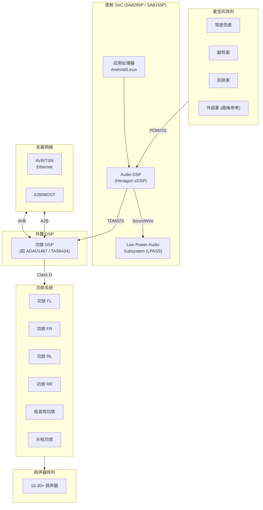
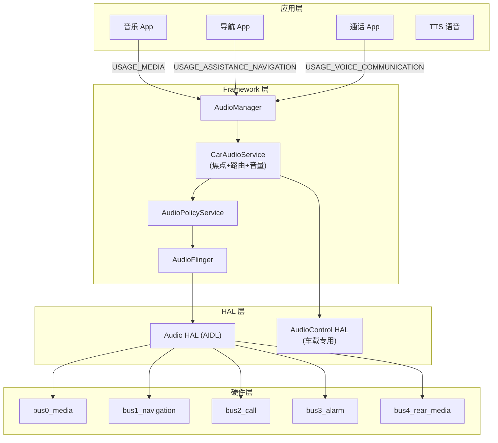
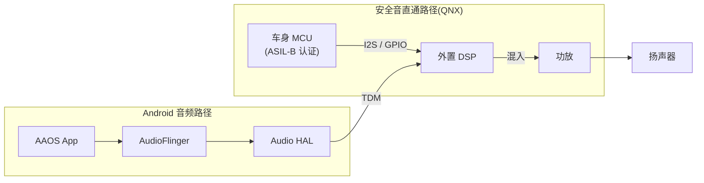
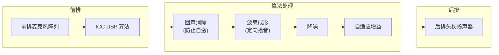
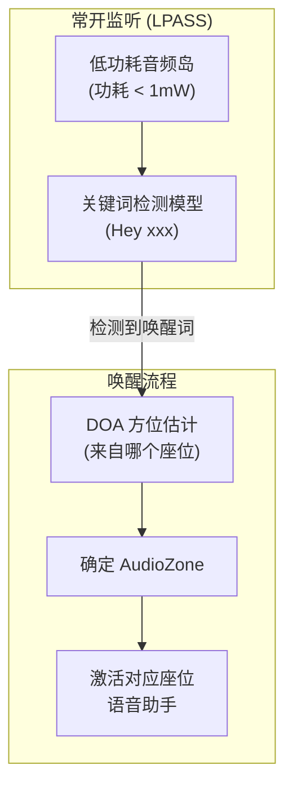

# 车载音频系统概览 (Automotive Audio System Overview)

车载音频系统已从单纯的"娱乐系统"演变为一个集成安全警报、语音交互、多音区娱乐及主动降噪的复杂分布式系统。本章从系统架构、硬件拓扑、软件分层三个维度全面解析。

---

## 1. 车载音频硬件架构

### 1.1 典型座舱音频硬件拓扑



### 1.2 硬件平台对比

| 平台 | SoC | 音频通道数 | 典型车型 | 关键特性 |
|:---|:---|:---|:---|:---|
| **高通 SA8295P** | 5nm, 8核 | 32 TDM + 8 I2S | 高端座舱 | 三屏联动，Hexagon AI |
| **高通 SA8155P** | 7nm, 8核 | 16 TDM + 4 I2S | 中端座舱 | 单屏+仪表 |
| **瑞萨 R-Car H3/M3** | 28nm, 8核 | 16 TDM | 日系车型 | 高安全等级 |
| **NXP i.MX8QM** | 28nm, 6核 | 8 SAI | 欧系中端 | 双域隔离 |
| **Intel Atom** | 14nm | USB Audio | 部分 IVI | x86 生态 |

### 1.3 音频通道规模

典型高端车载音频系统的通道规模远超手机：

```
高端配置 (如 B&W / 哈曼 / Bang & Olufsen):
  扬声器:    16-30 个 (含高音/中音/低音/环绕/天花板)
  功放通道:  16-24 通道 Class-D
  麦克风:    6-8 个 (含路噪参考麦)
  DSP 通道:  48+ (含 ANC/RNC 回路)
  
中端配置:
  扬声器:    8-12 个
  功放通道:  8-12 通道
  麦克风:    3-4 个
  DSP 通道:  16-24
```

---

## 2. AAOS 音频软件架构

### 2.1 以流为中心的架构 (Stream-Centric)



### 2.2 逻辑流 vs 物理流

| 维度 | 逻辑流 (Logical Stream) | 物理流 (Physical Stream) |
|:---|:---|:---|
| 定义 | App 发出的带 AudioAttributes 的数据流 | AudioFlinger 混音后输出到 HAL 的 Bus |
| 标识 | Usage + ContentType + Tags | Bus 地址 (如 `bus0_media`) |
| 上下文 | 保留完整的 Context 信息 | Context 信息丢失 |
| 混音点 | AudioFlinger MixerThread | 一条 Bus 可能承载多个逻辑流的混音 |
| 控制粒度 | 单 App 级别 | Bus 级别 (影响该 Bus 上的所有流) |

### 2.3 CarAudioContext 完整列表

AAOS 定义了 12+ 个 Context 用于精细化路由：

| CarAudioContext | 对应 AudioAttributes Usage | 默认 Bus |
|:---|:---|:---|
| `MUSIC` | USAGE_MEDIA | bus0_media |
| `NAVIGATION` | USAGE_ASSISTANCE_NAVIGATION | bus1_navigation |
| `VOICE_COMMAND` | USAGE_ASSISTANT | bus1_navigation |
| `CALL_RING` | USAGE_NOTIFICATION_RINGTONE | bus2_call |
| `CALL` | USAGE_VOICE_COMMUNICATION | bus2_call |
| `ALARM` | USAGE_ALARM | bus3_alarm |
| `NOTIFICATION` | USAGE_NOTIFICATION | bus3_alarm |
| `SYSTEM_SOUND` | USAGE_ASSISTANCE_SONIFICATION | bus3_alarm |
| `EMERGENCY` | USAGE_EMERGENCY | bus4_emergency |
| `SAFETY` | USAGE_SAFETY | bus4_emergency |
| `VEHICLE_STATUS` | USAGE_VEHICLE_STATUS | bus5_status |
| `ANNOUNCEMENT` | USAGE_ANNOUNCEMENT | bus6_announcement |

---

## 3. 仲裁矩阵与优先级

### 3.1 标准仲裁优先级

| 优先级 | Context | 典型示例 | 处理策略 | ASIL 等级 |
|:---|:---|:---|:---|:---|
| **P0 (最高)** | EMERGENCY | 气囊弹出、紧急 eCall | 硬件直通，强制静音一切 | ASIL-B/D |
| **P1** | SAFETY | 倒车雷达、ADAS 预警 | 压低背景音 (Ducking) | ASIL-A/B |
| **P2** | VEHICLE_STATUS | 低电量、车门未关 | 并发播放或 Duck | QM |
| **P3** | CALL | 电话通话 | 暂停媒体 | QM |
| **P4** | NAVIGATION | 导航播报 | Duck 媒体，与通话并存 | QM |
| **P5** | ANNOUNCEMENT | 交通广播、OTA 通知 | 抢占焦点 | QM |
| **P6 (最低)** | MUSIC / MEDIA | 音乐、视频、游戏 | 被随时中断 | QM |

### 3.2 外部音源直通 (External Sounds)

安全音（Chimes）和警告音（Warnings）通常**不经过 Android 路由**：



**安全音直通设计原则**：
- 不依赖 Android 系统启动状态
- 端到端延迟 < 5ms
- 满足功能安全 ASIL-B/D 要求
- MCU 独立控制，Android 挂死不影响安全音
- CHIME音需要通知安卓侧音源进行DUCK
---

## 4. 车载音频专用功能

### 4.1 车内通信 (ICC, In-Car Communication)



**ICC 技术挑战**：

| 挑战 | 原因 | 解决方案 |
|:---|:---|:---|
| 声学反馈 (啸叫) | 扬声器→麦克风回路增益 > 1 | 自适应反馈抑制 (AFC) |
| 端到端延迟 | 要求 < 10ms 否则不自然 | 硬件直通 + MMAP |
| 路噪干扰 | 高速行驶时底噪 70dB+ | 路噪参考麦 + 自适应降噪 |
| 空间感丧失 | 单通道传输缺乏方向感 | 双耳 ICC (保留 ITD/ILD) |

### 4.2 语音唤醒与多音区识别



**多音区唤醒关键技术**：
- **DOA (Direction of Arrival)**：利用麦克风阵列时间差估计声源方位
- **座位映射**：DOA 角度 → OccupantZone ID
- **低功耗实现**：KWD 运行在 LPASS (Hexagon LPI)，主 AP 可休眠

### 4.3 紧急呼叫 (eCall / ERA-GLONASS)

```
eCall 音频链路 (欧盟法规要求):
  车内麦克风 → ADC → DSP (AEC+NS) → Modem → 紧急呼叫中心
  紧急呼叫中心 → Modem → DSP (增益调节) → 功放 → 扬声器

要求:
  - 碰撞后 60 秒内自动拨出
  - 音频通路不依赖 Android (MCU + Modem 独立工作)
  - 全双工通话，AEC 必须在 DSP 层实现
```

### 4.4 引擎声浪模拟 (ESE, Engine Sound Enhancement)

详见 [04-ANC-RNC.md](./04-ANC-RNC.md) 中的 ESE 章节。

电动车天然静音，ESE 通过合成声浪增强驾驶体验：
- 低速行人警告 (AVAS，法规要求)
- 高速运动声浪合成 (跑车模式)
- 声浪随转速/油门实时变化

---

## 5. 车载音频与手机音频的核心差异

| 维度 | 手机 | 车载 |
|:---|:---|:---|
| 扬声器数量 | 1-2 个 | 16-30+ 个 |
| 音区数量 | 1 个 (全局) | 2-4 个 (前/后/左/右) |
| 功能安全 | 无 | ASIL-A/B (安全音) |
| 音频焦点 | 单一焦点栈 | 多 Zone 独立焦点 |
| 外部音源 | 无 | MCU 直通、A2B、AVB |
| 延迟要求 | 10-200ms | 安全音 < 5ms |
| DSP 复杂度 | 单芯片 | 多芯片级联 (SoC + 外置 DSP) |
| 网络连接 | 无 | A2B / MOST / AVB / Ethernet |
| 算法规模 | AEC+NS | AEC+NS+ANC+RNC+ICC+ESE+空间音频 |

---

## 6. 关键参考 (References)

1.  [Android Automotive Audio Architecture](https://source.android.com/docs/automotive/audio)
2.  [Qualcomm SA8295P Audio Platform](https://developer.qualcomm.com/)
3.  [GENIVI / COVESA Audio Architecture](https://www.covesa.global/)
4.  *Automotive Audio Signal Processing* - Springer
5.  [IEEE 802.1 AVB/TSN for Automotive](https://standards.ieee.org/standard/802_1BA-2011.html)
6.  [ISO 26262 Functional Safety in Automotive Audio](https://www.iso.org/standard/68383.html)
