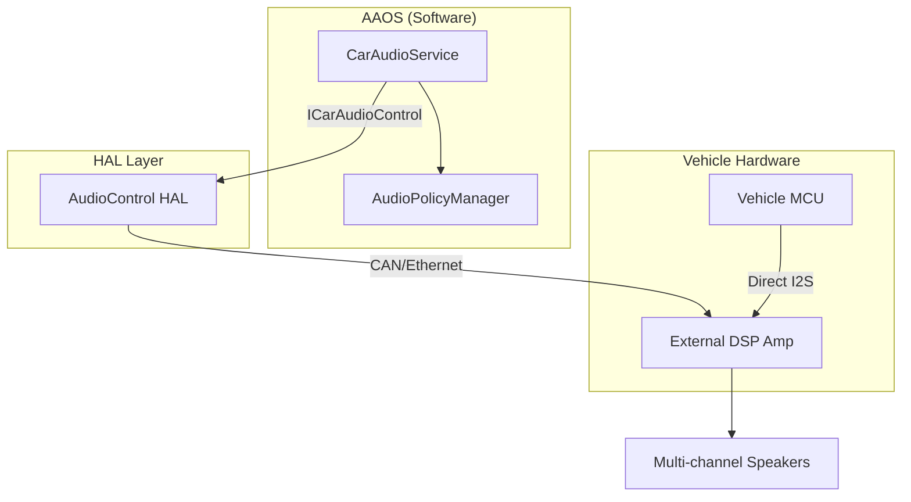

# 车载音频系统概览 (Automotive Audio System Overview)

车载音频系统（Automotive Audio）已从传统的“收音机+扬声器”模式演变为复杂的**分布式多区实时交互系统**。其核心挑战在于：如何在保证驾驶安全（安全音、雷达音）的前提下，提供极致的娱乐体验（多音区、声场均衡）。

---

## 1. 仲裁矩阵 (Arbitration Matrix)

车载音频设计的灵魂是**仲裁 (Arbitration)**。当多个声音同时请求播放时，系统必须基于优先级矩阵决定谁能发声，谁被压低（Duck），谁被静音（Mute）。

### 1.1 优先级分层
| 优先级 | 类型 (Context) | 典型示例 | 处理策略 |
| :--- | :--- | :--- | :--- |
| **P0 (最高)** | Emergency | 紧急报警、紧急电话、ADAS 介入 | 硬件直通，强制中断一切 |
| **P1** | Safety | 倒车雷达、未系安全带、转向灯 | 压低音乐音量 (Ducking) |
| **P2** | Vehicle Status | 低电量提醒、系统通知 | 并发播放或排队 |
| **P3** | Communication | 语音助理、蓝牙电话、微信语音 | 排他性播放（音乐暂停） |
| **P4 (最低)** | Entertainment | 音乐、视频、电台 | 可被随时打断或压低 |

---

## 2. 硬件与软件的边界：VHAL

在 Android Automotive (AAOS) 中，`AudioControl HAL` 是连接 Android 策略与车辆底层硬件的桥梁。

### 2.1 核心流程
1.  **Android 侧**：`CarAudioService` 发起路由请求。
2.  **HAL 侧**：执行 `IAudioControl::onDevicesToAudioPortConfig`。
3.  **硬件侧**：外部 DSP 功放切换物理开关或调节交叉混音矩阵。

---

## 3. 车载电子架构的影响

*   **集中式架构**：所有音频都在机头 (Head Unit) 处理，直接输出到扬声器。
*   **域控架构 (Domain Controller)**：机头输出数字流（如 AVB/A2B），由专用的**音频域控制器 (External Amp)** 进行全局混音和调音。

---

## 4. 关键参考 (References)

1.  [AOSP: Automotive Audio Overview](https://source.android.com/docs/core/audio/automotive)
2.  [Functional Safety (ISO 26262) for In-Car Infotainment](https://www.iso.org/standard/43906.html)

---
*Next Topic: [车载多音区、动态路由与 Bus 绑定](./02-Multi-zone-Routing.md)*
