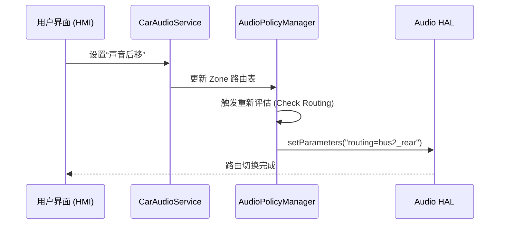

# 车载多音区、动态路由与 Bus 绑定

在智能座舱中，每一个“座位”都可以被看作一个独立的音频消费单元。为了实现这一目标，Android Automotive (AAOS) 引入了高度抽象且灵活的路由模型。

---

## 1. 核心概念：音区 (Audio Zones)

AAOS 通过 **Audio Zone** 来物理隔离车内空间。

*   **Primary Zone (ID: 0)**：包含主驾和副驾。默认输出到车内音响系统。
*   **Secondary Zones (ID: 1, 2...)**：通常指后排（左、右）。输出通常定向到后排头枕扬声器或蓝牙/有线耳机。

### 🧠 🧠 专家深度：Occupant Zone 映射
在多账号系统中，`OccupantZoneService` 会将“人”与“区”绑定。
*   *场景*：当账号 A（登录在后排）启动音乐 App 时，系统会自动寻找与之绑定的 Audio Zone，并确保声音只从后排耳机传出。

---

## 2. 基于 Bus 的逻辑拓扑

不同于手机只有扬声器（Speaker）和耳机（Headset），车机拥有几十个扬声器。Android 通过 **Bus (总线地址)** 来区分用途。

### 2.1 物理绑定代码 (car_audio_configuration.xml)
这是车载音频最核心的配置文件。

```xml
<audioConfiguration version="3">
    <zones>
        <zone name="primary zone" isPrimary="true" occupantZoneId="0">
            <volumeGroups>
                <group>
                    <!-- 🚀 关键：定义 Bus 地址 -->
                    <device address="bus0_media">
                        <context context="music"/>
                        <context context="game"/>
                    </device>
                    <device address="bus1_navigation">
                        <context context="navigation"/>
                        <context context="voice_command"/>
                    </device>
                </group>
            </volumeGroups>
        </zone>
    </zones>
</audioConfiguration>
```

---

## 3. 动态路由切换 (Dynamic Routing)

当检测到状态变更（如用户手动在车机界面点击“声音仅驾驶员可见”）时，系统会触发动态路由。

### 3.1 代码级实现路径
1.  **CarAudioService** 接收到切换请求。
2.  调用 `AudioPolicyManager::setDeviceConnectionState`。
3.  **核心函数触发**：`getDeviceForStrategy()` 根据新的 `car_audio_configuration` 逻辑重新计算输出节点。
4.  **底层执行**：Audio HAL 收到指令，修改 DSP 内部的交叉混音矩阵（Mix Matrix）。



---

## 4. 关键调试命令 (专家级)

如果遇到声音路由错误，必须使用以下命令查看“真相”：

*   **查看 Zone 绑定情况**：
    `adb shell dumpsys car_service | grep -A 20 "CarAudioService"`
*   **查看当前活跃流走的哪条 Bus**：
    `adb shell dumpsys media.audio_policy | grep -A 10 "mOutputs"`
*   **验证 HAL 是否收到请求**：
    `adb logcat | grep -i "AudioControl"`

---
*Next Topic: [车载音频焦点策略与音量组管理](./03-Focus-Volume-Management.md)*
