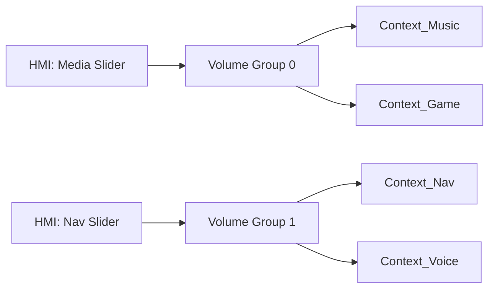

# 车载音频焦点策略与音量组管理

车载环境下的交互极其频繁：导航播报、雷达提示、手机来电、语音助理。如何协调这些声音的竞争关系（焦点）并统一管理其响度（音量组），是车载开发的核心。

---

## 1. 车载音频焦点 (Car Audio Focus)

与手机不同，车载系统通常禁用 Android 原生的焦点同步，而使用 `CarAudioContext` 驱动的自定义逻辑。

### 1.1 焦点冲突矩阵
| 请求流 \ 当前流 | Music | Navigation | Call |
| :--- | :--- | :--- | :--- |
| **Request Nav** | Ducking (压低音乐) | Parallel (混合) | Ducking |
| **Request Call** | Interrupt (暂停) | Ducking | Reject/Wait |
| **Request Safety** | Mute (静音) | Mute | Ducking |

### 1.2 核心代码流程
当 App 请求焦点时：
1.  调用 `AudioManager.requestAudioFocus()`。
2.  `CarAudioFocus` 内部接收到请求，根据 `CarAudioContext` 查找冲突表。
3.  **结果返回**：`AUDIOFOCUS_REQUEST_GRANTED`（允许发声）或 `FAILED`。

---

## 2. 音量组管理 (Volume Groups)

车载系统不会对每个 Context 单调调节音量，而是将它们划分为若干个 **Volume Group**。

### 2.1 映射关系 (Mapping)
一个音量组包含多个上下文。例如，“媒体音量”滑块可能同时控制音乐和游戏。



### 2.2 专家提示：增益步长 (Gain Steps)
在 `car_audio_configuration.xml` 中，可以为每个组定义步长：
```xml
<volumeGroup>
    <context context="music"/>
    <context context="game"/>
    <!-- 🚀 关键：步长定义 -->
    <gain minIndex="0" maxIndex="40" defaultValue="20" stepValue="100"/> 
</volumeGroup>
```

---

## 3. 音量调节的“穿透”过程

当用户旋转物理旋钮或点击屏幕调节音量时：

1.  **CarAudioService** 接收到 Index 变化。
2.  查找对应的 **Volume Group**，计算 dB 值。
3.  通过 `AudioControl HAL` 的 `onVolumeGroupEvent` 通知底层。
4.  **硬件层同步**：外部 DSP 功放应用新的增益系数。

### 🧠 🧠 专家深度：Fade 与 Balance
车载系统支持“声场中心调节”。
*   **Balance**：调节左/右扬声器权重。
*   **Fade**：调节前/后扬声器权重。
*   这些逻辑通常由 `CarAudioService` 计算出四个声角的权重，最终合并到 HAL 层的增益指令中。

---

## 4. 关键调试与验证

*   **实时查看所有音量组电平**：
    `adb shell dumpsys car_service | grep -A 50 "Volume groups"`
*   **强制设置某个音区音量**：
    `cmd car_service set-audio-zone-volume <ZONE_ID> <GROUP_ID> <INDEX>`

---
*Next Module: [07. 高通平台专题 (Qualcomm Platform)](../07-Qualcomm-Platform/README.md)*
