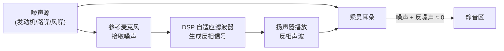
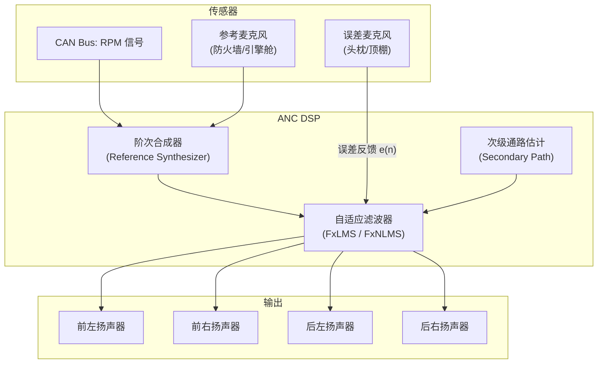
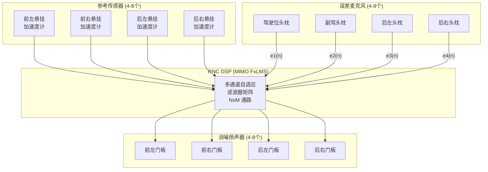
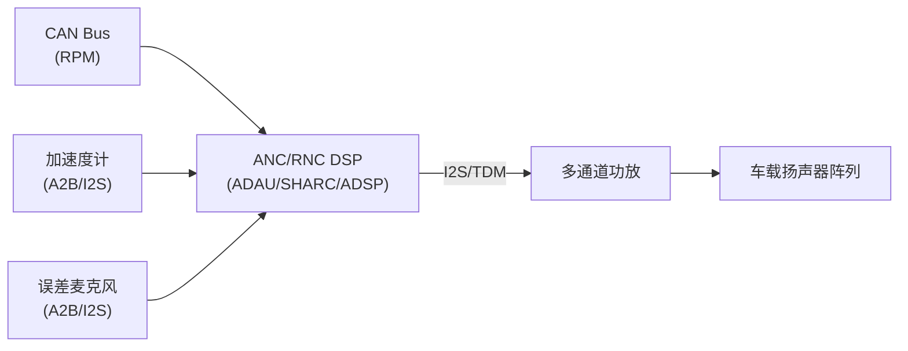

# 车载主动降噪与路噪消除 (ANC & RNC)

主动降噪 (ANC, Active Noise Cancellation) 和路噪消除 (RNC, Road Noise Cancellation) 是高端智能座舱的核心音频技术，通过"以声灭声"原理大幅提升车内静谧性。

---

## 1. 基本原理：反相干涉



核心公式：$y(n) = noise(n) + anti\_noise(n) \approx 0$

其中 `anti_noise(n)` 与 `noise(n)` 幅度相等、相位相反（180°）。

---

## 2. ANC vs RNC 对比

| 特性 | ANC (主动降噪) | RNC (路噪消除) |
|:---|:---|:---|
| **目标噪声** | 发动机阶次噪声（低频周期性） | 轮胎-路面噪声（宽频随机） |
| **频段** | 20-500Hz（窄带） | 20-1000Hz（宽带） |
| **参考信号** | 发动机转速信号 (RPM) 或振动传感器 | 悬挂加速度计 + 车内麦克风 |
| **算法类型** | 前馈 (Feedforward) 为主 | 前馈 + 反馈混合 |
| **自适应复杂度** | 中等 | 高（多通道 MIMO） |
| **典型车型** | 混动/燃油车 | 高端 EV/燃油车 |

---

## 3. 发动机阶次 ANC 详解

### 3.1 阶次噪声特征

发动机噪声的频率与转速直接相关：

$f_{order} = \frac{RPM \times Order}{60}$

*   **四缸发动机**：主阶次 = 2nd Order（每转两次爆燃）
    *   2000 RPM → $f = 2000 \times 2 / 60 = 66.7$ Hz
*   **六缸发动机**：主阶次 = 3rd Order

### 3.2 ANC 系统架构



### 3.3 FxLMS 自适应算法

**Filtered-x Least Mean Squares** 是 ANC 中最经典的自适应算法：

```
权重更新公式:
w(n+1) = w(n) + μ · e(n) · x'(n)

其中:
  w(n)  : 自适应滤波器系数
  μ     : 步长 (learning rate), 控制收敛速度 vs 稳定性
  e(n)  : 误差麦克风信号 (残余噪声)
  x'(n) : 参考信号经次级通路滤波后的信号 (filtered-x)
```

**关键挑战**：
*   **次级通路 (Secondary Path)**：从扬声器到误差麦克风的传递函数必须精确建模
*   **因果性约束**：算法处理延迟必须 < 噪声传播延迟，否则无法有效消除
*   **收敛速度**：RPM 快速变化时（急加速），滤波器需要快速跟踪

---

## 4. 路噪消除 (RNC) 详解

### 4.1 路噪特征

*   **宽频**：20Hz-1000Hz，无明显周期性
*   **非平稳**：随路面、车速、轮胎状态实时变化
*   **多路径**：通过轮胎→悬挂→车身→空气多条路径传入座舱

### 4.2 RNC MIMO 系统架构



### 4.3 计算复杂度

对于 $N$ 个参考 × $M$ 个误差 × $L$ 个扬声器的系统：
*   自适应滤波器数量 = $N \times L$
*   次级通路估计数量 = $L \times M$
*   **典型配置 (4x4x4)**：16 个自适应滤波器 + 16 个次级通路

### 4.4 降噪效果指标

| 指标 | 含义 | 典型值 |
|:---|:---|:---|
| **IL (Insertion Loss)** | 开启 RNC 后噪声衰减量 | 3-8 dB (宽带平均) |
| **峰值衰减** | 特定频率最大衰减 | 10-15 dB |
| **有效频段** | RNC 起效的频率范围 | 20-500Hz |
| **收敛时间** | 算法达到稳态的时间 | < 1 秒 |

---

## 5. 硬件要求与系统延迟

### 5.1 传感器

| 传感器 | 用途 | 关键要求 |
|:---|:---|:---|
| **加速度计** | RNC 参考信号 | 带宽 > 1kHz, 灵敏度 100mV/g |
| **参考麦克风** | ANC 参考拾取 | 高 SNR, 防水防尘 |
| **误差麦克风** | 残余噪声反馈 | 安装在静音区附近 (头枕) |
| **RPM 信号** | ANC 阶次参考 | 来自 CAN Bus，延迟 < 5ms |

### 5.2 延迟约束

```
ANC: 端到端延迟 (传感器→扬声器) < 2-3ms (硬性因果约束)
RNC: 端到端延迟 < 5ms (因果性约束相对宽松)
```

### 5.3 典型硬件拓扑



---

## 6. 与娱乐音频的协同

### 6.1 信号叠加

```
最终扬声器输出 = 音乐信号 + ANC反噪声 + RNC反噪声
```

*   叠加后不能超过功放/扬声器最大输出能力
*   ANC/RNC 不能引入可闻音染
*   娱乐音量变化不应干扰误差估计

### 6.2 引擎声浪模拟 (Engine Sound Enhancement, ESE)

在 EV 或混动车中人工合成"发动机声浪"：
*   **目的**：驾驶反馈感、满足 AVAS 法规
*   **实现**：DSP 根据车速/加速度/踏板深度实时合成阶次声
*   **与 ANC 协同**：ESE 需确保不被 ANC 消除（频率域隔离或白名单机制）

---

## 7. 关键参考 (References)

1.  *Active Noise Control Systems* - Sen M. Kuo & Dennis R. Morgan
2.  *Signal Processing for Active Control* - Stephen Elliott
3.  [Analog Devices - Automotive ANC Solutions](https://www.analog.com/en/applications/markets/automotive-pavilion-home/active-noise-cancellation.html)
4.  [Harman - Road Noise Cancellation](https://www.harman.com/)
5.  [Bose - Active Sound Management](https://www.bose.com/automotive)
