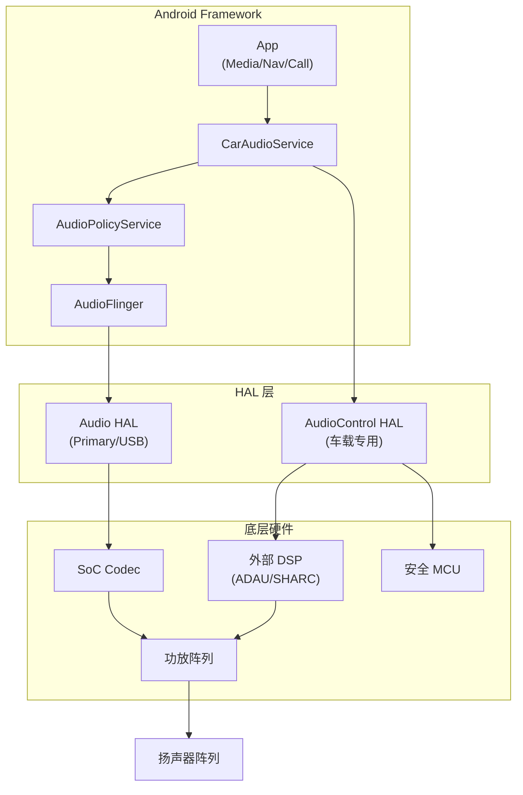
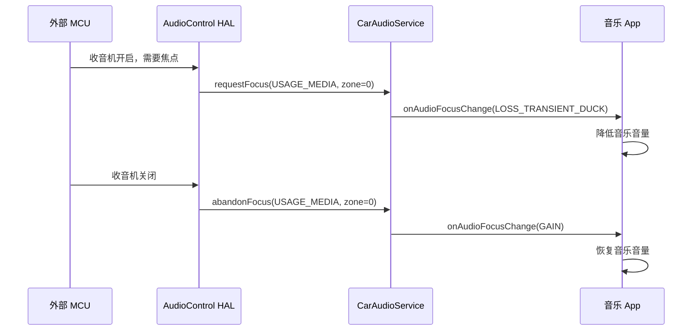
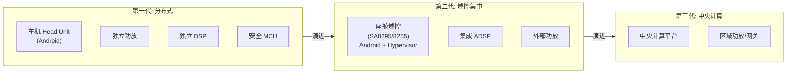
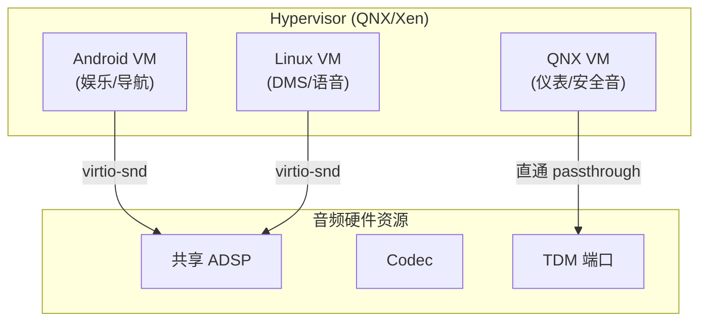
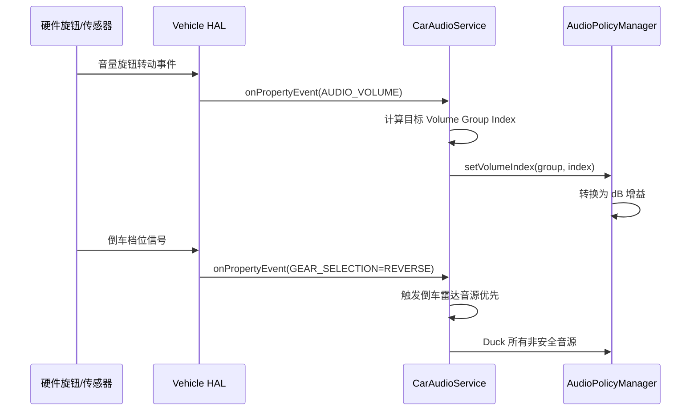

# AudioControl HAL 与 AAOS 音频架构演进

AudioControl HAL 是 Android Automotive OS (AAOS) 特有的音频硬件抽象层，负责连接 Android 框架层与车载底层音频硬件（外部 DSP、功放、MCU）。本章同时梳理 AAOS 音频架构从分布式到集中式的演进路线。

---

## 1. AAOS 音频架构全景



**关键区别**：
*   **Audio HAL**：标准 Android 音频通路，处理 PCM 数据流
*   **AudioControl HAL**：车载专用控制通路，不传输 PCM 数据，只下发**控制指令**（音量、Fade/Balance、Ducking、焦点事件）

---

## 2. AudioControl HAL 接口详解

### 2.1 AIDL 接口定义 (Android 12+)

```java
// IAudioControl.aidl — 核心接口
interface IAudioControl {
    // ===== 音量控制 =====
    // 通知底层：某个音量组的增益变化
    void onDevicesToDuckChange(in DuckingInfo[] duckingInfos);
    void onDevicesToMuteChange(in MutingInfo[] mutingInfos);
    
    // ===== 焦点事件 =====
    // 向底层通知当前音频焦点状态（非 Android 管理的外部音源）
    void registerFocusListener(in IFocusListener listener);
    void onAudioFocusChange(in String usage, int zoneId, int focusChange);
    
    // ===== Fade & Balance =====
    void setFadeTowardFront(float value);   // -1.0(全后) ~ +1.0(全前)
    void setBalanceTowardRight(float value); // -1.0(全左) ~ +1.0(全右)
    
    // ===== 音频增益回调 =====
    void registerGainCallback(in IAudioGainCallback callback);
    
    // ===== 功能查询 =====
    void setModuleChangeCallback(in IModuleChangeCallback callback);
}
```

### 2.2 DuckingInfo 结构

当高优先级音源（如导航）需要压低低优先级音源（如音乐）时：

```java
parcelable DuckingInfo {
    int zoneId;                          // 音区 ID
    String[] addressesToDuck;            // 需要 Duck 的 Bus 地址
    String[] addressesToUnduck;          // 需要恢复的 Bus 地址
    AudioAttributesGroup[] usagesHoldingFocus; // 当前持有焦点的 Usage
}
```

### 2.3 外部音源焦点管理 (IFocusListener)

车载系统中存在 Android 无法感知的音源（如 AM/FM 收音机、蓝牙电话由 MCU 直接处理）。AudioControl HAL 通过 `IFocusListener` 让底层可以**请求** Android 焦点：



---

## 3. AudioControl HAL 实现示例

### 3.1 HAL 服务端实现框架

```cpp
// AudioControlHalService.cpp
class AudioControl : public BnAudioControl {
public:
    // Fade/Balance — 下发到外部 DSP
    ndk::ScopedAStatus setFadeTowardFront(float value) override {
        // 计算前后扬声器增益权重
        float frontGain = (value + 1.0f) / 2.0f;  // 0.0 ~ 1.0
        float rearGain  = 1.0f - frontGain;
        
        // 通过 I2C/SPI 下发到外部 DSP
        mDspController->setFade(frontGain, rearGain);
        return ndk::ScopedAStatus::ok();
    }
    
    ndk::ScopedAStatus setBalanceTowardRight(float value) override {
        float rightGain = (value + 1.0f) / 2.0f;
        float leftGain  = 1.0f - rightGain;
        mDspController->setBalance(leftGain, rightGain);
        return ndk::ScopedAStatus::ok();
    }
    
    // Ducking — 控制指定 Bus 的增益衰减
    ndk::ScopedAStatus onDevicesToDuckChange(
            const std::vector<DuckingInfo>& duckingInfos) override {
        for (const auto& info : duckingInfos) {
            for (const auto& addr : info.addressesToDuck) {
                mDspController->setDucking(addr, DUCK_ATTENUATION_DB);
            }
            for (const auto& addr : info.addressesToUnduck) {
                mDspController->setDucking(addr, 0 /* no attenuation */);
            }
        }
        return ndk::ScopedAStatus::ok();
    }
    
    // 焦点监听注册
    ndk::ScopedAStatus registerFocusListener(
            const std::shared_ptr<IFocusListener>& listener) override {
        mFocusListener = listener;
        return ndk::ScopedAStatus::ok();
    }
    
private:
    std::shared_ptr<DspController> mDspController;
    std::shared_ptr<IFocusListener> mFocusListener;
};
```

### 3.2 HAL 服务注册

```cpp
// service.cpp
int main() {
    ABinderProcess_setThreadPoolMaxThreadCount(4);
    auto audioControl = ndk::SharedRefBase::make<AudioControl>();
    
    const std::string instance = 
        std::string(IAudioControl::descriptor) + "/default";
    binder_status_t status = 
        AServiceManager_addService(audioControl->asBinder().get(),
                                   instance.c_str());
    ABinderProcess_joinThreadPool();
    return EXIT_FAILURE;
}
```

---

## 4. AAOS 音频架构演进

### 4.1 架构代际对比



| 代际 | 音频处理位置 | 通信方式 | 典型 SoC |
|:---|:---|:---|:---|
| **分布式** | 独立 DSP 功放模块 | I2S/MOST/A2B | 传统 MCU + 独立 DSP |
| **域控集中** | 座舱 SoC 内置 ADSP | TDM/SoundWire | SA8295 / SA8255 |
| **中央计算** | 中央 SoC + 区域网关 | Ethernet AVB/TSN | 下一代 SoC |

### 4.2 Hypervisor 多 OS 音频隔离

高端座舱 SoC（如 SA8295）支持 Hypervisor 运行多个 OS：



**关键设计原则**：
*   **安全音 (P0/P1)** 由 QNX VM 直接控制，不经过 Android
*   **娱乐音频** 由 Android VM 通过 virtio-snd 共享 ADSP
*   **仲裁决策** 可由 Hypervisor 层或独立安全 MCU 执行

### 4.3 Ethernet AVB/TSN 音频传输

下一代车载音频正在从 A2B/I2S 演进到以太网传输：

| 特性 | A2B | Ethernet AVB | Ethernet TSN |
|:---|:---|:---|:---|
| **带宽** | ~50 Mbps | 100 Mbps | 1 Gbps+ |
| **拓扑** | 菊花链 | 星形/树形 | 任意 |
| **同步精度** | 纳秒级 | 微秒级 (gPTP) | 纳秒级 |
| **音频 + 其他数据** | 仅音频 | 音频 + 视频 | 音频 + 视频 + 控制 |
| **线缆** | UTP | 标准以太网 | 标准以太网 |

---

## 5. VHAL (Vehicle HAL) 音频交互

### 5.1 VHAL 与音频相关的属性

```java
// 音量旋钮硬件事件
AUDIO_VOLUME_LIMIT_MAXIMUM  // 系统最大音量限制
AUDIO_VOLUME_LIMIT_MINIMUM  // 系统最小音量限制

// 外部放大器信息
AUDIO_EXT_ROUTING_HINT      // 外部路由提示

// 紧急音源
EMERGENCY_SOUND_STATE       // 紧急声音状态 (e-Call)

// 座舱状态
SEAT_OCCUPANCY              // 座位占用状态 (影响音区激活)
```

### 5.2 VHAL 事件驱动音频行为



---

## 6. 调试命令速查

```bash
# AudioControl HAL 状态
adb shell dumpsys android.hardware.automotive.audiocontrol

# CarAudioService 完整状态
adb shell dumpsys car_service | grep -A 100 "CarAudioService"

# 音区配置
adb shell dumpsys car_service | grep -A 30 "Audio Zones"

# VHAL 音频属性
adb shell dumpsys android.hardware.automotive.vehicle | grep -i audio

# 实时路由状态
adb shell dumpsys media.audio_policy | grep -A 20 "mOutputs"

# Bus 设备连接状态
adb shell dumpsys media.audio_policy | grep "BUS"
```

---

## 7. 关键参考 (References)

1.  [Android Automotive Audio Architecture](https://source.android.com/docs/automotive/audio)
2.  [IAudioControl AIDL Interface](https://cs.android.com/android/platform/superproject/+/main:hardware/interfaces/automotive/audiocontrol/)
3.  [Qualcomm SA8295 Audio Overview for Automotive](https://developer.qualcomm.com/)
4.  [IEEE 802.1 TSN Task Group](https://1.ieee802.org/tsn/)
5.  [Android Vehicle HAL](https://source.android.com/docs/automotive/vhal)
