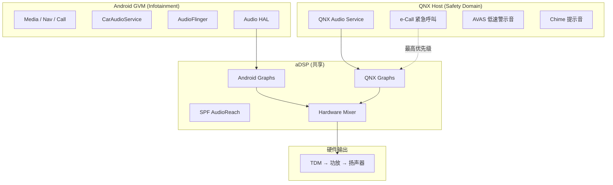

# 高通车载音频平台 (Qualcomm Automotive Audio — SA8295)

高通 SA8295P (Snapdragon 8295) 是目前高端智能座舱的主流芯片平台，其音频子系统基于 AudioReach 架构，支持多域 (Multi-Domain) 音频处理、QNX Hypervisor 隔离和复杂的多通道 TDM 路由。本章聚焦 SA8295 车载音频的平台架构、Bringup 流程和典型场景配置。

---

## 1. SA8295 音频硬件架构

### 1.1 芯片级音频拓扑

```
SA8295P 音频子系统:

  ┌──────────────────────────────────────────────────────────┐
  │ AP (Application Processor — Kryo CPU)                   │
  │  ├── Android / Linux GVM                                │
  │  │   ├── audioserver (AudioFlinger + AudioPolicy)       │
  │  │   ├── Audio HAL (AIDL Primary + USB)                │
  │  │   └── AGM (Audio Graph Manager)                      │
  │  └── QNX Host / LA Host                                 │
  ├──────────────────────────────────────────────────────────┤
  │ LPASS (Low Power Audio Subsystem)                        │
  │  ├── aDSP (Audio DSP — Hexagon)                         │
  │  │   ├── SPF (Signal Processing Framework)              │
  │  │   ├── AudioReach Graphs                              │
  │  │   └── CAPI Modules (3A / Effects / Codec)            │
  │  ├── LPI (Low Power Island)                             │
  │  │   └── VAD / KWD (超低功耗语音唤醒)                   │
  │  └── DMA Engine (LPAIF)                                 │
  │       ├── Primary TDM (RX/TX)                           │
  │       ├── Secondary TDM (RX/TX)                         │
  │       ├── Tertiary TDM (RX/TX)                          │
  │       ├── Quaternary TDM (RX/TX)                        │
  │       ├── Quinary TDM (RX/TX)                           │
  │       ├── Senary MI2S / TDM                             │
  │       └── SoundWire (可选)                               │
  ├──────────────────────────────────────────────────────────┤
  │ 外部器件                                                 │
  │  ├── 外部 Codec (AK4332 / CS系列)                       │
  │  ├── 外部 SmartPA (TAS6424 / FDA系列)                   │
  │  ├── A2B Transceiver (AD2428W)                          │
  │  ├── 外部 DSP (ADAU1452 / SHARC)                       │
  │  └── 安全 MCU (e-Call / AVAS)                           │
  └──────────────────────────────────────────────────────────┘
```

### 1.2 与手机平台的关键差异

| 维度 | 手机 (SM8550) | 车载 (SA8295) |
|:---|:---|:---|
| **TDM 端口数** | 1-2 组 | 5-6 组 (Primary~Senary) |
| **声道数** | 2ch (立体声) | 16-32ch+ (多音区/多功放) |
| **外部器件** | 内置 Codec + SmartPA | 外部 Codec + 功放阵列 + A2B |
| **OS 架构** | 单 Android | QNX Hypervisor + Android GVM |
| **安全要求** | 无 | ASIL-B (e-Call / AVAS) |
| **延迟要求** | 通话 <40ms | ANC <5ms, e-Call 实时 |
| **AudioReach 版本** | AR 2.0+ | AR 2.0+ (HQX/LA 变体) |
| **Audio HAL** | Primary HAL | Primary + Extension HAL |

---

## 2. 多域音频架构 (Multi-Domain)

### 2.1 QNX Hypervisor 音频隔离



### 2.2 音频域划分

```
典型车载多域音频分配:

  Domain 1: QNX Host (Safety-Critical)
    ├── e-Call 紧急呼叫 (最高优先级, ASIL-B)
    ├── AVAS 低速行人警示 (法规强制)
    ├── Chime 系统提示音 (安全带/车门)
    └── 麦克风直通 (紧急通话备份)
    
  Domain 2: Android GVM (Infotainment)
    ├── 媒体播放 (Music / Podcast)
    ├── 导航语音 (TTS)
    ├── 语音助手 (ASR/TTS)
    ├── 电话通话 (VoIP / HFP)
    ├── 蓝牙音乐 (A2DP)
    └── 通知提示 (Notifications)
    
  Domain 3: 第三方 Guest OS (可选)
    └── 后排娱乐 (Rear Seat Entertainment)

优先级仲裁:
  e-Call > Chime > Phone > Nav > Media  
  QNX 域有硬件级优先权, 可强制 Duck/Mute Android 域
  AVAS不参与仲裁，不影响安卓和CHIME发音
```

### 2.3 跨域通信

```
QNX ↔ Android 音频通信:

  方式 1: 共享 aDSP (推荐)
    QNX → GPR → aDSP Graph (QNX 子图)
    Android → AGM → GPR → aDSP Graph (Android 子图)
    两个子图在 DSP 内部混音
    
  方式 2: Virtio Audio (虚拟化)
    QNX Host 暴露 virtio-snd 设备给 Android GVM
    Android Audio HAL → virtio frontend → QNX backend → 硬件
    
  方式 3: 共享内存 + IPC (Inter-Process Communication, 进程间通信)
    用于控制信令 (音量/路由切换)
    不直接传输 PCM 数据
```

---

## 3. SA8295 Audio Bringup 流程

### 3.1 Bringup 阶段

```
SA8295 Audio Bringup Checklist:

  Phase 1: 硬件验证
    □ 确认 TDM/I2S 物理连线 (BCLK/SYNC/DATA)
    □ 示波器验证时钟信号 (频率/占空比)
    □ 确认外部 Codec/PA 的 I2C 地址和供电
    □ 验证 GPIO/TLMM 引脚复用配置
    
  Phase 2: Kernel/DTS 配置
    □ 配置 pinctrl (TDM pin 功能选择)
    □ 配置 Machine Driver (DAI Link 定义)
    □ 配置 Codec Driver (I2C/SPI 注册)
    □ 验证 tinyplay/tinycap 基本播放录音
    
  Phase 3: AudioReach 配置
    □ ACDB 校准文件 (通过 QACT)
    □ AGM Use Case XML 配置
    □ AudioReach Graph 定义 (播放/录音/通话)
    □ 验证 Graph Open → Start → Data Flow → Stop
    
  Phase 4: Android 集成
    □ audio_policy_configuration.xml 配置
    □ car_audio_configuration.xml 音区/Bus 映射
    □ Audio HAL mixPort/devicePort 定义
    □ 端到端播放/录音验证
    
  Phase 5: 调优与功能
    □ 音量曲线调优
    □ 音效链配置 (EQ/DRC/ANC)
    □ 多音区路由验证
    □ 焦点仲裁验证
    □ e-Call/AVAS 功能验证
```

### 3.2 DTS 配置示例

```dts
/* SA8295 TDM 音频节点配置 (简化) */

&soc {
    /* TDM 引脚配置 */
    pri_tdm_clk_active: pri_tdm_clk_active {
        mux {
            pins = "gpio45";
            function = "pri_mi2s";
        };
        config {
            pins = "gpio45";
            drive-strength = <8>;
            bias-disable;
        };
    };
    
    pri_tdm_sync_active: pri_tdm_sync_active {
        mux {
            pins = "gpio46";
            function = "pri_mi2s_ws";
        };
        config {
            pins = "gpio46";
            drive-strength = <8>;
            bias-disable;
        };
    };
    
    pri_tdm_data0_active: pri_tdm_data0_active {
        mux {
            pins = "gpio47";
            function = "pri_mi2s_data0";
        };
        config {
            pins = "gpio47";
            drive-strength = <8>;
            bias-disable;
        };
    };
};

/* Machine Driver 中的 DAI Link */
&q6core {
    sound-adp-star {
        compatible = "qcom,sa8295-snd-card";
        qcom,model = "sa8295-adp-star-snd-card";
        
        /* Primary TDM RX (播放 → 外部功放) */
        qcom,pri-tdm-rx-master;
        qcom,pri-tdm-rx-slots = <8>;       /* 8 声道 */
        qcom,pri-tdm-rx-slot-width = <32>; /* 32-bit slot */
        qcom,pri-tdm-rx-sample-rate = <48000>;
        
        /* Secondary TDM TX (录音 ← 麦克风阵列) */
        qcom,sec-tdm-tx-master;
        qcom,sec-tdm-tx-slots = <4>;       /* 4 路麦克风 */
        qcom,sec-tdm-tx-slot-width = <32>;
        qcom,sec-tdm-tx-sample-rate = <48000>;
        
        /* Tertiary TDM (A2B Transceiver) */
        qcom,tert-tdm-rx-slave;            /* A2B 作为 Master */
        qcom,tert-tdm-rx-slots = <8>;
        
        /* DAI Links */
        dai-link@0 {
            link-name = "Primary TDM RX 0";
            cpu {
                sound-dai = <&q6tdm PRI_TDM_RX_0>;
            };
            codec {
                sound-dai = <&ext_codec 0>;
            };
        };
    };
};
```

---

## 4. TDM 多通道配置详解

### 4.1 SA8295 TDM 端口映射

```
SA8295 LPAIF TDM 端口分配 (典型车载方案):

  Primary TDM RX   → 主驾驶员区扬声器 (8ch)
  Primary TDM TX   → (保留)
  
  Secondary TDM RX → 副驾驶/后排扬声器 (8ch)
  Secondary TDM TX → 麦克风阵列输入 (4-6ch)
  
  Tertiary TDM RX  → A2B 下行 (后排/顶棚扬声器)
  Tertiary TDM TX  → A2B 上行 (远端麦克风)
  
  Quaternary TDM   → 外部 DSP 通信 (ADAU1452)
  
  Quinary TDM      → ANC/RNC 参考信号 + 误差信号
  
  Senary MI2S      → 蓝牙 HFP SCO (如需)

BCLK 计算:
  48kHz × 8ch × 32bit = 12.288 MHz (Primary)
  48kHz × 4ch × 32bit = 6.144 MHz  (Secondary TX)
```

### 4.2 TDM Slot 映射

```
TDM Slot 到声道的映射 (8ch 示例):

  Slot 0: Front Left      (FL)    → 主驾左前
  Slot 1: Front Right     (FR)    → 副驾右前
  Slot 2: Rear Left       (RL)    → 左后
  Slot 3: Rear Right      (RR)    → 右后
  Slot 4: Front Center    (FC)    → 中置
  Slot 5: LFE             (Sub)   → 低音炮
  Slot 6: Side Left       (SL)    → 左环绕
  Slot 7: Side Right      (SR)    → 右环绕

Slot Mask 配置:
  8ch 全开:  slot_mask = 0xFF   (11111111)
  前 4ch:    slot_mask = 0x0F   (00001111)
  仅 FL+FR:  slot_mask = 0x03   (00000011)
```

### 4.3 TDM 时钟问题排查

```
常见 TDM CLK/SYNC 错误 (参考 80-PM164-2):

  问题 1: TDM_SYNC 和 TDM_CLK 不同步
    原因: SoC 和外部 Codec 的 PLL 配置不匹配
    排查: 
      - 示波器同时抓 BCLK 和 SYNC
      - 验证 BCLK = SampleRate × Slots × SlotWidth
      - 检查 DTS 中 clock-frequency 配置
    
  问题 2: TDM 数据错位 (Channel Swap)
    原因: Slot offset 配置错误
    排查:
      - 确认 slot_offset 数组配置
      - 用示波器对比 SYNC 与 DATA 的时序关系
      - adb shell tinymix "PRI TDM RX 0 SlotMapping" 
    
  问题 3: TDM 只有部分声道有声
    原因: Slot mask 未完全配置
    排查:
      - 检查 DTS 中 qcom,tdm-rx-slots
      - 检查 AGM XML 中的 channel 配置
      - tinymix 确认 slot_mask 值
      
  问题 4: Master/Slave 模式不匹配
    原因: SoC 设为 Master 但外部器件也输出时钟
    排查:
      - 确认 DTS 中 qcom,xxx-tdm-rx-master/slave
      - 拔除外部器件, 验证 SoC 是否独立输出时钟
```

---

## 5. 车载 AudioReach 典型 Graph

### 5.1 播放 Graph (多音区)

```
车载播放 AudioReach Graph (多音区):

  Android AudioFlinger
       │
       ▼
  ┌─────────────────────────────────────────────────────┐
  │ aDSP (AudioReach SPF)                               │
  │                                                     │
  │  Media Stream ──→ [Decoder] ──→ [Volume]            │
  │                                      │              │
  │  Nav Stream ───→ [Volume] ──→ [Mixer] ──→ [EQ]     │
  │                                      │      │       │
  │  Phone Stream ─→ [Volume] ──┘        │      │       │
  │                                      │      │       │
  │                              [DRC] ←─┘      │       │
  │                                │            │       │
  │                          [Splitter]    [Splitter]    │
  │                           /      \      /      \    │
  │                     [Zone1 Vol] [Zone2 Vol]         │
  │                         │           │               │
  │                   [TDM Sink 0] [TDM Sink 1]         │
  │                   (Primary RX) (Secondary RX)       │
  └─────────────────────────────────────────────────────┘
       │                    │
       ▼                    ▼
    主驾扬声器           副驾/后排扬声器
```

### 5.2 录音 Graph (多麦克风)

```
车载录音 AudioReach Graph:

  麦克风阵列 (4ch TDM TX)
       │
       ▼
  ┌─────────────────────────────────────────────┐
  │ aDSP                                        │
  │                                             │
  │  [TDM Source] ──→ [Gain] ──→ [AEC Ref]      │
  │   (Sec TDM TX)              (远端参考)       │
  │        │                        │            │
  │        └──→ [ECNS Module] ←────┘            │
  │              (回声消除+降噪)                  │
  │                  │                           │
  │            [Beamformer]                      │
  │              (波束成形 → 驾驶员方向)          │
  │                  │                           │
  │            [AGC] → [PCM Out]                 │
  └─────────────────────────────────────────────┘
       │
       ▼
    Android AudioRecord / ASR Engine
```

### 5.3 车载 HFP 通话 Graph

```
车载免提通话 (HFP) AudioReach Graph:

  ┌─────────────────────────────────────────────────┐
  │ aDSP                                            │
  │                                                 │
  │  下行 (远端语音 → 扬声器):                      │
  │    BT SCO RX ──→ [Decoder] ──→ [Volume]         │
  │                                   │              │
  │                              [EQ/DRC]            │
  │                                   │              │
  │                              [TDM Sink]          │
  │                              → 驾驶员扬声器       │
  │                                                  │
  │  上行 (麦克风 → 远端):                           │
  │    TDM Source ──→ [ECNS] ──→ [AGC]               │
  │    (麦克风阵列)    │              │               │
  │                   │         [Encoder]             │
  │              [Loopback]         │                │
  │              (远端参考)    BT SCO TX              │
  │              ← 从下行获取        → 蓝牙发送       │
  └─────────────────────────────────────────────────┘

关键点:
  - AEC 参考信号从下行播放的 PCM 获取 (loopback)
  - 多麦阵列做波束成形, 抑制车内噪声
  - 下行仅路由到驾驶员区扬声器 (隐私)
  - 同时需要 Duck 媒体音量
```

---

## 6. 车载 Audio HAL 扩展

### 6.1 SA8295 Audio HAL 层次

```
SA8295 Audio HAL 架构:

  CarAudioService
       │
       ├──→ AudioControl HAL (AIDL)
       │     └── 控制指令: Ducking / Focus / Fade&Balance
       │
       └──→ AudioPolicyService
             │
             └──→ Audio HAL (AIDL Primary)
                   │
                   ├──→ AGM (Audio Graph Manager)
                   │     └──→ GSL → GPR → aDSP SPF
                   │
                   └──→ AudioControl Extension
                         └── 厂商自定义扩展 (音区切换/ANC 控制)

关键 HAL 配置文件:
  /vendor/etc/audio_policy_configuration.xml  → 端口/路由
  /vendor/etc/car_audio_configuration.xml     → 音区/Bus 映射
  /vendor/etc/audio_effects.xml               → 音效链
  /vendor/etc/acdb/                           → ACDB 校准数据
  /vendor/etc/audio_platform_info.xml         → 平台能力声明
```

### 6.2 车载特有的 mixPort 配置

```xml
<!-- audio_policy_configuration.xml — 车载多 Bus 配置 -->
<audioPolicyConfiguration>
  <modules>
    <module name="primary" halVersion="3.0">
      <mixPorts>
        <!-- 媒体播放 (主驾) -->
        <mixPort name="media" role="source"
                 flags="AUDIO_OUTPUT_FLAG_PRIMARY">
          <profile format="AUDIO_FORMAT_PCM_16_BIT"
                   samplingRates="48000"
                   channelMasks="AUDIO_CHANNEL_OUT_STEREO"/>
        </mixPort>
        
        <!-- 导航语音 -->
        <mixPort name="nav_guidance" role="source">
          <profile format="AUDIO_FORMAT_PCM_16_BIT"
                   samplingRates="48000"
                   channelMasks="AUDIO_CHANNEL_OUT_STEREO"/>
        </mixPort>
        
        <!-- 电话通话 -->
        <mixPort name="phone" role="source">
          <profile format="AUDIO_FORMAT_PCM_16_BIT"
                   samplingRates="48000"
                   channelMasks="AUDIO_CHANNEL_OUT_MONO"/>
        </mixPort>
        
        <!-- 系统提示音 -->
        <mixPort name="sys_notification" role="source">
          <profile format="AUDIO_FORMAT_PCM_16_BIT"
                   samplingRates="48000"
                   channelMasks="AUDIO_CHANNEL_OUT_STEREO"/>
        </mixPort>
      </mixPorts>
      
      <devicePorts>
        <!-- 每个 Bus 对应一个逻辑设备 -->
        <devicePort tagName="bus0_media"
                    type="AUDIO_DEVICE_OUT_BUS" address="bus0_media">
          <profile format="AUDIO_FORMAT_PCM_16_BIT"
                   samplingRates="48000"
                   channelMasks="AUDIO_CHANNEL_OUT_STEREO"/>
        </devicePort>
        <devicePort tagName="bus1_nav"
                    type="AUDIO_DEVICE_OUT_BUS" address="bus1_nav">
          <profile format="AUDIO_FORMAT_PCM_16_BIT"
                   samplingRates="48000"
                   channelMasks="AUDIO_CHANNEL_OUT_STEREO"/>
        </devicePort>
        <devicePort tagName="bus2_phone"
                    type="AUDIO_DEVICE_OUT_BUS" address="bus2_phone">
          <profile format="AUDIO_FORMAT_PCM_16_BIT"
                   samplingRates="48000"
                   channelMasks="AUDIO_CHANNEL_OUT_MONO"/>
        </devicePort>
      </devicePorts>
      
      <routes>
        <route type="mix" sink="bus0_media" sources="media"/>
        <route type="mix" sink="bus1_nav" sources="nav_guidance"/>
        <route type="mix" sink="bus2_phone" sources="phone"/>
      </routes>
    </module>
  </modules>
</audioPolicyConfiguration>
```

---

## 7. 车载场景调试

### 7.1 调试命令速查

```bash
# ==================== TDM 端口状态 ====================
# 查看所有 TDM PCM 设备
adb shell cat /proc/asound/cards
adb shell cat /proc/asound/pcm

# 查看 TDM 端口运行状态
adb shell cat /proc/asound/card0/pcm*p/sub0/status
adb shell cat /proc/asound/card0/pcm*c/sub0/status

# 直接 TDM 播放测试 (绕过 Android)
adb shell tinyplay /data/test_8ch.wav -D 0 -d 0 -c 8 -r 48000 -b 16

# ==================== AGM / AudioReach ====================
# 查看 AGM 当前活跃 session
adb shell cat /proc/asound/card0/agm_dump

# 查看 AudioReach Graph 状态
adb shell echo 0x2 > /proc/asound/card0/agm_dump_level
adb shell cat /proc/asound/card0/agm_dump

# ==================== 车载路由 ====================
# 查看 Bus 设备映射
adb shell dumpsys car_service | grep -A 20 "CarAudioService"

# 查看音区配置
adb shell dumpsys car_service | grep -A 50 "Audio Zones"

# 查看焦点状态
adb shell dumpsys car_service | grep -i "focus"

# ==================== TDM Slot 验证 ====================
# 查看 TDM 配置
adb shell tinymix -D 0 | grep -i "tdm\|slot"

# 设置 TDM Slot Mapping
adb shell tinymix -D 0 "PRI TDM RX 0 SlotMapping" "0 4 8 12 16 20 24 28"

# ==================== 跨域调试 (QNX + Android) ====================
# QNX 侧查看音频状态 (需 QNX shell)
# io-audio -d
# snd_pcm_open / snd_pcm_write 测试

# Android GVM 侧确认 virtio-snd (如使用虚拟化)
adb shell cat /proc/asound/cards | grep virtio
```

### 7.2 车载常见问题

| 问题 | 可能原因 | 排查步骤 |
|:---|:---|:---|
| 某个音区无声 | Bus 路由配置错误 | 检查 car_audio_configuration.xml 的 zone-bus 映射 |
| 声道错位 | TDM Slot 映射错误 | 示波器验证 + tinymix 检查 SlotMapping |
| e-Call 被媒体覆盖 | 仲裁优先级配置错误 | 检查 QNX 域优先级 > Android 域 |
| 麦克风串扰 | TDM TX 通道未隔离 | 检查 Slot 分配，单独录制每个 Slot 验证 |
| 通话回声 | AEC 参考信号未接 | 检查 AudioReach Graph 中的 Loopback 连接 |
| 多域音量不同步 | AudioControl HAL 未同步 | 验证 HAL setGroupVolume 下发到外部 DSP |
| 冷启动无声 | Graph 未在 boot 时创建 | 检查 init.rc 中 audio 服务启动顺序 |
| A2B 链路断开 | A2B 发现/同步失败 | 检查 A2B Master I2C 通信和 SYNC pin |

---

## 8. 关键参考 (References)

1.  80-PH451-12: SA8295 Android Audio Overview for Automotive
2.  80-PM164-50: SA8295 HQX Audio Overview for AudioReach
3.  80-PM164-51: SA8295 HQX Audio Bringup Guide
4.  80-PM164-53: SA8295 Audio Playback and Record Use Cases
5.  80-PM164-54: SA8295 HQX Audio Customization Guide
6.  80-PM164-2: SA8295P TDM CLK and TDM SYNC Error Application Note
7.  80-PM164-86: QNX Hypervisor BSP Feature Overview
8.  80-VN500-34: AudioReach HFP on Automotive
9.  80-VN600-2: SA8295/SA8255/SA7255 LA Audio Overview

---
*返回：[AudioControl HAL](./05-AudioControl-HAL.md) | [高通平台专题](../07-Qualcomm-Platform/README.md)*
