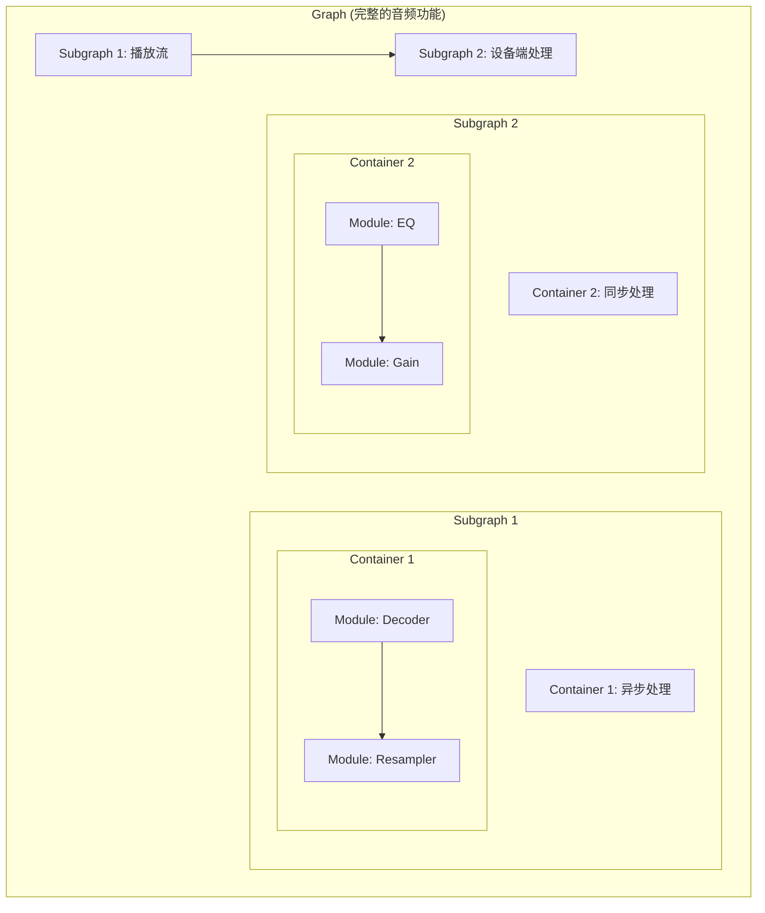

# Qualcomm AudioReach 架构深度解析

AudioReach 是高通 (Qualcomm) 推出的下一代音频驱动架构，旨在取代传统的 Elite 架构。它采用了更加模块化、可扩展的设计，极大地简化了复杂音频场景（如多声道、多音区）的开发。

---

## 1. 核心设计理念

AudioReach 的核心是将音频处理路径抽象为 **图形 (Graph)**。
*   **灵活性**：开发者可以动态创建、连接或销毁音频处理节点，而无需重新编译内核。
*   **跨平台**：统一了手机 (Mobile)、车机 (Automotive) 和计算 (Compute) 平台的音频驱动模型。

---

## 2. 逻辑层级结构

AudioReach 的对象层级从大到小依次为：**Graph -> Subgraph -> Container -> Module**。

### 2.1 模块 (Module)
音频处理的最小单元（如：Gain, EQ, Mixer, I2S Sink）。每个模块都有唯一的 **Module ID**。

### 2.2 容器 (Container)
模块的宿主。它定义了内部模块的运行环境，如：
*   **优先级 (Priority)**
*   **执行模式**：同步或异步。
*   **内存池**。

### 2.3 子图 (Subgraph)
一组逻辑相关的容器集合。一个 Subgraph 通常对应一个完整的音频功能块（如一个播放实例）。

---

## 3. GPR (Graph Packet Router)

GPR 是应用层（或系统层）与 AudioReach 交互的桥梁。
*   所有的控制命令（如：调节音量、开启算法）都封装在 GPR 数据包中，发送给 DSP。

---

## 4. 图形化开发：QACT

高通提供了 **QACT (Qualcomm Audio Configuration Tool)** 工具。
*   开发者可以在 QACT 中以可视化连线的方式设计 AudioReach 图形。
*   实时调试各模块的参数（如实时调整 EQ 曲线）。

---

## 5. 关键参考 (References)

1.  [Qualcomm Developer Network - AudioReach](https://developer.qualcomm.com/)
2.  Qualcomm AudioReach Documentation (Access restricted to QC customers)

---
*Next Topic: [高通 ADSP 拓扑与调试](./02-ADSP-Topology.md)*
