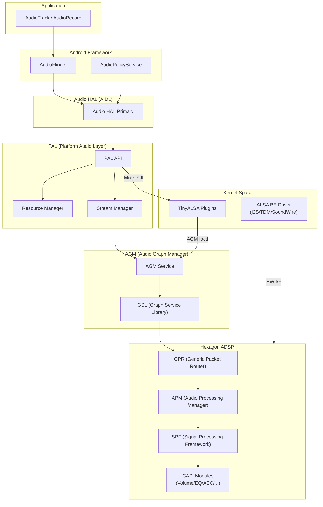
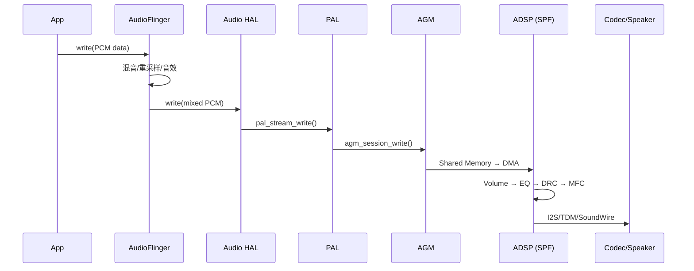

# Qualcomm AudioReach 架构深度解析

AudioReach（也称为 Signal Processing Framework, SPF）是高通 (Qualcomm) 推出的下一代音频信号处理架构。它不仅实现了算法的模块化，还通过一套复杂的软件中间层（PAL, AGM）实现了软硬件的高度解耦。本章深入分析每一层的职责、关键数据流、配置体系以及调试方法。

---

## 1. 架构演进：旧架构 vs AudioReach

```
旧架构 (SM8350 及以前):
  ┌───────────────────────────────────┐
  │ Audio HAL → TinyALSA → Kernel FE+BE Driver → ADSP │
  └───────────────────────────────────┘
  问题:
    - FE 驱动在 Kernel, 修改需要改内核代码
    - Graph 拓扑硬编码, 不够灵活
    - 调试困难 (需要 Kernel log + DSP log 对照)

AudioReach (SM8450+):
  ┌───────────────────────────────────────────────┐
  │ Audio HAL → PAL → AGM → GSL → GPR → SPF/APM  │
  │                ↕                               │
  │         TinyALSA Plugins → Kernel (BE Only)    │
  └───────────────────────────────────────────────┘
  优势:
    - FE 虚拟化到用户空间
    - Graph 拓扑由 XML + Key Vector 动态配置
    - 分层清晰, 各层可独立调试
    - CAPI 模块化, 算法可插拔
```

---

## 2. 系统全景架构



---

## 3. 各层详解

### 3.1 PAL (Platform Audio Layer)

```
PAL 层核心职责:
  Github地址：https://github.com/AudioReach/audioreach-pal
  文件位置: vendor/qcom/opensource/pal/
  
  1. Stream 管理:
     ├── StreamPCM      (普通 PCM 播放/录音)
     ├── StreamCompress  (Offload 播放)
     ├── StreamSoundTrigger (关键词检测)
     └── StreamUPD       (超声接近检测)
     
  2. Device 管理:
     ├── DeviceRxSpeaker / DeviceRxHeadphone
     ├── DeviceTxMic / DeviceTxHandset
     └── DeviceBT_A2DP / DeviceBT_SCO
     
  3. Resource Manager:
     ├── 解析 resourcemanager.xml
     ├── 管理设备连接/断开
     ├── 音频路由策略 (Device → Backend 映射)
     └── 并发策略 (StreamPriority, 通话优先)
     
  4. Session 管理:
     ├── SessionAlsaPcm (PCM 数据通路)
     ├── SessionAlsaCompress (Compress 通路)
     └── SessionAlsaVoice (语音通话通路)
```

### 3.2 AGM (Audio Graph Manager)

```
AGM 层核心职责:
  Github地址：https://github.com/AudioReach/audioreach-graphmgr
  文件位置: vendor/qcom/opensource/agm/
  
  1. Graph 生命周期管理:
     OPEN → PREPARE → START → STOP → CLOSE
     
  2. FE-BE 连接:
     ├── 接收 PAL 的 GKV 配置
     ├── 查询 ACDB 获取 Graph 拓扑
     ├── 建立 FE→Module Chain→BE 路径
     └── 管理多个并发 Session
     
  3. AGM 接口 (通过 TinyALSA Plugin 暴露):
     ├── agm_session_open()
     ├── agm_session_set_config()
     ├── agm_session_prepare()
     ├── agm_session_start()
     ├── agm_session_read/write()
     └── agm_session_close()
```

### 3.3 GSL (Graph Service Library)

```
GSL 核心功能:
  Github地址：https://github.com/AudioReach/audioreach-graphservices
  1. ACDB 数据解析:
     ├── 从 acdb.mdb (SQLite) 加载 Graph 拓扑
     ├── 解析 SubGraph → Module → Connection
     └── 获取模块的默认校准参数
     
  2. GPR 协议封装:
     ├── 将 Graph 命令封装为 GPR Packet
     ├── 通过 /dev/gpr_channel 发送到 ADSP
     └── 接收 DSP 侧的应答和事件

  3. 内存管理:
     ├── Shared Memory 分配 (PCM 数据传输)
     └── Calibration Memory (参数下发)
```

### 3.4 键值对管理 (Key Vectors)

| 键类型 | 全称 | 作用 | 示例 |
|:---|:---|:---|:---|
| **GKV** | Graph Key Vector | 唯一标识 Graph 拓扑 | `{StreamRx=DeepBuffer, DeviceRx=Speaker}` |
| **CKV** | Calibration Key Vector | 选择校准参数集 | `{Volume=Level5, SamplingRate=48000}` |
| **TKV** | Tag Key Vector | 运行时动态控制 | `{MuteTag=Unmute, GainTag=-6dB}` |

```
Key Vector 如何工作:

  1. PAL 根据 Usecase 构建 GKV
     例: 播放音乐到扬声器
     GKV = {StreamType=PCM_RX, DeviceType=SPEAKER, 
            Instance=1, SamplingRate=48000}
            
  2. AGM 用 GKV 查询 ACDB → 获取 Graph ID
     Graph ID 对应一组 SubGraph:
       SubGraph_1: [WR_EP → VOLUME → PEQ → MFC]     (PP SubGraph)
       SubGraph_2: [DEVICE_MFC → HW_EP_RX]            (Device SubGraph)
       
  3. PAL 用 CKV 选择校准参数
     CKV = {VolumeLevel=5} → 加载 Volume 模块的 Level5 增益表
     
  4. 运行时用 TKV 动态控制
     TKV = {MuteTag=1} → 发送 Mute 命令到 Volume 模块
```

---

## 4. 数据流详解

### 4.1 播放路径 (Playback Data Flow)



### 4.2 录音路径 (Capture Data Flow)

```
Mic → Codec ADC → I2S/SoundWire → ADSP
  → SPF Graph: [HW_EP_TX → DEVICE_MFC → EC_REF_MUX → AEC → NS → VOLUME → WR_EP]
  → Shared Memory → AGM → PAL → HAL → AudioFlinger → App
```

---

## 5. 配置文件体系

### 5.1 核心 XML 文件

| 文件 | 路径 | 作用 |
|:---|:---|:---|
| **resourcemanager.xml** | `/vendor/etc/` | 设备映射、后端配置、并发策略 |
| **card-defs.xml** | `/vendor/etc/` | 虚拟 PCM/Mixer 节点定义 |
| **usecaseKvManager.xml** | `/vendor/etc/` | Usecase → GKV 映射 |
| **mixer_paths.xml** | `/vendor/etc/` | Mixer 控件默认值 |
| **acdb.mdb** | `/vendor/etc/acdbdata/` | Graph 拓扑 + 校准数据 (SQLite) |

### 5.2 resourcemanager.xml 关键字段

```xml
<!-- 后端配置示例 -->
<device_profile>
    <in-device>
        <id>PAL_DEVICE_IN_HANDSET_MIC</id>
        <back_end_name>CODEC_DMA-LPAIF_VA-TX-0</back_end_name>
        <max_channels>2</max_channels>
        <channels>1</channels>
        <snd_device_name>va-mic</snd_device_name>
        <samplerate>48000</samplerate>
        <bit_width>16</bit_width>
    </in-device>
</device_profile>

<!-- 并发策略 -->
<usecase>
    <name>PAL_STREAM_VOIP_RX</name>
    <priority>1</priority>  <!-- 最高优先 -->
    <device_pp_enable>true</device_pp_enable>
</usecase>
```
### 5.3 card-defs.xml 关键字段
```xml
<defs>
<card>
    <id>100</id> //virtual cardid这个是高通虚拟出来的，实际在ASOC里根本没注册这个card，在userspace层走高通的AGM,GLS传递数据
    <name>qcm6490virtualsndcard</name>

    <pcm-device>
        <id>100</id>
        <name>PCM100</name>
        <pcm_plugin>
            <so-name>libagm_pcm_plugin.so</so-name> //这个会加载tinyalsa的plugin，高通的AGM库有这个实现，会通过BINDER调用到AGM进程的方法，不走普通的ALSA了
        </pcm_plugin>
        <props>
            <playback>1</playback>  //播放PCM
            <capture>0</capture>
        </props>
    </pcm-device>

    <pcm-device>
        <id>101</id>
        <name>PCM101</name>
        <pcm_plugin>
            <so-name>libagm_pcm_plugin.so</so-name>
        </pcm_plugin>
        <props>
            <playback>0</playback>
            <capture>1</capture>  //播放PCM
        </props>
    </pcm-device>
    ...
</card>
</defs>
```
### 5.4 usecaseKvManager.xml 关键字段
```xml
//从这个XML知道高通audioreach把一个完整的Graph分成了streams，streampps，devices，devicepps subgraphs，
PAL层的payloadbuilder会选择对应的配置，比如选择了流类型DEEPBUFFER，设备为SPEKER，把这信息告诉GSL从ACDB里面retrive
<defs>
<graph_key_value_pair_info>
    <streams>
        <!-- Low-latency stream -->
        <stream type="PAL_STREAM_LOW_LATENCY">    //低延迟流，性能要求高
            <keys_and_values Direction="TX" Instance="1">
                <!-- STREAMTX - RAW_RECORD -->
                <graph_kv key="0xB1000000" value="0xB1000009"/>
            </keys_and_values>
            <keys_and_values Direction="RX" Instance="1">
                <!-- STREAMRX - PCM_LL_PLAYBACK -->
                <graph_kv key="0xA1000000" value="0xA100000E"/>
                <!-- INSTANCE - INSTANCE_1 -->
                <graph_kv key="0xAB000000" value="0x1"/>
            </keys_and_values>
            <keys_and_values Direction="RX" Instance="2">
                <!-- STREAMRX - PCM_LL_PLAYBACK -->
                <graph_kv key="0xA1000000" value="0xA100000E"/>
                <!-- INSTANCE - INSTANCE_2 -->
                <graph_kv key="0xAB000000" value="0x2"/>
            </keys_and_values>
        </stream>
        <!-- Deep Buffer stream -->
        <stream type="PAL_STREAM_DEEP_BUFFER">    //高延迟流，稳定
            <keys_and_values Direction="RX" Instance="1">
                <!-- STREAMRX - PCM_DEEP_BUFFER -->
                <graph_kv key="0xA1000000" value="0xA1000001"/>
                <!-- INSTANCE - INSTANCE_1 -->
                <graph_kv key="0xAB000000" value="0x1"/>
            </keys_and_values>
            <keys_and_values Direction="RX" Instance="2">
                <!-- STREAMRX - PCM_DEEP_BUFFER -->
                <graph_kv key="0xA1000000" value="0xA1000001"/>
                <!-- INSTANCE - INSTANCE_2 -->
                <graph_kv key="0xAB000000" value="0x2"/>
            </keys_and_values>
            <keys_and_values Direction="TX" Instance="1">
                <!-- STREAMTX - PCM_RECORD -->
                <graph_kv key="0xB1000000" value="0xB1000001"/>
                <!-- INSTANCE - INSTANCE_1 -->
                <graph_kv key="0xAB000000" value="0x1"/>
            </keys_and_values>
            <keys_and_values Direction="TX" Instance="2">
                <!-- STREAMTX - PCM_RECORD -->
                <graph_kv key="0xB1000000" value="0xB1000001"/>
                <!-- INSTANCE - INSTANCE_2 -->
                <graph_kv key="0xAB000000" value="0x2"/>
            </keys_and_values>
            <keys_and_values Direction="TX" Instance="3">
                <!-- STREAMTX - PCM_RECORD -->
                <graph_kv key="0xB1000000" value="0xB1000001"/>
                <!-- INSTANCE - INSTANCE_3 -->
                <graph_kv key="0xAB000000" value="0x3"/>
            </keys_and_values>
        </stream>
        ...
    </streams>

    <streampps>
        <!-- Voice Call stream PP -->
        <streampp type="PAL_STREAM_VOICE_CALL">
            <keys_and_values>
                <!-- STREAMPP_RX - STREAMPP_RX_DEFAULT -->
                <graph_kv key="0xAF000000" value="0xAF000001"/>
            </keys_and_values>
        </streampp>
    </streampps>

    <devices>
        <!-- Speaker Device -->
        <device id="PAL_DEVICE_OUT_SPEAKER">  //自带SPEAKER
            <keys_and_values>
                <!-- DEVICERX - SPEAKER -->
                <graph_kv key="0xA2000000" value="0xA2000001"/>
            </keys_and_values>
        </device>
        <!-- Handset Device -->
        <device id="PAL_DEVICE_OUT_HANDSET">
            <keys_and_values>
                <!-- DEVICERX - HANDSET -->
                <graph_kv key="0xA2000000" value="0xA2000004"/>
            </keys_and_values>
        </device>
        ...
    </devices>

    <devicepps>
    <!-- OUT Speaker DevicePPs -->
        <!-- OUT Speaker DevicePPs -->
        <devicepp id="PAL_DEVICE_OUT_SPEAKER">  //SPEAKER设备下不同的流类型处理不同，一般音效都在这个subgraph里
            <keys_and_values StreamType="PAL_STREAM_DEEP_BUFFER,PAL_STREAM_PCM_OFFLOAD,PAL_STREAM_COMPRESSED,PAL_STREAM_LOW_LATENCY,PAL_STREAM_GENERIC">
                <!-- DEVICERX - SPEAKER -->
                <graph_kv key="0xA2000000" value="0xA2000001"/>
                <!-- DEVICEPP_RX - DEVICEPP_RX_AUDIO_MBDRC -->
                <graph_kv key="0xAC000000" value="0xAC000002"/>
            </keys_and_values>
            <keys_and_values StreamType="PAL_STREAM_LOW_LATENCY" CustomConfig="speaker-safe">
                <!-- DEVICERX - SPEAKER -->
                <graph_kv key="0xA2000000" value="0xA2000001"/>
                <!-- DEVICEPP_RX - DEVICEPP_RX_AUDIO_MBDRC -->
                <graph_kv key="0xAC000000" value="0xAC000002"/>
            </keys_and_values>
        </devicepp>

        <!-- OUT Handset DevicePPs -->
        <devicepp id="PAL_DEVICE_OUT_HANDSET">
            <keys_and_values StreamType="PAL_STREAM_DEEP_BUFFER,PAL_STREAM_PCM_OFFLOAD,PAL_STREAM_COMPRESSED,PAL_STREAM_LOW_LATENCY,PAL_STREAM_GENERIC">
                <!-- DEVICERX - HANDSET -->
                <graph_kv key="0xA2000000" value="0xA2000004"/>
                <!-- DEVICEPP_RX - DEVICEPP_RX_AUDIO_MBDRC -->
                <graph_kv key="0xAC000000" value="0xAC000002"/>
            </keys_and_values>
            <keys_and_values StreamType="PAL_STREAM_VOIP_RX">
                <!-- DEVICERX - HANDSET -->
                <graph_kv key="0xA2000000" value="0xA2000004"/>
                <!-- DEVICEPP_RX - DEVICEPP_RX_VOIP_MBDRC -->
                <graph_kv key="0xAC000000" value="0xAC000003"/>
            </keys_and_values>
        </devicepp>
    </devicepps>
</graph_key_value_pair_info>
```

### 5.5 mixer_paths.xml
```xml
//主要是用来控制codec的mixer ctl
<mixer>
    <!-- These are the initial mixer settings -->
    <ctl name="WSA_AIF_VI Mixer WSA_SPKR_VI_1" value="0" />
    <ctl name="WSA_AIF_VI Mixer WSA_SPKR_VI_2" value="0" />
    <ctl name="WSA_AIF_CPS Mixer WSA_SPKR_CPS_1" value="0" />
    <ctl name="WSA_AIF_CPS Mixer WSA_SPKR_CPS_2" value="0" />

    <!-- Codec controls -->
    <!-- WSA controls -->
    <ctl name="WSA RX0 MUX" value="ZERO" />
    <ctl name="WSA RX1 MUX" value="ZERO" />
    <ctl name="WSA_RX0 INP0" value="ZERO" />
    <ctl name="WSA_RX1 INP0" value="ZERO" />
    <ctl name="WSA2 RX0 MUX" value="ZERO" />
    <ctl name="WSA2 RX1 MUX" value="ZERO" />
    <ctl name="WSA2_RX0 INP0" value="ZERO" />
    <ctl name="WSA2_RX1 INP0" value="ZERO" />
    <path name="speaker">
        <ctl name="SpkrLeft PA Volume" value="20" />
        <ctl name="WSA RX0 MUX" value="AIF1_PB" />
        <ctl name="WSA_RX0 INP0" value="RX0" />
        <ctl name="WSA_COMP1 Switch" value="1" />
        <ctl name="SpkrLeft COMP Switch" value="1" />
        <ctl name="SpkrLeft BOOST Switch" value="1" />
        <ctl name="SpkrLeft DAC Switch" value="1" />
        <ctl name="SpkrLeft VISENSE Switch" value="1" />
	      <ctl name="SpkrRight PA Volume" value="20" />
        <ctl name="WSA RX1 MUX" value="AIF1_PB" />
        <ctl name="WSA_RX1 INP0" value="RX1" />
        <ctl name="WSA_COMP2 Switch" value="1" />
        <ctl name="SpkrRight COMP Switch" value="1" />
        <ctl name="SpkrRight BOOST Switch" value="1" />
        <ctl name="SpkrRight DAC Switch" value="1" />
        <ctl name="SpkrRight VISENSE Switch" value="1" />
    </path>
    <ctl name="Spkr2Right WSA MODE" value="0" />
    ...
</mixer> 
```

## 6. Graph 生命周期

```
Graph 状态机:

  ┌──────┐   open()   ┌─────────┐  prepare()  ┌──────────┐
  │ IDLE │──────────→│ OPENED  │──────────→│ PREPARED │
  └──────┘           └─────────┘           └──────────┘
                                                │
                                           start()
                                                │
                                                ▼
  ┌──────┐   close()  ┌─────────┐  stop()   ┌─────────┐
  │ IDLE │←──────────│ STOPPED │←─────────│ STARTED │
  └──────┘           └─────────┘           └─────────┘

  各阶段的 DSP 操作:
    open:    分配 Graph 资源, 加载模块
    prepare: 下发校准参数 (CKV), 配置端口
    start:   使能 DMA, 开始数据流
    stop:    停止 DMA, 保留 Graph
    close:   释放所有资源
```

---

## 7. 调试方法

### 7.1 常用调试命令

```bash
# 查看 PAL 层状态
adb shell dumpsys vendor.audio.hardware | grep -A 50 "PAL"

# 查看 AGM session 信息
adb shell cat /proc/agm/sessions

# 查看 DSP Graph 状态
adb shell cat /proc/snd/card0/graph_info

# 查看当前活跃的 PCM 流
adb shell cat /proc/asound/pcm

# 查看 Mixer 控件 (Key Vector 相关)
adb shell tinymix | grep -i "metadata\|graph\|gkv"

# 查看 ACDB 加载状态
adb logcat -s ACDB AGM PAL AudioReach

# GPR 调试 (DSP 侧通信)
adb logcat -s GPR SPF APM
```

### 7.2 常见问题排查

| 问题 | 可能原因 | 排查方法 |
|:---|:---|:---|
| 无声 | Graph 未 START / BE 未连接 | 检查 AGM session 状态, tinymix BE 路由 |
| 爆音 | Graph 参数不匹配 (采样率/位宽) | 检查 resourcemanager.xml 配置 |
| 崩溃 | ADSP SSR (子系统重启) | 检查 dmesg + DSP log |
| 延迟高 | Graph 模块链过长 | 检查 ACDB Graph 拓扑, 精简模块 |
| 切换卡顿 | 路由切换时 Graph 重建 | 优化 PAL device switch 逻辑 |

### 7.3 日志关键词

```
关键 Logcat Tag:
  PAL:        PAL 层 Stream/Device 操作
  AGM:        AGM Session 生命周期
  ACDB:       校准数据加载
  GPR:        ADSP 通信协议
  SPF:        DSP 信号处理框架
  APM:        DSP 音频处理管理器
  AHAL:       Audio HAL 层

典型正常启动日志:
  PAL: pal_stream_open: stream type=PCM_RX
  AGM: agm_session_open: session_id=1
  ACDB: GetGraph: GKV matched, graph_id=0x1234
  GPR: gpr_send_pkt: opcode=APM_CMD_GRAPH_OPEN
  SPF: graph_open: success, num_modules=5
```

---

## 8. 关键参考 (References)

1.  *SA8295/SM8650 ADSP Software Architecture* - Qualcomm Documentation
2.  *AudioReach SPF Generic Packet Router (GPR) API Reference*
3.  Qualcomm PAL/AGM Source Code (Vendor Proprietary)
4.  [Qualcomm AudioReach Overview](https://developer.qualcomm.com/)
5.  [ACDB Manager (QACT) User Guide](https://developer.qualcomm.com/)
