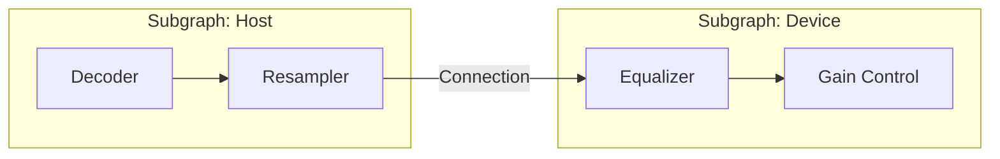

# Qualcomm AudioReach 架构深度解析

AudioReach 是高通 (Qualcomm) 推出的下一代音频驱动架构。它彻底抛弃了静态拓扑，转向了基于**图形 (Graph)** 的动态管理，是目前车载和旗舰手机音频开发者的必修课。

---

## 1. 从 ELITE 到 AudioReach 的演进

*   **ELITE (Legacy)**：拓扑结构在编译时固定，修改一个模块需要重新烧录 DSP 固件。
*   **AudioReach (Modern)**：支持动态运行时通过命令连接模块，极大地缩短了调试周期。

---

## 2. 关键对象模型

1.  **Module (模块)**：最小算法单元（如 EQ, Gain）。每个模块有唯一的 **IID (Instance ID)**。
2.  **Container (容器)**：模块的运行载体。定义了执行频率（同步/异步）和优先级。
3.  **Subgraph (子图)**：逻辑功能的封装（如：USB 播放流）。
4.  **Graph (图)**：由多个 Subgraph 连接而成的完整端到端链路。



---

## 3. GPR (Graph Packet Router) 二进制协议

所有的控制逻辑（如：调音量）都是通过 GPR 数据包下发给 DSP 的。

### 3.1 数据包结构 (伪结构体)
```c
struct gpr_packet_t {
    uint16_t version;
    uint16_t header_size;
    uint16_t src_port;
    uint16_t dst_port; // 目标 Subgraph/Module 地址
    uint32_t token;    // 唯一标识，用于异步回调
    uint32_t opcode;   // 操作码 (如: APM_CMD_GRAPH_OPEN)
    uint8_t  payload[];
};
```

---

## 4. 实战：ADSP 性能监控

在开发过程中，必须监控 DSP 的负载以防实时音频爆音。

*   **查看 DSP 负荷**：使用高通 `adsp_perf` 或 `qcat` 实时查看每个 Container 的 CPU 占用。
*   **PCM Dump**：通过 GPR 命令指定 Module 开启 Dump，将数据存入 `/data/vendor/audio/` 供离线分析。

---

## 5. 关键参考 (References)

1.  [Qualcomm AudioReach API Reference](https://developer.qualcomm.com/)
2.  Qualcomm Hexagon DSP Architecture Whitepaper
