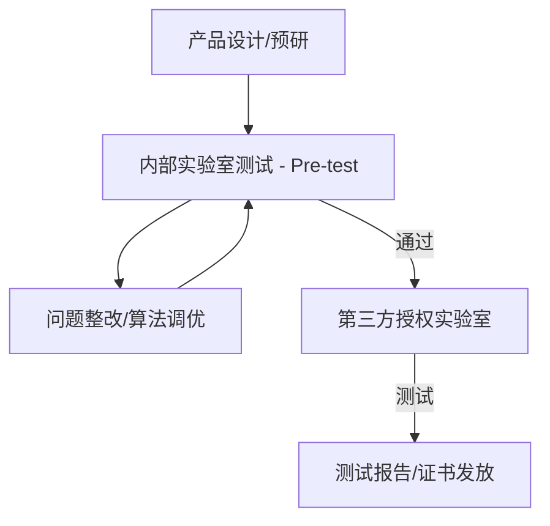

# 行业通信标准与认证 (Industry Standards & Certifications)

在消费电子和汽车领域，音频产品不仅要“好听”，还必须满足一系列国际标准和第三方平台的认证要求，以确保互操作性和基本的通话质量。

---

## 1. 语音质量评估标准 (ITU-T)

国际电信联盟 (ITU) 制定了一系列评估语音质量的算法，将主观听感转化为可量化的分数 (MOS, Mean Opinion Score)。

### 1.1 PESQ (ITU-T P.862)
*   **全称**：Perceptual Evaluation of Speech Quality。
*   **用途**：传统窄带拨号语音质量测试。已被 POLQA 基本取代。

### 1.2 POLQA (ITU-T P.863)
*   **全称**：Perceptual Objective Listening Quality Analysis。
*   **用途**：目前最先进的语音质量评估标准，支持宽带 (HD Voice) 和全频带语音测试，广泛用于 5G 和 VoIP 测试。
*   **指标**：分数范围 1-5 分，4.0 以上通常被认为达到商用级别。

---

## 2. 车载专用标准

汽车由于其特殊的声学环境（高背景噪声、玻璃反射），有一套极其严苛的标准。

### 2.1 ITU-T P.1100 / P.1110
*   **P.1100**：窄带车载免提通话标准。
*   **P.1110**：宽带车载免提通话标准。
*   **测试项**：包含双讲 (Double-talk) 性能、回声抵消、背景噪声下的语音清晰度。

### 2.2 Apple CarPlay & Android Auto
*   **认证要求**：如果车机要支持 CarPlay，必须通过 Apple 提供的音频测试套件，包含对延迟 (Latency) 和回声消除性能的强制要求。

---

## 3. 会议系统认证

随着远程办公普及，以下认证成为办公音频产品的必备：

*   **Microsoft Teams Certification**：对麦克风拾音距离、全双工性能有极高要求。
*   **Zoom Certified**：确保设备在 Zoom 软件下的音视频同步和降噪表现。

---

## 4. 认证测试流程

---

## 5. 关键参考 (References)

1.  [ITU-T P.863 : POLQA Specification](https://www.itu.int/rec/T-REC-P.863)
2.  [Apple MFi Program - CarPlay Audio Requirements](https://developer.apple.com/carplay/)
3.  [Microsoft Teams Audio Device Requirements](https://docs.microsoft.com/en-us/microsoftteams/devices/audio-devices)

---
*Next Module: [11. 学习路径与资源 (Learning Path)](../11-Learning-Path-Resources/README.md)*
