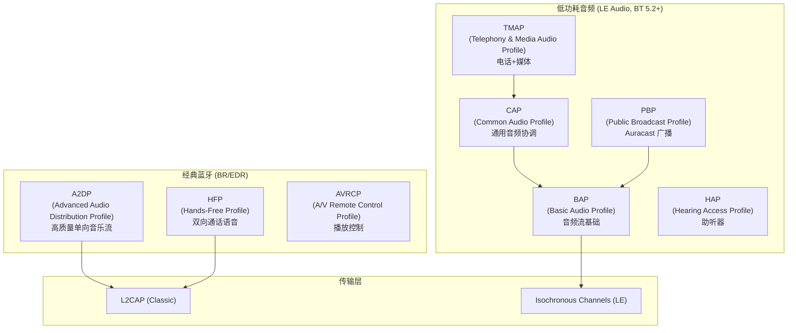
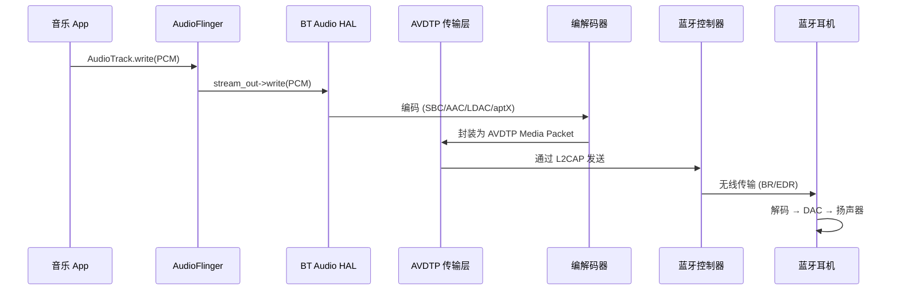
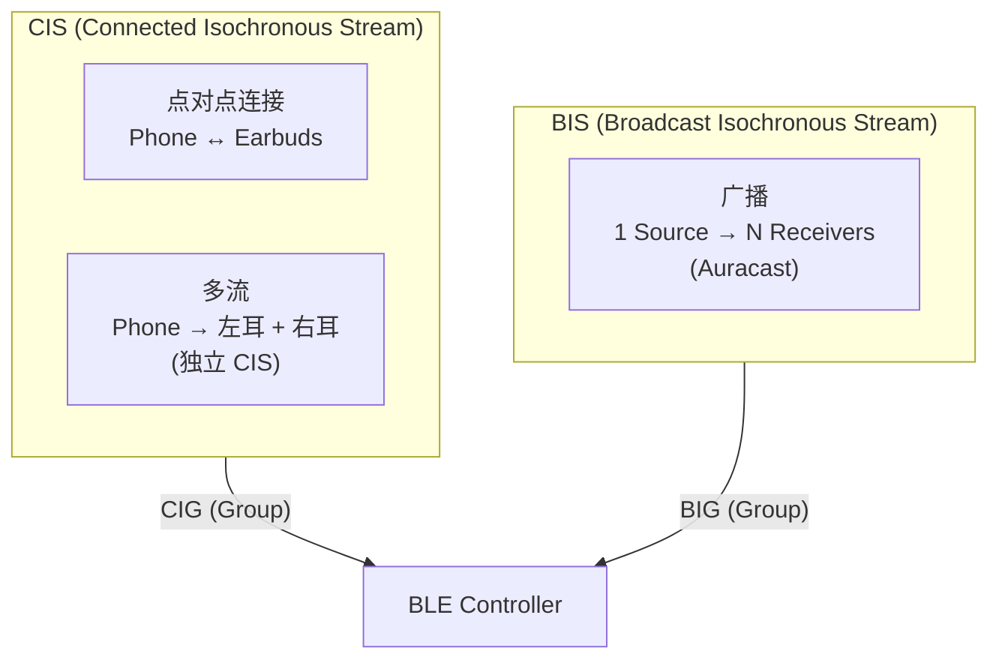
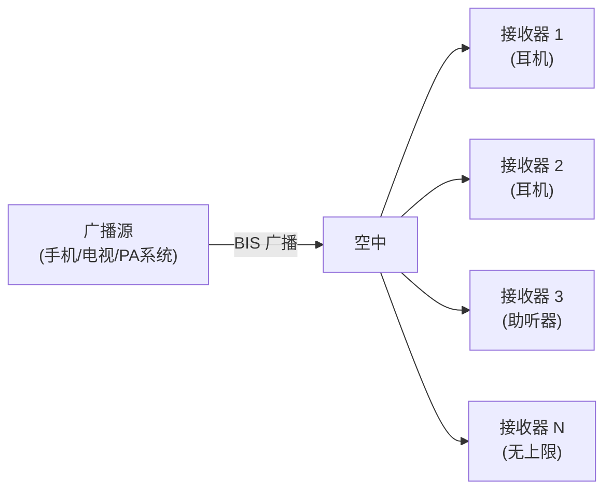

# 蓝牙音频协议栈与编解码

蓝牙音频是消费电子中最普及的无线音频技术。本章从经典蓝牙 (Classic BT) 到低功耗音频 (LE Audio) 全面梳理协议栈、编解码器与传输机制。

---

## 1. 蓝牙音频协议全景



---

## 2. A2DP 高质量音乐流

### 2.1 A2DP 协议架构



### 2.2 A2DP 编解码器对比

| 编解码器 | 码率 | 采样率 | 延迟 | 授权 | 音质评价 |
|:---|:---|:---|:---|:---|:---|
| **SBC** | 198-345 kbps | 44.1/48 kHz | ~150ms | 免费 (强制支持) | 基线，可接受 |
| **AAC** | 256 kbps (CBR) | 44.1/48 kHz | ~150-200ms | 需授权 | 优于 SBC |
| **aptX** | 352 kbps | 44.1/48 kHz | ~70ms | Qualcomm 专有 | 低延迟，质量好 |
| **aptX HD** | 576 kbps | 48 kHz/24bit | ~200ms | Qualcomm 专有 | Hi-Res 级 |
| **aptX Adaptive** | 279-420 kbps | 44.1/48/96 kHz | ~50-80ms | Qualcomm 专有 | 自适应码率 |
| **LDAC** | 330/660/990 kbps | 96 kHz/24bit | ~200ms | Sony (已开源) | 最高音质 |
| **LHDC** | 400/560/900 kbps | 96 kHz/24bit | ~150ms | Savitech | Hi-Res 级 |

### 2.3 SBC 编解码核心原理

```
SBC 编码流程:
┌─────────┐   ┌──────────────┐   ┌──────────┐   ┌──────────┐   ┌─────────┐
│ PCM     │──▶│ 子带分析滤波 │──▶│ 比例因子 │──▶│ 量化与   │──▶│ 比特流  │
│ 输入    │   │ (8子带 SBC)  │   │ 计算     │   │ 比特分配 │   │ 打包    │
└─────────┘   └──────────────┘   └──────────┘   └──────────┘   └─────────┘

关键参数:
  - Block Size: 4/8/12/16
  - Subbands: 4 或 8
  - Allocation Method: SNR 或 Loudness
  - Joint Stereo: 可选（节省码率）
```

### 2.4 LDAC 三种质量模式

| 模式 | 码率 | 帧长 | 适用场景 |
|:---|:---|:---|:---|
| **Quality** | 990 kbps | 每帧 330 bytes | 安静环境，追求音质 |
| **Normal** | 660 kbps | 每帧 220 bytes | 日常使用 (默认) |
| **Connection** | 330 kbps | 每帧 110 bytes | 信号差，优先稳定 |

LDAC 使用 **MDCT (改进离散余弦变换)** + **频谱包络编码** + **细节编码**，原理接近 AAC 但针对高码率优化。

---

## 3. HFP 双向通话

### 3.1 HFP vs A2DP

| 特性 | A2DP | HFP |
|:---|:---|:---|
| **方向** | 单向 (Source → Sink) | 双向 (全双工) |
| **音质** | 高质量 (立体声) | 窄带/宽带语音 (单声道) |
| **编解码** | SBC/AAC/LDAC 等 | CVSD (窄带) / mSBC (宽带) |
| **采样率** | 44.1-96 kHz | 8 kHz (CVSD) / 16 kHz (mSBC) |
| **传输** | L2CAP | SCO/eSCO 链路 |
| **延迟要求** | 可容忍较高延迟 | 严格 (<150ms 端到端) |

### 3.2 SCO 链路特点

```
SCO (Synchronous Connection-Oriented):
  - 预留固定带宽的同步链路
  - 周期性时隙分配 (每 1.25ms/2.5ms/3.75ms)
  - 不重传 → 丢包直接表现为语音断续
  
eSCO (Extended SCO):
  - 允许有限重传 (1-2次)
  - 更灵活的时隙分配
  - HFP 1.6+ 默认使用 eSCO + mSBC (宽带语音)
```

### 3.3 HFP 超宽带语音 (SWB)

HFP 1.9 引入 **LC3-SWB (Super Wide Band)**：
- 采样率：32 kHz（对比 mSBC 的 16 kHz）
- 编解码：LC3（LE Audio 同款）
- 频率响应：50Hz-14kHz（mSBC 仅到 7kHz）
- 需要 BT 5.0+ 和双端支持

---

## 4. LE Audio 新一代蓝牙音频

### 4.1 LE Audio vs Classic Audio

| 特性 | Classic Audio (A2DP/HFP) | LE Audio |
|:---|:---|:---|
| **蓝牙版本** | BR/EDR | BLE 5.2+ |
| **编解码** | SBC (强制) + 可选 | LC3 (强制) |
| **功耗** | 较高 | **显著降低 (~50%)** |
| **多流** | 不支持原生多流 | **多流 (Multi-Stream)** |
| **广播** | 不支持 | **Auracast 广播** |
| **延迟** | ~100-200ms | **~20-30ms (低延迟模式)** |
| **助听器** | 非标准 (ASHA 私有) | **HAP 标准化** |

### 4.2 LC3 编解码器深度解析

LC3 (Low Complexity Communication Codec) 是 LE Audio 的**强制编解码器**：

```
LC3 编码流程:
┌──────┐   ┌────────┐   ┌──────────┐   ┌──────────┐   ┌────────┐
│ PCM  │──▶│ MDCT   │──▶│ 频谱量化 │──▶│ 噪声整形 │──▶│ 算术   │
│ 输入 │   │ 变换   │   │ (SNS)    │   │ (TNS)    │   │ 编码   │
└──────┘   └────────┘   └──────────┘   └──────────┘   └────────┘

关键参数:
  帧长: 7.5ms 或 10ms
  采样率: 8/16/24/32/44.1/48 kHz
  码率: 16-320 kbps (灵活配置)
  声道: 单声道 或 立体声 (联合编码)
```

### 4.3 LC3 音质 vs 码率对比

| 编解码 | 码率 | 主观评分 (MUSHRA) |
|:---|:---|:---|
| SBC (Joint Stereo) | 345 kbps | ~65 |
| **LC3** | **160 kbps** | **~75** |
| AAC-LC | 256 kbps | ~72 |
| **LC3** | **320 kbps** | **~85 (接近透明)** |

**核心优势**：LC3 在 **一半码率**下音质超越 SBC。

### 4.4 Isochronous Channels (ISO)

LE Audio 引入全新的传输机制替代 SCO/L2CAP：



**CIS (Connected Isochronous Stream)**：
- 点对点，支持双向
- 多流：手机可同时向左右耳发送**独立 CIS**，实现真正的独立左右耳
- 支持不同 QoS 配置（可靠性 vs 延迟）

**BIS (Broadcast Isochronous Stream)**：
- 一对多广播，无连接
- Auracast 的传输基础

### 4.5 Auracast 广播音频



**应用场景**：
- **机场/车站**：广播登机通知到旅客耳机
- **健身房**：多台电视各自广播音频，用户自选频道
- **会议室**：演讲者音频广播给所有与会者
- **电影院**：多语言音轨广播

---

## 5. 蓝牙音频延迟分析

### 5.1 端到端延迟分解

```
A2DP 延迟 (典型 ~150-200ms):
┌──────────┬───────────┬────────────┬───────────┬──────────┐
│ App 缓冲 │ 编码延迟  │ 传输调度   │ 无线传输  │ 解码+DAC │
│ ~20ms    │ ~20-50ms  │ ~50-80ms   │ ~5-10ms   │ ~20-40ms │
└──────────┴───────────┴────────────┴───────────┴──────────┘

LE Audio 低延迟模式 (~20-30ms):
┌──────────┬───────────┬────────────┬───────────┬──────────┐
│ App 缓冲 │ LC3 7.5ms │ ISO 调度   │ 无线传输  │ 解码+DAC │
│ ~5ms     │ ~7.5ms    │ ~5-10ms    │ ~2-5ms    │ ~5-10ms  │
└──────────┴───────────┴────────────┴───────────┴──────────┘
```

### 5.2 影响延迟的关键因素

| 因素 | 影响 | 优化方向 |
|:---|:---|:---|
| **编解码帧长** | LC3 7.5ms vs SBC 12.7ms | 使用短帧 |
| **传输间隔** | A2DP 固定调度 vs ISO 灵活 | ISO 允许更短间隔 |
| **重传策略** | 更多重传 = 更高延迟 | 游戏场景减少重传 |
| **Jitter Buffer** | 缓冲抖动 = 增加延迟 | 自适应 buffer |
| **编解码器选择** | aptX LL ~40ms vs SBC ~150ms | 选低延迟 codec |

---

## 6. 蓝牙音频质量常见问题

| 现象 | 可能原因 | 排查方向 |
|:---|:---|:---|
| **音乐断续/卡顿** | 2.4GHz 干扰、距离过远 | 检查 RSSI、切换 codec 降码率 |
| **通话对端听不清** | mSBC 协商失败回退 CVSD | 检查 HFP 版本、eSCO 参数 |
| **左右耳不同步** | TWS 转发延迟 | 升级 LE Audio Multi-Stream |
| **连接后无声** | A2DP codec 协商失败 | 检查 btsnoop HCI log |
| **音质明显差** | 回退到 SBC 低码率 | 检查 codec 协商结果 |
| **延迟高 (游戏)** | 使用了高延迟 codec | 切换 aptX Adaptive/LE Audio |

---

## 7. 关键参考 (References)

1.  [Bluetooth SIG - LE Audio Specifications](https://www.bluetooth.com/learn-about-bluetooth/recent-enhancements/le-audio/)
2.  [LC3 Codec Specification (Bluetooth SIG)](https://www.bluetooth.com/specifications/specs/low-complexity-communication-codec/)
3.  [A2DP v1.3.2 Specification](https://www.bluetooth.com/specifications/specs/advanced-audio-distribution-profile-1-3-2/)
4.  [HFP v1.9 Specification](https://www.bluetooth.com/specifications/specs/hands-free-profile-1-9/)
5.  [Android Bluetooth Audio Architecture](https://source.android.com/docs/core/connect/bluetooth/bluetooth_audio)
