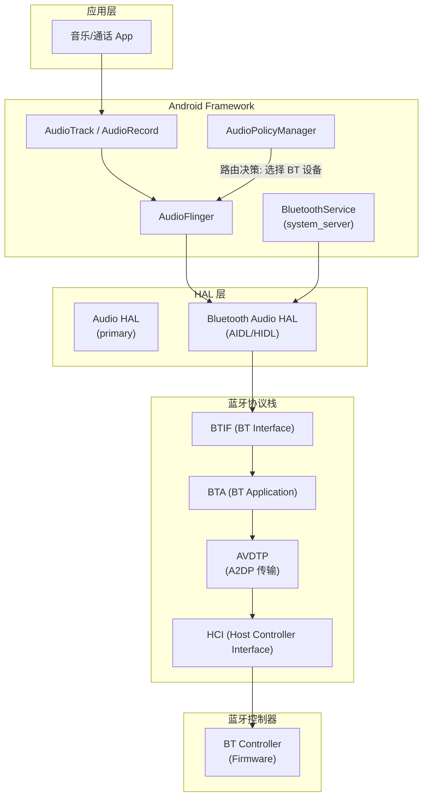
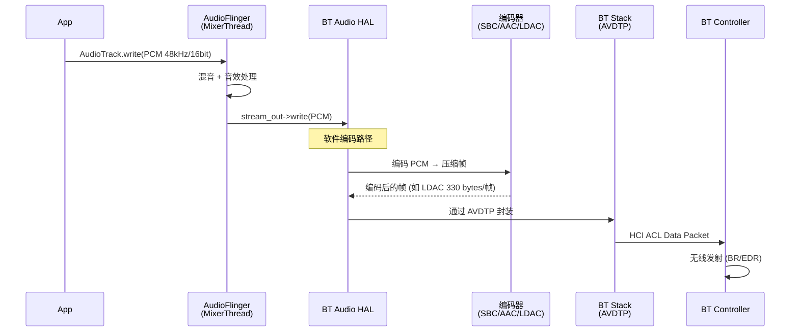
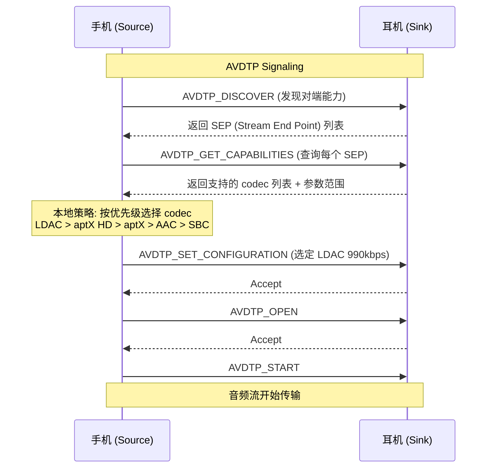
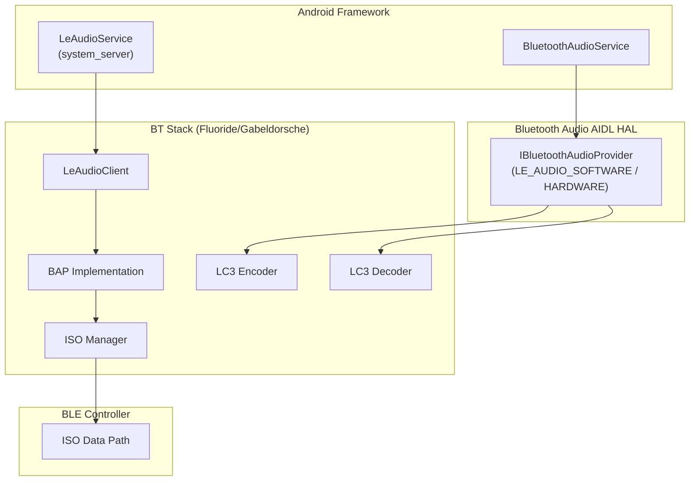
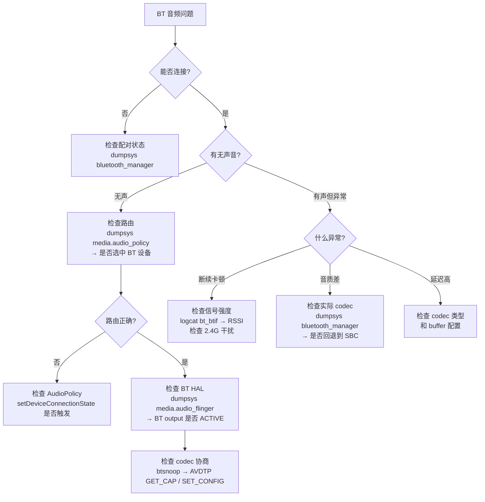

# Android 蓝牙音频架构与调试

本章深入解析 Android 系统中蓝牙音频的完整数据通路、HAL 架构演进、LE Audio 集成，以及实战调试方法。

---

## 1. Android 蓝牙音频架构全景



---

## 2. Bluetooth Audio HAL 架构演进

### 2.1 演进时间线

| Android 版本 | HAL 方式 | 特点 |
|:---|:---|:---|
| **≤ Android 7** | 直接集成在 `bluedroid` | 编解码与蓝牙栈耦合 |
| **Android 8-11** | **HIDL HAL** (`a2dp`, `hearing_aid`) | 分离 Audio HAL 与 BT 栈 |
| **Android 12+** | **AIDL HAL** (`IBluetoothAudioProvider`) | 统一 A2DP/HFP/LE Audio |
| **Android 13+** | AIDL HAL + LE Audio 完整支持 | BAP/CAP/TMAP 原生集成 |

### 2.2 AIDL HAL 核心接口

```java
// IBluetoothAudioProvider.aidl — 核心音频提供者接口
interface IBluetoothAudioProvider {
    // 启动音频会话
    void startSession(
        in IBluetoothAudioPort hostIf,       // 回调: AudioFlinger 端
        in AudioConfiguration audioConfig,    // 编解码配置
        in LatencyMode[] supportedLatencyModes
    );
    
    // 结束音频会话
    void endSession();
    
    // 通知音频流开始/暂停
    void streamStarted(in BluetoothAudioStatus status);
    void streamSuspended(in BluetoothAudioStatus status);
    
    // 延迟上报
    void updateSupportedLatencyModes(in LatencyMode[] supportedLatencyModes);
    
    // 获取呈现位置 (用于 A/V 同步)
    PresentationPosition getPresentationPosition();
}
```

### 2.3 AudioConfiguration 编解码协商

```java
// AudioConfiguration.aidl
union AudioConfiguration {
    PcmConfiguration pcmConfig;       // PCM 直通 (软件编码在 HAL 内)
    CodecConfiguration a2dpConfig;    // A2DP 编解码配置
    LeAudioConfiguration leAudioConfig; // LE Audio 配置
    
    // A2DP codec 配置示例
    // CodecConfiguration {
    //   codecType: LDAC
    //   sampleRate: 96000
    //   bitsPerSample: 24
    //   channelMode: STEREO
    //   encodedAudioBitrate: 990000  // 990 kbps
    //   peerMtu: 1005
    // }
}
```

---

## 3. A2DP 数据通路详解

### 3.1 播放数据流



### 3.2 编解码器协商流程



### 3.3 A2DP 与 AudioPolicy 的交互

当蓝牙 A2DP 设备连接时：

```
1. BluetoothService 检测 A2DP 连接成功
2. 通知 AudioPolicy: setDeviceConnectionState(BT_A2DP, CONNECTED, "XX:XX:XX:XX:XX:XX")
3. AudioPolicy:
   a. 加载 a2dp HAL module (如未加载)
   b. 打开新的 DirectOutput (AudioFlinger::openOutput)
   c. MEDIA 策略设备变更: Speaker → BT_A2DP
   d. 将活跃 MEDIA 流迁移到新 output
   e. 如果同时需要 Speaker: 创建 DuplicatingThread
4. AudioFlinger 在新 output 上创建 PlaybackThread
5. BT Audio HAL 启动 A2DP session，开始编码 + 传输
```

---

## 4. LE Audio Android 集成

### 4.1 LE Audio 软件架构



### 4.2 LE Audio 与 A2DP 的共存

Android 13+ 支持 LE Audio 与 A2DP 双协议：

| 场景 | 使用的协议 | 原因 |
|:---|:---|:---|
| 双端均支持 LE Audio | **LE Audio** (优先) | 更低功耗、更低延迟 |
| 仅 Source 支持 LE Audio | **A2DP** 回退 | 兼容性 |
| 通话 + 双端支持 | **LE Audio** (CIS 双向) | 替代 HFP |
| 广播场景 | **LE Audio BIS** | A2DP 无此能力 |

### 4.3 LE Audio QoS 配置

```java
// 常见的 QoS 配置集 (Bluetooth SIG 定义)
// 低延迟游戏场景
QoS_Config_Low_Latency {
    sduInterval: 7500us     // 7.5ms 帧间隔
    framing: unframed
    maxSdu: 60 bytes        // LC3 48kHz/32kbps 单帧
    retransmissionNumber: 2  // 允许 2 次重传
    maxTransportLatency: 15ms
}

// 高质量音乐场景
QoS_Config_High_Quality {
    sduInterval: 10000us    // 10ms 帧间隔
    framing: unframed
    maxSdu: 120 bytes       // LC3 48kHz/96kbps 单帧
    retransmissionNumber: 5  // 允许 5 次重传
    maxTransportLatency: 60ms
}
```

---

## 5. 蓝牙音频调试实战

### 5.1 核心调试命令

```bash
# ==================== 蓝牙服务状态 ====================
# 查看蓝牙连接设备与 profile 状态
adb shell dumpsys bluetooth_manager | grep -A 5 "Connected"

# 查看 A2DP 连接状态与 codec 信息
adb shell dumpsys bluetooth_manager | grep -A 20 "A2dpStateMachine"

# 查看 LE Audio 状态
adb shell dumpsys bluetooth_manager | grep -A 20 "LeAudio"

# ==================== 音频路由 ====================
# 确认 BT 设备是否被 AudioPolicy 选中
adb shell dumpsys media.audio_policy | grep -i bluetooth

# 查看 BT Audio HAL 输出
adb shell dumpsys media.audio_flinger | grep -A 10 "BT"

# ==================== HCI 日志 ====================
# 开启 btsnoop HCI log (需要开发者选项)
adb shell setprop persist.bluetooth.btsnooplogmode full
adb shell svc bluetooth disable && adb shell svc bluetooth enable

# 导出 btsnoop log
adb pull /data/misc/bluetooth/logs/btsnoop_hci.log

# ==================== 实时蓝牙日志 ====================
adb logcat -s bt_btif:V bt_a2dp:V bluetooth:V BtAudioHal:V
```

### 5.2 btsnoop HCI Log 分析

btsnoop log 可用 **Wireshark** 打开，关键分析点：

| 分析目标 | Wireshark 过滤器 | 关注字段 |
|:---|:---|:---|
| **Codec 协商** | `btavdtp.signal_id == 0x03` (GET_CAP) | Media Codec → Codec Type |
| **A2DP 流状态** | `btavdtp.signal_id == 0x06` (START) | 是否成功开始 |
| **数据包丢失** | `bta2dp` | Sequence Number 是否连续 |
| **SCO 参数** | `bthci_evt.code == 0x2c` (SCO Changed) | Air mode, Interval |
| **LE Audio ISO** | `btle.advertising_data` | CIG/CIS 参数 |

### 5.3 常见问题诊断流程



### 5.4 A2DP Codec 选择调试

```bash
# 查看当前 A2DP codec 配置
adb shell dumpsys bluetooth_manager | grep -A 15 "Codec Status"

# 示例输出:
# Codec Status:
#   Codec Config: codec=LDAC, priority=1000000,
#     sample_rate=0x20 (96000),
#     bits_per_sample=0x04 (24),
#     channel_mode=0x01 (STEREO),
#     codec_specific_1=1001 (Quality mode),  ← LDAC 990kbps
#     codec_specific_2=0,
#     codec_specific_3=0,
#     codec_specific_4=0

# 强制切换 codec (开发者选项)
# Settings → Developer options → Bluetooth Audio Codec → 选择目标 codec
```

### 5.5 蓝牙音频延迟测量

```bash
# 方法1: 使用 AudioFlinger dump 查看 presentation position
adb shell dumpsys media.audio_flinger | grep -A 5 "presentation"

# 方法2: 使用 Android 开发者选项中的 "Wireless display certification"
# 会显示音频延迟信息

# 方法3: 物理测量 (最准确)
# 使用 Dr.Rick Audio Latency Test 或类似 App
# 播放 → 麦克风拾取 → 计算往返延迟 / 2
```

---

## 6. 车载蓝牙音频特殊考量

| 场景 | 特殊要求 | 解决方案 |
|:---|:---|:---|
| **多设备连接** | 驾驶员 + 乘客各自蓝牙设备 | AAOS 多用户 BT Profile 支持 |
| **来电优先** | 蓝牙通话必须打断车载音乐 | CarAudioFocus 优先级仲裁 |
| **音区绑定** | 蓝牙音频发往特定音区 | BT 设备与 Occupant Zone 绑定 |
| **回声消除** | 车内扬声器播放 + 车内麦克风拾取 | AEC 参考信号来自蓝牙下行 |
| **A2DP Source** | 车机作为 Source 输出给蓝牙耳机 | 需要 A2DP Source profile 支持 |

---

## 7. 关键参考 (References)

1.  [Android Bluetooth Audio HAL (AIDL)](https://cs.android.com/android/platform/superproject/+/main:hardware/interfaces/bluetooth/audio/aidl/)
2.  [Bluetooth SIG - LE Audio](https://www.bluetooth.com/learn-about-bluetooth/recent-enhancements/le-audio/)
3.  [Android BT Audio Architecture](https://source.android.com/docs/core/connect/bluetooth/bluetooth_audio)
4.  [Wireshark Bluetooth Dissectors](https://wiki.wireshark.org/Bluetooth)
5.  [LC3 Codec Specification](https://www.bluetooth.com/specifications/specs/low-complexity-communication-codec/)
