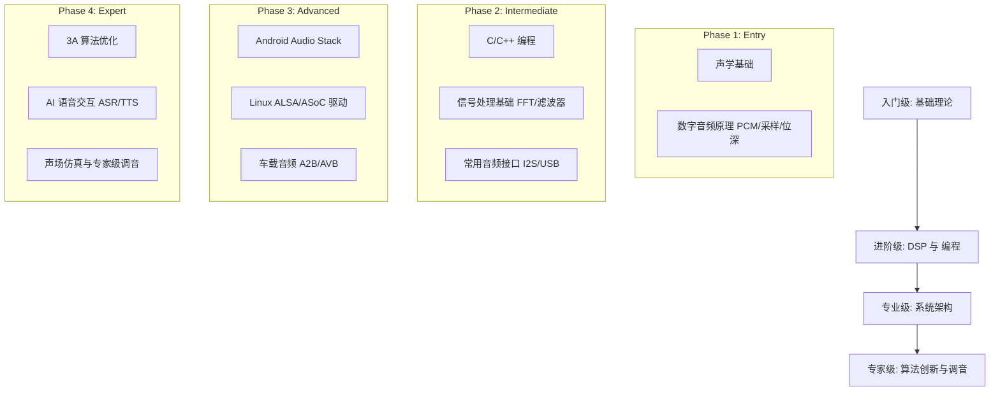

# 音频开发学习路径 (Audio Engineering Learning Path)

音频开发是一个跨学科领域，涉及物理学、数学、电子工程和软件工程。以下是一条系统化的自学与进阶路线。

---

## 1. 学习路线图 (Roadmap)



---

## 2. 阶段详解

### 2.1 入门阶段 (Beginner)
*   **目标**：理解声音是什么，以及它是如何在计算机中存储的。
*   **核心知识点**：
    *   声波物理特性（频率、波长、分贝）。
    *   PCM 编码原理。
    *   掌握 Audacity 等工具查看波形和频谱。

### 2.2 进阶阶段 (Intermediate)
*   **目标**：能够编写简单的音频处理程序。
*   **核心知识点**：
    *   掌握 C/C++ 基础（音频开发的主流语言）。
    *   掌握 **FFT (快速傅里叶变换)**，理解频域分析。
    *   理解基本的数字滤波器（IIR, FIR）。

### 2.3 专业系统阶段 (Professional)
*   **目标**：掌握主流操作系统的音频框架。
*   **核心知识点**：
    *   **Android**：AudioFlinger, AudioPolicy, HAL 实现。
    *   **Linux**：ALSA 驱动模型，DAPM 电源管理。
    *   **协议**：深入理解 I2S, TDM, PDM 时序。

### 2.4 专家领域 (Expert)
*   **目标**：解决行业难题，主导架构设计。
*   **核心知识点**：
    *   高性能 3A 算法实现。
    *   车载多音区、声场控制算法。
    *   声学仿真与硬件选型经验。

---

## 3. 关键建议

1.  **多听**：培养对音质的敏感度（什么是破音、底噪、回声）。
2.  **多看**：阅读 AOSP 和 Linux Kernel 的音频源码。
3.  **多动手**：买一块开发板（如 STM32, 树莓派），外接一个 Codec 跑通音频链路。

---
*Next Topic: [音频开发资源与工具推荐](./02-Resources-Tools.md)*
```,file_path: