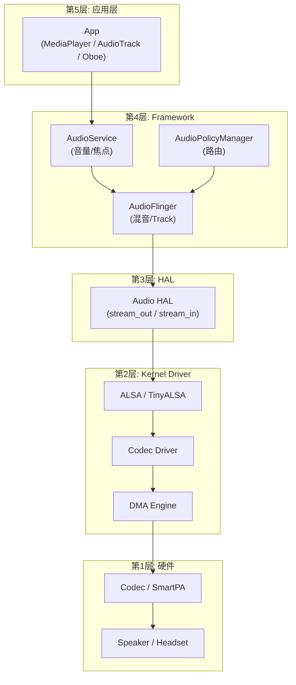
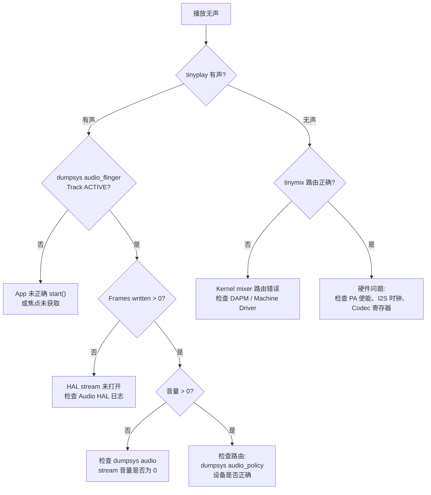

# 全链路音频调试方法论

音频问题往往跨越多个层次，本章提供系统化的分层定位方法、核心工具使用指南与常见问题 Cookbook。

---

## 1. 分层定位模型

### 1.1 音频数据流全链路



### 1.2 分层排查策略

遇到音频问题时，**自下而上**排查效率最高：

| 排查顺序 | 层级 | 核心验证手段 | 验证目标 |
|:---|:---|:---|:---|
| **Step 1** | 硬件 | 万用表 / 示波器 / 耳机直测 | PA 供电、I2S 时钟、Codec 寄存器 |
| **Step 2** | Kernel | `tinyplay`/`tinycap`/`tinymix` | 绕过 Android，直接验证 ALSA 通路 |
| **Step 3** | HAL | `dumpsys media.audio_flinger` | HAL stream 是否打开、数据是否写入 |
| **Step 4** | Framework | `dumpsys media.audio_policy` | 路由是否正确、音量是否为 0 |
| **Step 5** | App | logcat + App 日志 | AudioTrack 状态、焦点是否获取 |

### 1.3 关键判断点：TinyALSA 直通测试

```bash
# 如果 tinyplay 有声 → 问题在 HAL 以上
# 如果 tinyplay 无声 → 问题在 Driver/Hardware
tinyplay /sdcard/test.wav -D 0 -d 0 -c 2 -r 48000 -b 16

# 录音测试
tinycap /sdcard/record.wav -D 0 -d 0 -c 2 -r 48000 -b 16 -T 5

# 查看当前 mixer 控制器
tinymix -D 0

# 设置特定控制器
tinymix -D 0 "Speaker Switch" 1
```

---

## 2. 核心调试工具速查

### 2.1 dumpsys 全家桶

```bash
# ==================== AudioFlinger ====================
adb shell dumpsys media.audio_flinger
# 关注: Thread 状态、Track 状态、Underrun 次数、Effect Chains

# ==================== AudioPolicy ====================
adb shell dumpsys media.audio_policy
# 关注: Available devices、mOutputs、Volume Curves

# ==================== AudioService ====================
adb shell dumpsys audio
# 关注: 音量设置、焦点持有者、设备连接

# ==================== 蓝牙 ====================
adb shell dumpsys bluetooth_manager
# 关注: A2DP codec、连接状态、Profile 状态

# ==================== 一键全量导出 ====================
adb shell dumpsys media.audio_flinger > af_dump.txt && \
adb shell dumpsys media.audio_policy > ap_dump.txt && \
adb shell dumpsys audio > as_dump.txt
```

### 2.2 logcat 关键 TAG

```bash
# 最常用的音频 TAG 组合
adb logcat -s \
    AudioFlinger:V \
    AudioPolicyManager:V \
    AudioPolicyService:V \
    AudioTrack:V \
    AudioHAL:V \
    audio_hw_primary:V \
    AudioMixer:V

# 蓝牙音频
adb logcat -s bt_btif:V bt_a2dp:V BtAudioHal:V

# 音效
adb logcat -s AudioEffect:V EffectsFactory:V
```

### 2.3 procfs / sysfs 诊断

```bash
# ALSA 声卡信息
adb shell cat /proc/asound/cards
adb shell cat /proc/asound/pcm
adb shell cat /proc/asound/card0/codec#0/*

# Codec 寄存器 (需 debugfs)
adb shell cat /sys/kernel/debug/asoc/codecs
adb shell cat /sys/kernel/debug/asoc/components

# 音频相关中断
adb shell cat /proc/interrupts | grep -i audio

# DMA 状态
adb shell cat /proc/asound/card0/pcm0p/sub0/hw_params
adb shell cat /proc/asound/card0/pcm0p/sub0/status
```

---

## 3. Systrace / Perfetto 音频分析

### 3.1 Perfetto 抓取音频 trace

```bash
# 方法1: 命令行抓取
adb shell perfetto --txt -c - -o /data/misc/perfetto-traces/audio_trace.pb <<EOF
buffers { size_kb: 65536 }
data_sources {
  config {
    name: "linux.ftrace"
    ftrace_config {
      ftrace_events: "sched/sched_switch"
      ftrace_events: "sched/sched_wakeup"
      ftrace_events: "power/cpu_frequency"
      ftrace_events: "power/suspend_resume"
      atrace_categories: "audio"
      atrace_categories: "hal"
      atrace_apps: "audioserver"
    }
  }
}
duration_ms: 10000
EOF

adb pull /data/misc/perfetto-traces/audio_trace.pb
# 打开 https://ui.perfetto.dev 分析
```

### 3.2 Perfetto 中关注的音频事件

| Trace 事件 | 含义 | 关注场景 |
|:---|:---|:---|
| `AudioFlinger::threadLoop` | 混音线程每次循环 | 周期是否稳定、是否被抢占 |
| `AudioMixer::process` | 混音器处理耗时 | CPU 是否过载 |
| `HAL::write` | HAL 写入耗时 | HAL 阻塞/超时 |
| `AudioTrack::obtainBuffer` | App 获取 buffer | App 是否填充过慢 |
| `standby` | 线程进入待机 | 功耗排查 |
| `sched_switch` | 线程切换 | 音频线程是否被高优先级抢占 |

### 3.3 音频线程调度分析

```
正常情况:
  AudioOut_2 线程每 20ms 唤醒一次 (deep_buffer)
  每次执行 < 5ms
  
异常情况 (卡顿):
  AudioOut_2 线程被延迟唤醒 (> 25ms)
  或执行时间过长 (> 15ms)
  → 检查 CPU 频率是否被降频
  → 检查是否有更高优先级线程抢占
```

---

## 4. 常见问题 Cookbook

### 4.1 无声 (No Sound)



### 4.2 爆音 / Glitch

| 可能原因 | 验证方法 | 解决方案 |
|:---|:---|:---|
| **Underrun** | `dumpsys audio_flinger` → Underrun > 0 | 增大 buffer / 提高 App 线程优先级 |
| **采样率不匹配** | Track 采样率 ≠ HAL 采样率 | 检查 Resampler 质量 / 统一采样率 |
| **DMA buffer 过小** | `cat hw_params` 检查 period_size | 增大 ALSA period_size |
| **CPU 降频** | Perfetto 查看 cpu_frequency | 设置音频场景 CPU boost |
| **时钟漂移** | I2S BCLK/LRCLK 异常 | 检查 clock provider 配置 |
| **增益溢出** | 多路混音后振幅 > 1.0 | 检查 AudioMixer 饱和截断 |

### 4.3 延迟过高

```bash
# Step 1: 确认当前使用的 output flag
adb shell dumpsys media.audio_flinger | grep "Output thread" -A 5
# 检查是否误用 DEEP_BUFFER (延迟 ~100ms+)

# Step 2: 确认是否使用 FastTrack
adb shell dumpsys media.audio_flinger | grep -i "fast"
# 如果 FastTrack 降级为 NormalTrack → 检查准入条件

# Step 3: 检查 HAL buffer size
adb shell dumpsys media.audio_flinger | grep "HAL buffer size"
# 典型值: 240 frames (5ms) 为低延迟, 960 frames (20ms) 为普通

# Step 4: 确认 AAudio MMAP 是否启用
adb shell getprop aaudio.mmap_policy
# 2 = always, 1 = auto, 0 = never
```

### 4.4 功耗异常

```bash
# Step 1: 检查音频线程是否处于 Standby
adb shell dumpsys media.audio_flinger | grep "Standby"
# 如果无播放时 Standby=no → 有 Track 未 release

# Step 2: 检查是否有 offload 播放
adb shell dumpsys media.audio_flinger | grep "Offload"
# 音乐播放应使用 Offload 节省 CPU

# Step 3: 检查 DSP 是否进入低功耗
adb shell cat /sys/kernel/debug/regmap/*/registers | head
# 平台相关: 检查 DSP power state

# Step 4: 检查蓝牙 codec
adb shell dumpsys bluetooth_manager | grep "codec"
# LDAC 990kbps 功耗远高于 SBC/AAC
```

### 4.5 路由异常

```bash
# Step 1: 确认设备在线状态
adb shell dumpsys media.audio_policy | grep "Available"

# Step 2: 查看当前路由决策
adb shell dumpsys media.audio_policy | grep -A 15 "mOutputs"

# Step 3: 查看路由变化日志
adb logcat -s AudioPolicyManager:V | grep -E "setDeviceConnectionState|getNewOutputDevices|setOutputDevice"

# Step 4: 检查 audio_policy_configuration.xml 中 route 定义
adb shell cat /vendor/etc/audio_policy_configuration.xml | grep -A 3 "<route"
```

---

## 5. audioserver Crash / ANR 分析

### 5.1 Crash (Tombstone) 分析

```bash
# 获取最近的 tombstone
adb shell ls -lt /data/tombstones/ | head

# 查看 tombstone
adb shell cat /data/tombstones/tombstone_00

# 关键信息:
# 1. 崩溃的线程名 (AudioOut_2 / AudioIn_0)
# 2. 信号 (SIGSEGV=空指针, SIGABRT=断言失败)
# 3. backtrace → 定位崩溃代码
```

### 5.2 ANR 分析

```bash
# audioserver ANR 通常因为 Binder 调用超时
# 查看 ANR traces
adb shell cat /data/anr/traces.txt | grep -A 50 "audioserver"

# 常见原因:
# 1. HAL 函数阻塞 (write/setParameters 超时)
# 2. 死锁 (AudioFlinger lock + AudioPolicy lock)
# 3. Binder 线程池耗尽

# 诊断死锁
adb shell dumpsys media.audio_flinger --deadlock
```

### 5.3 audioserver 重启恢复

```bash
# 手动重启 audioserver (调试用)
adb shell kill $(adb shell pidof audioserver)
# 系统会自动重启 audioserver，所有音频流会中断重连

# 监控 audioserver 重启
adb logcat -s ServiceManager:V | grep audioserver
```

---

## 6. 调试速查表

| 我要查什么 | 命令 |
|:---|:---|
| 当前播放的 Track | `dumpsys media.audio_flinger \| grep "Track"` |
| 路由到哪个设备 | `dumpsys media.audio_policy \| grep "Devices"` |
| 音量值 | `dumpsys audio \| grep "volume"` |
| 焦点持有者 | `dumpsys audio \| grep "focus"` |
| 蓝牙 codec | `dumpsys bluetooth_manager \| grep "Codec"` |
| HAL buffer 大小 | `dumpsys media.audio_flinger \| grep "HAL buffer"` |
| Underrun 次数 | `dumpsys media.audio_flinger \| grep "Underrun"` |
| ALSA 声卡 | `cat /proc/asound/cards` |
| Mixer 控制器 | `tinymix -D 0` |
| Codec 寄存器 | `cat /sys/kernel/debug/asoc/codecs` |
| 音频线程 CPU | `top -H -p $(pidof audioserver)` |
| 音频 trace | `perfetto` + `atrace_categories: "audio"` |

---

## 7. 关键参考 (References)

1.  [Android Audio Debugging](https://source.android.com/docs/core/audio/debugging)
2.  [Perfetto - Android Tracing](https://perfetto.dev/docs/)
3.  [TinyALSA GitHub](https://github.com/tinyalsa/tinyalsa)
4.  [Android dumpsys Documentation](https://developer.android.com/studio/command-line/dumpsys)
5.  [ALSA Project - Debugging](https://www.alsa-project.org/wiki/Debugging)
