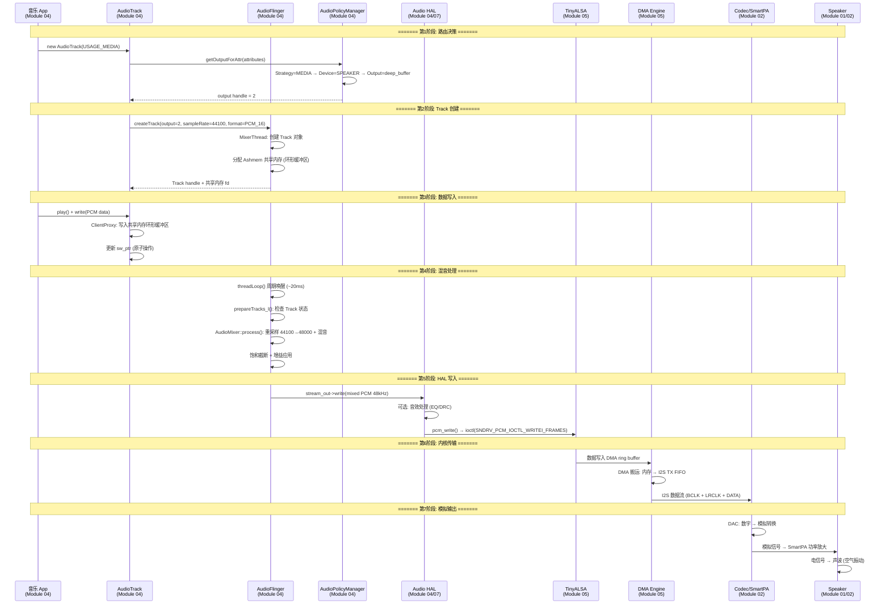
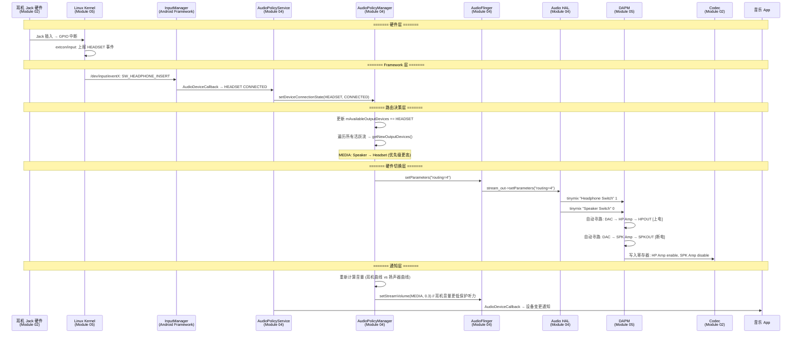

# 跨模块全链路数据流

本章以两个典型场景为线索，串联知识库中多个模块的知识点，帮助建立**全栈思维**。

---

## 1. 场景一：从 App play() 到喇叭出声

### 1.1 完整数据流



### 1.2 各阶段涉及的模块与知识点

| 阶段 | 涉及模块 | 核心知识点 |
|:---|:---|:---|
| **路由决策** | `04-AudioPolicy` | Usage→Strategy→Device 推导, `audio_policy_configuration.xml` |
| **Track 创建** | `04-AudioFlinger` | Track 状态机, Ashmem 共享内存, NormalTrack vs FastTrack |
| **数据写入** | `04-AudioTrack` | ClientProxy 环形缓冲区, obtainBuffer/releaseBuffer |
| **混音处理** | `04-AudioFlinger` | threadLoop, AudioMixer, 重采样器, 饱和截断 |
| **HAL 写入** | `04-AudioHAL`, `07-高通` | stream_out->write, ADSP 音效链 (AudioReach) |
| **内核传输** | `05-Linux` | ALSA PCM, ASoC DAI Link, DMA ring buffer, DAPM 电源管理 |
| **模拟输出** | `02-Hardware` | DAC 原理, SmartPA IV-Sense, Speaker 电声转换 |

### 1.3 延迟分解

```
端到端延迟 (典型 deep_buffer):

App buffer       : ~20ms  (AudioTrack 缓冲)
AF threadLoop    : ~20ms  (混音线程周期)
HAL buffer       : ~20ms  (HAL write 阻塞)
ALSA DMA buffer  : ~5-10ms (period_size)
Codec 处理       : ~1ms   (DAC 转换)
───────────────────────────────
总计             : ~66-71ms

FastTrack 低延迟路径:
App buffer       : ~5ms
FastMixer        : ~5ms
HAL buffer       : ~5ms
ALSA DMA         : ~5ms
───────────────────────────────
总计             : ~20ms

AAudio MMAP 路径:
App 直写 DMA     : ~2ms
ALSA DMA         : ~2ms
───────────────────────────────
总计             : ~4-5ms
```

---

## 2. 场景二：耳机插入的全栈变化

### 2.1 事件传播全链路



### 2.2 各层关键变化

| 层级 | 变化内容 | 代码/配置位置 |
|:---|:---|:---|
| **Hardware** | Jack GPIO 从低变高 | 板级电路 + DTS `jack-gpios` |
| **Kernel** | extcon 驱动上报 HEADSET 事件 | `drivers/extcon/` 或 `sound/soc/codecs/` |
| **InputManager** | 转换为 Android InputEvent | `InputManagerService` |
| **AudioPolicy** | 设备列表变更 + 重新路由 | `AudioPolicyManager::setDeviceConnectionState()` |
| **AudioFlinger** | `setParameters("routing=X")` | `PlaybackThread::setParameters()` |
| **Audio HAL** | tinymix 路由切换 | HAL `set_parameters()` → `mixer_ctl_set_value()` |
| **DAPM** | Widget 电源重新走线 | 自动: SPK path 断电, HP path 上电 |
| **音量** | 切换到耳机音量曲线 | `audio_policy_volumes.xml` DEVICE_CATEGORY_HEADSET |

### 2.3 常见问题定位

| 问题 | 层级 | 排查方法 |
|:---|:---|:---|
| 插耳机无反应 | Kernel | `cat /sys/class/extcon/*/state`, `dmesg \| grep jack` |
| 检测到但不切换 | AudioPolicy | `dumpsys media.audio_policy` → Available devices |
| 切换了但无声 | HAL/DAPM | `tinymix` 查看 HP Switch, `dapm_widgets` 查看上电状态 |
| 有声但音量异常 | AudioPolicy | `dumpsys audio` → 检查耳机音量 index |
| 拔出后不恢复 | AudioPolicy | logcat `AudioPolicyManager` → 是否触发 DISCONNECTED |

---

## 3. 知识库模块关联地图

```
场景: App 播放音乐到蓝牙耳机

01-Acoustics ──────── 声波物理、人耳感知 (为什么需要音量曲线)
      │
02-Hardware ───────── 蓝牙射频、Codec DAC、耳机扬声器单元
      │
03-DSP ────────────── SBC/LDAC 编解码原理、AEC (通话场景)
      │
04-Android ─────┬──── AudioTrack: PCM 数据写入
                ├──── AudioFlinger: 混音 + 送往 BT HAL
                ├──── AudioPolicy: 选择 BT A2DP 设备 + 音量控制
                └──── AudioHAL: BT Audio HAL AIDL 接口
                       │
05-Linux ──────────── ALSA (本地播放回退路径)
                       │
07-Qualcomm ───────── ADSP: BT 编码可能卸载到 DSP
                       │
10-Bluetooth ──────── A2DP 协议、AVDTP 传输、Codec 协商
                       │
11-Debug ──────────── btsnoop 分析、dumpsys bluetooth_manager
```

---

## 4. 关键参考 (References)

1.  本知识库各模块文档（参见主 [README](../README.md)）
2.  [Android Audio Architecture](https://source.android.com/docs/core/audio/architecture)
3.  [ALSA Project Documentation](https://www.alsa-project.org/wiki/Documentation)
