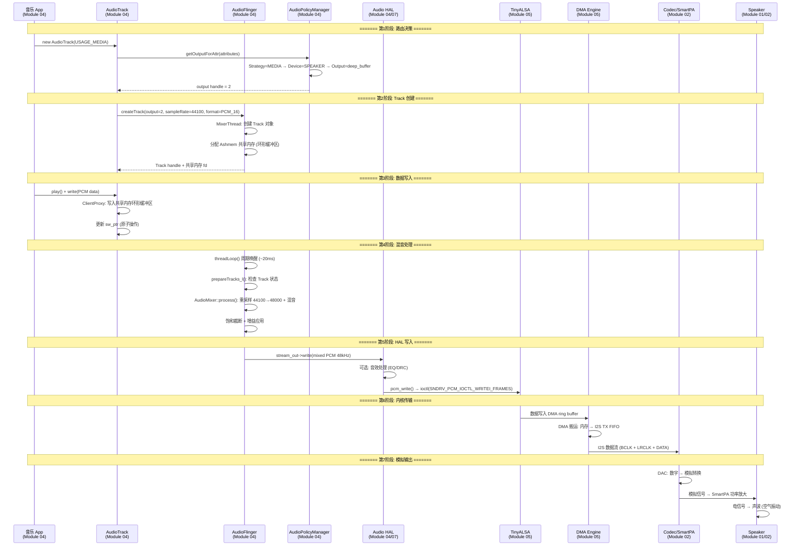
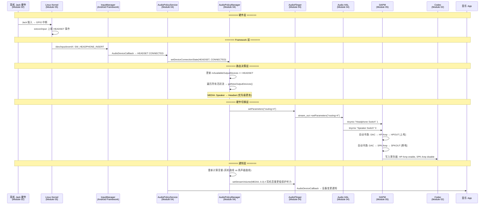
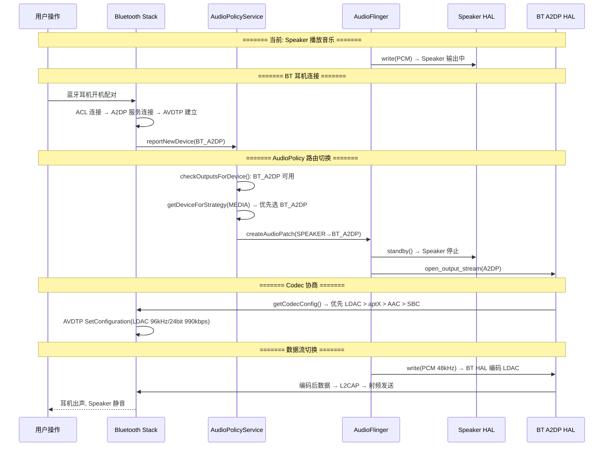

# 跨模块全链路数据流

本章以两个典型场景为线索，串联知识库中多个模块的知识点，帮助建立**全栈思维**。

---

## 1. 场景一：从 App play() 到喇叭出声

### 1.1 完整数据流



### 1.2 各阶段涉及的模块与知识点

| 阶段 | 涉及模块 | 核心知识点 |
|:---|:---|:---|
| **路由决策** | `04-AudioPolicy` | Usage→Strategy→Device 推导, `audio_policy_configuration.xml` |
| **Track 创建** | `04-AudioFlinger` | Track 状态机, Ashmem 共享内存, NormalTrack vs FastTrack |
| **数据写入** | `04-AudioTrack` | ClientProxy 环形缓冲区, obtainBuffer/releaseBuffer |
| **混音处理** | `04-AudioFlinger` | threadLoop, AudioMixer, 重采样器, 饱和截断 |
| **HAL 写入** | `04-AudioHAL`, `07-高通` | stream_out->write, ADSP 音效链 (AudioReach) |
| **内核传输** | `05-Linux` | ALSA PCM, ASoC DAI Link, DMA ring buffer, DAPM 电源管理 |
| **模拟输出** | `02-Hardware` | DAC 原理, SmartPA IV-Sense, Speaker 电声转换 |

### 1.3 延迟分解

```
端到端延迟 (典型 deep_buffer):

App buffer       : ~20ms  (AudioTrack 缓冲)
AF threadLoop    : ~20ms  (混音线程周期)
HAL buffer       : ~20ms  (HAL write 阻塞)
ALSA DMA buffer  : ~5-10ms (period_size)
Codec 处理       : ~1ms   (DAC 转换)
───────────────────────────────
总计             : ~66-71ms

FastTrack 低延迟路径:
App buffer       : ~5ms
FastMixer        : ~5ms
HAL buffer       : ~5ms
ALSA DMA         : ~5ms
───────────────────────────────
总计             : ~20ms

AAudio MMAP 路径:
App 直写 DMA     : ~2ms
ALSA DMA         : ~2ms
───────────────────────────────
总计             : ~4-5ms
```

---

## 2. 场景二：耳机插入的全栈变化

### 2.1 事件传播全链路



### 2.2 各层关键变化

| 层级 | 变化内容 | 代码/配置位置 |
|:---|:---|:---|
| **Hardware** | Jack GPIO 从低变高 | 板级电路 + DTS `jack-gpios` |
| **Kernel** | extcon 驱动上报 HEADSET 事件 | `drivers/extcon/` 或 `sound/soc/codecs/` |
| **InputManager** | 转换为 Android InputEvent | `InputManagerService` |
| **AudioPolicy** | 设备列表变更 + 重新路由 | `AudioPolicyManager::setDeviceConnectionState()` |
| **AudioFlinger** | `setParameters("routing=X")` | `PlaybackThread::setParameters()` |
| **Audio HAL** | tinymix 路由切换 | HAL `set_parameters()` → `mixer_ctl_set_value()` |
| **DAPM** | Widget 电源重新走线 | 自动: SPK path 断电, HP path 上电 |
| **音量** | 切换到耳机音量曲线 | `audio_policy_volumes.xml` DEVICE_CATEGORY_HEADSET |

### 2.3 常见问题定位

| 问题 | 层级 | 排查方法 |
|:---|:---|:---|
| 插耳机无反应 | Kernel | `cat /sys/class/extcon/*/state`, `dmesg \| grep jack` |
| 检测到但不切换 | AudioPolicy | `dumpsys media.audio_policy` → Available devices |
| 切换了但无声 | HAL/DAPM | `tinymix` 查看 HP Switch, `dapm_widgets` 查看上电状态 |
| 有声但音量异常 | AudioPolicy | `dumpsys audio` → 检查耳机音量 index |
| 拔出后不恢复 | AudioPolicy | logcat `AudioPolicyManager` → 是否触发 DISCONNECTED |

---

## 3. 知识库模块关联地图

```
场景: App 播放音乐到蓝牙耳机

01-Acoustics ──────── 声波物理、人耳感知 (为什么需要音量曲线)
      │
02-Hardware ───────── 蓝牙射频、Codec DAC、耳机扬声器单元
      │
03-DSP ────────────── SBC/LDAC 编解码原理、AEC (通话场景)
      │
04-Android ─────┬──── AudioTrack: PCM 数据写入
                ├──── AudioFlinger: 混音 + 送往 BT HAL
                ├──── AudioPolicy: 选择 BT A2DP 设备 + 音量控制
                └──── AudioHAL: BT Audio HAL AIDL 接口
                       │
05-Linux ──────────── ALSA (本地播放回退路径)
                       │
07-Qualcomm ───────── ADSP: BT 编码可能卸载到 DSP
                       │
10-Bluetooth ──────── A2DP 协议、AVDTP 传输、Codec 协商
                       │
11-Debug ──────────── btsnoop 分析、dumpsys bluetooth_manager
```

---

## 4. 场景三：蓝牙设备切换时音频路由变化



### 4.1 蓝牙断开时的回退

```
蓝牙耳机断开 → 路由回退:

  1. BT Stack 检测到 ACL 断开
  2. 通知 AudioPolicy: removeDevice(BT_A2DP)
  3. AudioPolicy 重新评估路由:
     → getDeviceForStrategy(MEDIA) → SPEAKER (回退)
  4. AudioFlinger:
     → BT HAL standby() / close()
     → Speaker HAL reopen()
     → 重新开始向 Speaker 写数据
     
  潜在问题:
    - 切换间隙可能有 ~200-500ms 静音
    - 如果 Speaker HAL open 慢 → 更长中断
    - 某些 App 可能收不到 AudioDeviceCallback
```

---

## 5. 场景四：录音链路 (麦克风到 App)

```
录音全链路 (逆向数据流):

  ┌──────────────────────────────────────────────────────────────┐
  │ 物理层                                                      │
  │   声波 → DMIC/AMIC → Codec ADC → I2S/SoundWire → SoC      │
  │   (声压→电信号→数字PCM)                                     │
  ├──────────────────────────────────────────────────────────────┤
  │ 内核层                                                      │
  │   DMA: I2S RX FIFO → 内存 ring buffer                      │
  │   ALSA: period 完成 → 通知用户空间                          │
  ├──────────────────────────────────────────────────────────────┤
  │ HAL 层                                                      │
  │   pcm_read() → 可选: ADSP 3A 处理 (AEC/NS/AGC)            │
  │   → 返回处理后的 PCM                                       │
  ├──────────────────────────────────────────────────────────────┤
  │ Framework 层                                                │
  │   AudioFlinger RecordThread:                                │
  │     → HAL read (周期性)                                     │
  │     → 音效处理 (如系统 NS/AEC)                             │
  │     → 写入共享内存 ring buffer                              │
  │   AudioRecord ClientProxy:                                  │
  │     → 从共享内存读取                                        │
  ├──────────────────────────────────────────────────────────────┤
  │ App 层                                                      │
  │   AudioRecord.read(buffer, size)                            │
  │   → 获得 PCM 数据                                          │
  │   → 编码 (Opus/AAC) / 存储 / 网络发送                      │
  └──────────────────────────────────────────────────────────────┘
  
  录音 AudioSource 与路由:
    VOICE_RECOGNITION    → 主麦, 关闭 NS (保证 ASR 准确)
    VOICE_COMMUNICATION  → 主麦, 开启 AEC+NS (通话)
    MIC (默认)           → 主麦, 可能有轻量 NS
    CAMCORDER            → 后置麦, 可能有风噪抑制
    UNPROCESSED          → 原始 ADC 输出, 无任何处理
```

---

## 6. 场景五：通话中切免提 (路由热切换)

```
通话中按免提按钮的全链路变化:

  用户操作: 按下免提按钮 (Speaker On)
    │
    ▼
  InCallService → AudioManager.setSpeakerphoneOn(true)
    │
    ▼
  AudioService → AudioPolicyManager::setForceUse(
      FOR_COMMUNICATION, FORCE_SPEAKER)
    │
    ▼
  AudioPolicy 重新路由:
    输出: EARPIECE → SPEAKER
    输入: BUILTIN_MIC → BACK_MIC (免提时用上方麦, AEC 效果更好)
    │
    ▼
  ADSP Graph 切换:
    1. 断开旧路径: Voice-Rx → Earpiece DAC
    2. 建立新路径: Voice-Rx → Speaker SmartPA
    3. AEC 参考信号切换: 从 Earpiece 回环 → 从 Speaker 回环
    4. 麦克风增益调整: 免提距离远, 增益加大
    │
    ▼
  Codec 路由变化:
    RX: HPH PA off → Speaker PA on
    TX: Mic PGA 切换 + 增益调整
    │
    ▼
  用户感知: 声音从听筒切到扬声器, ~100-300ms 切换时间
  
  常见问题:
    - 切换时"咔嗒"声: DAC/PA 切换瞬间电流冲击
    - AEC 不收敛: 参考信号路径变了, 滤波器需要重新适应
    - 回声短暂出现: AEC 重收敛的几百毫秒内
```

---

## 7. 各场景调试命令速查

```bash
# ==================== 通用 ====================
# 当前完整音频状态 (最全面)
adb shell dumpsys media.audio_flinger
adb shell dumpsys media.audio_policy

# ==================== 播放链路 ====================
# 当前活跃输出
adb shell dumpsys media.audio_flinger | grep -A20 "Output thread"
# 查看 Track 状态 (ACTIVE/PAUSED/IDLE)
adb shell dumpsys media.audio_flinger | grep -B2 -A10 "ACTIVE"

# ==================== 蓝牙链路 ====================
# 蓝牙音频编解码器
adb shell dumpsys bluetooth_manager | grep -iE "codec|a2dp"
# AVDTP 状态
adb shell dumpsys bluetooth_manager | grep -i "state"

# ==================== 录音链路 ====================
# 活跃录音流
adb shell dumpsys media.audio_flinger | grep -A10 "Input thread"
# 麦克风权限 (谁在录音)
adb shell dumpsys media.audio_flinger | grep -i "client\|pid"

# ==================== 路由切换 ====================
# 实时路由变化 logcat
adb logcat -s AudioPolicyManager AudioPolicyService AudioFlinger
# 关键搜索词: "routing", "device", "patch", "connect"
```

---

## 8. 关键参考 (References)

1.  本知识库各模块文档（参见主 [README](../README.md)）
2.  [Android Audio Architecture](https://source.android.com/docs/core/audio/architecture)
3.  [ALSA Project Documentation](https://www.alsa-project.org/wiki/Documentation)
4.  [Android Bluetooth Audio](https://source.android.com/docs/core/connect/bluetooth/bluetooth-audio)
5.  [AudioPolicy Routing - AOSP](https://source.android.com/docs/core/audio/routing)
