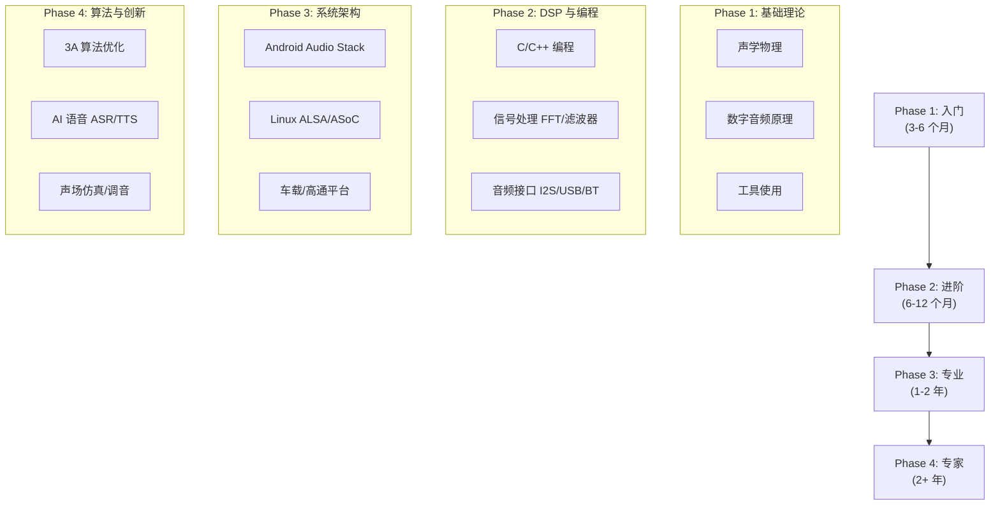

# 音频开发学习路径 (Audio Engineering Learning Path)

音频开发是一个跨学科领域，涉及物理学、数学、电子工程和软件工程。以下是一条系统化的自学与进阶路线，包含每个阶段的详细技能清单、实践项目建议和时间参考。

---

## 1. 学习路线图



---

## 2. 阶段详解

### 2.1 Phase 1: 入门 (Beginner) — 3~6 个月

**目标**：理解声音本质，掌握数字音频基本概念，能使用工具分析音频。

| 技能 | 具体内容 | 验证标准 |
|:---|:---|:---|
| **声学基础** | 频率/波长/分贝/相位/干涉 | 能解释 dB SPL 与 dBFS 的区别 |
| **心理声学** | 等响曲线/掩蔽效应/临界频带 | 能解释 A 计权的物理意义 |
| **PCM 编码** | 采样率/量化位深/Nyquist 定理 | 能手算 44.1kHz/16bit 的码率 |
| **文件格式** | WAV/FLAC/AAC/Opus 区别 | 能用 ffprobe 分析音频文件参数 |
| **工具使用** | Audacity 波形/频谱查看 | 能识别削波/底噪/频响异常 |

```
实践项目:
  1. 用 Audacity 录制并分析一段语音:
     - 查看波形、频谱图
     - 测量 RMS 电平
     - 添加噪声并观察 SNR 变化
     
  2. 用 Python 读取 WAV 文件:
     - 解析 WAV header
     - 绘制时域/频域图
     - 计算基本指标 (RMS, Peak, Crest Factor)
```

### 2.2 Phase 2: 进阶 (Intermediate) — 6~12 个月

**目标**：能够编写音频处理程序，理解核心 DSP 算法。

| 技能 | 具体内容 | 验证标准 |
|:---|:---|:---|
| **C/C++** | 指针/内存管理/多线程/SIMD | 能写 ring buffer 和 lock-free queue |
| **FFT** | DFT/FFT/STFT/窗函数 | 能实现频谱分析器 |
| **滤波器** | FIR/IIR/Biquad 设计 | 能实现参数 EQ (PEQ) |
| **重采样** | Polyphase/Sinc 插值 | 能实现 48kHz→16kHz SRC |
| **音频接口** | I2S/TDM/PDM/USB Audio | 能解读 I2S 时序图 |
| **编解码** | PCM/ADPCM/Opus/AAC 原理 | 能解释有损压缩的基本策略 |

```
实践项目:
  1. 实现一个命令行 EQ 处理器:
     - 读取 WAV → Biquad 滤波 → 写入 WAV
     - 支持 LPF/HPF/PEQ/Shelf
     
  2. 实现一个简单的混音器:
     - 多路 PCM 输入 → 音量控制 → 混音 → 输出
     - 处理不同采样率 (SRC)
     
  3. 在开发板 (STM32/树莓派) 上:
     - 配置 I2S → 外接 DAC → 播放 PCM
     - 录制麦克风 → 实时频谱显示
```

### 2.3 Phase 3: 专业系统 (Professional) — 1~2 年

**目标**：掌握主流操作系统的音频框架，能独立完成驱动和 HAL 开发。

| 技能 | 具体内容 | 验证标准 |
|:---|:---|:---|
| **Android 音频** | AudioFlinger/AudioPolicy/HAL | 能用 dumpsys 定位无声问题 |
| **Linux ALSA** | ASoC 三驾马车/DAPM/DTS | 能编写 Machine Driver |
| **Audio HAL** | HIDL→AIDL 迁移/Stream 实现 | 能实现 openOutputStream |
| **高通平台** | AudioReach/PAL/AGM/ACDB | 能用 QACT 调试 Graph |
| **蓝牙音频** | A2DP/LE Audio/Codec 协商 | 能排查蓝牙音频断连 |
| **车载音频** | AAOS/AudioControl/多音区 | 能配置 Zone-based Routing |

```
实践项目:
  1. Android 平台:
     - 移植 Audio HAL 到新硬件
     - 实现自定义 AudioEffect (.so)
     - 调试 AudioFocus 冲突场景
     
  2. Linux 平台:
     - 编写完整的 ASoC Machine Driver
     - 配置 DAPM 路由和电源管理
     - 实现 Multi-Codec / Multi-Card
     
  3. 高通平台:
     - 调通 AudioReach Graph (播放+录音)
     - 配置 TDM Slot 映射
     - ACDB 校准 (QACT)
```

### 2.4 Phase 4: 专家 (Expert) — 2+ 年

**目标**：解决行业难题，主导架构设计，创新算法和方案。

| 技能 | 具体内容 | 验证标准 |
|:---|:---|:---|
| **3A 算法** | AEC/NS/AGC 优化 | 能调优双讲检测和收敛速度 |
| **空间音频** | HRTF/Ambisonics/Head Tracking | 能实现 Binaural 渲染引擎 |
| **ANC/RNC** | FxLMS/MIMO/路径建模 | 能设计车载 RNC 系统 |
| **AI 语音** | ASR/TTS/KWD/说话人识别 | 能部署端侧 AI 模型 |
| **声学仿真** | FEM/BEM/房间声学 | 能仿真扬声器频响和指向性 |
| **架构设计** | 全链路延迟优化/功耗优化 | 能设计低于 10ms 的端到端路径 |

```
专家级研究方向:
  - 车载 ANC/RNC 多通道系统设计
  - 基于 AI 的实时语音增强 (NN-based AEC/NS)
  - 空间音频渲染引擎 (6DoF HRTF)
  - 超低延迟音频系统架构 (<5ms RTT)
  - 声学材料与换能器联合设计
  - 音频质量自动化测试平台
```

---

## 3. 推荐阅读路径（对应知识库模块）

### 3.1 Android 音频开发方向


### 3.2 车载音频方向


### 3.3 蓝牙音频方向


### 3.4 底层驱动方向


---

## 4. 技能矩阵速查

```
各岗位核心技能权重 (★=需要, ☆=了解):

技能\岗位           App开发  框架开发  HAL/驱动  算法开发  测试
─────────────────────────────────────────────────────
声学基础            ☆       ★       ★        ★★      ★
数字音频            ★       ★★      ★★       ★★      ★★
C/C++              ☆       ★★      ★★       ★★      ☆
Java/Kotlin        ★★      ★       ☆        ☆       ☆
DSP 算法            ☆       ☆       ★        ★★      ★
Android Framework  ★       ★★      ★        ☆       ★
Linux Kernel       ☆       ★       ★★       ☆       ☆
硬件接口            ☆       ☆       ★★       ★       ★
蓝牙协议            ☆       ★       ★        ☆       ★
车载系统            ☆       ★       ★        ★       ★
调试能力            ★       ★★      ★★       ★       ★★
```

---

## 5. 面试高频知识点

```
音频工程师面试 Top 20 高频问题 (按方向):

  === Android 音频 ===
  1. AudioFlinger 的线程模型有哪些？各自用途？
  2. AudioPolicy 路由决策流程 (Usage → Strategy → Device)？
  3. AudioTrack 的共享内存机制如何工作？
  4. FastTrack 和 NormalTrack 的区别与准入条件？
  5. Audio HAL 从 HIDL 到 AIDL 的演进动机？
  6. AudioFocus 的四种类型和 Duck 行为？
  
  === Linux 驱动 ===
  7. ASoC 三驾马车 (Codec/Platform/Machine) 各自职责？
  8. DAPM Widget 和 Route 的工作原理？
  9. snd_soc_bind_card() 做了什么？
  10. DPCM 中 FE 和 BE 的区别？
  
  === DSP / 算法 ===
  11. AEC 回声消除的基本原理 (LMS/NLMS)？
  12. HRTF 是什么？如何用于空间音频渲染？
  13. Opus 和 AAC 的适用场景差异？
  14. SmartPA IV-Sense 保护的原理？
  
  === 硬件 ===
  15. I2S 的四种格式和 Master/Slave 配置？
  16. PDM 和 PCM 的区别？Decimation 是什么？
  17. SoundWire 相比 I2S 的优势？
  
  === 调试 ===
  18. Android 音频无声问题的排查思路？
  19. 如何定位 Underrun/Overrun 问题？
  20. 蓝牙音频卡顿如何分析？
```

---

## 6. 学习资源推荐书单

```
按阶段推荐的经典书籍:

  Phase 1 (入门):
    📕 《声学基础》- 杜功焕 (中文经典教材)
    📕 "Audio Engineering 101" - Tim Dittmar
    📕 "Digital Audio Signal Processing" - Udo Zölzer
    
  Phase 2 (进阶):
    📗 "Understanding Digital Signal Processing" - Richard Lyons
    📗 "DAFX: Digital Audio Effects" - Udo Zölzer
    📗 "The Scientist and Engineer's Guide to DSP" - Steven Smith (免费在线)
    
  Phase 3 (专业):
    📘 "Linux Device Drivers" - Jonathan Corbet (LDD3)
    📘 "Embedded Android" - Karim Yaghmour
    📘 "Android Internals" - Jonathan Levin
    📘 AOSP Source Code (最好的参考资料)
    
  Phase 4 (专家):
    📙 "Adaptive Filter Theory" - Simon Haykin (自适应滤波)
    📙 "Speech Enhancement" - Jacob Benesty (语音增强)
    📙 "3D Audio" - Rozenn Nicol (空间音频)
    📙 "Active Noise Control Systems" - Kuo & Morgan (ANC)
```

---

## 7. 关键建议

1.  **多听**：培养对音质的敏感度（什么是破音、底噪、回声、混响过长）。
2.  **多看源码**：阅读 AOSP `audioserver`、Linux Kernel `sound/soc/` 目录下的代码。
3.  **多动手**：买一块开发板（STM32 + I2S DAC，或树莓派 + HiFiBerry），跑通完整音频链路。
4.  **多调试**：善用 `dumpsys`、`tinymix`、`Perfetto`、`Audacity` 等工具。
5.  **多串联**：理解全链路数据流（App → Framework → HAL → Kernel → HW），避免只了解单层。
6.  **多交流**：关注 AES 论文、参加技术社区讨论、与硬件/算法/测试团队协作。
7.  **建立知识体系**：用本知识库作为索引，按方向系统性学习，而非碎片化阅读。

---
*Next Topic: [音频开发资源与工具推荐](./02-Resources-Tools.md)*